# I7 · HDFC Bank (1995–2024): what consistency is worth, and what a merger costs

> **The hook.** In the ten years to March 2010 HDFC Bank grew its profit from ₹120 crore to ₹2,949 crore, 37.7% a
> year, with a return on assets between 1.39% and 1.54% in every year, including 2008–09, when it also absorbed an
> acquired bank. In April 2010 the market paid 4.2× book and 29× earnings for that record. The buyer earned 13.0% a year
> to September 2026 (14.0% with dividends) against 9.5% for the Nifty — but every rupee of it by April 2022: EPS rose
> 14-fold while the P/E halved. On 4 April 2022 the bank announced a merger with its promoter, the mortgage lender
> HDFC Ltd, and the stock jumped 10%. Four and a half years later it was 11% lower, the loan-to-deposit ratio had
> touched 108%, the margin had fallen from 4.1% to about 3.4%, the low-cost deposit share from 44% to 34%, and the
> chairman and then the CEO had left. This case teaches what a deposit franchise is worth, why a bank's P/B must fall as
> its growth slows, and how to do the arithmetic when a bank takes over a lender funded by bonds.

| | |
|:--|:--|
| **Period** | FY2000–FY2010 (set-up) · **26 April 2010** (decision A) · FY2011–FY2021 · **4 April 2022** (decision B) · April 2022–September 2026 (outcome) |
| **Decision dates** | **A:** close of **26 April 2010**, the first trading day after the FY2010 results: **₹1,989.60** (₹99.48 on today's share count), market cap **≈ ₹91,070 crore**. You may use only what was public by then: annual reports to FY2009, the FY2010 results release and ICICI Bank's FY2010 results. **B:** close of **4 April 2022**, the day the merger was announced: **₹1,656.80** (₹828.40 today's basis), market cap **≈ ₹9.18 lakh crore**. You may use only what was public by then: annual reports and the 20-F to FY2021, the Q3 FY2022 results, the merger announcement and deck, HDFC Ltd's FY2021 annual report and Q3 FY2022 results, and RBI actions to March 2022 |
| **Sector** | Private-sector bank: retail and wholesale lending, deposits, payments, cards (NSE: HDFCBANK; BSE: 500180; NYSE ADR: HDB). Fiscal year ends 31 March |
| **Themes** | The consistency premium · the RoA tree · current and savings deposits (CASA) as the moat · underwriting through cycles · justified P/B as growth normalises · bank–NBFC merger arithmetic (swap ratio, LDR, CRR/SLR/priority-sector drag, liability repricing) · succession, regulator and governance risk |
| **Modules this case reinforces** | [07.1 Banks & NBFCs](../../07-special-valuation/01-banks-and-nbfcs.md) · [08.1 Banks & lending](../../08-sectors/01-banks-and-lending.md) · [04.3 Returns on capital](../../04-financial-analysis/03-returns-on-capital.md) · [05.3 Moats](../../05-business-analysis/03-moats-and-competitive-advantage.md) · [05.5 Management & capital allocation](../../05-business-analysis/05-management-and-capital-allocation.md) · [05.6 Corporate governance (India)](../../05-business-analysis/06-corporate-governance-india.md) · [06.5 Multiples & justified P/B](../../06-valuation/05-relative-valuation-and-multiples.md) · [06.6 Reverse DCF & expectations](../../06-valuation/06-reverse-dcf-and-expectations.md) · [12.3 Special situations (mergers)](../../12-macro-special-sits/03-special-situations.md) · [11.5 Monitoring & selling](../../11-process/05-monitoring-and-selling.md) |
| **Difficulty** | Intermediate–Advanced (★★★☆☆). Do it after Modules 07 and 08; pairs with [I3 Bajaj Finance](03-bajaj-finance-2008-2019.md) (the lender's identity), [I5 Yes Bank](05-yes-bank-2018-2020.md) (the opposite of consistency) and [G2 Coca-Cola 1988](../global/02-coca-cola-1988.md) (quality at a price) |
| **Time** | ~3 hours (two decision points; about 45 minutes on each before you read on) |

!!! note "Conventions in this case"
    Indian GAAP, standalone bank, ₹ crore unless stated (1 lakh crore = ₹1 trillion; recent releases report in ₹
    billion: ₹100 billion = ₹10,000 crore). **Share basis:** the ₹10 share of 2010 was split 5-for-1 in July 2011 and
    2-for-1 in September 2019, and a 1:1 bonus was issued in August 2025, so one April-2010 share is 20 shares today
    and one April-2022 share is 2. Prices are NSE closes from Yahoo Finance (yfinance, split- and bonus-adjusted),
    converted back to the basis of the time, with today's basis in brackets. **Derived ratios** are ours: RoA = PAT ÷
    average of opening and closing total assets (the bank's own figure uses daily averages); credit cost = loan-loss
    provisions ÷ average net advances; LDR (loan-to-deposit ratio) = advances ÷ deposits; C/I = operating expenses ÷ net
    revenue. "≈" marks rounded figures. Bracketed numbers point to the [Sources](#sources).

---

## 1. The scene

### 1.1 The business (as of 26 April 2010)

HDFC Bank was the first private-sector bank licensed by the Reserve Bank of India after banking was opened to new
entrants in the early 1990s. Its promoter was **HDFC Ltd**, India's largest mortgage lender; its first branch opened on
18 February 1995 [[3]](#sources). It grew by building branches and by two acquisitions: **Times Bank** (agreed in
November 1999) [[3]](#sources) and **Centurion Bank of Punjab** (CBoP), merged in from 23 May 2008 at one HDFC Bank
share for 29 CBoP shares [[4]](#sources).

By March 2010 it had 1,725 branches in 779 cities, 19 million customers, deposits of ₹1.67 lakh crore and gross
advances of ₹1.27 lakh crore [[2]](#sources). Its three legs were a **deposit franchise** — savings deposits of ₹49,877
crore and current accounts of ₹37,227 crore, together **52% of deposits** (the release quoted a "core" CASA ratio of
50%); current accounts pay no interest and are sticky because they carry a company's collections and payments
[[1]](#sources) [[2]](#sources) — **retail lending** in higher-yield, higher-loss products (HDFC Ltd did the
mortgages), and **wholesale banking** built around companies' transaction accounts.

In FY2010 net interest income grew 13% to ₹8,387 crore, operating expenses only 4.2%, and net profit **31.3% to
₹2,948.7 crore**. The net interest margin (NIM) was 4.3%. Gross non-performing assets (GNPA) were 1.43% of advances
(1.98% a year earlier), net NPAs 0.31%, specific-provision coverage 74.8%. The capital adequacy ratio (CAR) was 17.4%
(Tier 1 13.3%) against a 9% minimum [[1]](#sources) [[2]](#sources).

### 1.2 Competition, management and what the market believed

ICICI Bank reported the same weekend. It had spent FY2010 shrinking — advances −17%, deposits −7.5% — and its CASA
ratio rose from 28.7% to 41.7% mostly because term deposits fell; profit rose 7% to ₹4,025 crore on net worth of
₹51,618 crore, an RoE under 8% [[5]](#sources).

Aditya Puri, previously chief executive of Citibank Malaysia, had been managing director since September 1994
[[7]](#sources); in January 2010 the board reappointed him to March 2013. HDFC Ltd executives Keki Mistry and Renu
Karnad sat on the board, and HDFC Ltd had just converted warrants at ₹1,530.13 a share, adding ₹4,009 crore of equity,
to restore the stake diluted by the CBoP merger [[1]](#sources) [[2]](#sources).

The market believed HDFC Bank would compound profit at 30% a year without accidents, and the record supported it. The
doubts: **the credit cost was not low** (2.1–2.2% of advances in FY2007–FY2009, from the unsecured retail mix);
**FY2009 had been harder than it looked** (C/I 51.7%, CASA 44.4%, GNPA 1.98% after CBoP); and **growth needed
capital** (net worth rose from ₹751 crore in FY2000 to ₹21,520 crore in FY2010, partly from new shares).

### 1.3 The price on 26 April 2010

The shares closed at **₹1,989.60** (₹99.48 today's basis), against ₹973.40 in March 2009 [[1]](#sources). With 45.77
crore shares, the market value was about ₹91,070 crore: **4.23× March-2010 book value per share of ₹470.12** and **29.4×
FY2010 EPS of ₹67.60**, a dividend yield of 0.6%.

### 1.4 The scene at decision B (4 April 2022)

HDFC Bank was now India's largest private bank: total assets of ₹19.38 lakh crore at December 2021, advances of ₹12.61
lakh crore (+16.5%), deposits of ₹14.46 lakh crore (+13.8%), CASA 47.1%, 5,779 branches and over 68 million customers;
core NIM 4.1%, GNPA 1.26%, CAR 19.5%; nine-month profit ₹26,906 crore, +17.3% [[8]](#sources) [[13]](#sources). Three
things had changed since 2019:

- **Leadership.** Puri retired on 26 October 2020. The RBI approved **Sashidhar Jagdishan** — at the bank since 1996,
  CFO since 2008 — as MD and CEO for three years from 27 October 2020 [[9]](#sources).
- **The regulator.** On 2 December 2020, after two years of outages in internet banking, mobile banking and payments
  (the latest from a power failure at the primary data centre on 21 November 2020), the RBI ordered the bank to stop
  all "Digital 2.0" launches and new credit-card sourcing, and asked the board to fix accountability [[10]](#sources).
  The card curb was relaxed in August 2021 and the Digital 2.0 curb lifted on 11 March 2022 [[11]](#sources). In May
  2021 the RBI fined the bank ₹10 crore over third-party products sold to auto-loan customers, after a whistle-blower
  inquiry found some employees had taken unauthorised commissions from a GPS-device vendor. The same annual filing
  showed the bank below its priority-sector target: 38.2% of adjusted net bank credit against 40% [[12]](#sources).
- **The multiple.** The stock was ₹1,159.45 (₹1 face) in March 2019 and ₹1,506 on 1 April 2022 — about 9% a year while
  EPS grew about 20% a year. It had peaked at ₹1,688.70 in October 2021.

**The announcement (4 April 2022, before the open).** HDFC Ltd would merge into the bank at **42 HDFC Bank shares (₹1
face) for every 25 HDFC Ltd shares (₹2 face)**; HDFC Ltd's 21% stake in the bank would be extinguished, leaving HDFC
Ltd's holders with 41% of a fully public bank, which would also inherit HDFC Life, HDFC ERGO, HDFC AMC and other
subsidiaries. Approvals were needed from the RBI, SEBI, the Competition
Commission, the National Housing Bank, IRDAI, PFRDA, the NCLT, exchanges and shareholders; completion was expected in
about 18 months [[13]](#sources). The bank's shares
closed at **₹1,656.80, up 10.0%**; HDFC Ltd's rose 10% to ₹2,696 on the BSE from ₹2,450.95 [[16]](#sources).

---

## 2. The numbers then

### 2.1 Decision A: the decade to FY2010

Everything in Tables 2.1–2.3 was public on 26 April 2010 [[1]](#sources) [[2]](#sources) [[3]](#sources)
[[4]](#sources).

**Table 2.1: Profit and loss and what the market paid, FY2001–FY2010 (₹ crore; per-share on the ₹10 share)**

| FY | Net interest income | Other income | Operating expenses | Loan-loss provisions | Net profit | Profit growth (%) | EPS (₹) | Book/share (₹) | P/B (×) | P/E (×) |
|:--|--:|--:|--:|--:|--:|--:|--:|--:|--:|--:|
| 2001 | 501 | 177 | 310 | 53 | 210 | 75.0 | 8.64 | 37.50 | 6.09 | 26.4 |
| 2002 | 607 | 336 | 418 | 86 | 297 | 41.4 | 11.01 | 69.00 | 3.43 | 21.5 |
| 2003 | 771 | 466 | 577 | 88 | 388 | 30.5 | 13.75 | 79.60 | 2.95 | 17.1 |
| 2004 | 1,245 | 480 | 810 | 178 | 510 | 31.4 | 17.95 | 94.52 | 4.01 | 21.1 |
| 2005 | 1,590 | 651 | 1,085 | 176 | 666 | 30.6 | 22.92 | 145.86 | 3.93 | 25.0 |
| 2006 | 2,301 | 1,124 | 1,691 | 480 | 871 | 30.8 | 27.92 | 169.24 | 4.57 | 27.7 |
| 2007 | 3,468 | 1,516 | 2,421 | 861 | 1,141 | 31.1 | 36.29 | 201.42 | 4.74 | 26.3 |
| 2008 | 5,228 | 2,283 | 3,746 | 1,216 | 1,590 | 39.3 | 46.22 | 324.39 | 4.10 | 28.8 |
| 2009 | 7,421 | 3,291 | 5,533 | 1,726 | 2,245 | 41.2 | 52.85 | 344.31 | 2.83 | 18.4 |
| 2010 | 8,387 | 3,808 | 5,764 | 1,939 | 2,949 | 31.3 | 67.60 | 470.12 | 4.11 | 28.6 |

Source: the ten-year financial highlights in the FY2010 annual report [[1]](#sources); P/B and P/E use the 31 March
NSE price printed there. FY2000: profit ₹120.04 crore, EPS ₹5.93, P/B 8.32×, P/E 43.4×. FY2009 includes CBoP from
23 May 2008. FY2000–FY2010 compound growth: profit 37.7%, EPS 27.6%, book value per share 31.3%.

**Table 2.2: Balance sheet and derived ratios, FY2001–FY2010 (₹ crore; ratios in %)**

| FY | Deposits | Net advances | Net worth | LDR | CASA | NIM | RoA | RoE | C/I | Credit cost | CAR |
|:--|--:|--:|--:|--:|--:|--:|--:|--:|--:|--:|--:|
| 2001 | 11,658 | 4,637 | 913 | 39.8 | n/d | n/d | 1.54 | 24.5 | 45.7 | 1.31 | 11.1 |
| 2002 | 17,654 | 6,814 | 1,942 | 38.6 | n/d | n/d | 1.51 | 18.3 | 44.3 | 1.50 | 13.9 |
| 2003 | 22,376 | 11,755 | 2,245 | 52.5 | n/d | n/d | 1.43 | 18.1 | 46.7 | 0.95 | 11.1 |
| 2004 | 30,409 | 17,745 | 2,692 | 58.4 | 54.7 | 3.8 | 1.40 | 20.1 | 47.0 | 1.21 | 11.7 |
| 2005 | 36,354 | 25,566 | 4,520 | 70.3 | 60.6 | 3.9 | 1.42 | 20.4 | 48.4 | 0.81 | 12.2 |
| 2006 | 55,797 | 35,061 | 5,300 | 62.8 | n/d | n/d | 1.39 | 17.5 | 49.4 | 1.58 | 11.4 |
| 2007 | 68,298 | 46,945 | 6,433 | 68.7 | n/d | n/d | 1.39 | 19.4 | 48.6 | 2.10 | 13.1 |
| 2008 | 1,00,769 | 63,427 | 11,497 | 62.9 | 54.5 | n/d | 1.42 | 16.1 | 49.9 | 2.20 | 13.6 |
| 2009 | 1,42,812 | 98,883 | 14,646 | 69.2 | 44.4 | 4.2 | 1.42 | 16.1 | 51.7 | 2.13 | 15.7 |
| 2010 | 1,67,404 | 1,25,831 | 21,520 | 75.2 | 52.0 | 4.3 | 1.45 | 16.8 | 47.3 | 1.73 | 17.4 |

Sources: [[1]](#sources) (balance sheet, RoE on average net worth, CAR); CASA from the deposit schedules (demand plus
savings ÷ total deposits) and NIM from the directors' reports of the FY2005, FY2009 and FY2010 annual reports
[[1]](#sources) [[3]](#sources) [[4]](#sources); n/d = not disclosed there. RoA, C/I, credit cost and LDR computed by us
(total assets ₹1,83,271 crore in FY2009, ₹2,22,459 crore in FY2010). FY2000–FY2010 growth: advances 43.2% a year,
deposits 34.8%.

**Table 2.3: Valuation at decision A (26 April 2010, ₹1,989.60)**

| Metric | Value | Working |
|:--|--:|:--|
| Market capitalisation | ≈ ₹91,070 crore | 45.77 crore shares (₹457.74 crore of ₹10 capital [[2]](#sources)) × 1,989.60 |
| P/B / P/E / dividend yield | 4.23× / 29.4× / 0.6% | ÷ book ₹470.12; ÷ EPS ₹67.60; ₹12 ÷ price |
| FY2010 RoA / RoE / leverage | 1.45% / 16.8% / 11.2× | average assets ₹2,02,865 crore ÷ average equity ₹18,083 crore |
| RoA FY2001–FY2010; profit growth FY2002–FY2010 | 1.39–1.54%; 30.5–41.4% | Tables 2.1–2.2 |

### 2.2 What the filings said at A (paraphrased)

1. **FY2010 results release.** Savings deposits +42.9%, current accounts +30.9%; provisioning above regulatory
   requirements, with total provisions over 100% of gross NPAs [[2]](#sources).
2. **FY2010 annual report.** Loan-loss provisions rose on NPA formation in the first half, which then fell; NIM up 13
   basis points to 4.3%; gross advances +27%, led by wholesale lending (+41%) [[1]](#sources).
3. **FY2005 annual report.** NIM had risen from 3.8% to 3.9% mainly because of a higher share of current and savings
   balances — the bank describing its own moat [[3]](#sources).

### 2.3 Decision B: the decade to FY2021 and the merger

Everything in Tables 2.4–2.7 was public on 4 April 2022 [[6]](#sources) [[7]](#sources) [[8]](#sources)
[[12]](#sources) [[13]](#sources) [[14]](#sources) [[15]](#sources).

**Table 2.4: HDFC Bank, FY2013–FY2021 and December 2021 (₹ crore; ratios in %; P/B and P/E at 31 March)**

| FY | Net advances | Deposits | Net profit | Profit growth | CASA | NIM | GNPA | RoA | C/I | Credit cost | RoE | CAR | P/B (×) | P/E (×) |
|:--|--:|--:|--:|--:|--:|--:|--:|--:|--:|--:|--:|--:|--:|--:|
| 2013 | 2,39,721 | 2,96,247 | 6,726 | 30.2 | 47.4 | 4.5 | 0.97 | 1.77 | 49.6 | 0.57 | 20.1 | 16.8 | 4.11 | 22.0 |
| 2014 | 3,03,000 | 3,67,337 | 8,478 | 26.0 | 44.8 | 4.4 | 0.98 | 1.86 | 45.6 | 0.60 | 20.9 | 16.1 | 4.13 | 21.1 |
| 2015 | 3,65,495 | 4,50,796 | 10,216 | 20.5 | 44.0 | 4.4 | 0.93 | 1.88 | 44.6 | 0.52 | 20.4 | 16.8 | 4.13 | 24.3 |
| 2016 | 4,64,594 | 5,46,424 | 12,296 | 20.4 | ≈43 | 4.3 | 0.94 | 1.84 | 44.3 | 0.51 | 18.0 | 15.5 | 3.73 | 21.9 |
| 2017 | 5,54,568 | 6,43,640 | 14,550 | 18.3 | ≈48 | 4.3 | 1.05 | 1.81 | 43.4 | 0.62 | 18.0 | 14.6 | 4.13 | 25.2 |
| 2018 | 6,58,333 | 7,88,771 | 17,487 | 20.2 | 43.5 | 4.3 | 1.30 | 1.81 | 41.0 | 0.81 | 18.2 | 14.8 | 4.71 | 28.5 |
| 2019 | 8,19,401 | 9,23,141 | 21,078 | 20.5 | 42.4 | 4.3 | 1.36 | 1.83 | 39.7 | 0.87 | 16.3 | 17.1 | 4.23 | 29.5 |
| 2020 | 9,93,703 | 11,47,502 | 26,257 | 24.6 | 42.2 | 4.3 | 1.26 | 1.89 | 38.6 | 1.00 | 16.8 | 18.5 | 2.76 | 18.0 |
| 2021 | 11,32,837 | 13,35,060 | 31,117 | 18.5 | 46.1 | 4.2 | 1.32 | 1.90 | 36.3 | 1.08 | 16.6 | 18.8 | 4.04 | 26.4 |
| Dec-2021 (9M) | 12,60,863 | 14,45,918 | 26,906 | 17.3 | 47.1 | 4.1 | 1.26 | 1.52* | — | — | — | 19.5 | — | — |

Sources: [[6]](#sources) (financials, RoE, CAR, 31 March price and book per share, compiled in the bank's ten-year
highlights from each year's annual report); CASA, NIM (core where only that was given) and GNPA from each year's
fourth-quarter results [[7]](#sources); December 2021 from [[8]](#sources). FY2016–FY2017 CASA were given rounded;
FY2017's was swollen by demonetisation deposits. *Nine-month RoA, not annualised. FY2013 growth, RoA and credit cost use
FY2012 profit ₹5,167.1 crore, advances ₹1,95,420 crore and total assets ₹3,37,909 crore [[7]](#sources). FY2013–FY2021
growth: profit 21.1%, EPS 18.8%, advances 21.4% a year.

**Table 2.5: HDFC Ltd (the target), FY2017–FY2021 (₹ crore)**

| FY | Loans outstanding | Net profit | Shareholders' funds | Bank borrowings | Market borrowings | Deposits |
|:--|--:|--:|--:|--:|--:|--:|
| 2017 | 2,96,472 | 7,443 | 39,645 | 37,270 | 1,56,690 | 86,574 |
| 2018 | 3,62,811 | 10,959 | 65,265 | 46,802 | 1,81,645 | 91,269 |
| 2019 | 4,06,607 | 9,632 | 77,355 | 77,548 | 1,83,067 | 1,05,599 |
| 2020 | 4,50,903 | 17,770 | 86,158 | 1,04,909 | 1,81,869 | 1,32,324 |
| 2021 | 4,98,298 | 12,027 | 1,08,783 | 1,05,179 | 1,86,055 | 1,50,131 |

Source: HDFC Ltd's ten-year highlights [[14]](#sources) (Ind AS from FY2018; FY2018 and FY2020 profit are footnoted
there and are not clean run-rates). At December 2021: total assets ₹6,23,420 crore, net advances ₹5,25,806 crore, net
worth ₹1,15,400 crore [[13]](#sources); Q3 FY2022 NIM 3.6% and gross NPLs 2.32% [[15]](#sources). FY2021 borrowings of
₹4,41,365 crore were 34% deposits, 42% bonds and 24% bank loans — and no current or savings accounts.

**Table 2.6: The merger terms and the companies' own pro forma (standalone, December 2021)**

| Metric | HDFC Bank | HDFC Ltd | Pro forma | Change for the bank |
|:--|--:|--:|--:|--:|
| Equity shares (crore) | 554 | 181 | 742 | +34% |
| Net worth (₹ crore) | 2,29,640 | 1,15,400 | 3,30,768 | +44% |
| Book value per share (₹) | 414 | — | 446 | +8% |
| Advances (₹ crore) | 12,68,863 | 5,25,806 | 17,86,669 | +41% |
| Annualised profit (₹ crore) | 35,875 | 13,388 | 49,263 | +37% |
| EPS (₹) | c.65 | — | c.67 | +3% |
| CAR (%) | 19.5 | 22.4 | 19.8 | +0.3 pt |
| Market value, 1 April 2022 | ≈ ₹8.35 lakh crore | ≈ ₹4.44 lakh crore | | |

Source: the investor deck [[13]](#sources), a "basis addition without adjustments to bank model", with nine-month
figures annualised by the companies (the results release gives net worth of ₹2,23,394 crore and advances of ₹12,60,863
crore). Swap ratio 42/25 = 1.68.

**Table 2.7: Valuation and regulatory parameters at decision B (4 April 2022, ₹1,656.80)**

| Metric | Value | Working |
|:--|--:|:--|
| Market capitalisation | ≈ ₹9.18 lakh crore | 554.24 crore shares [[8]](#sources) × 1,656.80 |
| P/B | 4.11× (4.48× on March-2021 book) | ÷ Dec-2021 book of ₹403.1 (2,23,394 ÷ 554.24); ÷ ₹369.54 |
| P/E | 25.6× annualised; 29.3× FY2021 | EPS ₹64.73 (26,906 × 4/3 ÷ 554.24); ₹56.58 |
| Same, at the 1 April close (₹1,506) | 3.74× book; 23.3× annualised EPS | |
| Loan-to-deposit ratio, bank alone | 87.2% | 12,60,863 ÷ 14,45,918 |
| CRR / SLR | 4% / 18% of net demand and time liabilities | FY2021 20-F [[12]](#sources) |
| Priority-sector target / bank's FY2021 achievement | 40% / 38.2% of adjusted net bank credit | [[12]](#sources) |

### 2.4 What the filings said at B (paraphrased)

1. **Merger rationale** [[13]](#sources). Cheap CASA funding would make housing loans more competitive; affordable
   housing loans were likely to count as priority-sector lending; unsecured loans would fall as a share of the book;
   convergence of bank and NBFC rules and a deeper market for priority-sector certificates made the deal possible. The
   pro forma came before applying CRR, SLR and priority-sector rules to the acquired book.
2. **Q3 FY2022 release** [[8]](#sources). CASA deposits +24.6%; liquidity coverage ratio 123%; retail loans +13.3%,
   commercial and rural +29.4%, wholesale +7.5%; CAR 19.5% against 11.7% required.
3. **HDFC Ltd** [[15]](#sources). Individual gross NPLs of 1.44%; non-individual (developer and corporate) 5.04%.

---

## 3. You are the analyst

Answer these **before reading section 4**, using only sections 1–2. Show your arithmetic.

### Decision A (26 April 2010, ₹1,989.60, 4.23× book)

1. **(Numerical — the RoA tree and the CASA dividend.)** Express FY2010 NII, other income, operating expenses,
   provisions and tax as percentages of average total assets (₹2,02,865 crore) and check they sum to the RoA. Then price
   the deposit franchise: deposits were 29.8% savings, 22.2% current, 48.0% term. Assume savings pay 3.5%, current
   accounts 0%, term deposits 7.0%, and compare with a bank at 20/10/70. Deposits averaged 76.5% of assets; the tax rate
   was 31.3%. How much of the RoA does the CASA advantage explain?
2. **(Numerical — what "consistent" means.)** From Tables 2.1–2.2, compute the mean and standard deviation of RoA and
   RoE for FY2001–FY2010 and the range of profit growth. Which P&L line was *not* stable, and what absorbed it? Why
   should low RoA variance lower the cost of equity — and why might it not?
3. **(Numerical — what 4.23× book requires.)** Find the steady-state RoE that 4.23× implies with r = 13% and g = 10%.
   Then value the share with a two-stage model: book ₹470.12; RoE 18%, payout 20% for N years; then RoE 16%, g 10%; for
   N = 10, 15, 20 and r = 12%, 13%. Which assumption moves the value most?
4. **(Numerical — growth needs capital.)** At RoE 16.8% and a 21.7% payout, how fast can book value grow unaided? If
   advances grow 25% a year for five years at constant leverage, how much equity is needed and how much will retained
   earnings supply? At what P/B is issuing the difference good for existing holders?
5. **(Judgement — was FY2009 a pass?)** List the evidence that the underwriting was tested in FY2008–FY2010 and the
   evidence that it was not. Compare with ICICI Bank's FY2010.
6. **(Decision A.)** Buy, avoid or wait? Compute five-year IRRs from ₹1,989.60 with a 22% payout under (i) EPS growth
   25%, exit P/E 25; (ii) 20% growth, exit 18; (iii) 15% growth, exit 14. Weight them and size the position
   ([11.4](../../11-process/04-position-sizing-and-portfolio-construction.md)).

### Decision B (4 April 2022, ₹1,656.80, 4.11× book)

7. **(Numerical — the swap ratio.)** At the 1 April closes (bank ₹1,506.30, HDFC Ltd ₹2,450.95, BSE), what premium did
   42:25 give HDFC Ltd holders? With 181 crore HDFC Ltd shares and 554.24 crore bank shares, confirm the 41%. What was
   HDFC Ltd worth excluding its 21% bank stake, and how many net new shares did the bank's other holders issue for it?
   After the 4 April jumps, was there an arbitrage, and what would you need to believe to trade it?
8. **(Numerical — the balance-sheet arithmetic.)** (a) Compute the pro forma loan-to-deposit ratio using December 2021
   bank figures, HDFC Ltd's net advances of ₹5,25,806 crore and its FY2021 deposits of ₹1,50,131 crore. (b) Treat HDFC
   Ltd's deposits and market borrowings (₹3,36,186 crore) as new net demand and time liabilities; compute the extra CRR
   (4%) and SLR (18%) holdings. Assume CRR balances forgo a 7% yield and SLR bonds earn 1.5 points less than loans;
   compute the pre-tax and post-tax drag (assume a 25.17% tax rate) against pro forma profit of ₹49,263 crore. (c) What priority-sector
   requirement does 40% of the acquired book add? (d) Blend a 4.1% NIM on ₹19.38 lakh crore of bank assets with 3.6%
   on ₹6.23 lakh crore of HDFC Ltd assets. (e) If loans grow 15% a year, what deposit growth takes the LDR to 90% in
   three years?
9. **(Judgement — why P/B compresses.)** RoE fell from ~20% to ~16.6% while P/B stayed near 4× (Table 2.4). Compute the
   justified P/B at RoE 17%, r = 13% for g = 12%, 10%, 8%, and the growth implied by 4.11×. What happens to P/B as
   growth converges on nominal GDP, even if RoE holds?
10. **(Red flags and decision B.)** List what was knowable on 4 April 2022 about leadership, the regulator and
    integration. Compute five-year IRRs from ₹1,656.80 (EPS ₹64.73, payout 20%) for (i) EPS +18% a year, exit P/E 22;
    (ii) +14%, 18; (iii) +10%, 15. Buy, hold or sell into the pop — and how would an options trader view a 10% one-day
    move in a ₹9 lakh crore stock?

---

## 4. What happened

```mermaid
flowchart LR
  A["26-Apr-2010<br/>₹1,990 · 4.2× book · 29× EPS<br/>(₹99.5 today's basis)"] --> B["FY2011–FY2019<br/>profit +24%/yr; GNPA ≤1.4%;<br/>P/B ~4×; splits 2011, 2019"]
  B --> C["2020–2021<br/>Covid: P/B 2.8× (Mar-20);<br/>Puri retires, Jagdishan CEO;<br/>RBI curbs digital & cards"]
  C --> D["4-Apr-2022<br/>Merger with HDFC Ltd, 42:25;<br/>stock +10% to ₹1,657;<br/>−23% by 16-Jun"]
  D --> E["1-Jul-2023<br/>Merger effective;<br/>LDR 108% (Sep-23);<br/>NIM 3.4%, CASA 38%"]
  E --> F["FY2024–FY2025<br/>deposits +26%, +14%;<br/>LDR 97% (Mar-25);<br/>HDB IPO; 1:1 bonus"]
  F --> G["Mar–Jul 2026<br/>chairman resigns;<br/>law-firm review: not<br/>substantiated; new chairman"]
  G --> H["Aug–Sep 2026<br/>CEO not seeking<br/>reappointment; ₹737:<br/>2.1× book, 15× EPS"]
```

**2010–2019: the compounding continued.** Profit rose from ₹2,948.7 crore (FY2010) to ₹21,078 crore (FY2019), 24.4% a
year, and EPS 21.6% a year. GNPA never exceeded 1.36%, CASA stayed at 42–48%, NIM at 4.3–4.5% and RoA at 1.77–1.90%
(Table 2.4). The price went from ₹198.96 (the decision-A price on the ₹1 basis) to ₹1,159.45 by March 2019 — 21.8% a
year, almost exactly the EPS growth, because the P/B stayed near 4× [[6]](#sources). Growth slowed from ~30% to ~20%,
and RoE drifted from 20–21% to 16–17% as capital built up (in FY2019 net worth rose by ₹42,911 crore, about twice that
year's profit, on new equity).

**2020–2022: tests of a different kind.** Covid took the stock to 2.76× book in March 2020, and no dividend was paid
for FY2020 [[6]](#sources). Credit cost rose to 1.0–1.1% and GNPA peaked at 1.32%, while profit still grew 24.6% and
18.5%. The harder tests were a first-ever CEO change, an RBI embargo on growth products (about nine months for cards,
fifteen for Digital 2.0) and the GPS penalty [[9]](#sources) [[10]](#sources) [[11]](#sources) [[12]](#sources). By 1
April 2022 the P/E had fallen from 29.5× (March 2019) to 23.3× on annualised EPS.

**The merger (April 2022–July 2023).** The 10% pop did not last: on 16 June 2022 the stock was ₹1,281.30 (₹640.65
today's basis), 22.7% below the announcement close. The RBI's letter of 20 April 2023 set the terms that mattered
[[17]](#sources): **no relief on reserves** (CRR, SLR and the liquidity coverage ratio on the whole balance sheet from
day one, without exceptions); a **priority-sector phase-in** (one-third of HDFC Ltd's loans in adjusted net bank credit
in year one, the rest in equal parts over two more years); HDFC Life and HDFC ERGO allowed as over-50% subsidiaries,
the HDFC Credila stake to be cut to 10% within two years, and HDFC Ltd's floating-rate loans to be linked to external
benchmarks within six months. The merger took effect on **1 July 2023** [[18]](#sources).

**The aftermath.** The arithmetic of question 8 showed up almost exactly.

**Table 4.1: The merged bank, standalone (₹ billion unless stated)**

| Metric | Mar-2023 (pre-merger) | Sep-2023 | Mar-2024 | Mar-2025 | Mar-2026 | Jun-2026 |
|:--|--:|--:|--:|--:|--:|--:|
| Deposits | 18,834 | 21,729 | 23,798 | 27,147 | 31,053 | 31,708 |
| Gross advances | 16,142 | 23,546 | 25,078 | 26,435 | 29,600 | 30,608 |
| Loan-to-deposit ratio (%) | 85.7 | 108.4 | 105.4 | 97.4 | 95.3 | 96.5 |
| CASA ratio (%) | 44 | 38 | 38.2 | 34.8 | 34.1 | 32.3 |
| Borrowings, % of liabilities | 8 | 21 (Dec-23) | 18 | 14 | 11 | n/d |
| NIM for the quarter, % of total assets | 4.1 | 3.4 | 3.4 (core 3.44) | 3.54 (core 3.46) | 3.38 | 3.26 |
| Cost of funds for the quarter (%) | 3.7 | 4.8 | 4.9 | 4.9 | 4.4 | n/d |
| Gross NPA (%) | 1.1 | 1.3 | 1.24 | 1.33 | 1.15 | 1.17 |
| Net profit (₹ crore) | ≈44,100 (FY23) | — | 60,812 (FY24) | 67,347 (FY25) | 74,671 (FY26) | 19,060 (Q1 FY27) |

Sources: [[18]](#sources) (to March 2024, borrowings share, cost of funds), [[25]](#sources) (March 2025 and March 2026
borrowings share and cost of funds), [[19]](#sources) [[20]](#sources) and the FY2024 and FY2025 results releases
[[7]](#sources). FY2023 profit derived from the FY2024 release (₹608.1 billion, +37.9%). LDR computed by us.

Three stories sit in that table. **A quarter to absorb the book, three years to digest it:** advances jumped about ₹7
lakh crore in the merger quarter while deposits rose ₹2.6 lakh crore; the LDR hit 108% and borrowings 21% of
liabilities; deposit growth of 26.4% (FY2024), 14.1% (FY2025) and 14.4% (FY2026), with loan growth held to 5.4% in
FY2025, brought the LDR under 100% by March 2025 and borrowings to 11% by March 2026. **The deposit franchise was
diluted, not destroyed:** term deposits grew 20.3% and 15.5% in FY2025–FY2026 against CASA growth of 3.9% and 12.3%, so
the CASA ratio fell to 32.3% by June 2026 and the cost of funds rose from 3.7% to 4.9% before easing to 4.4%
[[18]](#sources) [[20]](#sources) [[25]](#sources). **Returns held; growth did not:** NIM settled at 3.3–3.5%, but GNPA
was 1.15% in March 2026, cost-to-income near 40% and reported RoA 1.91% (FY2025) and 1.94% (FY2026); with ₹1.15 lakh
crore of equity added, RoE fell to about 14.4%. Profit grew 10.7% in FY2025 and 10.9% in FY2026 — including a ₹9,179
crore pre-tax gain on selling ₹10,000 crore of HDB Financial Services shares in its June 2025 IPO, roughly offset by a
₹9,000 crore floating provision — and 5.0% in the June 2026 quarter [[19]](#sources) [[20]](#sources).

A 1:1 bonus was allotted on 28 August 2025. In September 2025 the Dubai Financial Services Authority barred the bank's
DIFC branch from taking new advisory and arranging clients over onboarding lapses; the bank called the branch (1,489
customers) immaterial [[7]](#sources). The stock fell 8.4% on 17 January 2024, the day after the Q3 FY2024 results,
peaked at ₹1,012.90 on 30 July 2025, and has fallen since.

**2026: governance.** On 18 March 2026 the part-time chairman, **Atanu Chakraborty** (on the board since May 2021),
resigned, writing that happenings and practices he had seen over two years were "not in congruence with my personal
Values and Ethics", without specifics; the RBI approved **Keki Mistry** as interim chairman [[21]](#sources). The stock
fell 5.3% the next day, when the RBI said it had no material concerns on record about the bank's conduct or governance
[[7]](#sources). Two law firms appointed by the board, Wilson Sonsini and Wadia Ghandy, reported on 26 June that the
statement was **not substantiated** by board records or interviews, that Chakraborty had not been interviewed despite
repeated requests, and that there was no contemporaneous record of his raising "the Dubai matter" he later cited
publicly [[22]](#sources). The review was the board's; his account has not been tested by a regulator or a court.

On 27 July the bank said independent directors had found that deposit-raising arrangements with the Maharashtra State
Road Development Corporation in 2017 and 2021 were "business overreach" without mala fide intent; citing a possible
divergence from RBI directions, it issued warning letters and ₹1 lakh penalties to the MD & CEO, CFO and head of retail
assets and reported the matter to the RBI [[7]](#sources). A 2025 criminal complaint by the Lilavati Kirtilal Mehta
Medical Trust alleging that Jagdishan had received about ₹2.05 crore from former trustees was quashed by the Bombay High
Court in May 2026 as a counterblast to the bank's recovery proceedings [[24]](#sources). **Rajiv Kumar**, a former
Finance Secretary, became chairman with RBI approval on 15 July 2026 [[23]](#sources). On 29 August **Jagdishan** said he
would not seek reappointment; he retires on 26 October 2026, and on 12 September the board sent the RBI two names for
his successor [[7]](#sources).

**Where the two decisions ended up (23 September 2026, ₹737.25).**

| | Decision A (26-Apr-2010) | Decision B (4-Apr-2022) |
|:--|--:|--:|
| Price then, today's basis | ₹99.48 | ₹828.40 |
| Price multiple / annual return (price only) | 7.41× / 13.0% | 0.89× / −2.6% |
| Total return with dividends (annual) | 14.0% | −1.1% |
| Nifty 50 / Bank Nifty, same period (annual, price) | 9.5% / 11.2% | 6.0% / 8.9% |
| EPS then → FY2026 (today's basis) | ₹3.38 → ₹48.62 (18.1% a year) | ₹32.37 annualised → ₹48.62 (≈9.5% a year) |
| P/E then → now (FY2026 EPS) | 29.4× → 15.2× | 25.6× → 15.2× |
| P/B then → now | 4.23× → 2.08× | 4.11× → 2.08× |

The A buyer's 7.41× is EPS growth × P/E change: 14.38 × (15.2 ÷ 29.4) = 7.44 — and was already 7.57× on 1 April
2022 (18.5% a year, against 10.6% for the Nifty): all the gain came before the merger. At ₹737.25 the market value is
₹11.35 lakh crore on 1,539 crore shares; standalone book value is ₹354.9 a share [[19]](#sources). The period low was
₹687.10 on 9 September 2026, 32% below the July 2025 peak.

---

## 5. Signals: knowable then vs hindsight

| Knowable at the time | Only in hindsight |
|:--|:--|
| **A:** RoA of 1.39–1.54% for ten years through a crisis and an acquisition; CASA worth ~0.6 points of RoA; profit growth above 30% every year | Nine more years of 24% profit growth with GNPA never above 1.4% |
| **A:** 4.23× book implied a steady-state RoE of ~23% against 16.8% actual — a long runway and a low discount rate were needed | That the runway would last to 2019, holding P/B near 4× for nine years |
| **A:** a 2%-plus retail credit cost in FY2007–FY2009, covered by the margin | That the retail book would come through Covid with GNPA of 1.3% |
| **B:** pro forma LDR ~112%, the CRR/SLR drag, a priority-sector shortfall, a pro forma "without adjustments to bank model" | LDR 108% by September 2023, CASA 34.8% by March 2025, NIM 3.3–3.5% |
| **B:** ~3% EPS accretion for 34% more shares; an acquired book with a 3.6% NIM funded by bonds and bank loans | EPS growth of only ~9.5% a year to FY2026 and a P/E of 15× |
| **B:** 4.11× book required ~11.7% perpetual growth at RoE 17%; the P/E had already fallen from 29.5× to 23× | RoE falling to ~14% as the merger added equity faster than profit |
| **B:** a new insider CEO, an RBI embargo just lifted, a disciplinary episode in auto loans | The chairman's resignation, the law-firm review, the MSRDC findings and the CEO's exit |

!!! success "The strongest bear case that existed at each date"
    **At A (2010):** the best bank in India was priced to stay the best *and* grow 25–30% for fifteen years or more:
    4.2× book needed a 23% steady-state RoE or a very long growth phase, against an actual 17%, and one point on the
    discount rate moved the value by a third. Buy the franchise, not the price.

    **At B (2022):** a bank whose moat was cheap deposits was buying ₹5.3 lakh crore of long-tenor mortgages funded by
    ₹4.4 lakh crore of bonds, bank loans and term deposits, with no relief on reserves, just before rates rose, for ~3%
    EPS accretion. The deposits to replace that funding would have to be bought at term-deposit rates, and the CASA
    ratio and NIM would fall while they were. A new CEO would be judged on an integration no Indian bank had attempted.
    And a P/B of 4× still assumed growth near the cost of equity.

    The bear case at A was right about the multiple (it halved) and wrong about the investment, because earnings grew
    14-fold. The bear case at B was right about both. The P/B was about 4× on both dates; what differed was the growth
    behind it — a fifteen-year-old bank with 1,725 branches in 2010, a ₹19 lakh crore bank buying growth with its own
    shares in 2022.

---

## 6. Lessons

1. **Consistency is a low-variance RoA, worth paying for — up to a point.** RoA moved less than 0.2 points in ten
   years and profit never grew less than 30%; that lowers the risk of forced dilution and deserves a lower cost of
   equity. It does not justify any multiple: 4.2× book assumed the consistency would last fifteen to twenty years.
   → [07.1 Banks & NBFCs](../../07-special-valuation/01-banks-and-nbfcs.md) · [04.3 Returns on capital](../../04-financial-analysis/03-returns-on-capital.md)
2. **The deposit franchise is the moat, and you can price it.** A 52% CASA ratio against a peer's 30% was worth about
   0.6 points of after-tax RoA — over 40% of the return. Transaction-driven current accounts are the hardest thing to
   copy and the easiest to dilute by buying a bond-funded book.
   → [05.3 Moats](../../05-business-analysis/03-moats-and-competitive-advantage.md) · [08.1 Banks & lending](../../08-sectors/01-banks-and-lending.md)
3. **Underwriting is judged through cycles, and the margin is part of it.** The credit cost reached 2%+ in
   FY2007–FY2009, but the margin paid for it and GNPA stayed under 2% through 2008–09 and Covid. Judge a lender on
   risk-adjusted margin and its worst year.
   → [07.1 Banks & NBFCs](../../07-special-valuation/01-banks-and-nbfcs.md) · [I3 Bajaj Finance](03-bajaj-finance-2008-2019.md)
4. **P/B must compress as growth normalises, even if RoE holds.** In (RoE − g) ÷ (r − g), g near r makes the multiple a
   bet on growth duration; at nominal-GDP growth a 17%-RoE bank is worth ~2.3× book, not 4×. HDFC Bank went from 4.2×
   to 2.1× while earnings grew 14-fold.
   → [06.5 Multiples & justified P/B](../../06-valuation/05-relative-valuation-and-multiples.md) · [06.6 Reverse DCF](../../06-valuation/06-reverse-dcf-and-expectations.md)
5. **When a bank buys an NBFC, it buys the NBFC's liabilities.** Model CRR, SLR and LCR on the acquired funding, the
   priority-sector requirement on the acquired loans, the LDR and the years of deposit growth needed to replace bonds.
   "Pro forma without adjustments" is the number before the arithmetic that matters.
   → [12.3 Special situations](../../12-macro-special-sits/03-special-situations.md) · [08.1 Banks & lending](../../08-sectors/01-banks-and-lending.md)
6. **Accretion is a test, not a slogan.** 34% more shares for 37% more profit was 3% EPS accretion before the
   regulatory drag; a "transformational" deal with low-single-digit accretion is a bet that synergies beat costs.
   → [05.5 Management & capital allocation](../../05-business-analysis/05-management-and-capital-allocation.md)
7. **Decompose the return you earned.** Decision A's 13% a year was 18% EPS growth less a halved P/E, all earned by
   2022. A full price for a great company can work, but the re-rating is deferred, not removed.
   → [01.5 Returns math](../../01-markets-101/05-time-value-and-returns-math.md) · [I2 Asian Paints](02-asian-paints-compounder.md)
8. **Key-person, regulator and governance risk belong in a bank's cost of equity.** A founding CEO's retirement, an
   RBI embargo, a chairman's unexplained resignation and a CEO's early exit each cost the stock something even where no
   financial damage was found. Read what the regulator says, what the board commissions and who was not interviewed.
   → [05.6 Corporate governance (India)](../../05-business-analysis/06-corporate-governance-india.md) · [11.5 Monitoring & selling](../../11-process/05-monitoring-and-selling.md)

---

## 7. Model answers

<strong>Q1 — The RoA tree and the CASA dividend (A)</strong>

As % of average assets (₹2,02,865 crore): NII 4.13, other income 1.88, operating expenses (2.84), loan-loss provisions
(0.96), other provisions (0.10), tax (0.66) → **RoA 1.45%**. At 11.2× leverage, RoE ≈ 16.3% (16.8% reported on the
bank's averaging).

Deposit cost: HDFC Bank = 0.298 × 3.5 + 0.222 × 0 + 0.480 × 7.0 = **4.40%**; the 30%-CASA bank = 0.20 × 3.5 + 0.70 ×
7.0 = **5.60%**. The 1.20-point gap × 0.765 (deposits ÷ assets) = **0.92 points of assets pre-tax**, × (1 − 0.313) =
**0.63 points after tax** — about 44% of the RoA. Operating expenses of 2.84% of assets are the
price of that branch-led franchise: the moat and the cost base are the same thing.

<strong>Q2 — What "consistent" means (A)</strong>

RoA FY2001–FY2010: mean **1.44%**, standard deviation **0.05 points**; RoE mean **18.7%**, standard deviation 2.4
points; profit growth **30.5–41.4%**. The unstable line was the **credit cost** (0.81% to 2.20%), absorbed by a NIM
rising from 3.8% to 4.3%, by fees and, in FY2010, by costs growing 4.2% against revenue growth of 13.8%. Low variance
deserves a lower cost of equity: such a bank never raises equity at a bad price or loses deposits in a panic. It may
deserve less than it gets: markets price systematic risk, smoothness can be manufactured (floating provisions), and a
decade without a credit bust is a small sample — a short-volatility book also shows low realised volatility until it
does not.

<strong>Q3 — What 4.23× book requires (A)</strong>

Steady state: RoE = 0.10 + 4.23 × 0.03 = **22.7%**, against 16.8% actual — so the price is buying a growth phase.
Two-stage values (book ₹470.12; RoE 18%, payout 20% for N years; then RoE 16%, g 10%):

| N (years) | r = 12% | r = 13% |
|:--|--:|--:|
| 10 | ₹1,910 | ₹1,222 |
| 15 | ₹2,202 | ₹1,376 |
| 20 | ₹2,528 | ₹1,540 |

At RoE 20%: ₹2,201 / ₹1,410 (N = 10) up to ₹3,324 / ₹2,020 (N = 20). ₹1,990 was fair at r = 12% with 10–15 years of
high returns, or at r = 13% only with 20 years at 20%. **The discount rate moves value most**, through the terminal
P/B (3.0× at r = 12%, 2.0× at 13%): a long-duration equity has the convexity of a long bond.

<strong>Q4 — Growth needs capital (A)</strong>

Internal book growth = 16.8% × (1 − 0.217) = **13.2%**. Advances at 25% a year reach ₹1,25,831 × 1.25⁵ = ₹3,84,004
crore by FY2015; at constant leverage equity must reach ₹21,520 × 1.25⁵ = **₹65,673 crore**, while retained earnings
give ₹21,520 × 1.132⁵ ≈ **₹39,914 crore** — a gap of **≈ ₹25,760 crore**. Issuing at 4× book is accretive to book value
per share, and to EPS if the new capital earns more than the 3.4% earnings yield at which it is sold: a bank growing
25% on a 17% RoE is a serial issuer, and its P/B is its cost of new equity. (Actual: advances grew 23.8% a year to
FY2015 and net worth 23.6% a year, to ₹62,009 crore.)

<strong>Q5 — Was FY2009 a pass? (A)</strong>

For: credit cost peaked at 2.2% and fell to 1.73%; GNPA peaked at 1.98% and fell to 1.43%; RoA held at 1.42%; C/I
rose to 51.7% for one year only; CASA dipped to 44.4% and recovered to 52.0%; profit grew 41% and 31% while ICICI Bank
shrank. Against: 2008 was a funding scare, not a credit bust; the retail book had not been through one; and a 4%-plus
NIM absorbs a 2% credit cost that would cripple a 2.5%-NIM bank. Verdict: a liquidity and integration test passed, and
a mild credit test. Covid (GNPA 1.32% in FY2021) was harder, and also passed.

<strong>Q6 — Decision A</strong>

Five-year IRRs from ₹1,989.60 (22% payout): (i) +25%, exit 25× → ₹5,157 (2.59×), **22.0%**; (ii) +20%, 18× → ₹3,028
(1.52×), **9.9%**; (iii) +15%, 14× → ₹1,904 (0.96×), **0.3%**. At 40/40/20 the expected terminal price is 0.4 × 2.59 +
0.4 × 1.52 + 0.2 × 0.96 = **1.84×**, ≈ 12.9% a year before dividends — about the cost of equity: a fair price for an
excellent business, worth a moderate (3–5%) position added to on de-ratings. Actual: EPS grew 25.5% a year to FY2015
and the P/E was 24.3× in March 2015 — scenario (i), 21.1% a year. It needed the multiple to hold, which it did for
nine years.

<strong>Q7 — The swap ratio (B)</strong>

Parity at 1 April: 1.68 × ₹1,506.30 = ₹2,530.6 vs ₹2,450.95 → a **3.2% premium** to HDFC Ltd holders. Shares: 181 ×
1.68 = 304.1 crore new; 21% × 554.24 = 116.4 crore extinguished; total 554.24 + 304.1 − 116.4 = **741.9 crore**, of
which HDFC Ltd holders own **41.0%** ✓. HDFC Ltd excluding its bank stake: ₹4.44 − 0.21 × ₹8.35 ≈ **₹2.68 lakh crore**.
The bank's other holders issued a net **187.7 crore shares**, worth ₹2.83 lakh crore at ₹1,506.30 — about 5% more than
that ex-stake value.

On 4 April parity was 1.68 × ₹1,656.90 = ₹2,783.6 against ₹2,696: HDFC Ltd traded **3.1% below parity**. That ~3%
over ~15–18 months was thin carry for deal-break risk: merger arbitrage is a short put on completion.

<strong>Q8 — The balance-sheet arithmetic (B)</strong>

(a) LDR 12,60,863 ÷ 14,45,918 = **87.2%**; pro forma 17,86,669 ÷ 15,96,049 = **111.9%** (actual, September 2023:
108.4%).

(b) New net demand and time liabilities ≈ 1,50,131 + 1,86,055 = ₹3,36,186 crore (bank loans become inter-bank
liabilities). CRR 4% = **₹13,447 crore**; SLR 18% = **₹60,513 crore**. Cost 13,447 × 7% + 60,513 × 1.5% = **₹1,849
crore pre-tax**, ₹1,384 crore after tax — **2.8% of pro forma profit**, almost cancelling the 3% accretion.

(c) 40% × 5,25,806 = **₹2,10,322 crore** of extra priority-sector lending, partly met by affordable housing, the rest
through agriculture and small-business loans or certificates — for a bank already short at 38.2%. The 2023 phase-in
spread the cost; it did not remove it.

(d) (4.1% × 19,38,286 + 3.6% × 6,23,420) ÷ 25,61,706 = **3.98%**, ~3.9% after ~7 bp of reserve drag. The actual 3.4%
was lower because HDFC Ltd's bonds cost more than deposits, rates rose in 2022–23, and the bonds were replaced by term
deposits.

(e) 17,86,669 × 1.15³ = ₹27,17,300 crore of loans needs ₹30,19,222 crore of deposits at a 90% LDR: **23.7% a year**,
above every year in Table 2.4 except FY2014 and FY2020, on a far larger base. So loan growth slows or deposits are
bought dearly — both happened. Each 50 bp saved on ₹4.41 lakh crore of HDFC Ltd borrowings is worth ~₹2,200 crore
pre-tax, but term deposits carry CRR and SLR, so much of that "liability synergy" was never there.

<strong>Q9 — Why P/B compresses (B)</strong>

At RoE 17%, r 13%: g 12% → **5.0×**; 10% → **2.33×**; 8% → **1.80×**. Solving 4.11 = (0.17 − g) ÷ (0.13 − g) gives g =
**11.7%** (10.4% at r = 12%): perpetual growth near the cost of equity. As a large bank's growth converges on nominal
GDP, the multiple falls even at constant RoE — and HDFC Bank's RoE was drifting down, while the merger added equity and
cut the NIM. Today's 2.08× at RoE ~14.4% implies g ≈ 12% at r = 13% (≈10% at 12%): with RoE barely above the cost of
equity, the multiple hinges on the discount rate.

<strong>Q10 — Red flags and decision B</strong>

Flags: an insider CEO seventeen months in, facing the largest integration in Indian banking; an RBI embargo lifted
three weeks earlier; the GPS penalty; a priority-sector shortfall; a pro forma "without adjustments to bank model"; 5%
NPLs on the acquired non-individual book; three years of de-rating. IRRs from ₹1,656.80: (i) +18%, 22× → **15.5%**;
(ii) +14%, 18× → **7.3%**; (iii) +10%, 15× → **−0.1%**. Only (i) beats 13%, and it needed the old growth rate on a much
larger balance sheet, so **hold, and trim into the pop if the position is large** was defensible; buying the jump
required believing (i). Actual: EPS grew ~9.5% a year (₹64.73 annualised → ₹97.24 for FY2026 on the 2022 basis) and the
P/E settled at 15× — scenario (iii). For an options trader, the pop lifted near-dated implied volatility, which usually
decays; the durable information sat in the longer-dated distribution — a deal that needed years of deposit growth.

---

## 8. Discussion questions & extensions

1. **Rebuild the RoA tree for FY2026** and compare it with Q1's FY2010 tree. Which lines moved, and is ~1.9% on a
   mortgage-heavy book better than 1.45% on the 2010 book once leverage is considered?
2. **The consistent bank versus the cheap bank.** In April 2010 ICICI Bank was shrinking with an RoE under 8%. Compare
   both stocks' total returns from April 2010 and April 2022 to today. When did the consistency premium pay? Compare
   [G2 Coca-Cola 1988](../global/02-coca-cola-1988.md).
3. **Was the merger value-creating?** Estimate FY2026 EPS and RoE for the bank alone at its 2019–2022 growth rate and
   compare with the actual, valuing the insurance, AMC and NBFC subsidiaries at market.
4. **Governance signals, calibrated.** Compare Satyam's director resignations ([I1](01-satyam-2009.md)), Yes Bank's
   2018–19 exits ([I5](05-yes-bank-2018-2020.md)) and HDFC Bank's 2026 chairman: which preceded real damage, and why?
5. **Growth normalisation across lenders.** Put HDFC Bank (4.2× → 2.1× book) beside Bajaj Finance
   ([I3](03-bajaj-finance-2008-2019.md), 8.9× → 5.5×): back out the growth each peak multiple implied and compare it with
   what was delivered.

---

## Sources

All accessed 23-Sep-2026.

[1]: https://www.hdfc.bank.in/content/dam/hdfcbankpws/in/en/pdf/annual-reports/2009-10/annual-report-for-2009-2010.pdf
[2]: https://www.sec.gov/Archives/edgar/data/1144967/000119312510092930/d6k.htm
[3]: https://www.hdfc.bank.in/content/dam/hdfcbankpws/in/en/pdf/annual-reports/2004-05/annual-report-for-2004-2005.pdf
[4]: https://www.hdfc.bank.in/content/dam/hdfcbankpws/in/en/pdf/annual-reports/2008-09/annual-report-for-2008-2009.pdf
[5]: https://www.icici.bank.in/about-us/article/news-performance-review-quarter-and-year-ended-march-31-2010-20131912181723889
[6]: https://v.hdfc.bank.in/htdocs/common/2022/july/Annual_Report_FY22/10-year-financial-highlights.html
[7]: https://www.sec.gov/cgi-bin/browse-edgar?action=getcompany&CIK=0001144967&type=&dateb=&owner=include&count=100
[8]: https://www.sec.gov/Archives/edgar/data/1144967/000119312522010470/d294714d6k.htm
[9]: https://www.sec.gov/Archives/edgar/data/1144967/000119312520211208/d10520d6k.htm
[10]: https://www.sec.gov/Archives/edgar/data/1144967/000119312520309217/d81112d6k.htm
[11]: https://www.businesstoday.in/industry/banks/story/rbi-lifts-all-curbs-on-hdfc-banks-digital-business-generating-activities-325744-2022-03-12
[12]: https://www.sec.gov/Archives/edgar/data/1144967/000119312521226470/d298173d20f.htm
[13]: https://www.sec.gov/Archives/edgar/data/1144967/000119312522095376/d292183d6k.htm
[14]: https://homeloans.hdfc.bank.in/digital-annual-report-2021-2022/financial-highlights
[15]: https://www.business-standard.com/article/companies/hdfc-q3-results-net-profit-rises-11-to-rs-3-261-cr-122020200743_1.html
[16]: https://www.businesstoday.in/markets/company-stock/story/hdfc-hdfc-bank-shares-zoom-10-on-merger-announcement-328464-2022-04-04
[17]: https://www.sec.gov/Archives/edgar/data/1144967/000119312523111702/d486769d6k.htm
[18]: https://www.hdfcbank.com/content/bbp/repositories/723fb80a-2dde-42a3-9793-7ae1be57c87f/?path=/Footer/About+Us/Investor+Relation/Detail+PAges/financial+results/PDFs/2024/20April/Q4FY24-Earnings-Presentation.pdf
[19]: https://www.sec.gov/Archives/edgar/data/1144967/000119312526162748/d133399dex99.htm
[20]: https://www.sec.gov/Archives/edgar/data/1144967/000119312526308398/d101962dex99.htm
[21]: https://www.sec.gov/Archives/edgar/data/1144967/000095015726000374/ex-99.htm
[22]: https://www.sec.gov/Archives/edgar/data/1144967/000095015726000756/ex-99.htm
[23]: https://www.business-standard.com/industry/banking/rbi-approves-appointment-of-rajiv-kumar-as-part-time-chairman-of-hdfc-bank-126071501024_1.html
[24]: https://www.businesstoday.in/amp/india/story/bombay-hc-quashes-fir-against-hdfc-bank-ceo-sashidhar-jagdishan-in-lilavati-trust-case-530023-2026-05-06
[25]: https://www.hdfc.bank.in/content/dam/hdfcbankpws/in/en/pdf/about-us/financial-results/2025-2026/quarter-4/q4fy26-earnings-presentation.pdf

Source [7] is HDFC Bank's SEC EDGAR filing list (its 6-Ks reproduce Indian exchange disclosures). Used: the FY2003
20-F (Mr Puri's tenure); annual results releases for FY2012–FY2021, FY2024 and FY2025 (e.g. 0001193125-21-121869,
0001193125-25-087787); Q3 FY2024 results; the bonus; the DFSA notice (0001193125-25-221262); the RBI statement of 19
March 2026; the MSRDC conclusion (0000950157-26-000815); Mr Jagdishan's decision (0001193125-26-375274); and the
succession submission. Source [12], the FY2021 20-F, gives the reserve and priority-sector rules then in force and the
May 2021 penalty. Prices and index levels: NSE via Yahoo Finance (yfinance).

---
[← Previous: I6 · Eicher Motors (2009–2019)](06-eicher-motors-royal-enfield.md) · [Module index](../index.md) · [Next: I8 · Zomato & Paytm IPOs (2021) →](08-zomato-paytm-ipos-2021.md)
