# I8 · Zomato & Paytm IPOs (2021): two loss-making platforms, one year, opposite fates

> **The hook.** In July 2021 Zomato asked ₹76 a share — ₹59,623 crore for a food-delivery company that had never made
> a profit, had just lost ₹816 crore on ₹1,994 crore of revenue, and traded at 30× that revenue. The book was covered
> 38 times and the stock closed its first day 66% higher. Four months later Paytm asked ₹2,150 — ₹1.39 lakh crore for a
> payments company whose take rate had fallen from 1.41% to 0.61% of what it processed, whose central product ran on a
> bank the RBI had already disciplined, and in which 55% of the ₹18,300-crore issue was existing investors selling. It
> closed its first day 27% lower. By July 2022 both were below their issue prices. By September 2026 Eternal (the
> renamed Zomato) was worth 4.4× its issue price and Paytm 0.84× — after touching −85% in 2024 and seeing the RBI cancel
> its sister bank's licence in 2026. This case teaches how to value a loss-making platform before it has earnings:
> unit economics per order, GMV versus revenue, what "adjusted EBITDA" leaves out, who is selling in an IPO — and how
> to price a regulator.

| | |
|:--|:--|
| **Period** | FY2019–FY2021 restated financials (set-up) · **14 July 2021** (decision A: Zomato) · **8 November 2021** (decision B: Paytm) · July 2021–September 2026 (outcome) |
| **Decision dates** | **A:** 14 July 2021, the day Zomato's issue opened, at the **₹76** upper end of the ₹72–76 band: ≈ **₹59,623 crore** market cap on 784.5 crore post-issue shares. You may use only what was public by then: the red herring prospectus (RHP) of 6 July 2021, the price band, the anchor allocation of 13 July and published IPO notes. **B:** 8 November 2021, the day One97 Communications' (Paytm's) issue opened, at the **₹2,150** upper end of the ₹2,080–2,150 band: ≈ **₹1,39,379 crore** market cap on 64.8 crore post-issue shares. You may use only what was public by then: the RHP of 26 October 2021, the price band, the anchor allocation, and Zomato's post-listing trading (₹131.15 on 8 November) |
| **Sector** | Consumer internet: food delivery, dining-out and restaurant supplies (Zomato; NSE: ZOMATO, now **ETERNAL**) · digital payments and financial-services distribution (One97 Communications; NSE: **PAYTM**). Both fiscal years end 31 March |
| **Themes** | Unit economics per order · GMV/GOV vs revenue and the take rate · contribution margin vs adjusted EBITDA vs net loss · ESOP cost · fresh issue vs offer for sale · anchor books, float and lock-ins · reverse-engineering the IPO price · regulatory dependence and the "no identifiable promoter" structure · divergent outcomes from similar starting points |
| **Modules this case reinforces** | [01.3 Raising & returning capital](../../01-markets-101/03-raising-and-returning-capital.md) · [01.2 Market cap & EV](../../01-markets-101/02-shares-market-cap-and-enterprise-value.md) · [04.7 Quality of earnings](../../04-financial-analysis/07-quality-of-earnings.md) · [05.1 Business models & unit economics](../../05-business-analysis/01-business-models-and-unit-economics.md) · [05.3 Moats](../../05-business-analysis/03-moats-and-competitive-advantage.md) · [06.6 Reverse DCF](../../06-valuation/06-reverse-dcf-and-expectations.md) · [07.4 High-growth & loss-making](../../07-special-valuation/04-high-growth-and-loss-making.md) · [08.10 Telecom, media & internet](../../08-sectors/10-telecom-media-internet.md) · [08.11 Financial services ex-lending](../../08-sectors/11-financial-services-ex-lending.md) · [09.5 Governance red flags (India)](../../09-forensics/05-governance-red-flags-india.md) · [12.2 Market cycles & sentiment](../../12-macro-special-sits/02-market-cycles-and-sentiment.md) |
| **Difficulty** | Intermediate (★★★☆☆). Do it after Module 07; pairs with [G5 Amazon](../global/05-amazon-1997-2015.md), [G3 Cisco](../global/03-cisco-2000.md) and [I13 DMart](13-dmart-avenue-supermarts.md) |
| **Time** | ~3 hours (two decision points; about 45 minutes on each before reading on) |

!!! note "Conventions in this case"
    ₹ crore (1 crore = 10 million) unless stated; both RHPs report in ₹ million, converted here by dividing by 10.
    Restated consolidated Ind AS figures from the RHPs; later years from company results and Screener.in. **GOV**
    (Zomato's gross order value) and **GMV** (Paytm's gross merchandise value) are the value of transactions that
    pass through the platform, *not* revenue. Neither stock has had a split or bonus since listing (Zomato's 6,700:1
    bonus was in April 2021, before the IPO), so issue prices and later prices are directly comparable. Share prices are
    NSE daily closes from Yahoo Finance via yfinance unless a press source is cited; "September 2026" prices are the close
    of 21 September 2026. Bracketed numbers point to the [Sources](#sources).

---

## 1. The scene

### 1.1 Zomato (as of 14 July 2021)

**The business.** Zomato began in 2008 as Foodiebay, a restaurant-listing site [[12]](#sources), and was incorporated
in January 2010 [[1]](#sources). By 2021 it had three businesses: **food delivery** (the bulk of revenue), **dining-out** (listings,
table reservations, the Zomato Pro loyalty programme) and **Hyperpure** (supplies sold to restaurants, started in
FY2019). In March 2021 it had 148,384 active food-delivery restaurants, 169,802 active delivery partners and a median
delivery time of about 30 minutes; average monthly transacting users (MTU) were 5.6m, 10.7m and 6.8m in FY2019–21
[[1]](#sources). It had bought Uber Eats' Indian business in January 2020 for ₹1,376 crore, paid in preference shares
that made Uber a 9% shareholder, and in FY2021 shut most of its international operations to focus on India.

**How the money flows.** A customer's order carries the food bill, taxes, a delivery charge and any discount. The
restaurant pays Zomato a **commission** on the order; the customer's **delivery charge** is passed through to the
delivery partner, and Zomato tops the partner up with an "availability fee". Since 28 October 2019 Zomato has described
itself as a technology platform rather than a delivery provider, so the customer delivery charge is no longer in
revenue [[1]](#sources). This one accounting change is why FY2020 and FY2021 revenue are not like-for-like, and why
**revenue ÷ GOV** — the take rate — is the ratio to watch.

**The industry.** The RHP's industry report (RedSeer) put India's food-services market at $65bn in 2019, growing 9% a
year to $110bn by 2025, but only 8–9% of Indian food consumption was restaurant food, against 47–50% in the US and
42–45% in China; Covid had shrunk the addressable market to $32–35bn [[1]](#sources). Competition was a **duopoly with
Swiggy** (private, backed by SoftBank and Prosus), plus Amazon, which had launched food delivery in Bangalore; Zomato's
CFO said Amazon had had "no major impact on market share" [[3]](#sources). Zomato claimed to have become category
leader by GOV in the October 2020–March 2021 half.

**Ownership and governance.** The RHP described Zomato as "professionally managed" with **no identifiable promoter**.
The largest holders were Info Edge (18.7%), Uber (9.2%), Ant Group entities Alipay Singapore (8.4%) and Antfin Singapore (8.3%), and
venture funds such as Internet Fund VI (6.0%) and SCI Growth Investments II (6.0%); the founder and CEO **Deepinder Goyal** held
5.55% [[1]](#sources). Two governance-relevant disclosures: (i) in April 2021 Goyal was granted **36.85 crore options**
at an exercise price of ₹1, vesting over one to six years, with a fair value of ₹37 each; and (ii) Zomato was, and
would remain after the IPO, a **"foreign owned and controlled" company** under India's FDI rules, so it could not undertake
some "commercially attractive business activities" without government approval, or at all [[1]](#sources).

### 1.2 The Zomato offer

The issue was **₹9,375 crore**: a **fresh issue of ₹9,000 crore** (new shares; money to the company) and an **offer for
sale (OFS) of ₹375 crore** by Info Edge (existing shares; money to the seller). ₹6,750 crore of the proceeds were
earmarked for "organic and inorganic growth initiatives" [[1]](#sources). At least 75% was reserved for qualified
institutional buyers (QIBs), up to 60% of which could go to **anchor investors** — large institutions allotted shares the
day before the issue opens, at the issue price, and locked in for 30 days. On 13 July Zomato allotted 55.22 crore shares
at ₹76 (**₹4,196.5 crore**, about 45% of the issue) to anchors including Tiger Global, Fidelity, Baillie Gifford, the
Government of Singapore, Canada Pension Plan, Mirae Asset and T. Rowe Price [[3]](#sources). The pre-IPO
shareholders' stock was locked in for a year, except holdings of registered foreign venture capital investors
(Sequoia, Mirae-Naver), a Category I AIF and the ESOP trust, which were exempt [[1]](#sources).

**What the market believed.** Brokers' IPO notes mostly said subscribe. IDBI Capital's note of 13 July is typical: a
network-effect platform in a two-to-three-player market, losses to fall as delivery charges rise and competition
eases — while conceding that the price was about **6× FY2021 GOV against 1–3× for global peers** [[5]](#sources). The
doubt was in the arithmetic: a company that had never made money, whose FY2021 loss had fallen partly because Covid
cut orders and marketing, was asking to be valued at roughly 30× revenue.

### 1.3 Paytm (as of 8 November 2021)

**The business.** One97 Communications was incorporated in December 2000; its founder, MD and CEO is **Vijay
Shekhar Sharma** (VSS), and Paytm is its consumer and merchant brand [[2]](#sources). By 2021 it reported three revenue lines:

- **Payment and financial services** (75% of FY2021 revenue): fees on payments made through Paytm's wallet, cards,
  net banking, UPI and in-store devices; device subscriptions (card machines, the "Soundbox" speaker); and fees for
  distributing loans (personal, merchant and "Postpaid" buy-now-pay-later) made by partner lenders, plus insurance and
  broking (Paytm Money).
- **Commerce and cloud services**: ticketing, games, advertising and cloud services — ₹1,537 crore in FY2019, down to
  ₹693 crore in FY2021 as Covid hit travel and entertainment.
- Scale: 337m registered consumers and 21.8m registered merchants (June 2021); average MTU of 50.4m in both Q4 FY2021
  and Q1 FY2022, up 13.8% in Q2 FY2022; devices deployed 0.8m (March 2021) → 1.3m (September 2021); loans distributed
  rising from 2.6m in all of FY2021 to 1.4m in Q1 FY2022 and over 2.8m in Q2 FY2022 [[2]](#sources).

**The take-rate problem.** Paytm defined its take rate as revenue ÷ GMV. Some instruments (credit cards, wallet,
Postpaid, FASTag) earn a fee; **UPI earns zero** (the RHP says so in terms) [[2]](#sources). As Indian payments moved
to UPI, Paytm's GMV rose and its take rate fell — from 1.41% in FY2019 to 0.61% in Q1 FY2022.

**The bank next door.** Many of Paytm's instruments — the wallet, the @paytm UPI handle, FASTag, fixed deposits — were
provided by **Paytm Payments Bank (PPBL)**, in which One97 owned 49% and VSS personally owned 51%. PPBL was accounted
for as an associate (not consolidated), and it was regulated by the RBI; One97 was not [[2]](#sources). The RHP listed
the RBI's actions against PPBL in the previous three years: a ban on opening new accounts and wallets from June to
December 2018 "on account of supervisory concerns"; a 2019 Banking Ombudsman show-cause notice on a KYC failure; an RBI
inspection report of January 2021 with thirteen findings (among them weak oversight of business correspondents, a
wallet data-base arrangement with One97 that "posed a risk" to customer-data confidentiality, and delayed fraud
reporting); and on 1 October 2021 a **₹1 crore penalty** for having told the RBI in 2017 that a bill-payment business
had been transferred from One97 when it was transferred only in 2021 — with a "letter of displeasure" to One97 itself
[[2]](#sources).

**Ownership and governance.** Like Zomato, One97 said it had **no identifiable promoter**. Antfin (Ant Group) held 27.9%,
SoftBank's SVF India 17.3%, SAIF III 11.4%, VSS 9.1%, Alibaba 6.8%, SAIF IV 4.8%, and Axis Trustee Services — "on behalf
of Sharma Family Trust" — 4.7% [[2]](#sources). VSS had been granted **2.1 crore options** under the 2019 ESOP scheme at an
exercise price of ₹9 [[2]](#sources). Ant and Alibaba together owned 37.3% before the offer.

### 1.4 The Paytm offer and the price on the decision date

The issue was **₹18,300 crore**: a fresh issue of **₹8,300 crore** and an **OFS of ₹10,000 crore** — 55% of the
issue. Antfin was selling ₹4,704 crore, SAIF ₹1,891 crore, SoftBank's SVF Panther ₹1,689 crore, Alibaba ₹785 crore and
VSS ₹403 crore [[2]](#sources). Of the fresh money, ₹4,300 crore was for "growing and strengthening" the ecosystem
(acquiring and retaining consumers and merchants) and ₹2,000 crore for new businesses and acquisitions. Anchor
investors took 3.83 crore shares at ₹2,150 (**₹8,235 crore**) [[6]](#sources).

On 8 November 2021 Zomato — which had listed at a 53% premium in July — closed at ₹131.15, 73% above its issue price
[[7]](#sources). Paytm at ₹2,150 would be worth 1.35× Zomato.

---

## 2. The numbers then

Everything in this section was in the RHPs [[1]](#sources) [[2]](#sources). A start-up's RHP gives three restated
years (plus a stub quarter if the issue is late in the year); that is all a public investor had.

**Table 2.1: Zomato, restated consolidated (₹ crore unless stated)**

| Item | FY2019 | FY2020 | FY2021 |
|:--|--:|--:|--:|
| Orders (crore) | 19.10 | 40.31 | 23.89 |
| GOV | 5,387 | 11,221 | 9,483 |
| Average order value, AOV = GOV ÷ orders (₹) | 282 | 278 | 397 |
| Revenue from operations | 1,312.6 | 2,604.7 | 1,993.8 |
| Revenue growth (%) | — | 98.4 | (23.5) |
| Revenue ÷ GOV (%) | 24.4 | 23.2 | 21.0 |
| Customer delivery charges collected but not in revenue | 122.7 | 615.4 | 659.9 |
| Outsourced support cost (delivery partners, call centres) | 1,330.1 | 2,093.8 | 589.9 |
| Advertisement and sales promotion | 1,236.0 | 1,338.4 | 527.1 |
| Employee benefits / share-based payment expense | 600.8 / 100.0 | 798.9 / 98.5 | 740.8 / 142.1 |
| Adjusted EBITDA (company definition) | (2,143.8) | (2,206.2) | (325.1) |
| Adjusted EBITDA ÷ revenue (%) | (163.3) | (84.7) | (16.3) |
| Net loss | (1,010.5) | (2,385.6) | (816.4) |
| Cash from operations | (1,742.9) | (2,143.6) | (1,017.9) |

FY2019's net loss is smaller than its adjusted EBITDA loss because of a ₹1,199.9-crore exceptional gain; FY2021's
includes ₹324.8 crore of exceptional charges. **Adjusted EBITDA** as Zomato defined it excludes other income,
depreciation and amortisation, finance costs, exceptional items and share-based payment. GOV in Q4 FY2021 was ₹3,313
crore, the highest quarter to date. At 31 March 2021 Zomato held ≈₹6,705 crore of cash, bank deposits and liquid
mutual funds (₹307 crore cash, ₹597 crore other bank balances, ₹2,205 crore mutual funds, ₹3,597 crore deposits of more
than 12 months) and ₹1.4 crore of borrowings [[1]](#sources).

**Table 2.2: Zomato food-delivery unit economics per order (₹)**

| Per order | FY2020 | FY2021 | Change |
|:--|--:|--:|--:|
| (i) Commission and other charges | 43.6 | 62.8 | +19.2 |
| (ii) Customer delivery charge | 15.3 | 27.0 | +11.7 |
| (iii) Delivery cost (partner payout) | (52.0) | (45.7) | +6.3 |
| (iv) Platform-funded discounts | (21.7) | (8.3) | +13.4 |
| (v) Other variable costs (payment gateway, support, refunds) | (15.7) | (15.3) | +0.4 |
| **Contribution per order = (i)+(ii)−(iii)−(iv)−(v)** | **(30.5)** | **20.5** | **+51.0** |
| Contribution as % of AOV | (11.0) | 5.2 | |

Source: RHP chart, "Fiscal 2020/2021 unit economics" [[1]](#sources); marketing, branding and fixed costs are
excluded. Percentages of AOV use Table 2.1's AOV. The RHP also showed **GOV retention by annual cohort**: the FY2017
cohort spent 3.0× its first-year GOV in year 4 and the FY2018 cohort 2.7× in year 3 — but the FY2019 cohort was at 1.1×
in year 3 and the FY2020 cohort at 0.7× in year 2, which the company attributed to Covid. 68% of FY2021's new customers
came organically.

**Table 2.3: Paytm, restated consolidated (₹ crore unless stated)**

| Item | FY2019 | FY2020 | FY2021 | Q1 FY2021 | Q1 FY2022 |
|:--|--:|--:|--:|--:|--:|
| GMV (₹ lakh crore) | 2.29 | 3.03 | 4.03 | 0.70 | 1.47 |
| GMV growth (%) | 95.9 | 32.3 | 33.0 | 3.4 | 110.6 |
| Revenue from operations | 3,232.0 | 3,280.8 | 2,802.4 | 551.2 | 890.8 |
| — payment and financial services | 1,695.5 | 1,906.8 | 2,109.2 | 429.8 | 689.4 |
| **Take rate = revenue ÷ GMV (%)** | **1.41** | **1.08** | **0.69** | 0.79 | **0.61** |
| Payment processing charges | 2,257.4 | 2,265.9 | 1,916.8 | 398.0 | 526.5 |
| — as % of GMV | 0.98 | 0.75 | 0.48 | 0.57 | 0.36 |
| Marketing and promotion | 3,408.3 | 1,397.1 | 532.5 | 84.1 | 137.7 |
| — as % of revenue | 105.5 | 42.6 | 19.0 | 15.3 | 15.5 |
| Contribution profit (company definition) | (1,998.0) | (237.8) | 362.5 | 82.0 | 244.5 |
| Contribution margin (%) | (61.8) | (7.2) | 12.9 | 14.9 | 27.4 |
| Employee benefits / share-based payment expense | 856.2 / 154.6 | 1,119.3 / 166.1 | 1,184.9 / 112.5 | 213.8 / 10.5 | 350.7 / 39.0 |
| Adjusted EBITDA (company definition) | (4,211.5) | (2,468.3) | (1,654.8) | (321.1) | (331.9) |
| Net loss | (4,230.9) | (2,942.4) | (1,701.0) | (284.4) | (381.9) |
| Cash from operations | (4,475.9) | (2,376.6) | (2,082.5) | (210.3) | 330.7 |

Contribution profit = revenue − payment processing charges − promotional cashback and incentives − connectivity and
content fees − contest, ticketing and FASTag expenses − logistics and deployment costs. FY2020 revenue includes a
one-off ₹255 crore recovery of marketing expense from a merchant. Q1 FY2021's contribution includes an ₹11 crore
non-recurring benefit. At 31 March 2021 Paytm held ₹547 crore of cash, ₹2,330 crore of other bank balances and ₹147
crore of quoted debt instruments (≈₹3,024 crore). In Q1 FY2022 the top five merchants contributed 23% of GMV but 35%
of revenue [[2]](#sources).

**Table 2.4: The two offers**

| Item | Zomato | Paytm |
|:--|--:|--:|
| Issue opens / closes | 14–16 July 2021 | 8–10 November 2021 |
| Price band (₹) | 72–76 | 2,080–2,150 |
| Issue size (₹ crore) | 9,375 | 18,300 |
| Fresh issue / OFS (₹ crore) | 9,000 / 375 | 8,300 / 10,000 |
| OFS share of the issue (%) | 4.0 | 54.6 |
| Main sellers | Info Edge | Antfin, SAIF, SVF Panther, Alibaba, VSS |
| Pre-issue shares (crore) | 666.10 | 60.97 |
| New shares at the top of the band (crore) | 118.42 | 3.86 |
| Post-issue shares (crore) | 784.52 | 64.83 |
| Issue as % of post-issue shares | 15.7 | 13.1 |
| Anchor allotment (₹ crore) | 4,196.5 | 8,235 |
| Lock-ins | Anchors 30 days; pre-IPO capital 1 year (FVCI, AIF and ESOP-trust holdings exempt) | Anchors 30 days; pre-IPO capital 1 year |
| Largest pre-issue holder | Info Edge 18.7% | Antfin 27.9% |

Sources: [[1]](#sources) [[2]](#sources) [[3]](#sources) [[6]](#sources); share counts computed.

**Table 2.5: Valuation at the two decision dates**

| Metric | A: Zomato at ₹76 | B: Paytm at ₹2,150 | Working |
|:--|--:|--:|:--|
| Market cap, post-issue | ₹59,623 crore | ₹1,39,379 crore | 784.52 × 76; 64.83 × 2,150 |
| Market cap incl. granted ESOPs (Zomato) | ₹63,229 crore | — | (784.52 + 10.59 ESOP-2018 + 36.85 ESOP-2021) × 76 |
| Cash after the fresh issue (before expenses) | ≈ ₹15,705 crore | ≈ ₹11,324 crore | 6,705 + 9,000; 3,024 + 8,300 |
| Enterprise value (EV) | ≈ ₹43,918 crore | ≈ ₹1,28,055 crore | market cap − cash (debt negligible) |
| Market cap ÷ FY2021 revenue | 29.9× | 49.7× | |
| EV ÷ FY2021 revenue | 22.0× | 45.7× | |
| EV ÷ FY2020 (pre-Covid) revenue | 16.9× | 39.0× | 43,918 ÷ 2,604.7; 1,28,055 ÷ 3,280.8 |
| EV ÷ run-rate revenue | — | 35.9× | Q1 FY2022 × 4 = ₹3,563 crore |
| Market cap ÷ FY2021 GOV / GMV | 6.3× | 0.35× | 59,623 ÷ 9,483; 1,39,379 ÷ 4,03,300 |
| EV ÷ run-rate GOV (Q4 FY2021 × 4) | 3.3× | — | 43,918 ÷ 13,252 |
| EV ÷ run-rate contribution profit | — | 131× | Q1 FY2022 × 4 = ₹978 crore |
| P/E | n/m (losses) | n/m (losses) | |
| Zomato's own EV ÷ FY2021 revenue on 8 Nov 2021 | 43.7× | — | (784.52 × 131.15 − 15,705) ÷ 1,993.8 |

Figures computed from [[1]](#sources) [[2]](#sources) [[7]](#sources). EV uses March 2021 cash plus the gross fresh
issue; it ignores cash burnt between March and the IPO and issue expenses, so it slightly flatters both.

### 2.6 What the filings said (paraphrased)

1. **Zomato on unit economics.** Contribution per order had swung from −₹30.5 to +₹20.5 in a year, presented as unit
   economics improving "consistently" alongside growth. Advertising and sales promotion had fallen from 88% of total
   income (FY2019) to 25% (FY2021), which the company attributed to a rising share of repeat customers [[1]](#sources).
2. **Zomato on risk.** No history of profit; intense competition; the new labour codes could
   require platforms to fund social security for "gig workers"; a Competition Commission information request; untraceable
   historical corporate records; foreign-owned-and-controlled status restricting some activities; and a warning that
   pre-IPO holders could sell once the one-year lock-in ended [[1]](#sources).
3. **Paytm on take rates.** The take rate "depends on the mix of payment instruments"; UPI carries a zero take rate;
   since Q3 FY2021 fees on some instruments had risen and higher-take-rate instruments (credit cards, Postpaid) were
   growing; payment processing costs had fallen from 1.0% to 0.5% of GMV with scale and routing [[2]](#sources).
4. **Paytm on PPBL.** A failure by PPBL to support Paytm's services "could adversely impact" the business; if PPBL were
   penalised or restricted, services could be halted; One97 and VSS had undertaken to the RBI to keep PPBL's net worth
   above ₹100 crore; the RBI's inspection findings were being addressed [[2]](#sources).
5. **Paytm on its payment-aggregator licence.** The online payment-aggregator business had been moved to a subsidiary,
   Paytm Payments Services Ltd, which had applied to the RBI for authorisation; the application was pending
   [[2]](#sources).

---

## 3. You are the analyst

Answer these **before reading section 4**, using only sections 1–2. Show your arithmetic.

### Decision A (Zomato, 14 July 2021, ₹76)

1. **(Numerical — contribution to break-even.)** In FY2021 Zomato earned ₹20.5 of contribution on 23.89 crore orders.
   Compute total contribution. Treat "adjusted EBITDA loss + contribution" as a rough measure of fixed and other costs,
   and compute how many orders a year Zomato needs to break even at ₹20.5, ₹30 and ₹40 per order. Which of Table 2.2's
   five lines produced FY2021's ₹51 improvement, and which of them could reverse if Swiggy cut prices?
2. **(Numerical — what the price requires.)** EV was ≈ ₹43,918 crore. Assume a 13% rupee cost of equity, a ten-year
   horizon, no interim cash to shareholders, and exit at 20× year-10 free cash flow. What free cash flow must Zomato earn
   in year 10? If it converts 5% of GOV to free cash flow (roughly a 22% take rate × 30% operating margin, after tax),
   what GOV does it need, and what annual growth is that from FY2021 GOV (₹9,483 crore) and from the Q4 FY2021 run-rate
   (₹13,252 crore)? ([06.6](../../06-valuation/06-reverse-dcf-and-expectations.md))
3. **(Numerical — adjusted EBITDA and the ESOP grant.)** What share of FY2021's adjusted EBITDA loss does the
   share-based payment it excludes represent? Goyal's 36.85 crore options have a fair value of ₹37 each: what is the
   total, and what does it cost per year if expensed evenly over six years, as a share of FY2021 revenue? What is the
   fully diluted market cap? Why do companies prefer "adjusted EBITDA", and which number should an owner use?
   ([04.7](../../04-financial-analysis/07-quality-of-earnings.md))
4. **(Judgement — is this a moat or a subsidy?)** Using the cohort table, the 68% organic-acquisition figure and the
   industry structure, argue both sides: (a) a two-sided network in a duopoly with rising take rates; (b) a business
   whose "improvement" is Covid (fewer orders, higher AOV, no marketing), whose customers multi-home between two apps, and
   whose competitor is funded by SoftBank. What would you need to see in the next four quarters to believe (a)?
   ([05.3](../../05-business-analysis/03-moats-and-competitive-advantage.md))
5. **(Decision A.)** Subscribe, avoid, or subscribe and sell on listing? Consider three separate questions: (i) is ₹76
   below intrinsic value on your Q2 numbers; (ii) what does a 96% fresh-issue structure with a ₹4,197-crore anchor book
   tell you about the demand for the float; (iii) what happens when the one-year lock-in on most of the 85% of shares held before the IPO ends?

### Decision B (Paytm, 8 November 2021, ₹2,150)

6. **(Numerical — GMV is not revenue.)** Compute FY2021 revenue minus payment processing charges minus promotional
   cashback (₹235.7 crore), and express it as a percentage of GMV. If GMV grows to ₹10 lakh crore and the take rate stays
   at 0.61%, what is revenue? What would have to happen to the take rate, and why was the trend against it?
7. **(Numerical — the same reverse DCF.)** With EV ≈ ₹1,28,055 crore, 13%, ten years and 20× exit, what year-10 free
   cash flow does Paytm need? At a 25% free-cash-flow margin on revenue, what revenue, and what growth rate from FY2021
   revenue (₹2,802 crore) and from the run-rate (₹3,563 crore)? At the FY2021 take rate, what GMV would that revenue
   imply? Compare the growth required with Zomato's in Q2.
8. **(Red flags — score the regulatory and governance risk.)** List what the RHP disclosed about PPBL and the RBI
   (2018 ban, 2021 inspection, 2021 penalty, the data-sharing finding, the associate structure with VSS at 51%). Add the
   ownership facts: 37.3% held by Ant and Alibaba; "no identifiable promoter", yet VSS at 9.1% plus a family trust at 4.7%
   and 2.1 crore options at ₹9. Which items would you score Red and which Amber
   ([09.5](../../09-forensics/05-governance-red-flags-india.md))? What is the one event that would break the model, and
   can you put a probability on it?
9. **(Numerical — who is selling?)** 55% of the issue is OFS. For each seller, compute the fraction of its holding it
   is selling at ₹2,150 (VSS 5.95 crore shares, Antfin 18.33 crore, Alibaba 4.43 crore, SAIF III 7.49 crore, SVF Panther
   0.79 crore). What is Ant's stake after the IPO? What does it mean when the largest shareholder sells about an eighth
   of its stake and one SoftBank vehicle sells all of its shares, while the company raises only ₹8,300 crore?
10. **(Decision B.)** Subscribe or avoid at ₹2,150? Write the expected value with three scenarios — (i) take rate
    stabilises, lending distribution scales, EBITDA-positive in two years; (ii) slow grind, revenue +20% a year, losses
    for five years; (iii) a regulatory shock to PPBL — and your probabilities. How would a derivatives trader express
    "a regulator can remove a core product by letter" once the stock has listed options, and why is that risk not
    diversifiable within a single-stock position? ([11.7](../../11-process/07-fundamentals-meets-derivatives.md))

---

## 4. What happened

```mermaid
flowchart LR
  A["Jul-2021<br/>Zomato lists: ₹76 issue,<br/>38× subscribed,<br/>day-1 close ₹125.85"] --> B["Nov-2021<br/>Paytm lists: ₹2,150 issue,<br/>1.89× subscribed,<br/>day-1 close ₹1,560.80"]
  B --> C["Mar-2022<br/>RBI bars PPBL from<br/>onboarding new customers"]
  C --> D["Jun–Jul 2022<br/>Zomato buys Blinkit<br/>(₹4,447 Cr in stock);<br/>lock-in ends, ₹41.65"]
  D --> E["Aug-2023<br/>Zomato's first<br/>quarterly profit (₹2 Cr)"]
  E --> F["31-Jan-2024<br/>RBI shuts PPBL deposits;<br/>Paytm ₹761 → ₹317 by May"]
  F --> G["Mar–Sep 2025<br/>Zomato renamed Eternal;<br/>Blinkit to inventory model;<br/>Ant exits Paytm"]
  G --> H["Jan–May 2026<br/>Dhindsa Eternal CEO;<br/>RBI cancels PPBL licence;<br/>Paytm FY26 profit ₹552 Cr"]
  H --> I["Sep-2026<br/>Eternal ₹335.90 (4.4×);<br/>Paytm ₹1,810 (0.84×)"]
```

### 4.1 Zomato → Eternal

**Listing and the first year.** The issue was subscribed 38.25 times. Zomato listed on 23 July 2021 at ₹116 on the NSE
(+52.6%) and ended the day at ₹125.85 on the BSE (+66%), a market value of ₹98,732 crore [[4]](#sources). The day
before listing, Aswath Damodaran published a valuation of **₹41 a share** (equity ≈ ₹39,400 crore) built on a $25bn
Indian food-delivery market in ten years, a ~40% share, revenue of 22% of GOV and a 30% operating margin; he called the
stock over-valued at the offer price while granting that reasonable investors could justify more than ₹100
[[9]](#sources). The market sided with the bulls first: the close peaked at ₹160.30 on 15 November 2021
[[7]](#sources).

Then came the 2022 sell-off in loss-making technology stocks. On 24 June 2022 Zomato agreed to buy **Blinkit**, a
loss-making quick-commerce (10-minute grocery delivery) start-up, for ₹4,447.48 crore paid entirely in stock — up to
62.85 crore new shares at ₹70.76, 8% of the post-IPO share count; the deal closed on 10 August [[10]](#sources). The
shares fell from ₹70.50 to ₹65.85 in the next session. The one-year lock-in ended on 23 July 2022; on 26 July the stock
closed at **₹41.65 — 45% below the issue price and 74% below the peak** (intraday low ₹40.60 the next day)
[[7]](#sources).

**The turn.** Food delivery kept widening its margin and Blinkit's losses narrowed. Zomato reported its first net
profit — ₹2 crore — for the June 2023 quarter [[11]](#sources), then ₹351 crore for FY2024 and ₹527 crore for FY2025
[[17]](#sources). The company was renamed **Eternal Ltd** with effect from 20 March 2025 (ticker ETERNAL), leaving
"Zomato" as the name of the food-delivery app [[12]](#sources). In May 2025
it capped foreign ownership at 49.5% so that it would qualify as an **Indian-owned and controlled company** — the
status the RHP had said it lacked — and from 1 September 2025 Blinkit moved to an inventory-led model, buying and
selling stock itself rather than acting as a marketplace for sellers [[13]](#sources). Revenue is now recorded gross
for much of Blinkit's sales, so reported revenue jumped from ₹20,243 crore (FY2025) to ₹54,364 crore (FY2026) without a
like-for-like change in the business [[17]](#sources).

In the December 2025 quarter Blinkit reported its first positive adjusted EBITDA (₹4 crore, 2,027 dark stores) [[14]](#sources). On
22 January 2026 Eternal announced that Deepinder Goyal would step down as group CEO, saying he wanted to pursue
higher-risk ideas that did not fit a listed company; Blinkit's head, **Albinder Dhindsa**, became group CEO from
1 February [[14]](#sources). For the March 2026 quarter Eternal reported net
profit of ₹174 crore, B2C net order value (NOV) of ₹26,880 crore (+54%) and consolidated adjusted EBITDA of ₹429 crore
[[15]](#sources); Blinkit's NOV grew 95% with adjusted EBITDA of ₹37 crore (0.3% of NOV) across 2,243 dark stores, and
food delivery grew NOV 18.8% at an adjusted EBITDA margin of 5.5% of NOV [[16]](#sources). FY2026 net profit was ₹366
crore [[17]](#sources).

**The price.** On 21 September 2026 Eternal closed at **₹335.90: 4.42× the issue price, 33.3% a year** since listing,
against 1.48× (7.8% a year, price only) for the Nifty 50 over the same dates [[7]](#sources). The market value was
≈ ₹3.24 lakh crore on ≈ 965 crore shares — 23% more shares than at the IPO, mainly the Blinkit issue plus later
issuance and ESOP exercises [[17]](#sources) — about 6× FY2026 (gross) revenue and ~890× FY2026 earnings.

### 4.2 Paytm

**Listing.** The issue was subscribed 1.89 times: QIBs 2.79×, retail 1.66×, non-institutional investors 0.24×
[[6]](#sources). Paytm listed on 18 November 2021, opened at ₹1,950 on the NSE (−9.3%) and closed at **₹1,560.80
(−27.4%)** [[8]](#sources). By the end of the pre-IPO lock-in a year later it closed at ₹441.10 (24 November 2022) [[8]](#sources).

**The regulator, round one.** On 11 March 2022 the RBI, using section 35A of the Banking Regulation Act, directed PPBL
to stop onboarding new customers with immediate effect and to appoint an IT audit firm for a comprehensive system audit,
citing "material supervisory concerns" [[18]](#sources). Paytm closed at ₹674.80 on the next trading day
[[8]](#sources).

**Operating progress.** Revenue rose from ₹4,974 crore (FY2022) to ₹7,990 crore (FY2023) and ₹9,978 crore (FY2024),
the operating loss narrowed from ₹2,384 crore to ₹943 crore, net loss from ₹2,396 crore to ₹1,422 crore, and cash from
operations turned positive in FY2023 [[25]](#sources). In August 2023 Ant transferred about 10.3% of Paytm to VSS
[[23]](#sources). The stock recovered to ₹987.65 by 20 October 2023 [[8]](#sources).

**The regulator, round two.** On 31 January 2024 the RBI, citing "persistent non-compliances and continued material
supervisory concerns" found by the system audit and by external auditors' compliance validation, barred PPBL from
accepting deposits, credits or top-ups in customer accounts, wallets, FASTags and NCMC cards after 29 February 2024,
and from offering fund transfers, bill payments and UPI; customers could still withdraw [[19]](#sources).
Paytm fell from ₹761.20 to ₹487.20 in two sessions (−36%) and closed at
**₹317.15 on 8 May 2024 — 85% below the issue price** (intraday low ₹310 the next day) [[8]](#sources). In the March
2024 quarter Paytm lost ₹550 crore, wrote off its ₹227.1-crore investment in PPBL, saw monthly transacting users fall
from 10.4 crore (January) to 8 crore (April), guided to an annualised EBITDA hit of about ₹500 crore, and moved its UPI
customers to Axis Bank, HDFC Bank, SBI and Yes Bank as partner banks [[21]](#sources).

**The promoter question.** SEBI alleged, in a 2024 show-cause notice, that VSS had re-classified himself as a
non-promoter on 12 July 2021 — days before filing the draft prospectus — while keeping control through the family
trust, which made him eligible for his 2.1 crore options. In April 2025 VSS gave up the options, and under a SEBI
settlement order in 2025, without admitting or denying the findings, he and One97 each paid ₹1.11 crore and he was
barred from accepting stock options from any listed company for three years [[22]](#sources).

**Recovery.** Ant sold 4% in May 2025 and its remaining 5.84% (3.73 crore shares, ₹3,803 crore at a ₹1,020 floor) on
5 August 2025, completing its exit [[23]](#sources). Paytm reported a net profit in every quarter from June 2025 (₹123 crore)
[[25]](#sources), and for FY2026 its **first full-year profit: ₹552 crore** on revenue of ₹8,437
crore (+22%), EBITDA of ₹502 crore, March-quarter merchant GMV of ₹6.5 lakh crore (+27%), 7.7 crore monthly
transacting users and financial-services revenue of ₹2,593 crore (+52%) [[24]](#sources). On 24 April 2026 the RBI
**cancelled PPBL's banking licence** under section 22(4) of the Banking Regulation Act, stating that the bank's affairs
had been conducted in a manner detrimental to depositors, that the general character of its management was prejudicial
to depositors and the public interest, and that it had not complied with its licence conditions; the RBI said PPBL had
enough liquidity to repay all deposits and would apply to the High Court to wind it up [[20]](#sources).

**The price.** On 21 September 2026 Paytm closed at **₹1,810: 0.84× the issue price (−3.5% a year)**, 16% above its
listing-day close and 5.7× its May 2024 low, against 1.32× for the Nifty 50 since its listing [[8]](#sources). The
market value was ≈ ₹1.16 lakh crore, about 14× FY2026 revenue and ~210× FY2026 earnings [[25]](#sources).

---

## 5. Signals: knowable then vs hindsight

| Knowable at the decision dates | Only in hindsight |
|:--|:--|
| **Zomato's unit economics had turned** — contribution per order from −₹30.5 to +₹20.5 — but about half the gain (lower discounts, higher customer delivery charges) was reversible by competition, and nearly all of the ₹19.2 rise in commission per order came from a Covid-driven 43% jump in order value, not from a higher commission rate | That food delivery would reach an adjusted-EBITDA margin of ~5.5% of NOV and fund a second business |
| **The prices required** roughly 27–32% a year of GOV growth for a decade at Zomato and 38–41% a year of revenue growth at Paytm (section 7, Q2 and Q7) — Paytm's bar was higher, with a take rate falling as UPI grew | That Zomato would buy Blinkit with its own shares in 2022 and that quick commerce, not food delivery, would carry the growth |
| **Paytm's regulatory chain**: PPBL — a bank 51% owned by the CEO and outside Paytm's consolidation — already banned once (2018), criticised in a January 2021 inspection (including on data arrangements with One97) and fined in October 2021 | The specific RBI actions of March 2022 and January 2024, their severity, and the April 2026 licence cancellation |
| **Who was selling**: 96% of Zomato's issue was fresh money; 55% of Paytm's was an exit, led by its largest shareholder | That Ant would be fully out by August 2025 |
| **Governance design**: both declared "no identifiable promoter"; Paytm's founder held 9.1% plus a family-trust 4.7% and received 2.1 crore options at ₹9 | SEBI's view (2024) that the re-classification was designed to allow the options, and the 2025 settlement |
| **The FDI status**: Zomato was "foreign owned and controlled", which limited what it could do | That it would re-classify as Indian-owned in 2025 so that Blinkit could hold inventory |
| **Price context**: at the Paytm decision date Zomato itself traded at ~44× FY2021 revenue — the 2021 market was paying for platforms, not profits | The −45% (Zomato) and −85% (Paytm) drawdowns, and which one would come back |

!!! success "The strongest bear case on both IPOs, as it stood in 2021"
    Neither company had ever earned a profit. Both had "improved" in FY2021 partly because Covid had cut the spending
    that growth requires — Zomato's marketing fell 61%, Paytm's 62%. Both measured themselves on adjusted EBITDA,
    which excluded ESOP costs that were about to rise (Zomato's CEO grant alone had a fair value of ₹1,363 crore).
    Both sold a "network effect" into markets where customers multi-home: Swiggy for
    Zomato; rival apps on a zero-fee UPI rail for Paytm, whose own RHP spoke of low barriers to entry and users on
    more than one platform. At ₹76 and ₹2,150 the prices required a decade of 30–40% compounding, and a normal year for a normal technology stock — a 2022 — would halve them.

    The bear case was right about the prices (both fell 45–85% below issue within three years) and right about Paytm's
    business, whose regulatory chain broke exactly where the RHP said it could. It was wrong about Zomato's
    *business*, because the thing that made Zomato worth 4.4× its issue price — quick commerce, bought with shares
    in the 2022 slump — was not in any 2021 model. A valuation can be conservative about the business it sees and still
    miss the option the management holds: the right response is a small position sized for both, not certainty in
    either direction.

---

## 6. Lessons

1. **Value a platform per transaction before you value it per share.** Contribution per order (or per ₹100 of GMV)
   tells you whether growth creates value; adjusted EBITDA and net loss tell you how far scale must go. Decompose any
   improvement into price, mix and cost — Zomato's FY2021 swing was half competition-reversible and its commission gain
   was almost all order value.
   → [05.1 Business models & unit economics](../../05-business-analysis/01-business-models-and-unit-economics.md) · [07.4 High-growth & loss-making](../../07-special-valuation/04-high-growth-and-loss-making.md)
2. **GMV is not revenue, and the take rate is the business.** ₹4 lakh crore of Paytm GMV was ₹2,802 crore of revenue
   and ₹650 crore after processing charges and cashback. A falling take rate on a zero-fee rail meant more volume did
   not mean more money; by FY2026 financial services (₹2,593 crore of ₹8,437 crore revenue) was filling the gap.
   → [08.11 Financial services ex-lending](../../08-sectors/11-financial-services-ex-lending.md) · [08.10 Telecom, media & internet](../../08-sectors/10-telecom-media-internet.md)
3. **Turn the IPO price into required growth.** A ten-line reverse DCF put Zomato's bar at ~30% a year of GOV growth and
   Paytm's at ~40% a year of revenue growth. Five years later Eternal's order value (now including Blinkit) had grown
   faster than its bar; Paytm's revenue had grown about 25% a year, reaching about half the level its price required.
   → [06.6 Reverse DCF](../../06-valuation/06-reverse-dcf-and-expectations.md) · [G3 Cisco](../global/03-cisco-2000.md)
4. **ESOPs are a cost; "adjusted EBITDA" is a management number.** Zomato's FY2021 share-based payment was 44% of its
   adjusted EBITDA loss, and its CEO grant alone was 4.7% of the post-issue shares. Use a fully diluted share count and
   expense the options in your model.
   → [04.7 Quality of earnings](../../04-financial-analysis/07-quality-of-earnings.md) · [01.2 Market cap & EV](../../01-markets-101/02-shares-market-cap-and-enterprise-value.md)
5. **Read an IPO's structure as a signal.** Fresh issue funds the company; an OFS funds the exit. Anchor books,
   30-day and one-year lock-ins set the supply calendar: both stocks made their lows around the release of pre-IPO
   stock or a regulatory shock, not on news about the business.
   → [01.3 Raising & returning capital](../../01-markets-101/03-raising-and-returning-capital.md) · [12.2 Market cycles & sentiment](../../12-macro-special-sits/02-market-cycles-and-sentiment.md)
6. **Regulatory dependence is a jump risk; price it as one.** When a core product runs on a separately regulated,
   founder-controlled entity with a disciplinary record, the model has a discrete failure state. The RHP listed every
   warning; the RBI acted twice and then withdrew the licence.
   → [09.5 Governance red flags (India)](../../09-forensics/05-governance-red-flags-india.md) · [11.7 Fundamentals meets derivatives](../../11-process/07-fundamentals-meets-derivatives.md)
7. **"No identifiable promoter" is a legal status, not a governance fact.** Look through trusts, classifications and
   option grants to who controls the company and who is paid how. Paytm's structure became a SEBI settlement.
   → [05.6 Corporate governance (India)](../../05-business-analysis/06-corporate-governance-india.md)
8. **Management's options include ones you cannot model.** Much of Eternal's later growth came from an acquisition
   paid for with stock during the 2022 slump. That argues for sizing — a position you can hold through a −45% drawdown — rather than
   for either conviction or dismissal.
   → [05.5 Management & capital allocation](../../05-business-analysis/05-management-and-capital-allocation.md) · [11.4 Position sizing](../../11-process/04-position-sizing-and-portfolio-construction.md)

---

## 7. Model answers

<strong>Q1 — Contribution to break-even (A)</strong>

Contribution = 20.5 × 23.89 crore orders ≈ **₹490 crore**. Fixed and other costs ≈ 490 + 325 = **₹815 crore**. Orders
to break even: 815 ÷ 20.5 = **39.7 crore** (1.66× FY2021; about FY2020's 40.3 crore); at ₹30, 27.2 crore; at ₹40, 20.4
crore. The ₹51.0 swing: commission +19.2, customer delivery charge +11.7, discounts +13.4, delivery cost +6.3, other
+0.4. Discounts and delivery charges (₹25.1, **49%**) are exactly what a competitor attacks. And the commission gain was
mostly order value: commission was 15.7% of AOV in FY2020 and 15.8% in FY2021, so the FY2021 rate on FY2020's AOV gives
₹44.1 — ₹18.7 of the ₹19.2 came from AOV rising 43% in a Covid year of larger household orders.

<strong>Q2 — What ₹76 requires (A)</strong>

Year-10 value needed = 43,918 × 1.13¹⁰ = 43,918 × 3.395 ≈ **₹1,49,083 crore**; at 20× → free cash flow ≈ **₹7,454
crore**; at 5% of GOV → GOV ≈ **₹1,49,083 crore**. Growth: (1,49,083 ÷ 9,483)^0.1 − 1 = **31.7%** a year from FY2021;
**27.4%** from the Q4 run-rate. Plausible for a category in its infancy, but it leaves nothing for competition, a
lower take rate or ESOP dilution. (Five years on, Eternal's B2C NOV run-rate of ₹1,07,520 crore — including Blinkit, and
on a different definition — had grown ~52% a year from the Q4 FY2021 GOV run-rate: the bar was cleared, by a business
that did not exist in the RHP.)

<strong>Q3 — Adjusted EBITDA and the ESOP grant (A)</strong>

Share-based payment ₹142.1 crore ÷ adjusted EBITDA loss ₹325.1 crore = **43.7%**. Goyal's grant: 36.85 crore × ₹37 =
**₹1,363 crore**; over six years ≈ ₹227 crore a year, **11.4% of FY2021 revenue** — a real cost paid in shares. Fully
diluted market cap: (784.52 + 10.59 + 36.85) × 76 = **₹63,229 crore**; with the unallocated 13.40 crore ESOP-2021
options, ₹64,248 crore (≈ the "$8.6bn" in press reports [[3]](#sources)). Companies prefer adjusted EBITDA because it excludes a large,
growing, non-cash cost; an owner should use the fully diluted count *or* expense the options — never neither.

<strong>Q4 — Moat or subsidy? (A)</strong>

(a) Moat: the FY2017–18 cohorts spent 2.4–3.0× their first-year GOV by years 3–4; 68% of new customers came organically;
advertising fell from 88% to 25% of income; two players remained and each had a reason to stop subsidising. (b) Subsidy:
FY2019–20 cohorts decayed (1.1×, 0.7×), Covid inflated AOV and cut marketing, customers and restaurants multi-home,
Swiggy was well funded, and restaurants resist commission increases. Evidence for (a) over four quarters: GOV growth
above 50% with discounts per order flat or falling, commission rate (not per-order commission) rising, and Swiggy
raising fees too.

<strong>Q5 — Decision A</strong>

Scenarios on Q2's method (5% FCF/GOV, 20× year-10, 13%, plus ₹15,705 crore cash, 784.52 crore shares): GOV +35% a year
→ ₹1,90,668 crore → **₹91.6/share**; +25% → ₹88,316 crore → **₹53.2**; +15% → ₹38,364 crore → **₹34.4**. At 25/50/25:
**≈ ₹58**, 24% below ₹76 (Damodaran's ₹41 was harsher). So: not cheap. But 96% fresh issue meant the company, not
sellers, got the money; ₹4,197 crore of anchors at the top of the band showed demand for a small float (15.7%), and the
year-one supply was capped by lock-ins. A defensible answer: **avoid as an investment; a small, pre-sized allotment
as a listing trade, sold before the lock-in expiry**. Nobody could know a quick-commerce acquisition would make the
bull case. What *was* knowable is that a stock worth ₹34–92 on reasonable scenarios should be sized to survive −50%.

<strong>Q6 — GMV is not revenue (B)</strong>

2,802.4 − 1,916.8 − 235.7 = **₹649.9 crore**, or **0.161%** of ₹4,03,300 crore GMV — Paytm kept 16 paise per ₹100
processed before paying for staff, technology and marketing. At ₹10 lakh crore GMV and 0.61%, revenue = **₹6,100
crore**. To earn more, the take rate must rise: via cards, Postpaid, device rentals and loan distribution. The trend was
against it because UPI — zero take rate — was winning the mix, and fees on UPI were a policy decision, not Paytm's.

<strong>Q7 — What ₹2,150 requires (B)</strong>

1,28,055 × 3.395 ≈ **₹4,34,691 crore**; ÷ 20 → FCF ≈ **₹21,735 crore**; at 25% margin → revenue ≈ **₹86,938 crore**:
**41.0%** a year from FY2021, **37.6%** from the run-rate. At a 0.69% take rate that is ₹126 lakh crore of GMV — 31× FY2021.
Zomato needed 27–32% on a metric with a *rising* take rate; Paytm needed 38–41% with a *falling* one. Outcome: FY2026
revenue ₹8,437 crore against ≈ ₹17,576 crore on the required run-rate path — 48% of it.

<strong>Q8 — Regulatory and governance scoring (B)</strong>

**Red:** core instruments (wallet, UPI handle, FASTag) provided by PPBL, which Paytm did not control or consolidate;
an RBI ban in 2018, a thirteen-finding inspection in 2021 (including data arrangements with One97), a penalty for false
information in October 2021 and a letter of displeasure to One97 itself — a regulator already losing patience.
**Amber:** 37.3% held by Ant and Alibaba, subject to India's 2020 rules on investment from land-border countries; "no identifiable promoter" while the founder and his
family trust held 14.8% and he received 2.1 crore options at ₹9 (worth ≈ ₹4,496 crore at the issue price); a pending
payment-aggregator licence; merchant concentration (top five: 35% of Q1 revenue). The model-breaking event was an RBI
restriction on PPBL — a jump, not a drift. A fair 2021 estimate of a material action over five years could be
15–30%; in fact two came within 27 months.

<strong>Q9 — Who is selling (B)</strong>

Shares sold at ₹2,150 as a share of holdings: VSS 0.19 crore (**3.1%**); Antfin 2.19 crore (**11.9%**); Alibaba, SAIF III,
SAIF IV and BH International ~**8.2%** each; SVF Panther 0.79 crore (**100%**, though SoftBank's larger SVF India stake of
17.3% was not offered). Ant falls from 27.9% to **24.9%**. Selling an eighth of a stake is not a vote of no confidence,
but ₹10,000 crore of exits against ₹8,300 crore of new money means the issue was priced by sellers who knew the business
best — and whose next sales, once the lock-in ended, would be the stock's marginal supply. (Ant was out by August 2025.)

<strong>Q10 — Decision B</strong>

Using the Q7 method on run-rate revenue ₹3,563 crore, cash ₹11,324 crore and 64.83 crore shares: (i) +30% a year, 25%
FCF margin → **₹1,291**; (ii) +20%, 15% → **₹475**; (iii) regulatory shock, +10%, 10% → **₹259**. At 25/50/25 ≈ **₹625**,
71% below ₹2,150; even the bull case falls short. **Avoid.** Once options list, "a regulator can remove a product by
letter" is a left-tail jump: buy downside puts (or put spreads) rather than sell them; implied volatility may not fully
price a tail like this, because the event is idiosyncratic and binary. The actual path
— −36% in the first two sessions of February 2024 — is what a short put would have faced.

---

## 8. Discussion questions & extensions

1. **Rebuild Table 2.2 for today.** From Eternal's latest shareholders' letter, compute food-delivery contribution and
   adjusted EBITDA per order and as % of NOV. Which of the five 2021 lines improved most since FY2021, and which is
   now the swing factor ([05.1](../../05-business-analysis/01-business-models-and-unit-economics.md))?
2. **Quick-commerce economics.** Blinkit earned 0.3% of NOV in Q4 FY2026. Build a dark-store model (orders per store per
   day, AOV, gross margin, delivery and rent) and find the store maturity at which it earns 3–4%. What does the inventory
   model change in working capital and in reported margins ([04.4](../../04-financial-analysis/04-working-capital-and-cash-conversion.md))?
3. **Price the regulator.** Write a scenario tree for a regulated fintech listed today (payments aggregator, payments
   bank or lending platform) with an explicit probability of a supervisory action. How much would a 20% probability of
   a −50% jump change your fair value and your position size ([11.4](../../11-process/04-position-sizing-and-portfolio-construction.md))?
4. **Compare with Amazon.** Put Zomato's FY2021 unit economics beside Amazon's in 1997–2001 ([G5](../global/05-amazon-1997-2015.md)).
   Which one had the clearer path from contribution to free cash flow, and which had more of its value in options
   management had not yet exercised?
5. **The 2021 IPO cohort.** Pick three other 2021–22 Indian new-age IPOs and, from their RHPs, compute fresh-issue share,
   OFS share, market cap ÷ revenue and contribution margin at IPO. Does the OFS share predict three-year returns? Relate
   your finding to the sentiment cycle in [12.2](../../12-macro-special-sits/02-market-cycles-and-sentiment.md) and to
   the governance cases in [I9 Adani–Hindenburg](09-adani-hindenburg-2023.md) and [I14 small-cap flags](14-manpasand-vakrangee-small-cap-flags.md).

---

## Sources

All accessed 23-Sep-2026.

[1]: https://www.morganstanley.com/content/dam/msdotcom/en/indiaofferdocuments/pdfs/Zomato_Limited_Red_Herring_Prospectus.pdf
[2]: https://www.morganstanley.com/content/dam/msdotcom/en/indiaofferdocuments/pdfs/One97CommunicationsLimited-Red-Herring-Prospectus.pdf
[3]: https://techcrunch.com/2021/07/13/zomato-raises-562-million-from-anchor-investors-ahead-of-ipo/
[4]: https://www.business-standard.com/article/markets/zomato-ends-66-higher-against-issue-price-m-cap-crosses-rs-1-trn-mark-121072300290_1.html
[5]: https://www.idbidirect.in/IDBIAdmin/Pdf/Zomato_IPO%20Note_13072021_IDBICAPITAL-13-July-2021-886823898.pdf
[6]: https://www.business-standard.com/article/news-cm/paytm-ipo-subscribed-1-89-times-121111001134_1.html
[7]: https://finance.yahoo.com/quote/ETERNAL.NS/history/
[8]: https://finance.yahoo.com/quote/PAYTM.NS/history/
[9]: https://aswathdamodaran.blogspot.com/2021/07/the-zomato-ipo-bet-on-big-markets-and.html
[10]: https://techcrunch.com/2022/06/24/zomato-blinkit/
[11]: https://www.business-standard.com/companies/news/zomato-posts-first-ever-profits-at-rs-2-cr-in-q1-fy24-revenue-soars-71-123080300681_1.html
[12]: https://inc42.com/buzz/zomato-is-now-officially-eternal-as-mca-confirms-name-change/
[13]: https://www.angelone.in/news/market-updates/blinkit-set-to-move-to-inventory-owned-model-from-september-report
[14]: https://finance.yahoo.com/news/zomato-founder-deepinder-goyal-step-114611254.html
[15]: https://www.eternal.com/blog/q4fy26/
[16]: https://upstox.com/news/market-news/earnings/eternal-q4-results-live-updates-zomato-blinkit-district-revenue-profit-ebitda-dividend-latest-news-share-price-april-28-2026/liveblog-192816/
[17]: https://www.screener.in/company/ETERNAL/consolidated/
[18]: https://www.rbi.org.in/scripts/BS_PressReleaseDisplay.aspx?prid=53405
[19]: https://www.rbi.org.in/Scripts/BS_PressReleaseDisplay.aspx?prid=57224
[20]: https://rbi.org.in/Scripts/BS_PressReleaseDisplay.aspx?prid=62621
[21]: https://www.outlookbusiness.com/corporate/how-rbi-restrictions-on-paytm-payments-bank-impacted-paytms-q4-fy24-results
[22]: https://www.moneylife.in/article/paytms-vijay-shekhar-sharma-barred-from-receiving-esops-for-3-years-in-sebi-settlement-order/77082.html
[23]: https://hdfcsky.com/news/ant-financial-fully-exits-paytm-with-rs-3803-crore-block-deal
[24]: https://paytm.com/support/investor-relations/paytm-fy-2026-results-full-year-profitability-with-pat-at-552-cr-revenue-grows-to-8437-cr
[25]: https://www.screener.in/company/PAYTM/consolidated/

Sources [1] and [2] are the red herring prospectuses (also filed with SEBI and the exchanges); all 2021 financial and
operating figures in sections 1–3 come from them. Share prices are daily closes from Yahoo Finance ([7], [8]), downloaded
with yfinance; Nifty 50 comparisons use the same service's ^NSEI series. Screener.in ([17], [25]) tabulates the
companies' reported consolidated results for FY2022–FY2026.

---
[← Previous: I7 · HDFC Bank (1995–2024)](07-hdfc-bank-consistency.md) · [Module index](../index.md) · [Next: I9 · Adani–Hindenburg (2023) →](09-adani-hindenburg-2023.md)
