# I9 · Adani–Hindenburg (2023): reading a short-seller report under fire

> **The hook.** On 24 January 2023, as Adani Enterprises prepared to open a ₹20,000 crore follow-on public offer
> (FPO), the US short seller Hindenburg Research published a report alleging stock manipulation and accounting
> fraud across the Adani Group, and ended it with 88 questions. The seven listed companies it named were worth
> ₹17.8 lakh crore. Their shares had risen by an average of ~930% in three years; the Nifty had risen 48%. Three
> sessions later, on the day the FPO opened, the seven were worth ₹13.9 lakh crore, and Adani Enterprises closed
> at ₹2,761, with the offer's price band 13–19% above it. The group called the report malicious, stale and already
> rejected by India's courts. Nobody could settle the allegations in a week, but anybody could read the filings.
> This case is about process: sorting a short report into facts you can check, inferences and testimony;
> measuring leverage, pledges and float concentration from public filings; and sizing a position when regulators
> will take years to rule, and in the end will rule only on some of the questions.

| | |
|:--|:--|
| **Period** | FY2016–FY2022 and H1 FY2023 financials (set-up) · **27 January 2023** (decision) · February 2023–September 2026 (outcome) |
| **Decision date** | Close of **Friday 27 January 2023** (26 January was a market holiday), the first day of the FPO. Adani Enterprises (AEL) **₹2,761.45** on the NSE, market cap **≈ ₹3.15 lakh crore**; the seven listed companies Hindenburg named, **≈ ₹13.9 lakh crore**. You may use only what was public by then: the Hindenburg report (24 January), the group's statements of 25–26 January and its 27 January exchange filing, the FPO terms and the anchor allotment (25 January), FY2022 annual reports, H1 FY2023 results (3 November 2022), shareholding and pledge disclosures to 31 December 2022, credit ratings, and market prices |
| **Sector** | Infrastructure and utilities conglomerate. Flagship **Adani Enterprises** (NSE: ADANIENT), an "incubator" for airports, roads, mining services, coal trading and new energy, plus Adani Ports & SEZ (ADANIPORTS), Adani Green Energy (ADANIGREEN), Adani Power (ADANIPOWER), Adani Transmission (now Adani Energy Solutions, ADANIENSOL), Adani Total Gas (ATGL) and Adani Wilmar (AWL). Fiscal year ends 31 March |
| **Themes** | A short report is evidence, not a verdict · allegation vs finding · promoter pledges and margin-call reflexivity · minimum public shareholding and offshore-fund concentration · capex funded by debt · valuation against peers · how related parties are defined · FPO mechanics · sizing when the governance question is unresolved · how long regulators take |
| **Modules this case reinforces** | [03.1 The disclosure universe (shareholding & pledges)](../../03-reading-filings/01-the-disclosure-universe.md) · [02.8 Group accounts & related parties](../../02-accounting/08-deeper-cuts-group-accounts-and-other.md) · [04.5 Leverage, solvency & liquidity](../../04-financial-analysis/05-leverage-solvency-liquidity.md) · [05.6 Corporate governance in India](../../05-business-analysis/06-corporate-governance-india.md) · [06.6 Reverse DCF](../../06-valuation/06-reverse-dcf-and-expectations.md) · [07.5 Holdcos & conglomerates](../../07-special-valuation/05-holdcos-conglomerates-psus-mncs.md) · [07.6 Infrastructure & utilities](../../07-special-valuation/06-real-estate-infra-utilities-telecom.md) · [09.5 Governance red flags (India)](../../09-forensics/05-governance-red-flags-india.md) · [09.7 The forensic checklist](../../09-forensics/07-the-forensic-checklist.md) · [11.4 Position sizing](../../11-process/04-position-sizing-and-portfolio-construction.md) · [11.7 Fundamentals meets derivatives](../../11-process/07-fundamentals-meets-derivatives.md) |
| **Difficulty** | Advanced (★★★★☆). Do it after Module 09. Pairs with [I1 Satyam](01-satyam-2009.md) (a confession), [G9 Wirecard](../global/09-wirecard-2020.md) (a short report later proved right), [G8 Valeant](../global/08-valeant-2015.md) and [I14 Manpasand & Vakrangee](14-manpasand-vakrangee-small-cap-flags.md) |
| **Time** | ~3 hours (about 75 minutes on sections 1–3 before you read on) |

!!! note "Conventions in this case"
    ₹ crore unless stated (1 lakh crore = 1,00,000 crore). Financials are consolidated, as tabulated by Screener.in
    from the companies' filings [[5]](#sources). "EBITDA" here is operating profit plus other income. "Borrowings"
    are as tabulated there and can differ from the group's own "gross debt". Share
    prices are NSE closes from Yahoo Finance (via yfinance). Adani Power's are restated to the basis of the time (×5,
    undoing its 2025 1:5 split); no other Adani company in the tables split its shares in the period. Market
    caps are the close × shares outstanding in January 2023: AEL 114.0 crore, APSEZ 216.0, AGEL 158.4, APL 385.7,
    ATL 111.5, ATGL 110.0 and AWL 130.0 crore, consistent with the market caps reported on 27 January 2023
    [[4]](#sources). Later AEL prices are *not* adjusted for its 2025–26 equity issue (share capital ₹115 crore → ₹129 crore [[5]](#sources)). Companies carry their January
    2023 names (ATL = Adani Transmission). Every claim from Hindenburg or the group is attributed to them.
    Bracketed numbers point to the [Sources](#sources).

---

## 1. The scene (as of 27 January 2023)

### 1.1 The group

Gautam Adani founded the group and chaired six of the seven listed companies Hindenburg named [[1]](#sources). By
January 2023 the group presented itself as an "infrastructure and utility" portfolio: nine listed companies with a
combined value of **~US$222 billion** on 30 December 2022 [[2]](#sources).

- **Regulated or contracted businesses:** ports (APSEZ); thermal power (APL); transmission and Mumbai electricity
  distribution (ATL); renewables selling under long-term power-purchase agreements (AGEL); city-gas distribution,
  a joint venture with TotalEnergies (ATGL).
- **The incubator:** Adani Enterprises. Alongside coal trading and mining services it was building seven airports
  (including Mumbai), roads, data centres, and solar and hydrogen manufacturing.
- **Recent deals:** Holcim's stakes in Ambuja Cements and ACC, bought in 2022 [[2]](#sources); a US$2 billion
  investment in AEL, AGEL and ATL by Abu Dhabi's International Holding Company (IHC), settled in May 2022
  [[3]](#sources); and the ₹20,000 crore (~US$2.5 billion) FPO [[8]](#sources).

The group said six of its nine listed companies had their revenue, costs and capex reviewed by sector regulators,
and that more than 100 rated entities produced nearly all of its EBITDA [[2]](#sources).

### 1.2 Governance and ownership on paper

The promoters (the Adani family and its holding entities) owned between 60.75% (AGEL) and 87.94% (AWL) of each
company. Four companies were within three points of 75%, the most a promoter may hold under the
minimum-public-shareholding (MPS) rule. Some promoter shares were pledged, most of all in Adani Power (25% of the
promoters' stake) and APSEZ (17%) [[4]](#sources). The auditors were Deloitte (APSEZ, ATL), EY's Indian affiliate
SRBC (APL, and jointly AGEL and AWL), and **Shah Dhandharia & Co.**, a much smaller firm (AEL, ATGL); more than 27
firms audited AEL's subsidiaries [[2]](#sources). Domestic credit ratings ran from AA+ (APSEZ, ATL) to A (APL).
APSEZ and ATL held investment-grade international ratings (Baa3/BBB−) [[2]](#sources).

### 1.3 What the report alleged (24 January)

Hindenburg described the report as the result of a two-year investigation. It gave it the title "How The World's
3rd Richest Man Is Pulling The Largest Con In Corporate History", and disclosed that it was **short through
US-traded bonds and non-Indian-traded derivatives** [[1]](#sources). The allegations fall into seven groups:

1. **Offshore entities and "stock parking".** The report said it had identified **38 Mauritius shell entities**
   controlled by Vinod Adani (Gautam Adani's elder brother) or his associates. It named offshore funds with
   concentrated Adani holdings as among the largest "public" shareholders: Elara India Opportunities, five funds it
   linked to Monterosa Investment Holdings, New Leaina and Opal Investment. It quoted an anonymous former Elara
   trader who said it was "obvious" that Adani controlled the shares.
2. **Minimum public shareholding.** If those holders were promoter-linked, four companies would breach the 75% cap.
   The report cited RTI replies showing SEBI had been investigating the offshore funds since concerns were raised in
   2021.
3. **Undisclosed related-party flows.** A Mauritius entity linked to Vinod Adani lent ₹1,171 crore to a private
   Adani company, which lent ₹984 crore to AEL. A UAE entity, Emerging Market Investment DMCC, "lent" US$1 billion
   to an Adani Power subsidiary. Assets moved from an AEL subsidiary to a Singapore entity were impaired soon after
   the transfer.
4. **Controls.** AEL had had five CFOs in eight years. Shah Dhandharia had four partners and 11 employees, and its
   signing partners were 23–24 years old when they started signing. The seven companies had **578 subsidiaries**
   and **6,025 related-party transactions** in FY2022.
5. **Leverage.** Five of the seven had current ratios below 1, and four had negative free cash flow. A CreditSights
   report in August 2022 had called the group "deeply over-leveraged".
6. **Valuation.** On the accounts as reported, the report put the downside against peers at **85%**.
7. **History.** Directorate of Revenue Intelligence (DRI) cases involving family members, and a 2007 SEBI order
   (its bans later reduced to fines) finding that the promoters had helped Ketan Parekh entities manipulate AEL's
   shares [[1]](#sources).

### 1.4 The group's response by the decision date

On 25 January the CFO, Jugeshinder Singh, called the report "a malicious combination of selective misinformation
and stale, baseless and discredited allegations" [[10]](#sources). On 27 January AEL filed a presentation with the
exchanges [[2]](#sources). Its points: 21 of the questions concerned the group's own disclosures, some from 2015;
eight of nine listed companies had a "Big 6" auditor; more than 100 rated entities covered nearly all EBITDA; six
companies were overseen by sector regulators; four ranked in the top 7% of their peer groups on ESG; and promoter
"leverage" (loans against shares) was **below 4% of the promoters' holding**, far lower than in 2019–20. The
413-page rebuttal did not come until 29 January. The FPO's terms were left unchanged.

### 1.5 What the market believed, and the price on the decision date

Before 24 January the market had priced in a decade of growth. On 25 January, the day after the report, an anchor
book of **₹6,000 crore at ₹3,276** was allotted to 33 investors, among them ADIA, LIC, SBI's employee pension fund,
Goldman Sachs and Morgan Stanley. No mutual fund took part [[7]](#sources). The doubts that were already public:
CreditSights' work on leverage, the 2021 questions about offshore funds, and valuations far above those of other
utilities (Table 2.5).

From 24 to 27 January the seven companies lost **₹3.88 lakh crore (−21.8%)**; the Nifty fell 2.8%. On 25 January
the group's dollar bonds fell by between about 1 and 14 cents on the dollar, and APSEZ's 2024 notes by 5.1 cents,
their largest one-day fall since April 2020 [[10]](#sources). AEL closed on 27 January at **₹2,761.45**, down 19.8%
in two sessions, leaving the FPO band 12.7–18.6% above the market.

---

## 2. The numbers then

Everything in this section was public on 27 January 2023 [[1]](#sources) [[2]](#sources) [[4]](#sources)
[[5]](#sources) [[6]](#sources).

**Table 2.1: Adani Enterprises, consolidated, FY2016–FY2022 (₹ crore)**

| Item | FY2016 | FY2017 | FY2018 | FY2019 | FY2020 | FY2021 | FY2022 |
|:--|--:|--:|--:|--:|--:|--:|--:|
| Revenue | 34,008 | 36,533 | 35,924 | 40,379 | 43,403 | 39,537 | 69,420 |
| EBITDA (incl. other income) | 2,728 | 2,651 | 2,401 | 2,473 | 3,166 | 3,000 | 4,726 |
| Interest | 1,357 | 1,257 | 1,250 | 1,625 | 1,572 | 1,377 | 2,526 |
| Net profit | 1,000 | 925 | 594 | 506 | 1,040 | 1,046 | 788 |
| Net worth | 13,378 | 14,136 | 15,089 | 14,756 | 16,947 | 17,159 | 22,257 |
| Borrowings | 19,169 | 20,846 | 17,637 | 11,243 | 12,419 | 16,227 | 41,604 |
| Capital work in progress | 7,705 | 7,731 | 5,526 | 5,765 | 7,347 | 8,825 | 23,544 |
| Cash from operations | 5,112 | 774 | 2,942 | 3,236 | 2,454 | 4,043 | 1,385 |
| Free cash flow | (778) | (3,373) | (4,352) | 1,471 | (268) | 684 | (10,260) |
| Borrowings ÷ EBITDA (×) | 7.03 | 7.86 | 7.35 | 4.55 | 3.92 | 5.41 | 8.80 |
| EBITDA ÷ interest (×) | 2.01 | 2.11 | 1.92 | 1.52 | 2.01 | 2.18 | 1.87 |

Source: [[5]](#sources). For H1
FY2023 (to 30 September 2022) AEL reported total income of ₹79,508 crore (+202%), EBITDA of ₹4,100 crore (+86%) and
attributable profit of ₹930 crore (+92%), on the back of coal trading ("integrated resource management") and airports
[[6]](#sources). FY2022 borrowings rose 156%, and capital work in progress (spending on assets not yet in use) nearly
tripled, as airports, roads and new industries were built.

**Table 2.2: The six operating companies, FY2022 (₹ crore)**

| Company | Borrowings | EBITDA | Borrowings ÷ EBITDA (×) | Debt ÷ equity (×) | EBITDA ÷ interest (×) | Cash from operations | Free cash flow | CWIP | RoE (%) | Domestic rating (Jan-2023) |
|:--|--:|--:|--:|--:|--:|--:|--:|--:|--:|:--|
| AEL | 41,604 | 4,726 | 8.80 | 1.87 | 1.87 | 1,385 | (10,260) | 23,544 | 4.0 | A+ |
| APSEZ | 47,935 | 11,360 | 4.22 | 1.15 | 4.47 | 10,420 | 6,774 | 4,023 | 13.7 | AA+ |
| AGEL | 52,832 | 4,019 | 13.15 | 20.21 | 1.54 | 3,060 | (11,728) | 19,899 | 20.3 | A+ |
| APL | 49,145 | 13,789 | 3.56 | 2.66 | 3.37 | 10,233 | 6,799 | 10,270 | 31.1 | A |
| ATL | 29,902 | 5,492 | 5.44 | 3.02 | 2.32 | 4,097 | (94) | 5,060 | 13.1 | AA+ |
| ATGL | 1,035 | 819 | 1.26 | 0.43 | 15.45 | 732 | (218) | 1,171 | 23.4 | AA− |
| **Six combined, FY2022** | **2,22,453** | **40,205** | **5.53** | **2.28** | **2.83** | **29,927** | **(8,727)** | **63,967** | | |
| Six combined, FY2021 | 1,56,326 | 32,677 | 4.78 | 2.12 | 2.54 | 24,652 | 4,649 | 29,364 | | |
| Six combined, FY2019 | 1,17,608 | 23,016 | 5.11 | 2.03 | 2.04 | 19,447 | 9,529 | 12,225 | | |

Sources: [[5]](#sources) for financials; ratings from the group's 27 January filing [[2]](#sources). RoE is net
profit ÷ average net worth. AGEL's equity was small because it was built almost entirely on project debt. Combined
borrowings rose **42%** in FY2022 while combined EBITDA rose 23%. The combined figures add up separate companies:
they ignore intra-group holdings and are not a consolidated group balance sheet.

**Table 2.3: Ownership, pledges and foreign-fund concentration, 31 December 2022**

| Company | Promoter holding (%) | Pledged, % of promoter holding | Pledged, % of company | Free float (%) | All FPIs (%) | FPIs ÷ free float | Value of pledged shares at 27-Jan close (₹ Cr) | Promoter pledge ≈ Mar-2020 (%) |
|:--|--:|--:|--:|--:|--:|--:|--:|--:|
| AEL | 72.64 | 2.66 | 1.93 | 27.36 | 15.39 | 56% | 6,083 | ≈50 |
| APSEZ | 65.13 | 17.31 | 11.27 | 34.87 | 13.76 | 39% | 14,537 | ≈58 |
| AGEL | 60.75 | 4.36 | 2.65 | 39.25 | 15.14 | 39% | 6,236 | ≈13 |
| APL | 74.97 | 25.01 | 18.75 | 25.03 | 12.88 | 51% | 17,931 | n/d |
| ATL | 74.19 | 6.62 | 4.91 | 25.81 | 19.32 | 75% | 11,030 | ≈54 |
| ATGL | 74.80 | 0 | 0 | 25.20 | 17.25 | 68% | 0 | n/d |
| AWL | 87.94 | 0 | 0 | 12.06 | 1.57 | 13% | 0 | — (listed 2022) |
| **Total** | | | | | | | **55,817** | |

Sources: promoter and pledge percentages [[4]](#sources); total FPI holdings (all foreign portfolio investors,
including funds below the 1% naming threshold) as compiled in the report from the December 2022 shareholding
patterns [[1]](#sources); March 2020 pledge levels read from the chart in the group's 27 January filing and so
approximate [[2]](#sources). Free float = 100 − promoter holding. Value of pledged shares = market cap × promoter %
× pledged %. The report named specific funds within these totals: the five Monterosa-linked funds held 1.69% of
AEL, 5.09% of ATL, 2.72% of ATGL and 1.29% of APL, and Opal Investment held 4.69% of APL [[1]](#sources).

**Table 2.4: Adani Enterprises at the decision date**

| Metric | Value | Working |
|:--|--:|:--|
| Price, 24 Jan → 27 Jan 2023 | ₹3,442.00 → ₹2,761.45 | NSE closes; −19.8% |
| Shares outstanding | 114.0 crore | Face value ₹1 |
| Market capitalisation | ₹3,14,805 crore | 2,761.45 × 114.0 |
| Enterprise value (gross borrowings, cash not netted) | ≈ ₹3,56,409 crore | 3,14,805 + 41,604 (Mar-2022) |
| EV ÷ FY2022 EBITDA | 75.4× | 3,56,409 ÷ 4,726 |
| EV ÷ H1 FY2023 EBITDA annualised | ≈ 43.5× | 3,56,409 ÷ (4,100 × 2) |
| P/E, FY2022 | 399.5× | 3,14,805 ÷ 788 |
| P/E, trailing twelve months to Sep-2022 | ≈ 255× | TTM ≈ 788 − 484 + 930 = ₹1,234 crore; H1 FY2022 profit ≈ 930 ÷ 1.92 |
| P/B, adjusted for IHC's May-2022 equity | ≈ 10.5× | 3,14,805 ÷ (22,257 + ≈7,700) |
| FPO size ÷ market cap | 6.4% | 20,000 ÷ 3,14,805 |
| New shares and dilution | 6.1–6.4 crore; 5.4–5.6% | 20,000 ÷ 3,276 (or 3,112) ÷ 114.0 |
| FPO band vs market | +12.7% to +18.6% | 3,112 and 3,276 vs 2,761.45 |
| Promoter holding / pledged | 72.64% / 2.66% of it | [[4]](#sources) |

The TTM profit mixes consolidated FY2022 profit with attributable H1 figures, so it is approximate (≈)
[[5]](#sources) [[6]](#sources).

**Table 2.5: Valuation at the decision date — the seven companies and listed peers**

| Company | Close 24-Jan (₹) | Close 27-Jan (₹) | Market cap 27-Jan (₹ Cr) | FY2022 net profit (₹ Cr) | P/E (×) | P/B on Mar-2022 book (×) | 3-year price change to 24-Jan |
|:--|--:|--:|--:|--:|--:|--:|--:|
| AEL | 3,442.00 | 2,761.45 | 3,14,805 | 788 | 399.5 | 14.1 | +1,398% |
| APSEZ | 761.20 | 596.95 | 1,28,941 | 4,953 | 26.0 | 3.1 | +98% |
| AGEL | 1,916.80 | 1,486.25 | 2,35,422 | 489 | 481.4 | 90.1 | +908% |
| APL | 274.65 | 247.95 | 95,634 | 4,912 | 19.5 | 5.2 | +332% |
| ATL | 2,762.15 | 2,014.20 | 2,24,583 | 1,236 | 181.7 | 22.7 | +729% |
| ATGL | 3,891.75 | 2,928.00 | 3,22,080 | 509 | 632.8 | 133.3 | +2,121% |
| AWL | 572.65 | 516.85 | 67,191 | 804 | 83.6 | 8.8 | listed Feb-2022 |
| **Seven combined** | | | **13,88,657** (24-Jan: 17,76,878) | 13,691 | **101.4** | **13.2** | avg of six **+931%** |
| NTPC | | 166.30 | 1,60,812 | 16,960 | 9.5 | 1.2 | |
| Power Grid | | 164.44* | 1,53,056 | 16,824 | 9.1 | 2.0 | |
| Tata Power | | 202.35 | 64,826 | 2,156 | 30.1 | 2.9 | |
| Indraprastha Gas | | 208.95* | 29,199 | 1,502 | 19.4 | 3.9 | |
| Gujarat Pipavav Port | | 90.50 | 4,383 | 197 | 22.2 | 2.0 | |
| Nifty 50 | 18,118 | 17,604 | | | | | +48% |

Sources: prices from Yahoo Finance; profits and book values from [[5]](#sources). \*Adjusted for later bonus issues
(Power Grid 2023, IGL 2024). Their market caps use today's share counts, which equal the January 2023 value
because a bonus does not change market value. The 3-year change runs from 24-Jan-2020 to 24-Jan-2023 on price.

### 2.6 What the filings said (paraphrased)

1. **Credit profile (group filing, 27 January).** Domestic ratings: APSEZ and ATL AA+, ATGL and AWL AA−, AEL and AGEL A+,
   APL A. Promoter pledges as a share of promoter holdings had fallen sharply since October 2019 (APSEZ from ~37% to
   ~17%; ATL ~38% to ~7%; AEL ~28% to ~3%) [[2]](#sources).
2. **Audit structure (same filing).** Eight of nine listed companies had a "Big 6" auditor. AEL's standalone audit
   was by Shah Dhandharia, with more than 27 firms auditing its subsidiaries. The group said a large firm
   periodically reviewed disclosures and treasury policy (Grant Thornton for FY2022 disclosures, EY for treasury)
   [[2]](#sources).
3. **AEL's H1 FY2023 release.** Profit growth came from coal trading and airports. It reported the first 17 MW
   data centre, financial closure of the ₹10,238 crore Ganga Expressway, and a 2 GW solar-module line. It gave no
   capex guidance [[6]](#sources).
4. **The report's disclaimer.** Hindenburg said the report was "our opinion and investigative commentary" and
   encouraged readers to do their own due diligence [[1]](#sources).
5. **The FPO.** ₹20,000 crore at ₹3,112–3,276 a share, open to retail and institutional bidders from 27 to 31
   January, with a ₹6,000 crore anchor book allotted at the top of the band on 25 January, before the report's
   effect on the price was known [[7]](#sources) [[8]](#sources).

---

## 3. You are the analyst

Answer these **before reading section 4**, using only sections 1–2. Show your arithmetic.

1. **(Numerical — what the prices implied.)** For ATGL, AGEL, ATL, AEL, APSEZ and APL, find the ten-year profit
   CAGR needed to justify the 27 January market cap at an exit P/E of 20× (and then 30×), discounting at 12% with
   no dividends. Which prices were ordinary, and which needed extraordinary growth *as well as* accurate accounts?
   Compare ATGL with Indraprastha Gas. ([06.6](../../06-valuation/06-reverse-dcf-and-expectations.md))
2. **(Numerical — leverage and interest cover.)** The six companies paid ₹14,200 crore of interest in FY2022 on
   average borrowings of ~₹1.89 lakh crore. What was the implied cost of debt? Re-price FY2022 borrowings at
   +200 bp with EBITDA flat, and recompute interest cover for the six combined, for AEL and for AGEL. Who pays for
   the ₹63,967 crore of CWIP? ([04.5](../../04-financial-analysis/05-leverage-solvency-liquidity.md))
3. **(Numerical — pledges as a reflexive loop.)** Suppose lenders hold collateral worth 2× the loan and call for a
   top-up at 1.5×. What price fall triggers the call? For APL and APSEZ, compare the value of the pledged shares
   with the value of the free float. Why is that a better measure than "pledged as % of promoter holding"?
4. **(Numerical — the 75% rule.)** Recompute promoter holdings in AEL, ATL, ATGL and APL *if* the funds the report
   named were promoter-linked. Which companies cross 75%? What evidence would a regulator need, and why is it hard
   to get?
5. **(Numerical — the FPO.)** Why would anyone bid ₹3,112–3,276 for shares trading at ₹2,761.45? Compute the day-one
   loss at the top of the band. Who is the natural buyer, and what would full subscription tell you?
6. **(Judgement — triage the report.)** Sort the claims in section 1.3 into three bins: (a) **verifiable from
   filings**, (b) **documentary but beyond your reach to verify**, and (c) **inference or testimony**. Which bin
   holds the claims that matter most for value?
7. **(Judgement — read the rebuttal.)** For each point in the group's 27 January filing, say whether it answers an
   allegation fully, partly or not at all. Is AEL among the eight companies with a "Big 6" auditor?
8. **(Red flags — score it.)** Run the Module 09 checklist ([09.7](../../09-forensics/07-the-forensic-checklist.md))
   and mark each item Red, Amber or Green. Keep flags from the **filings** separate from flags that rest on the
   **report**.
9. **(Decision.)** With a ₹1 crore book, would you subscribe to the FPO, buy in the market, avoid, short futures or
   buy puts? Take three scenarios for AEL two years out: A, the allegations are not established and growth is
   delivered (₹3,300); B, the allegations stay unresolved and the stock de-rates to 100× TTM profit; C, a
   liquidity event or adverse findings (₹500). Assign probabilities, compute the expected value, and size the
   position within a loss budget of 1% of capital. How would you express "gap risk both ways" in options?

---

## 4. What happened

```mermaid
flowchart LR
  A["24–27 Jan 2023<br/>Report published;<br/>seven companies −21.8%;<br/>FPO opens"] --> B["1 Feb 2023<br/>FPO 1.12× subscribed,<br/>then withdrawn;<br/>seven −40% vs 24 Jan"]
  B --> C["Feb–Mar 2023<br/>MSCI and Moody's actions;<br/>$2.15bn share-backed<br/>loans prepaid; GQG ₹15,446 Cr"]
  C --> D["May 2023<br/>SC expert committee:<br/>no regulatory failure<br/>found prima facie"]
  D --> E["3 Jan 2024<br/>Supreme Court: 22 of 24<br/>SEBI probes done;<br/>no SIT"]
  E --> F["Jun–Nov 2024<br/>SEBI notice to Hindenburg;<br/>US indictment and<br/>SEC civil suit"]
  F --> G["Jan–Sep 2025<br/>Hindenburg disbands;<br/>SEBI: Milestone/Rehvar<br/>allegations not established"]
  G --> H["May–Sep 2026<br/>SEC consent $6m/$12m;<br/>US fraud counts dismissed;<br/>13-FPI case continues"]
```

### 4.1 The rout and the withdrawn FPO (January–March 2023)

**The rebuttal.** On 29 January the group published a 413-page response. It said 65 of the 88 questions concerned
matters already disclosed, and it called Hindenburg's conduct "a calculated securities fraud". On specific claims:
Emerging Market Investment DMCC had not lent Adani Power US$1 billion; it had bought Mahan Energen's unsustainable
debt from lenders for US$100 under a resolution plan approved by the National Company Law Tribunal. Vinod Adani
held no managerial role in any listed Adani company. A listed company neither controls nor has to know who its
public shareholders are. Shah Dhandharia was a peer-reviewed firm registered since 1999 [[3]](#sources). The
response also printed the group's own FY2022 leverage table: gross debt of ₹1,88,400 crore across six companies,
and net debt of ₹1,61,500 crore, equal to **3.92× EBITDA** (3.18× on "run-rate" EBITDA, which annualises newly
commissioned assets). Screener's tabulation in Table 2.2 shows borrowings of ₹2,22,453 crore. The difference comes
from definitions: the group excluded shareholder subordinated debt and netted off ₹27,000 crore of cash
[[3]](#sources) [[5]](#sources).

**The FPO.** When bidding closed on 31 January the offer was subscribed 1.12 times: 1.26× by qualified institutions,
3.32× by non-institutional investors, 55% by employees and **12%** by retail. Abu Dhabi's IHC had committed US$400
million [[8]](#sources). On 1 February AEL fell 28.2% to ₹2,135.35. That evening the board withdrew the fully
subscribed offer and said it would return the money; Gautam Adani called investors' interest "paramount"
[[9]](#sources). AEL fell another 26.7% the next day.

**The bottom.** The seven companies were worth ₹17.77 lakh crore on 24 January. They were worth ₹10.74 lakh crore on
1 February (−39.6%) and **₹6.10 lakh crore on 28 February (−65.7%, a loss of ₹11.67 lakh crore)**. Over the same
period the Nifty fell 4.5%. MSCI cut the free-float designations of four group companies, and Moody's moved the
outlook on four group entities to negative [[11]](#sources).

| Company | 24-Jan-2023 | 27-Jan-2023 | 2023 low (date) | Low vs 24-Jan |
|:--|--:|--:|--:|--:|
| AEL | 3,442.00 | 2,761.45 | 1,193.50 (27-Feb) | −65.3% |
| APSEZ | 761.20 | 596.95 | 462.45 (2-Feb) | −39.2% |
| AGEL | 1,916.80 | 1,486.25 | 462.20 (27-Feb) | −75.9% |
| APL | 274.65 | 247.95 | 139.35 (27-Feb) | −49.3% |
| ATL | 2,762.15 | 2,014.20 | 642.90 (28-Feb) | −76.7% |
| ATGL | 3,891.75 | 2,928.00 | 530.60 (23-Nov) | −86.4% |

NSE closes in ₹ (APL on the basis of the time). Source: Yahoo Finance.

**Deleveraging.** On 2 March **GQG Partners** bought ₹15,446 crore (US$1.87 billion) of shares in AEL, APSEZ, AGEL
and ATL in secondary block trades, so the promoters were the sellers [[13]](#sources). By 12 March the promoters
had prepaid **US$2.15 billion of margin-linked share-backed loans** and a US$500 million bridge loan taken for the
Ambuja purchase, US$2.65 billion in six weeks [[12]](#sources). AEL's promoter holding was 69.23% at March 2023
[[5]](#sources).

### 4.2 The official processes, and what each found

**Supreme Court and its expert committee (2023).** On 2 March 2023 the Supreme Court directed SEBI to examine three
questions: whether the minimum-public-shareholding rule (Rule 19A of the Securities Contracts (Regulation) Rules)
had been breached, whether related-party transactions had gone undisclosed, and whether prices had been
manipulated. It also appointed an expert committee chaired by Justice A.M. Sapre, a former Supreme Court judge
[[14]](#sources). The committee reported on 6 May 2023, and on 17 May the Court ordered copies given to the parties
[[14]](#sources). Its findings [[15]](#sources):

- On the data SEBI gave it, the committee could not conclude, *prima facie*, that SEBI had failed as a regulator on
  price manipulation, and it saw no evident pattern of manipulation.
- SEBI's suspicion that 13 overseas holders were not genuinely public remained unproven: the committee put it in
  "the realm of suspicion".
- Related-party disclosure had to be judged under the definition in force at the time.
- Suspicious trades by six entities, and short positions built just before the report, were still under
  investigation.

It was not a clean chit on the questions still open [[15]](#sources).

**The Supreme Court judgment (3 January 2024).** SEBI had completed 22 of its 24 investigations. The Court directed
it to finish the other two, "preferably within three months", and declined to transfer the probe to a special
investigation team or the CBI. It said a report by a third-party organisation (OCCRP, August 2023) could not be
treated as proof without verification, and that the DRI matter had already been settled by the DRI's adjudicating
authority, by the CESTAT tribunal and by the Court itself. It also asked SEBI and the government to examine whether
short positions around the report had broken the law [[14]](#sources).

**SEBI and Hindenburg.** On 27 June 2024 SEBI issued a show-cause notice to Hindenburg, Nathan Anderson and
Mauritius-based FPI entities of Mark Kingdon over trading in AEL. Hindenburg called the notice "nonsense". It
disclosed that it had made about US$4.1 million of gross revenue from an investor relationship that was short AEL,
and about US$31,000 from its own short in Adani's US bonds [[16]](#sources). In August 2024 Hindenburg published
allegations about investments by SEBI's then-chair in offshore funds, which she and her husband denied. On **15
January 2025** Anderson announced that he was disbanding Hindenburg [[11]](#sources). *I could not find a published
final order on the June 2024 notice as of September 2026; treat that matter as unresolved.*

**SEBI's September 2025 orders.** On 15 January 2024 SEBI had issued a show-cause notice to APSEZ, APL, AEL, Gautam
Adani, Rajesh Adani, CFO Jugeshinder Singh, Milestone Tradelinks and Rehvar Infrastructure. The notice alleged that
APSEZ lent money to Milestone and Rehvar, which passed it on to APL and AEL between FY2019 and FY2023, and that these
were undisclosed related-party transactions. APSEZ's loans to Milestone included, for example, ₹7,196 crore in
FY2019 and ₹11,265 crore in FY2022, at 8–11.75% interest. On **18 September 2025** a SEBI whole-time member held the
allegations "not established" and disposed of the proceedings without directions [[19]](#sources). His reasons were
that:

- until the 2021 amendment took effect in April 2022, transactions routed through an *unrelated* party fell outside
  the definition of a related-party transaction, and the amendment could not be applied to past transactions;
- the notice made no allegation of siphoning or diversion;
- all the money had been repaid with interest before the investigation began.

The order refers to a similar order passed the same day. Note what was decided: that a disclosure *definition* did
not reach these flows. Whether the offshore shareholders were independent was not decided.

**Still open, and settled (2026).** The minimum-public-shareholding matter concerns 13 FPIs, including Elara India
Opportunities, APMS, Albula, Cresta, LTS, New Leaina and Opal. After show-cause notices, the funds applied to settle
in 2024. In August 2026 SEBI was reported to have rejected all 13 applications, because some funds would not
disclose information SEBI required and some resisted disgorgement of amounts running into hundreds of crores.
Proceedings continue, and **no finding has been made** [[24]](#sources). In September 2026 five group companies
(AEL, AGEL, ATGL, Adani Energy Solutions and AWL Agri Business) paid a combined **₹1.51 crore** to settle
adjudication proceedings, without admitting or denying the allegations. The alleged lapses included undisclosed
related-party transactions and audit reports signed without valid peer-review certificates [[25]](#sources).

### 4.3 The US case (2024–2026)

On **20 November 2024** federal prosecutors in Brooklyn unsealed an indictment, and the SEC filed a civil complaint.
The SEC alleged that Gautam Adani and his nephew Sagar Adani, an AGEL executive director, took part in a scheme to
pay or promise "hundreds of millions of dollars" in bribes to Indian officials for power-purchase commitments. It
also alleged that AGEL's September 2021 notes, which raised US$175 million from US investors, misdescribed the
company's anti-bribery compliance. The SEC sought penalties, injunctions and bars on serving as officers or
directors [[17]](#sources). In the criminal case, Gautam Adani, Sagar Adani and AGEL director Vneet Jaain were
charged with securities-fraud and wire-fraud offences. The Foreign Corrupt Practices Act and obstruction counts
were against other defendants [[18]](#sources). The group denied the allegations. AEL closed 22.6% lower in the
next session, on 21 November 2024.

Status as of September 2026:

- **The SEC case was settled.** On 14 May 2026 the SEC moved for consent judgments: civil penalties of **US$6
  million** (Gautam Adani) and **US$12 million** (Sagar Adani), plus injunctions, with neither man admitting or
  denying the allegations and no officer-and-director bar [[20]](#sources). The court entered them on 10 August
  2026 [[22]](#sources).
- **The criminal charges against the three were dismissed.** On 18 May 2026 the Justice Department moved to dismiss,
  citing prosecutorial discretion. On 10 August 2026 Judge Nicholas Garaufis permanently dismissed the charges
  against the three [[18]](#sources).
- **The case against the five co-defendants continues.** On 3 September 2026 the judge refused, without prejudice,
  to dismiss the charges against five Azure Power and CDPQ executives. He found that Indian authorities appeared to
  have decided not to investigate, rather than to have investigated and found nothing [[23]](#sources).
- **A separate sanctions settlement.** On 18 May 2026 AEL agreed to pay OFAC **US$275 million** for 32 apparent
  violations of Iran sanctions. These concerned LPG bought between November 2023 and June 2025 through a Dubai
  trader, with signs that the gas was of Iranian origin. AEL did not admit the allegations [[21]](#sources).

No court has found bribery by any Adani defendant.

### 4.4 The shares and the balance sheets, to September 2026

| Company | Close 27-Jan-2023 (₹) | Close 22-Sep-2026 (₹) | Price change | Market cap Sep-2026 (₹ Cr) |
|:--|--:|--:|--:|--:|
| AEL | 2,761.45 | 2,997.00 | +8.5% | 4,06,465 |
| APSEZ | 596.95 | 1,795.00 | +200.7% | 4,17,523 |
| AGEL | 1,486.25 | 1,304.00 | −12.3% | 2,14,347 |
| APL (per share of the time) | 247.95 | 1,034.80 | +317.3% | 3,94,874 |
| ATL / Adani Energy Solutions | 2,014.20 | 1,381.70 | −31.4% | 1,67,519 |
| ATGL | 2,928.00 | 626.25 | −78.6% | 68,777 |
| Nifty 50 | 17,604 | 23,414 (21-Sep) | +33.0% | |

Prices are from Yahoo Finance and market caps from [[5]](#sources). AEL's price is not adjusted for its 2025–26 equity
issue. APL's ₹206.96 is multiplied by 5 so that it is comparable with the pre-split price. The six companies (AWL
excluded) were worth ₹16.70 lakh crore in September 2026, against ₹17.02 lakh crore on 24 January 2023. They have
issued shares since, so the market cap overstates what holders earned.

From FY2022 to FY2026, the six companies' combined borrowings rose from ₹2.22 lakh crore to ₹3.80 lakh crore, and
their EBITDA from ₹40,205 crore to ₹95,968 crore. Borrowings fell from 5.53× EBITDA to 3.96×, and interest cover
rose from 2.83× to 3.95×. AEL's FY2026 EBITDA includes ₹11,688 crore of other income, and its borrowings are still
7.6× operating profit; AGEL's are 8.7× EBITDA. Combined free cash flow was −₹47,867 crore in FY2026: growth is
still funded from outside [[5]](#sources).

---

## 5. Signals: knowable then vs hindsight

| Knowable on 27-Jan-2023 | Only in hindsight |
|:--|:--|
| **Valuation:** four companies needed 34–58% annual profit growth for a decade (Q1); utility peers traded at 9–30× earnings | That the widest valuation gaps (ATGL, AGEL, ATL) would still be 12–79% below the decision price in 2026, while APSEZ and APL, priced on earnings, would triple and quadruple |
| **Leverage:** borrowings of the six at 5.5× EBITDA and up 42% in a year; AGEL at 13× EBITDA; negative free cash flow; growth that needed both debt and equity markets | That the group would refinance, prepay its pledges and raise equity quickly enough that no listed company defaulted |
| **Pledges:** APL's pledged shares were worth ~75% of its free float; the pledge spike in March 2020 was visible in the group's own chart | The size and speed of the prepayment (US$2.15 billion in about six weeks) |
| **Float:** FPIs held 51–75% of the free float in four companies; a SEBI probe of offshore holders had been public since 2021 | That the 13-FPI matter would still be open in 2026, with settlement applications rejected |
| **Governance facts:** a small auditor at the flagship, CFO turnover, 578 subsidiaries, the 2007 SEBI order | The September 2025 orders turning on the pre-2022 related-party definition; the ₹1.51 crore settlement of 2026 |
| **The FPO:** priced 13–19% above the market | 12% retail subscription, the withdrawal, and a 28% fall in one day |
| **The report's disclosed short position**, and businesses that were regulated and contracted | The US indictment and its resolution (dismissal, consent penalties) and the OFAC settlement, none of which tested the report's core claims |

!!! success "The strongest bull case that existed at the time"
    The businesses were real, physical and mostly regulated. Ships used the ports; the power plants sold to state
    utilities under tariff orders; transmission earned regulated returns; the airports answered to a concession
    regulator. Rating agencies and lenders had examined these cash flows. Much of the report rearranged public
    disclosures and cases the courts had already closed, and its most damaging claims rested on inference and
    anonymous testimony, published by an author who would profit from a fall. Sophisticated capital (IHC,
    TotalEnergies, an anchor book that included ADIA) had just committed money. A 21.8% fall in three sessions was
    a liquidity event, not a finding.

    That case was largely right about the *businesses*: APSEZ and APL were the big winners. It was wrong about
    *price*. It had no answer to a city-gas distributor at 633× earnings, and ATGL, where no fraud was ever found,
    lost almost four-fifths of its value. The governance questions were neither proved nor disproved within any
    horizon that is useful to an investor.

---

## 6. Lessons

1. **An allegation is not a finding, and a dismissal does not settle every point.** Keep a ledger of what was
   alleged, what was found, by whom, on what legal test, and what is still open. The 2025 SEBI orders turned on
   the *definition* of a related-party transaction; the US case ended in dismissal and consent penalties without
   admission; the 13-FPI matter is still open.
   → [05.6 Corporate governance in India](../../05-business-analysis/06-corporate-governance-india.md) · [09.5 Governance red flags (India)](../../09-forensics/05-governance-red-flags-india.md)
2. **Triage a short report before you react.** Price the checkable facts at once, treat unverifiable documents as
   probabilities, and give anonymous testimony little weight until someone with subpoena power acts on it.
   → [09.7 The forensic checklist](../../09-forensics/07-the-forensic-checklist.md) · [11.2 The research process](../../11-process/02-the-research-process.md)
3. **The valuation argument does not need the fraud argument.** A reverse DCF tested the report's "85% downside"
   in an afternoon. The stocks that fell furthest and stayed down were the most overvalued ones, not the ones SEBI
   investigated.
   → [06.6 Reverse DCF](../../06-valuation/06-reverse-dcf-and-expectations.md) · [06.5 Relative valuation](../../06-valuation/05-relative-valuation-and-multiples.md)
4. **In a leveraged group that needs capital for capex, the share price is part of the credit story.** When growth
   depends on new equity, a falling share price closes the equity window, erodes pledge collateral and moves rating
   outlooks.
   → [04.5 Leverage, solvency & liquidity](../../04-financial-analysis/05-leverage-solvency-liquidity.md) · [07.6 Infrastructure & utilities](../../07-special-valuation/06-real-estate-infra-utilities-telecom.md)
5. **Measure pledges against the float, not against the promoter's stake.** "25% of the promoter holding" sounds
   modest; "75% of the tradable float" describes a forced-selling loop.
   → [03.1 The disclosure universe (shareholding & pledges)](../../03-reading-filings/01-the-disclosure-universe.md)
6. **Concentrated ownership and a thin float make price discovery fragile.** When the promoter holds ~75% and FPIs
   hold half of the rest, a few holders set the price, whoever owns them. Haircut liquidity accordingly.
   → [01.4 Indian market structure](../../01-markets-101/04-indian-market-structure.md) · [07.5 Holdcos & conglomerates](../../07-special-valuation/05-holdcos-conglomerates-psus-mncs.md)
7. **Size for the legal overhang, not for your conviction.** Governance questions take years to close, and often
   close only in part. Size so that you could live through a 65% drawdown.
   → [11.4 Position sizing](../../11-process/04-position-sizing-and-portfolio-construction.md) · [11.5 Monitoring & selling](../../11-process/05-monitoring-and-selling.md)
8. **Short reports and rebuttals are both advocacy.** Read both against the filings, and note which claims each
   one answers and which it passes over.
   → [11.6 Behavioural finance & decision journals](../../11-process/06-behavioural-finance-and-decision-journals.md) · [12.3 Special situations](../../12-macro-special-sits/03-special-situations.md)

---

## 7. Model answers

<strong>Q1 — What the prices implied</strong>

Required year-10 profit = market cap × 1.12¹⁰ ÷ exit P/E, with 1.12¹⁰ = 3.106. Required CAGR = (required profit ÷
FY2022 profit)^(1/10) − 1.

| Company | Market cap (₹ Cr) | FY2022 profit (₹ Cr) | Required CAGR, exit 20× | Required CAGR, exit 30× |
|:--|--:|--:|--:|--:|
| ATGL | 3,22,080 | 509 | 58.2% | 51.9% |
| AGEL | 2,35,422 | 489 | 53.9% | 47.8% |
| AEL | 3,14,805 | 788 | 51.1% | 45.1% |
| ATL | 2,24,583 | 1,236 | 39.7% | 34.1% |
| APSEZ | 1,28,941 | 4,953 | 15.0% | 10.4% |
| APL | 95,634 | 4,912 | 11.7% | 7.3% |

Working for ATGL: 3,22,080 × 3.106 ÷ 20 = ₹50,017 crore of profit needed in year 10. That is 98× FY2022's ₹509 crore,
or 58% a year for ten years. Four of the seven needed 34–58% a year *for a decade* from regulated or contracted
businesses; APSEZ and APL were priced like ordinary businesses. At Indraprastha Gas's 19.4×,
ATGL would be worth 19.4 × 509 = ₹9,875 crore, 1/32.6 of its market cap. Even at a generous 60× it would be worth
₹30,540 crore, 90.5% less. This is the report's "85% downside" claim, and it needs none of the fraud allegations.

<strong>Q2 — Leverage and interest cover</strong>

Implied cost of debt = 14,200 ÷ ((1,56,326 + 2,22,453) ÷ 2) = 14,200 ÷ 1,89,390 = **7.5%**. Adding 200 bp on ₹2,22,453
crore raises interest by ₹4,449 crore, to ₹18,649 crore. Combined interest cover falls from 40,205 ÷ 14,200 =
**2.83×** to 40,205 ÷ 18,649 = **2.16×**. AEL: 4,726 ÷ (2,526 + 832) = **1.41×** (from 1.87×). AGEL: 4,019 ÷ (2,617 +
1,057) = **1.09×** (from 1.54×). Borrowings were 7.4 years of operating cash flow (2,22,453 ÷ 29,927), and free cash
flow was −₹8,727 crore against ₹63,967 crore of CWIP. New debt and new equity (IHC's US$2 billion, then the FPO)
would fund the build-out, so equity-market access was part of the credit case. That is why the bonds fell without
any default.

<strong>Q3 — Pledges as a reflexive loop</strong>

With 2× cover and a top-up call at 1.5×, the trigger is a fall of 1 − 1.5/2 = **25%**, and the collateral is worth
less than the loan after a **50%** fall. The seven had fallen 21.8% in three sessions, close to that illustrative
trigger. Value of pledged shares ÷ value of the free float at the 27 January close: APL 17,931 ÷ 23,937 = **75%**;
APSEZ 14,537 ÷ 44,962 = **32%**; ATL 19%; AGEL 7%; AEL 7%. A forced sale of APL's pledged shares would equal three-quarters of the float, which the
"25% of promoter holding" figure hides. The group's own chart showed the loop at work in 2020: APSEZ pledges rose
from ~37% to ~58% of promoter holdings between October 2019 and March 2020 as prices fell [[2]](#sources). What happened: the promoters prepaid US$2.15 billion of margin-linked loans by 12 March 2023.
That broke the loop, paid for partly by selling stakes to GQG [[12]](#sources) [[13]](#sources).

<strong>Q4 — The 75% rule</strong>

Promoter holding plus the named funds: AEL 72.64 + 1.69 = **74.33%** (under 75% on these funds alone); ATL 74.19 +
5.09 = **79.28%**; ATGL 74.80 + 2.72 = **77.52%**; APL 74.97 + 1.29 + 4.69 = **80.95%**. Three of the four would cross
75%, *if* the funds were promoter-linked. Reclassification needs evidence of beneficial ownership or of acting in
concert, which means looking through foreign structures: exactly where the expert committee found SEBI stuck
("realm of suspicion"). FPIs of every kind held 75% (ATL), 68%
(ATGL), 56% (AEL), 51% (APL), 39% (APSEZ, AGEL) and 13% (AWL) of the free float. Most FPI money is ordinary money,
so this is not evidence of wrongdoing. It measures how few hands set the price.

<strong>Q5 — The FPO</strong>

An allotment at ₹3,276, when the market price is ₹2,761.45, loses **15.7%** on day one (2,761.45 ÷ 3,276 − 1). At
the lower band the loss is 11.3% (2,761.45 ÷ 3,112 − 1). The natural buyers were strategic or relationship investors, for whom the price
was a signal of support. Full subscription would show the group could mobilise friendly capital, not what the
shares were worth. What happened: QIBs
1.26×, non-institutional investors 3.32×, retail 12%, and the offer was withdrawn on 1 February [[8]](#sources)
[[9]](#sources). The dilution (5.4–5.6%) was never the issue; the signal about funding was.

<strong>Q6 — Triage the report</strong>

**(a) Verifiable from the filings:** promoter holdings and pledges; FPI shares of the float; current ratios and free
cash flow; the flagship's auditor; CFO turnover; the counts of subsidiaries and related-party transactions; Opal's
4.69% of APL; valuations; the 2007 SEBI order and the DRI/CESTAT history, whose outcomes are public.

**(b) Documentary, but beyond your reach to verify:** the 38 Mauritius entities and who controls them; the
fund-flow chains; the Monterosa links (LEI data is public, beneficial ownership is not); the DMCC "loan" (though
the group's NCLT explanation can be checked against the tribunal order).

**(c) Inference and testimony:** the former Elara trader's comment; "seems to be used for parking"; wash trading
inferred from delivery volumes.

The claims that would move value most sit in (b) and (c). Bin (a) alone supports a **valuation and leverage** bear
case, and by 2026 that was the part that had mattered for shareholders.

<strong>Q7 — Read the rebuttal</strong>

- **"21 questions are our own disclosures."** This answers "new findings", not interpretation.
- **"8 of 9 listed companies have a Big 6 auditor."** True, but the exceptions include **AEL, the flagship raising
  the FPO** (with ATGL "evaluating"). It answers the pattern, not the allegation.
- **"~100 rated entities cover ~100% of EBITDA."** A partial answer on operating-level leverage. It says nothing
  about valuation or holding-level debt.
- **"Sector regulators review revenue and capex at 6 of 9."** A real mitigant for APL, ATL, AGEL, APSEZ and ATGL,
  but weaker for AEL's trading and incubated businesses.
- **"Top-7% ESG scores."** Irrelevant to every allegation.
- **"Promoter leverage below 4% of holding."** A direct answer on pledges. It is silent on the offshore holders,
  who are what matters for the 75% rule.

The response was strongest where the facts could be checked, and silent where they could not.

<strong>Q8 — Red-flag score</strong>

**From the filings.**

- *Red:* valuations far above peers; debt growing faster than EBITDA, with negative free cash flow; a much smaller
  auditor at the flagship; pledged shares large relative to the float (APL, APSEZ); a float concentrated in a few
  foreign holders; four companies near the 75% cap.
- *Amber:* AEL's CFO turnover; a complex structure (partly a result of project finance); family members in key
  roles; the 2007 SEBI order; pledges that were falling but still material.
- *Green:* regulated or contracted revenue at five operating companies; investment-grade ratings at APSEZ and ATL;
  reputable co-investors (TotalEnergies, IHC); an improving pledge trend.

**From the report.** Undisclosed control of offshore holders and round-tripped funds would be Red *if true*. On 27
January none of it was verified.

The score supports "avoid, or keep it small". It does not support "fraud".

<strong>Q9 — Decision and sizing</strong>

**Scenarios for AEL.**

| Scenario | Price in two years | Change from ₹2,761.45 |
|:--|--:|--:|
| A: allegations not established, growth delivered | ₹3,300 | +19.5% |
| B: allegations unresolved; de-rated to 100× TTM profit (100 × 1,234 ÷ 114.0) | ₹1,082 | −60.8% |
| C: liquidity event or adverse findings | ₹500 | −81.9% |

At probabilities of 45/40/15, EV = 0.45 × 3,300 + 0.40 × 1,082 + 0.15 × 500 = **₹1,993 (−27.8%)**. Holding B and C
in the ratio 40:15, the price implies a **77%** probability of A.

**The choices.**

- **FPO:** no. It asked 13–19% more than the market price.
- **Buy in the market:** avoid, because the expected value is negative. If you insist, a 1% loss budget (₹1 lakh)
  and an 82% loss in scenario C cap the position at ≈ **₹1.2 lakh (1.2%)**.
- **Short futures:** positive expected value, but the gap risk runs both ways (a supportive investor or a ruling
  can squeeze the price 20–30%). A 30% adverse gap limits the position to ~3.3% notional.
- **Puts:** implied volatility is high after a 20% fall, so use **defined-risk put spreads**, or a small long
  strangle if you see a bimodal outcome. Never sell puts into a governance event ([I1](01-satyam-2009.md)).

**What happened.** AEL fell to ₹1,193.50 on 27 February (−56.8%). It was at ₹3,645.25 in June 2024 (+32%), fell
22.6% on the US indictment, and stood at ₹2,997 in September 2026 (+8.5%). Both tails happened, one after the other,
and path, margin and sizing decided who stayed in to see the recovery.

---

## 8. Discussion questions & extensions

1. **Reconcile the leverage.** Rebuild the group's 3.92× net debt ÷ EBITDA and Screener's 5.53× gross borrowings ÷
   EBITDA from the six FY2022 annual reports. How much of the gap is subordinated debt, leases, restricted cash and
   "run-rate" EBITDA? Which definition would a lender use?
   ([04.5](../../04-financial-analysis/05-leverage-solvency-liquidity.md))
2. **Write the allegation ledger.** For each allegation group in section 1.3, record: examined by whom, the
   finding, and what is still open as of September 2026. Where is the ledger blank, and why?
3. **Short report against short report.** Compare this case with [G9 Wirecard](../global/09-wirecard-2020.md),
   where the short sellers and journalists were attacked and investigated and in the end vindicated, and with
   [I1 Satyam](01-satyam-2009.md), where there was no short report. What separates a report whose core claims are
   in bin (a) from one whose core claims are in bins (b) and (c)?
4. **The related-party definition.** Read the September 2025 SEBI order [[19]](#sources) and SEBI's 2021 amendment to
   the definition of a related-party transaction. Would the Milestone/Rehvar flows be caught under today's rule?
   What should an analyst have done with such flows in FY2022, when it was legal not to disclose them as
   related-party transactions? ([02.8](../../02-accounting/08-deeper-cuts-group-accounts-and-other.md))
5. **Options around a governance event.** Using NSE option-chain data for AEL from 24 January to 28 February 2023,
   compare implied volatility before and after the report with realised volatility. Would a long strangle bought
   on 27 January have paid? What happened to put skew? ([11.7](../../11-process/07-fundamentals-meets-derivatives.md))

---

## Sources

All accessed 23-Sep-2026.

[1]: https://web.archive.org/web/2023/https://hindenburgresearch.com/adani/
[2]: https://www.adanienterprises.com/-/media/Project/Enterprises/Investors/Corporate-Announcement/498-Response-to-HINDENBRUG-REPORT27012023.pdf
[3]: https://www.adani.com/-/media/Project/Adani/Invetsors/Adani-Response-to-hindenburg-January-29-2023.pdf
[4]: https://www.businesstoday.in/markets/company-stock/story/adani-group-pledged-shares-how-promoter-pledge-looks-like-in-9-adani-companies-367865-2023-01-27
[5]: https://www.screener.in/company/ADANIENT/consolidated/
[6]: https://www.adanienterprises.com/newsroom/media-releases/adani-enterprises-ltd-h1-fy23-results
[7]: https://www.indiainfoline.com/news/ipo/anchor-book-of-adani-enterprises-fpo-oversubscribed-1-51-times
[8]: https://www.businesstoday.in/markets/company-stock/story/adani-enterprises-fpo-fully-subscribed-nii-portion-booked-326-times-368253-2023-01-31
[9]: https://www.adanienterprises.com/newsroom/media-releases/adani-enterprises-limited-stands-by-its-investors
[10]: https://www.business-standard.com/article/companies/gautam-adani-s-us-dollar-bonds-fall-after-report-by-hindenburg-research-123012600210_1.html
[11]: https://en.wikipedia.org/wiki/Hindenburg_Research
[12]: https://www.businesstoday.in/latest/corporate/story/adani-group-prepays-215-bn-share-backed-financing-500-mn-bridge-loan-for-ambuja-acquisition-373095-2023-03-12
[13]: https://www.adanienergysolutions.com/newsroom/media-releases/adani-portfolio-companies-complete-inr-15446-cr-secondary-equity-transaction-with-gqg-partners
[14]: https://api.sci.gov.in/supremecourt/2023/5354/5354_2023_1_1501_49132_Judgement_03-Jan-2024.pdf
[15]: https://www.barandbench.com/news/fact-check-has-supreme-court-appointed-expert-committee-given-clean-chit-adani-group
[16]: https://www.businesstoday.in/markets/stocks/story/adani-case-hindenburg-research-gets-46-page-show-cause-notice-from-sebi-says-this-on-kotak-bank-435372-2024-07-02
[17]: https://www.sec.gov/newsroom/press-releases/2024-181
[18]: https://en.wikipedia.org/wiki/Indictment_against_Gautam_Adani_et_al.
[19]: https://www.sebi.gov.in/sebi_data/attachdocs/sep-2025/order_matter_milestone_rehvar.pdf
[20]: https://www.sec.gov/enforcement-litigation/litigation-releases/lr-26554
[21]: https://ofac.treasury.gov/recent-actions/20260518
[22]: https://www.mlex.com/mlex/financial-crime/articles/2511865/us-judge-approves-sec-settlement-with-indian-billionaire-adani-in-fraud-case
[23]: https://m.thewire.in/article/law/us-judge-gautam-adani-bribery-charges-co-defendants-india-claim
[24]: https://www.kotakneo.com/news/regulations/sebi-rejects-settlement-13-fpis-adani-group-stakes-disclosure-2026/
[25]: https://www.businesstoday.in/latest/corporate/story/sebi-settles-proceedings-linked-to-hindenburg-report-against-5-adani-firms-for-rs1-51-crore-557106-2026-09-22

Source [5] is AEL's consolidated Screener.in page; the same tables were read from the pages for ADANIPORTS,
ADANIGREEN, ADANIPOWER, ADANIENSOL, ATGL, AWL, NTPC, POWERGRID, TATAPOWER, IGL and GPPL. Share prices are NSE closes
from Yahoo Finance (yfinance). Source [10] also carries the group's 25 January 2023 statement. Figures marked "≈"
are rounded or derived as explained beside them.

---
[← Previous: I8 · Zomato & Paytm IPOs (2021)](08-zomato-paytm-ipos-2021.md) · [Module index](../index.md) · [Next: I10 · Vodafone Idea & the telecom war (2016–) →](10-vodafone-idea-telecom-war.md)
