# I10 · Vodafone Idea & the telecom war (2016–2026): when a new entrant resets the price to zero

> **The hook.** On 1 September 2016 Reliance announced that Jio's voice calls would be free for life and its data
> would cost about ₹50 a GB, against the ₹216–228 a GB and 33–34 paise a minute the incumbents were earning. Idea
> Cellular, India's number three with a 19% revenue share and ₹11,910 crore of EBITDA, fell 10.5% that day to ₹83.65.
> Three years later Idea had merged with Vodafone India and then lost 17% of its subscribers in six months. On
> 24 October 2019 the Supreme Court upheld the government's definition of "adjusted gross revenue", an industry bill
> of about ₹1.47 lakh crore, and Vodafone Idea closed at ₹4.35. By September 2026 the state owned 49% of the company,
> having taken equity in place of dues, and had cut its AGR bill from ₹87,695 crore to ₹64,046 crore. A 2016 Idea
> holder had lost ~72% (rights-adjusted); a Bharti Airtel holder had made 6.7×. The case teaches the capital cycle,
> ARPU × subscribers, spectrum and AGR as debt, EBITDA versus cash, and distressed equity as an option on the state.

| | |
|:--|:--|
| **Period** | FY2012–FY2016 (set-up) · **6 September 2016** (decision A) · 2016–2019 (price war, merger) · **24 October 2019** (decision B) · 2019–September 2026 (outcome) |
| **Decision dates** | **A:** close of **6 September 2016**, the first trading day after Jio's commercial launch on 5 September (a market holiday). Idea **₹84.85**, market cap ≈ **₹30,550 crore**; Bharti Airtel ₹321.50, ≈ ₹1.29 lakh crore. **B:** close of **24 October 2019**, the day of the Supreme Court's AGR judgment. Vodafone Idea (VIL) **₹4.35** (down 23.0% on the day), market cap ≈ **₹12,500 crore**. You may use only what was public by then. **For A:** Idea's FY2016 annual report, its Q1 FY17 results (August 2016) and its investor presentation of 3 September 2016; Reliance's Jio release of 1 September 2016; Bharti's Q1 FY17 quarterly report. **For B:** VIL's FY2019 annual report, its Q1 FY20 results (July 2019), the April 2019 rights issue, Jio's Q2 FY20 numbers (mid-October 2019), Bharti's Q1 FY20 numbers, the judgment and VIL's statement that evening |
| **Sector** | Mobile telecom services (NSE: IDEA, renamed Vodafone Idea Limited in 2018; comparator NSE: BHARTIARTL). Fiscal year ends 31 March |
| **Themes** | Capital cycle and price war · ARPU × subscribers · operating leverage · spectrum as debt (deferred payment liabilities) · licence fee, spectrum usage charge and AGR · EBITDA vs cash after spectrum and AGR · merger synergies vs subscriber loss · distressed equity and dilution · the state as creditor turned shareholder · a 3+1 market structure |
| **Modules this case reinforces** | [05.4 Capital cycle](../../05-business-analysis/04-capital-cycle-and-competition.md) · [05.2 Industry analysis](../../05-business-analysis/02-industry-analysis.md) · [05.1 Business models & unit economics](../../05-business-analysis/01-business-models-and-unit-economics.md) · [08.10 Telecom, media & internet](../../08-sectors/10-telecom-media-internet.md) · [07.6 Infra, utilities & telecom valuation](../../07-special-valuation/06-real-estate-infra-utilities-telecom.md) · [04.5 Leverage, solvency & liquidity](../../04-financial-analysis/05-leverage-solvency-liquidity.md) · [02.7 Intangibles & deferred liabilities](../../02-accounting/07-deeper-cuts-assets-and-expenses.md) · [03.3 Notes to accounts (contingent liabilities)](../../03-reading-filings/03-notes-to-accounts.md) · [01.2 Market cap & EV](../../01-markets-101/02-shares-market-cap-and-enterprise-value.md) · [12.3 Special situations](../../12-macro-special-sits/03-special-situations.md) · [11.4 Position sizing](../../11-process/04-position-sizing-and-portfolio-construction.md) |
| **Difficulty** | Advanced (★★★★☆). Do it after Modules 05 and 07. Pairs with [I11 Kingfisher & Jet Airways](11-jet-kingfisher-airlines.md) (a capital cycle meeting a leveraged balance sheet), [G7 Nokia & BlackBerry](../global/07-nokia-blackberry-2007-2013.md) (incumbents against a disruptor) and [I5 Yes Bank](05-yes-bank-2018-2020.md) (a state-led rescue) |
| **Time** | ~3 hours (two decision points; about 45 minutes on each before reading on) |

!!! note "Conventions in this case"
    ₹ crore unless stated (1 crore = 10 million; 1 lakh crore = 1 trillion). Idea's FY2012–FY2016 history is on the
    company's own Indian GAAP basis for "standalone plus 100% subsidiaries", as shown in its September 2016
    presentation. From Q1 FY17 figures are Ind AS. The FY2016–FY2026 annual series in section 4 is Screener's
    consolidated Ind AS series, so FY2016 there differs slightly from the Indian GAAP figures in section 2.
    **EBITDA** means operating profit before depreciation and amortisation. From FY2020 it includes the Ind AS 116
    effect: lease payments for towers move below EBITDA. Where that matters, figures "ex-Ind AS 116" are shown.
    **Share prices** are NSE closing prices from the exchange's daily bhavcopy files, on the basis of the time. VIL's
    April 2019 rights issue (87 shares for every 38 held, at ₹12.50) makes pre-2019 prices incomparable with later
    ones. Where a return spans that date, it is given both "raw" (the price you saw) and "rights-adjusted" (Yahoo
    Finance's adjustment factor of 0.603 on pre-rights prices). Bharti's total returns use Yahoo's adjusted series,
    which accounts for its 2019 rights issue and its dividends. Numbers in brackets point to the [Sources](#sources).

---

## 1. The scene

### 1.1 The business (as of 6 September 2016)

A mobile operator sells access to a network. Its revenue is an identity:

$$\text{Revenue} \approx \text{subscribers} \times \text{ARPU} \times 12$$

**ARPU** (average revenue per user) is monthly revenue divided by the average number of subscribers. Almost all
the costs are fixed or semi-fixed: towers (usually rented from tower companies), energy, network equipment,
spectrum, distribution and staff. The main variable costs are **regulatory levies**, which are charged as a share
of revenue. A **licence fee** is payable on "adjusted gross revenue" (AGR), and a **spectrum usage charge (SUC)** on
the same base. In FY2016 Idea paid ₹2,508 crore of licence fee and ₹1,643 crore of SUC. That was 7.0% and 4.6% of
its standalone service revenue, 11.6% in all [[1]](#sources). With fixed costs and variable revenue, operating
leverage is extreme: a 10% fall in ARPU at constant subscribers falls almost entirely through to EBITDA.

**Idea Cellular** (Aditya Birla Group) started as a regional operator. By FY2016 it covered all 22 service areas.
It reported consolidated revenue of ₹35,981 crore and EBITDA of ₹13,257 crore, up 14% and 18% [[1]](#sources). It
had 175.1 million subscribers at March 2016, 55.6% of them in rural and "deep hinterland" markets, the highest share
of any operator. It called itself "the fastest growing Indian telco for straight 8 years". Between FY2012 and FY2016
its revenue market share rose from 14.3% to 18.9%, and its EBITDA margin from 22.7% to 33.1% [[1]](#sources)
[[2]](#sources). It launched 4G in December 2015 and built more than 14,000 4G sites in 100 days in the 10 circles where it had won
4G spectrum [[1]](#sources).

### 1.2 The industry and the entrant

India had 8–9 operators in each circle between 2008 and 2016. Idea's own view in September 2016 was that voice
was consolidating to "5–6 players" and data to "4 large pan India players". It added a warning:
"possibility of short term pressure on data realization" [[2]](#sources). The top three, Bharti, Vodafone India and
Idea, held 73.4% of industry gross revenue in FY2016. The rest (Reliance Communications, Aircel, Tata,
BSNL/MTNL and others) held 26.6%, down from 33.7% in FY2012 (Table 2.2).

**Reliance Jio** was the entrant. It was a subsidiary of Reliance Industries, India's largest private company, and it
had bought pan-India spectrum in the 2014 and 2015 auctions. Idea estimated in September 2016 that Jio had built
155,000–190,000 broadband sites. Idea had about 71,000 and Bharti about 138,000. On Idea's estimates, Jio's data
capacity was 17,000–20,000 TB a day, against Idea's 3,000 and Bharti's 6,800 [[2]](#sources). It was an all-4G,
voice-over-LTE network with no 2G or 3G legacy.

On **1 September 2016** Mukesh Ambani announced the launch at Reliance's AGM [[3]](#sources):

- a **Welcome Offer** of unlimited 4G data, voice, video and apps, **free until 31 December 2016**, from 5 September;
- **domestic voice calls free for life**, to any network, with no roaming charges;
- data at an average of "around Rs. 50/GB", described as among the lowest in the world. The AGM slide put the
  incumbents at "65p/min" for voice and "Rs 250/GB" for data;
- ten plans from ₹19 (a day) to ₹4,999 (a month), plus 4G phones under the LYF brand from ₹2,999;
- a stated intention to use the free period to resolve "interconnection and MNP related issues" with other
  operators. Jio also said it might extend the free period if its customers did not get "seamless connectivity".

### 1.3 Management and governance

Idea's promoters, the Aditya Birla Group, held 42.45% at December 2016 [[8]](#sources). Kumar Mangalam Birla was
chairman and Himanshu Kapania managing director [[7]](#sources). There was no governance cloud. The questions were
strategic and financial. Bharti Airtel was also promoter-controlled and had a large African business
[[5]](#sources). Vodafone India was unlisted and wholly owned by Vodafone Group [[8]](#sources).

### 1.4 What the market believed, and who doubted it

The consensus Idea itself quoted, from 3–4 sell-side analysts, forecast industry gross revenue growing at 8.7% a
year from FY2017 to FY2021, with data revenue growing ~30% a year [[2]](#sources). The bull case for incumbents
went like this. Jio would have to charge from January 2017. Rural customers depended on 2G voice. Incumbents had
spectrum, distribution and 20-year licence renewals. The weakest operators would exit and hand their share to the top
three: Telenor had announced its exit, and Idea expected RCom, Tata and others to lose spectrum at renewal
[[2]](#sources). The bear case was simpler. A rich entrant that has already sunk its capital
prices to fill capacity, not to earn a return on it. Incumbents' voice revenue, 81% of Idea's revenue, was now being
given away free by a competitor.

On 1 September Idea fell 10.5% (₹93.45 to ₹83.65) and Bharti 6.3% (₹331.65 to ₹310.85) [[6]](#sources). By the close
of 6 September both had recovered slightly, to ₹84.85 and ₹321.50.

### 1.5 The scene at decision B (24 October 2019)

Three years on, VIL's own annual report described an industry "consolidated into three large private players"
(Vodafone Idea, Bharti and Jio) plus the state-owned BSNL/MTNL. Vodafone India had merged into Idea with effect
from 31 August 2018 to form **Vodafone Idea** [[9]](#sources). The merger had been announced on 20 March 2017 with these terms
[[8]](#sources):

- Vodafone 45.1%, Aditya Birla Group 26.0% (after buying 4.9% from Vodafone for ~₹3,900 crore), public 28.9%;
- estimated synergies with a net present value of ~₹67,000 crore, and a run-rate of ~₹14,000 crore a year (60% opex)
  from the fourth full year;
- integration costs of ~₹13,300 crore;
- pro-forma net debt of ₹1,07,900 crore at 4.4× LTM EBITDA of ₹24,400 crore, to fall to "~3×" after selling towers
  and delivering synergies.

The price war had not ended when Jio started charging. VIL's FY2019 annual report said the industry's gross revenue
had fallen "nearly ₹304 Bn" (₹30,400 crore), or 16%, in two years [[9]](#sources). VIL raised ₹25,000 crore in a
rights issue at ₹12.50 in April 2019. The promoters underwrote most of it: Vodafone up to ₹11,000 crore and ABG up
to ₹7,250 crore [[10]](#sources). It said opex synergies were running at about 70% of an ₹8,400 crore target
[[11]](#sources).

The **AGR dispute** was 14 years old [[14]](#sources). Since August 1999 licences had charged a revenue share on
"adjusted gross revenue" [[1]](#sources). The operators argued that this meant revenue from licensed telecom
services. The Department of Telecommunications (DoT) argued that it meant *all* revenue, including non-telecom
income, and it levied interest, penalty and interest on the penalty on the difference [[15]](#sources). On
24 October 2019 the Supreme Court upheld the DoT's definition, including the interest and penalties. A supplementary
order gave three months to pay [[17]](#sources). Contemporary estimates put the industry total at ₹92,642 crore of
unpaid licence fee and ₹55,054 crore of spectrum usage charges, about ₹1.47 lakh crore. Much of it was owed by operators that
had already closed or become insolvent [[15]](#sources). VIL's statement that evening called the
judgment "significantly damaging" and asked the government to "engage" to mitigate the stress [[14]](#sources).
VIL closed at ₹4.35, down 23.0%. Bharti closed *up* 3.3%, at ₹372.35 [[6]](#sources).

---

## 2. The numbers then

### 2.1 Decision A (6 September 2016)

**Table 2.1: Idea Cellular, FY2012–FY2016 and Q1 FY17 (₹ crore)**

| Item | FY2012 | FY2013 | FY2014 | FY2015 | FY2016 | Q1 FY17 (Ind AS) |
|:--|--:|--:|--:|--:|--:|--:|
| Revenue | 19,680 | 22,595 | 26,504 | 31,555 | 35,967 | 9,487 |
| EBITDA | 4,466 | 5,352 | 7,347 | 9,768 | 11,910 | 3,074 |
| EBITDA margin (%) | 22.7 | 23.7 | 27.7 | 31.0 | 33.1 | 32.4 |
| Net profit | 604 | 1,008 | 1,793 | 3,477 | 2,677 | n/a |
| Capex | 3,683 | 3,360 | 3,568 | 4,046 | 7,769 | 1,080 |
| Gross block + CWIP | 39,260 | 44,601 | 57,121 | 61,384 | 98,913 | n/a |
| Net debt | 11,955 | 11,588 | 19,186 | 12,804 | 38,754 | 37,660 |
| Net debt / EBITDA (×) | 2.68 | 2.17 | 2.61 | 1.31 | 3.25 | 3.06 (annualised) |
| Revenue market share (%, TRAI gross revenue) | 14.3 | 14.9 | 16.2 | 17.5 | 18.9 | 19.2 |
| Subscribers, VLR (million) | 105.3 | 120.2 | 137.9 | 161.4 | 183.9 | 183.2 (reported) |

Sources: [[2]](#sources) (FY2012–16 on Idea's "standalone + 100% subsidiaries, IGAAP" basis) and
[[4]](#sources) (Q1 FY17). VLR ("visitor location register") counts subscribers active on the network, which is a
better count than reported SIMs. Revenue grew at 16.3% and EBITDA at 27.8% a year over FY2012–16. The FY2016 jump
in net debt and gross block was the March 2015 spectrum auction [[1]](#sources). Q1 FY17 capex is the reported
₹10.8 bn [[4]](#sources).

**Table 2.2: Industry structure (₹ crore, TRAI gross revenue)**

| Operator | FY2012 revenue | FY2016 revenue | FY2016 share (%) | Share of FY12–16 revenue added (%) | Q1 FY17 share (%) |
|:--|--:|--:|--:|--:|--:|
| Bharti Airtel | 41,344 | 60,687 | 31.4 | 35.4 | 32.6 |
| Vodafone India | 30,659 | 44,643 | 23.1 | 25.6 | 23.2 |
| Idea Cellular | 19,813 | 36,409 | 18.9 | 30.4 | 19.2 |
| Rest of industry | 46,628 | 51,271 | 26.6 | 8.5 | 25.0 |
| **Total** | **1,38,445** | **1,93,010** | **100.0** | **100.0** | **100.0** |

Source: [[2]](#sources). Industry gross revenue grew 5.4% in FY2016, and Idea's grew 13.5%. Voice (including VAS) was
₹29,495 crore of Idea's FY2016 gross revenue (81.0%) and data ₹6,914 crore (19.0%). Idea carried 298 bn MB of data
in FY2016.

**Table 2.3: What the entrant charged against what the incumbents earned (Q1 FY17)**

| Metric | Idea | Bharti Airtel (India mobile) | Jio (announced 1-Sep-2016) |
|:--|--:|--:|--:|
| Voice realisation (paise/min) | 34.3 | 33.49 | 0 (free for life) |
| Data realisation (paise/MB) | 21.1 | 22.31 | ≈4.9 (₹50/GB) |
| Data price (₹/GB, derived) | ≈216 | ≈228 | ≈50 |
| ARPU (₹/month) | ≈177 (revenue per subscriber) | 196 | free until 31-Dec-2016 |
| Subscribers (million) | 183.2 | 255.7 | 0 (at launch) |
| Monthly churn (%) | n/d | 3.6 | — |
| Broadband sites (Idea's estimate, June 2016) | ~71,000 | ~138,000 | 155,000–190,000 |

Sources: [[4]](#sources) [[5]](#sources) [[3]](#sources) [[2]](#sources). ₹/GB = paise/MB × 1,024 ÷ 100. Idea did
not disclose a blended ARPU in the sources used here. The ≈₹177 is Q1 FY17 revenue ÷ 3 ÷ average subscribers
(175.1 million in March and 183.2 million in June), so it includes non-mobile revenue.

**Table 2.4: Spectrum as debt, and the licence bill (Idea standalone, 31 March 2016, ₹ crore)**

| Item | Amount | Terms |
|:--|--:|:--|
| Deferred payment liability (DPL): November 2012 auction | 1,331 | 8 equated annual instalments from December 2017 |
| DPL: February 2014 auction | 7,376 | 9 equated annual instalments from March 2018 |
| DPL: March 2015 auction | 22,403 | 10 equated annual instalments from April 2018 |
| **Total spectrum DPL** | **31,111** | Interest accrues on the deferred balance |
| Total loans (incl. DPL) | 41,503 | Up by ₹14,644 crore in FY2016, "due to the deferred payment liability" |
| Shareholders' funds | 25,766 | DPL ÷ net worth = 1.21× |
| Interest accrued but not due | 2,259 | Up from ₹114 crore a year earlier, as interest began to accrue on the 2015 DPL |
| Licence fee + SUC expensed in FY2016 | 4,151 | 11.6% of service revenue |
| Contingent: AGR-definition and other licensing disputes | 3,050 | "Most of these demands are currently before the Hon'ble High court and Hon'ble Supreme Court" |
| Contingent: one-time spectrum charge demands | 2,114 | Sub-judice; Bombay High Court stayed coercive action |

Source: [[1]](#sources) (notes on borrowings, other long-term liabilities and contingent liabilities). The auction
of **October 2016** was already scheduled. Idea's presentation called the 1,893 MHz on offer a move from "limited
spectrum availability to a phase of oversupply". It said Idea procured capacity "as & when needed" rather than
"block capital ahead of time" [[2]](#sources).

**Table 2.5: Valuation at decision A (6 September 2016)**

| Metric | Idea | Bharti Airtel (consolidated) | Working |
|:--|--:|--:|:--|
| Share price (₹) | 84.85 | 321.50 | NSE close [[6]](#sources) |
| Shares (crore) | 360.05 | ≈399.7 | [[1]](#sources); Bharti from ₹1,999 crore of ₹5 capital [[25]](#sources) |
| Market cap | ≈30,550 | ≈1,28,500 | price × shares |
| Net debt | 37,660 (Jun-16) | 83,492 (Jun-16) | [[4]](#sources) [[5]](#sources); includes spectrum DPL |
| Enterprise value (EV) | ≈68,210 | ≈2,12,000 | market cap + net debt |
| EBITDA FY2016 | 11,910 | 34,168 | [[2]](#sources) [[5]](#sources) |
| **EV / EBITDA (×)** | **5.7** | **6.2** | |
| Net profit FY2016 | 3,080 (consolidated, IGAAP) | 6,077 | [[1]](#sources) [[5]](#sources) |
| **P/E (×)** | **9.9** | **21.1** | |
| Net debt / EBITDA (×) | 3.06 (Q1 FY17 annualised) | 2.44 (FY2016) | |
| Debt as % of EV | 55.2 | 39.4 | |

Bharti's figures are consolidated, including Africa. Its India mobile services revenue was ₹14,877 crore in Q1 FY17
[[5]](#sources).

### 2.2 Decision B (24 October 2019)

**Table 2.6: Idea → Vodafone Idea, FY2016–FY2019 (consolidated Ind AS, ₹ crore)**

| Item | FY2016 | FY2017 | FY2018 | FY2019 |
|:--|--:|--:|--:|--:|
| Revenue | 35,949 | 35,576 | 28,279 | 37,092 |
| EBITDA | 11,668 | 10,227 | 6,054 | 4,116 |
| EBITDA margin (%) | 32 | 29 | 21 | 11 |
| Net profit | 2,728 | (400) | (4,168) | (14,604) |
| Borrowings (incl. spectrum DPL) | 40,541 | 55,055 | 57,985 | 1,25,940 |
| Net worth | 23,551 | 24,732 | 27,262 | 59,635 |
| Net debt (company-reported) | 38,754 | n/d | 52,353 | 1,18,575 |

Sources: [[24]](#sources) (Screener, from company filings); net debt from [[2]](#sources) (March 2016, IGAAP basis)
and [[9]](#sources) (March 2018 and March 2019). FY2019 includes Vodafone India from 31 August 2018. The
net-worth jump is the merger share issue of 437.5 crore shares.

**Table 2.7: Vodafone Idea after the merger (quarterly)**

| Metric | Q3 FY19 (Dec-18) | Q4 FY19 (Mar-19) | Q1 FY20 (Jun-19) |
|:--|--:|--:|--:|
| Subscribers (million) | 387.2 | 334.1 | 320.0 |
| ARPU (₹/month) | 89 | 104 | 108 |
| Monthly churn (%) | 5.0 | 7.2 | 3.7 |
| 4G subscribers (million) | 75.3 | 80.7 | 84.8 |
| Revenue (₹ crore) | 11,765 | 11,775 | 11,270 |
| EBITDA (₹ crore) | 1,163 | 1,785 | 3,650 (1,590 ex-Ind AS 116) |
| Net profit (₹ crore) | (5,005) | (4,882) | (4,874) |
| Capex (₹ crore) | n/d | n/d | 2,840 |
| Gross debt / cash / net debt (₹ crore) | — | — / — / 1,18,390 | 1,20,440 / 21,180 / 99,260 |

Sources: [[11]](#sources) (Q4 FY19 and Q1 FY20 as reported in July 2019); Q3 FY19 and the churn and subscriber series
from VIL's standardised quarterly tables [[16]](#sources), which carry the same figures VIL published each quarter.
The Q4 FY19 subscriber drop followed the "service validity vouchers" of late 2018: a minimum recharge of ₹35 every
28 days, which removed low-value SIMs [[9]](#sources).

**Table 2.8: The competitors at decision B**

| Metric | Vodafone Idea (Q1 FY20) | Bharti Airtel India mobile (Q1 FY20) | Jio (Q2 FY20, reported mid-Oct 2019) |
|:--|--:|--:|--:|
| Subscribers (million) | 320.0 | 276.8 | 355.2 |
| ARPU (₹/month) | 108 | 129 | 120 |
| Monthly churn (%) | 3.7 | 2.6 | 0.74 |
| Balance sheet | Net debt ₹99,260 crore | Consolidated net debt ₹1,16,646 crore after a ₹25,000 crore rights issue at ₹220 (May 2019) | Part of Reliance |

Sources: [[11]](#sources) [[13]](#sources) [[12]](#sources) [[23]](#sources).

**Table 2.9: The AGR exposure and valuation at decision B (price ₹4.35)**

| Metric | Value | Working |
|:--|--:|:--|
| Shares (crore) | 2,873.6 | 873.6 after the merger + 2,000 from the rights issue [[9]](#sources) [[10]](#sources) |
| Market cap | ≈₹12,500 crore | 4.35 × 2,873.6 |
| Net debt (June 2019) | ₹99,260 crore | VIL defines it to include deferred spectrum payments owed to the government [[16]](#sources) |
| EV | ≈₹1,11,760 crore | |
| EBITDA ex-Ind AS 116, annualised | ₹6,360 crore | 1,590 × 4 |
| **EV / EBITDA (×)** | **17.6** | |
| Net debt / EBITDA (×) | 15.6 | |
| Capex, annualised | ₹11,360 crore | 2,840 × 4 |
| Industry AGR claim (DoT, before the court) | ≈₹1,47,696 crore | 92,642 licence fee + 55,054 SUC [[15]](#sources) |
| VIL contingent liability, "other licensing disputes" incl. AGR (March 2019) | ₹17,124 crore | [[9]](#sources); up from ₹10,771 crore a year earlier |
| VIL one-time spectrum charge demands (March 2019) | ₹6,794 crore | 1,069 + 5,725 [[9]](#sources) |
| Monetisable assets | 11.15% of Indus Towers ≈ ₹5,630 crore; 1,59,000 km of fibre | [[11]](#sources) |
| Rating (March 2019) | CARE AA– / Negative | down from AA+ a year earlier [[9]](#sources) |

### 2.3 What the filings said (paraphrased)

1. **Idea, FY2016 annual report.** The chairman said Idea was now the clear number 2 on incremental revenue share,
   winning "1 out of 3 new subscribers", and had "committed large spectrum payouts" to build data capacity
   [[1]](#sources).
2. **Idea, 3 September 2016 presentation.** It expected voice to consolidate and Idea to win "higher incremental
   voice market share". Data would have 4 pan-India players, with "short term pressure on data realization". It
   called the October auction's reserve prices "unreasonable" [[2]](#sources).
3. **Merger presentation, 20 March 2017.** It expected the market to be "less volatile" once the entrant charged.
   The synergy estimate excluded "dis-synergy" from revenue lost to market-share caps [[8]](#sources).
4. **VIL, FY2019 annual report.** It cited "unrelenting pricing pressure" since the entrant's launch and set out a
   five-pillar plan: integration, investment in profitable districts only, ARPU through simplification,
   enterprise/IoT, and the balance sheet (the rights issue and the Indus stake). Synergies were now due by FY2021,
   two years early [[9]](#sources).
5. **VIL, Q1 FY20.** ARPU rose 3.8% quarter on quarter to ₹108 and churn fell to 3.7%. Districts were 66%
   consolidated, and the rights proceeds cut net debt to ₹99,260 crore [[11]](#sources).

---

## 3. You are the analyst

Answer these **before reading section 4**, using only sections 1–2. Show your arithmetic.

### Decision A (6 September 2016, Idea at ₹84.85)

1. **(Numerical — operating leverage.)** Annualise Idea's Q1 FY17: revenue ₹37,948 crore, EBITDA ₹12,296 crore,
   costs ₹25,652 crore. Assume 30% of costs vary with revenue (levies, content, dealer commissions) and 70% are
   fixed. Compute EBITDA, EBITDA margin and net debt/EBITDA (net debt ₹37,660 crore) if revenue falls 10%, 20% and
   30%. At which of these does a telecom lender start to worry?
2. **(Numerical — what is being priced at zero.)** From Table 2.2's note, what fraction of Idea's FY2016 gross
   revenue came from voice, which Jio now offered free? Re-price Idea's FY2016 data volume (298 bn MB) at Jio's
   ₹50/GB and compare with the ₹6,914 crore of data revenue Idea actually booked. What does this say about the
   "data will replace voice" argument in Idea's presentation?
3. **(Numerical — spectrum as debt.)** Using Table 2.4, estimate Idea's annual DPL payment from FY2018–19, assuming
   the equated instalments carry ~10% interest (an assumption, since the auction rates are not in the table).
   Compare it with FY2016 EBITDA minus capex (₹11,910 − ₹7,769 crore). Why does an analyst who reads "net debt
   ₹37,660 crore" without the note on borrowings understate the fixed charges that start in 2017–18?
4. **(Numerical — the equity is a levered sliver.)** Debt is 55% of Idea's EV. Show that a 10% fall in EV cuts the
   equity by ~22%. Then hold EV/EBITDA at the FY2016 multiple of 5.73× and apply the EBITDA from your 10%, 20% and
   30% cases in Q1. What is the equity worth per share in each?
5. **(Judgement — the capital cycle.)** List the signals in sections 1–2 that the industry was entering the "capital
   in" phase of the cycle ([05.4](../../05-business-analysis/04-capital-cycle-and-competition.md)). Consider the
   entrant's sunk network and its capacity relative to demand, spectrum "oversupply", the incumbents' own capex
   jump, and a parent with a refinery's cash flow. Who can afford to lose money for longest, and why does that
   matter more than who is most efficient?
6. **(Decision A.)** Long Idea, long Bharti, avoid, short Idea, or a pair (long Bharti, short Idea)? Justify it with
   Table 2.5: the two companies' net debt/EBITDA, P/E, debt share of EV, ARPU and site counts. Size it
   ([11.4](../../11-process/04-position-sizing-and-portfolio-construction.md)).

### Decision B (24 October 2019, VIL at ₹4.35)

7. **(Numerical — EBITDA vs cash.)** From Tables 2.7 and 2.9, compute VIL's annualised EBITDA ex-Ind AS 116 minus
   capex, before any interest, spectrum instalments or AGR. Then state EV/EBITDA and net debt/EBITDA. Why is EBITDA
   *including* Ind AS 116 (₹3,650 crore a quarter) the wrong number for this test?
8. **(Numerical — sizing the AGR hole.)** The industry bill was ≈₹1,47,696 crore. Bracket VIL's share at 30%, 35% and
   40% (Idea and Vodafone India together held 42% of industry revenue in FY2016, but part of the bill belonged to
   operators that had exited). Compare the range with VIL's market cap, its June 2019 cash (₹21,180 crore) and the
   ₹17,124 crore it had disclosed as contingent. Then value the equity at 6×, 7× and 8× EBITDA of ₹6,360 crore,
   net of net debt and AGR, plus the Indus stake.
9. **(Judgement — synergies vs subscriber loss.)** At the merger, pro-forma LTM revenue was ₹81,600 crore and EBITDA
   ₹24,400 crore. Compare with Q1 FY20 annualised (₹45,080 crore and ₹6,360 crore ex-Ind AS 116). VIL said it had
   delivered ~70% of an ₹8,400 crore opex-synergy target. Where did the rest of the EBITDA go? Consider ARPU, the
   subscriber count from Q3 FY19 to Q1 FY20, churn and 4G share against Bharti and Jio (Table 2.8). What does
   this say about merging two number-two players in a price war?
10. **(Decision B.)** At ₹4.35, is VIL equity worth anything on fundamentals alone? If not, what is the price paying
    for? Write the payoff as an option: what is the strike, who can exercise it, and what would make them? Consider
    the government, which was owed the AGR and spectrum dues; the banks; the promoters; and a market left with two
    private players. Build a bull scenario (ARPU ₹200, 280 million subscribers, 35% EBITDA margin, 7× EV/EBITDA, AGR
    ₹45,000 crore) and a no-relief scenario. How would you express the view: shares, long-dated calls, or nothing?
    What is the maximum position?

---

## 4. What happened

```mermaid
flowchart LR
  A["1–5 Sep 2016<br/>Jio: free voice,<br/>≈₹50/GB;<br/>Idea −10.5%"] --> B["Oct-2016<br/>Idea buys spectrum<br/>for ₹12,798 Cr;<br/>FY17 first loss"]
  B --> C["20-Mar-2017<br/>Vodafone–Idea merger<br/>announced; synergy<br/>NPV ₹67,000 Cr"]
  C --> D["31-Aug-2018<br/>Merger effective;<br/>Apr-2019 rights<br/>₹25,000 Cr at ₹12.50"]
  D --> E["24-Oct-2019<br/>SC AGR judgment;<br/>VIL ₹4.35;<br/>Q2 FY20 loss ₹50,922 Cr"]
  E --> F["Sep-2021<br/>Reform package:<br/>4-yr moratorium;<br/>Feb-2023 interest<br/>→ equity ₹16,133 Cr"]
  F --> G["Apr-2024 FPO<br/>₹18,000 Cr at ₹11;<br/>Apr-2025 ₹36,950 Cr<br/>dues → equity;<br/>state owns 49%"]
  G --> H["Dec-2025–Apr-2026<br/>AGR frozen at<br/>₹87,695 Cr, reassessed<br/>to ₹64,046 Cr"]
  H --> I["Sep-2026<br/>VIL ₹14.52;<br/>193m subs; ARPU ₹195<br/>vs Airtel ₹264"]
```

**2016–2018: the war.** Idea stayed in the October 2016 auction and bought 349.2 MHz for ₹12,798 crore, at "less
than 1% premium" to reserve [[7]](#sources). Revenue went the other way. In FY2017 Idea made its first net loss
(₹400 crore). In FY2018 revenue fell 20.5% to ₹28,279 crore, EBITDA fell 41% to ₹6,054 crore and the loss was ₹4,168
crore [[24]](#sources). That is almost exactly the −20% case of Q1, but with net debt of ₹52,353 crore rather than
₹37,660 crore [[9]](#sources). VIL later put the industry's gross revenue decline over two years at about ₹30,400
crore (16%), "inspite of increase in active subscribers" [[9]](#sources).

**The merger: synergies against subscribers.** Idea fell 9.6% on the merger announcement (₹108.10 to ₹97.70 on
20 March 2017) and closed at ₹49.35 on 31 August 2018, when the merger took effect [[6]](#sources). Integration went
to plan: 66% of districts consolidated and ~70% of targeted opex synergies within a year [[11]](#sources). The
customer base did not hold. Subscribers fell from 387.2 million in December 2018 to 304.0 million a year later. Over
the same year Bharti's India mobile base stayed at about 280 million and Jio kept adding [[16]](#sources)
[[13]](#sources) [[12]](#sources). That is what happens to a merged operator running two brands on a network still
being integrated, with a thinner 4G footprint than its rivals: customers leave as they upgrade. FY2019's net loss
was ₹14,604 crore [[24]](#sources).

**The judgment and the first rescue (2019–2021).** In mid-November 2019 VIL reported a Q2 FY20 net loss of
₹50,922 crore. It included ₹25,952 crore of other exceptional items (mostly the AGR charge), ₹4,822 crore of
impairments and a ₹13,963 crore tax charge from writing off deferred tax assets [[16]](#sources). On 14 November the
shares closed at ₹2.95, their lowest since the rights issue [[6]](#sources). All operators raised tariffs from early
December 2019, the first industry-wide increase since Jio's launch [[17]](#sources). The court rejected the review
petitions in January 2020. The DoT's preliminary assessment for VIL, later confirmed by the court, was ₹58,250 crore
up to FY2016–17. VIL paid ₹6,854 crore on its own assessment and provided ₹44,208 crore in FY2020. Its auditors
reported a "material uncertainty" about its ability to continue as a going concern [[17]](#sources). On 1 September
2020 the court allowed 10% by March 2021 and the rest in ten annual instalments to March 2031 [[20]](#sources).

**The state steps in (2021–2025).** The Cabinet's telecom package of 15 September 2021 did three things. It excluded
non-telecom revenue from AGR *prospectively*. It allowed a four-year moratorium on AGR and spectrum dues. And it
offered to take equity instead of the interest on the deferred amounts [[18]](#sources). VIL took both options. On
7 February 2023 ₹16,133 crore of interest (its NPV) became equity at ₹10 a share [[20]](#sources), which gave the
government about a third of the company [[24]](#sources). Tariffs rose again in November 2021 and July 2024
[[20]](#sources). In April 2024 VIL raised ₹18,000 crore through a further public offer (FPO) at ₹11, below the 2019
rights price of ₹12.50. In March 2025 the government converted ₹36,950 crore of spectrum instalments due in
FY2026–FY2028 into equity, again at ₹10. The allotment on 8 April 2025 took its stake to about 49%
[[20]](#sources). The shares closed at ₹7.17 that day [[6]](#sources). VIL had launched 5G in Mumbai the month
before [[19]](#sources).

**AGR resolved (2025–2026).** With the moratorium over, an AGR instalment of ₹16,428 crore fell due on 31 March 2026,
against FY2026 cash EBITDA of ₹9,217 crore [[20]](#sources) [[19]](#sources). VIL petitioned the Supreme Court in
September 2025. In orders of 27 October and 3 November 2025 the court held that a full reassessment, including
interest and penalty, lay within the government's policy domain. The dues were frozen at ₹87,695 crore as of
31 December 2025. On 30 April 2026 a DoT committee fixed them at **₹64,046 crore**: ₹100 crore a year from March 2032
to March 2035, then ₹10,608 crore a year to March 2041 [[20]](#sources). Under Ind AS 109 VIL derecognised the
₹80,502 crore liability and recognised the new schedule's present value, ₹24,880 crore. The ₹55,622 crore gain
turned FY2026 into a reported net profit of ₹34,552 crore [[20]](#sources). On our calculation the present value
implies a discount rate of about 8%. The promoters moved as well. Vodafone settled its ₹6,394 crore merger-era
contingent-liability receivable. The Aditya Birla Group committed ₹4,730 crore through warrants at ₹11, and Kumar
Mangalam Birla became non-executive chairman. CRISIL and ICRA rated VIL's bank facilities A– (Stable)
[[19]](#sources) [[20]](#sources).

**Table 4.1: Idea → Vodafone Idea, FY2016–FY2026 (consolidated Ind AS, ₹ crore)**

| FY | Revenue | EBITDA | Net profit | Borrowings | Equity capital | Net worth |
|:--|--:|--:|--:|--:|--:|--:|
| 2016 | 35,949 | 11,668 | 2,728 | 40,541 | 3,601 | 23,551 |
| 2017 | 35,576 | 10,227 | (400) | 55,055 | 3,605 | 24,732 |
| 2018 | 28,279 | 6,054 | (4,168) | 57,985 | 4,359 | 27,262 |
| 2019 | 37,092 | 4,116 | (14,604) | 1,25,940 | 8,736 | 59,635 |
| 2020 | 44,958 | 14,916 | (73,878) | 1,14,996 | 28,735 | 5,979 |
| 2021 | 41,952 | 16,946 | (44,233) | 2,01,720 | 28,735 | (38,228) |
| 2022 | 38,516 | 15,968 | (28,245) | 2,13,761 | 32,119 | (61,965) |
| 2023 | 42,177 | 16,753 | (29,301) | 2,37,766 | 48,680 | (74,359) |
| 2024 | 42,652 | 17,072 | (31,238) | 2,43,809 | 50,120 | (1,04,167) |
| 2025 | 43,572 | 18,048 | (27,384) | 2,33,229 | 71,393 | (70,320) |
| 2026 | 44,873 | 18,859 | 34,552 | 1,92,528 | 1,08,343 | (35,758) |

Source: [[24]](#sources). FY2019 includes Vodafone India from 31 August 2018. EBITDA from FY2020 includes the
Ind AS 116 effect, so it is not comparable with earlier years. VIL's "cash EBITDA", after lease payments, was
₹9,217 crore in FY2026 [[19]](#sources). The FY2021 borrowings jump is the AGR liability moving into deferred payment
obligations. The FY2026 net profit contains the ₹55,622 crore AGR gain. Cumulative net losses FY2017–FY2025:
₹2,53,451 crore.

**Where it stands (September 2026).** In Q1 FY27 VIL's revenue grew 6.0% year on year to ₹11,689 crore and its cash
EBITDA was ₹2,475 crore. Subscribers rose to 193.1 million, its first quarter of net additions since the merger.
"Customer ARPU" was ₹195, of which 130.1 million subscribers (67.4%) were on 4G/5G, and 5G was live in over 200
cities. Capex was ₹1,930 crore against a plan of ₹45,000 crore over three years. The SBI-led bank consortium for
₹25,000 crore of funded debt was still under discussion [[19]](#sources). Bank debt was ₹211 crore plus ₹3,300 crore of NCDs, against
cash of ₹6,558 crore [[21]](#sources). Its real creditor is the government: at March 2026 VIL owed it ₹1,45,454
crore, made up of ₹1,20,200 crore of deferred spectrum payments and ₹25,254 crore of AGR at present value
[[20]](#sources). The spectrum schedule steepens from 2028. The 2014-auction balance of ₹21,140 crore is due in five
instalments from March 2028, and ₹49,326 crore of the 2015-auction balance in six from April 2028. Adding the 2012, 2016 and
2022 auctions, we estimate principal alone at ≈₹16,500 crore a year from FY2029, against FY2026 cash EBITDA of ₹9,217
crore [[20]](#sources) [[19]](#sources). The last industry tariff increase was in July 2024 [[20]](#sources). On
23 September 2026 VIL closed at ₹14.52, a market value of ≈₹1.57 lakh crore on 10,834 crore shares, of which the
government held 49.00% and the promoters 25.64% [[6]](#sources) [[20]](#sources).

**Bharti Airtel: the incumbent that paid to stay in.** Bharti raised equity *into* the war rather than after it: a
₹25,000 crore rights issue at ₹220 in May 2019 [[23]](#sources), then a ₹14,400 crore QIP at ₹445 and ₹7,102 crore
of convertible bonds in January 2020 [[13]](#sources). It kept investing in 4G while the balance sheet held. From
FY2016 to FY2026 its revenue rose 2.19× (8.1% a year), its EBITDA 3.43× (13.1% a year) and its net profit 4.91×
[[25]](#sources). In Q1 FY27 its India mobile ARPU was ₹264, 1.35× VIL's. Its consolidated EBITDA margin was 57.4%
and net debt/EBITDA 1.17× [[22]](#sources).

**Table 4.2: The two decision dates, marked to 23 September 2026**

| Holding | Entry | 23-Sep-2026 | Multiple | Annualised |
|:--|--:|--:|--:|--:|
| Idea/VIL from A, raw price | ₹84.85 | ₹14.52 | 0.17× (−82.9%) | — |
| Idea/VIL from A, rights-adjusted | ₹51.16 | ₹14.52 | 0.28× (−71.6%) | −11.8% |
| Bharti from A, total return (Yahoo adjusted) | ₹272.11 | ₹1,833.20 | 6.74× | 20.9% |
| Nifty 50 from A (price) | 8,943.0 | 23,446.8 | 2.62× | 10.1% |
| VIL from B | ₹4.35 | ₹14.52 | 3.34× | 19.0% |
| Bharti from B, total return | ₹351.51 | ₹1,833.20 | 5.22× | 27.0% |
| Nifty 50 from B (price) | 11,582.6 | 23,446.8 | 2.02× | 10.7% |

Prices from NSE bhavcopies [[6]](#sources); the adjusted series are Yahoo Finance's. A = 6-Sep-2016 (10.05 years),
B = 24-Oct-2019 (6.92 years). **The VIL-from-B line needs a caveat.** VIL's share count rose from 2,873.6 crore to
10,834 crore (3.77×) over the same period. About ₹53,083 crore of that new equity went to the government at ₹10 in
place of dues, and ₹18,000 crore came from the FPO at ₹11. The per-share price tripled because the largest creditor
chose to become the largest shareholder and then cut its own claim.

---

## 5. Signals: knowable then vs hindsight

| Knowable at the time | Only in hindsight |
|:--|:--|
| **At A:** the entrant priced voice, 81% of Idea's revenue, at zero *for life*, and data at under a quarter of the incumbents' realisation. It had 2–3× Idea's broadband sites and ~6× its estimated capacity, all already built | How long the pricing pressure would last: industry gross revenue fell 16% over the next two years despite more active subscribers |
| **At A:** Idea's operating leverage. A 20% revenue fall takes EBITDA margin from 32% to ~21% and net debt/EBITDA to ~6× (Q1). Idea's own presentation flagged "pressure on data realization" | That FY2018 would land almost exactly on the 20% case: revenue −20.5% and EBITDA −41% against FY2016 on Screener's basis |
| **At A:** ₹31,111 crore of spectrum DPL, more than Idea's net worth, with instalments starting December 2017–April 2018, just as the price war would bite. Another auction was a month away | That Idea would add ₹12,798 crore more spectrum in October 2016, and that deferred spectrum would later be converted into government equity |
| **At A:** Bharti had 2.9× Idea's EBITDA, lower net debt/EBITDA (2.4× vs 3.1×), a higher ARPU and a larger network, yet the two traded at similar EV/EBITDA (6.2× vs 5.7×) | Bharti's willingness to raise ₹39,400 crore of equity in 2019–20 to stay in the fight |
| **At B:** VIL's EBITDA ex-Ind AS 116 did not cover capex. EV was 17.6× EBITDA. Subscribers had fallen 17% in six months despite the synergies | That the business would stabilise at ~193 million subscribers and ~₹45,000 crore of revenue: the "base" case, not the bull case |
| **At B:** an industry AGR bill of ≈₹1.47 lakh crore, with VIL's likely share 3.5–4.7× its market cap. The contingent-liability note (₹17,124 crore) understated the exposure because it disclosed the dispute, not the loss | The DoT's number (₹58,250 crore to FY2017, later ₹87,695 crore frozen), the moratorium, the conversions and the 2026 cut to ₹64,046 crore |
| **At B:** the government was VIL's largest creditor through spectrum and AGR. It had an interest in keeping three private operators. VIL said as much on the day of the judgment | That the state would end up owning 49% at ₹10 a share, and that the per-share price would still triple from ₹4.35 |

!!! success "The strongest bull case that existed at the time (decision B, VIL at ₹4.35)"
    The market already treated the equity as an option, and the option was cheap. At ₹12,500 crore, VIL's market
    cap was under a tenth of its net debt plus a mid-range AGR estimate, and nearly all of that debt was owed to one
    counterparty, the government. As VIL's own statement noted, most of the other operators hit by the judgment had
    already exited [[14]](#sources). A VIL failure would have left India with two private operators, and the
    government with a larger unrecoverable claim than any restructuring would cost it. The government could defer,
    reschedule or restructure what it was owed; a court could not. Pricing power was also on the bull's side: with
    three private operators left, every one of them needed higher tariffs. The promoters had committed up to
    ₹18,250 crore to the ₹25,000 crore rights issue only six months earlier [[10]](#sources). Priced as a binary
    with zero on failure, the bull case in Q10 (₹9.05 a share) needed only a ~48% chance of rescue to justify
    ₹4.35.

    That case was right about the price, which rose to ₹14.52, and wrong about almost everything underneath. Tariffs
    did rise, six weeks later. But the business shrank to half its subscriber base of December 2018, and the rescue
    came as dilution: the share count rose 3.77× and the state took ₹53,083 crore of equity at ₹10. The relief took
    six and a half years, a moratorium, two conversions and two Supreme Court orders to arrive. A bull who sized
    the position as an option premium made money. One who sized it as a value investment in a "cheap" telco sat
    through a ₹2.95 low within three weeks, and a stock that closed below ₹10 on about 60% of the trading days that
    followed.

---

## 6. Lessons

1. **In a capital cycle, the question is who can lose money longest, not who is most efficient.** Idea was the
   fastest-growing, best-run incumbent of 2012–16. It lost to an entrant whose network was sunk, whose parent had
   other cash flows, and whose goal was share. When a rich player has already spent the capital, price follows
   marginal cost, which in telecom is close to zero.
   → [05.4 Capital cycle](../../05-business-analysis/04-capital-cycle-and-competition.md) · [05.2 Industry analysis](../../05-business-analysis/02-industry-analysis.md)
2. **Decompose revenue into subscribers × ARPU, and then ask what the competitor is charging for each.** Idea's
   subscriber count held up in 2016–17. ARPU was where the damage showed. When 81% of your revenue is a product
   someone else gives away, the forecast that matters is realisation per minute and per GB, not "data growth".
   → [05.1 Business models & unit economics](../../05-business-analysis/01-business-models-and-unit-economics.md) · [08.10 Telecom](../../08-sectors/10-telecom-media-internet.md)
3. **Operating leverage is financial leverage's twin.** With ~70% fixed costs, a 20% revenue fall cut Idea's
   EBITDA by about half (Q1). With 55% of EV in debt, a 10% EV fall cut equity by 22% (Q4). Multiply the two and a
   "cheap" 5.7× EV/EBITDA stock can be worth zero after a modest price war.
   → [04.5 Leverage, solvency & liquidity](../../04-financial-analysis/05-leverage-solvency-liquidity.md) · [01.2 Market cap & EV](../../01-markets-101/02-shares-market-cap-and-enterprise-value.md)
4. **Spectrum is debt, and so are regulatory dues.** Deferred spectrum payments sit in borrowings with interest and
   a schedule. Read the schedule, not the total. Idea's instalments began in 2017–18, just as the war peaked.
   VIL's biggest instalments begin in 2028. AGR dues moved from a ₹3,050 crore contingent note (2016) to a
   ₹44,208 crore provision (FY2020). A contingent-liability note tells you a dispute exists. It does not tell you
   what the loss would be.
   → [02.7 Intangibles & deferred liabilities](../../02-accounting/07-deeper-cuts-assets-and-expenses.md) · [03.3 Notes to accounts](../../03-reading-filings/03-notes-to-accounts.md)
5. **EBITDA is not cash, and Ind AS 116 makes it less so.** VIL's reported EBITDA more than doubled in Q1 FY20
   because tower rent moved below the line. The cash test is EBITDA after lease payments ("cash EBITDA"), minus
   capex, minus spectrum instalments and AGR. On that test VIL burned cash at decision B and still falls short of
   its 2028+ spectrum schedule.
   → [07.6 Infra, utilities & telecom](../../07-special-valuation/06-real-estate-infra-utilities-telecom.md) · [04.7 Quality of earnings](../../04-financial-analysis/07-quality-of-earnings.md)
6. **Merging two weak players in a price war combines their costs faster than it keeps their customers.** The
   Vodafone–Idea synergies were real (~₹5,880 crore of opex by mid-2019), but revenue fell faster. Customers who
   upgrade leave for the stronger network, and a merger adds integration disruption just when network quality
   decides who they choose. Price synergies against the revenue lost, not against the pre-merger base.
   → [05.5 Management & capital allocation](../../05-business-analysis/05-management-and-capital-allocation.md) · [12.3 Special situations](../../12-macro-special-sits/03-special-situations.md)
7. **Distressed equity is an option; know who holds the exercise decision.** At ₹4.35 VIL's equity had no value on
   fundamentals. Its value depended on whether its largest creditor, the government, preferred three private
   operators to two. It did, and the equity tripled, but through ₹53,083 crore of conversions at ₹10 and a cut in
   the government's own claim. Size such positions as premium, not as value.
   → [06.7 Other valuation methods (options lens)](../../06-valuation/07-other-valuation-methods.md) · [11.4 Position sizing](../../11-process/04-position-sizing-and-portfolio-construction.md)
8. **The survivor that raises equity early wins the next cycle.** Bharti raised ₹39,400 crore of equity in 2019–20,
   while it still had a choice, and kept investing. It exits the war with ARPU of ₹264, a 57% EBITDA margin and
   net debt/EBITDA of 1.2×. VIL raised later, at lower prices, and mostly from the state. In a capital cycle, balance
   sheet strength *is* a competitive advantage.
   → [05.3 Moats](../../05-business-analysis/03-moats-and-competitive-advantage.md) · [I11 Kingfisher & Jet Airways](11-jet-kingfisher-airlines.md)

---

## 7. Model answers

<strong>Q1 — Operating leverage (A)</strong>

Annualised: revenue ₹37,948 crore, EBITDA ₹12,296 crore, costs ₹25,652 crore, of which ₹7,696 crore (30%) is
variable. Net debt/EBITDA = 37,660 ÷ 12,296 = **3.06×**.

| Revenue change | Revenue | Costs | EBITDA | Margin | Net debt / EBITDA |
|:--|--:|--:|--:|--:|--:|
| −10% | 34,153 | 24,882 | 9,271 | 27.1% | 4.1× |
| −20% | 30,358 | 24,113 | 6,246 | 20.6% | 6.0× |
| −30% | 26,564 | 23,343 | 3,220 | 12.1% | 11.7× |

Each 10% of revenue removes about a quarter of EBITDA. Lenders grow uneasy above 4–5× and treat 6× as distress, so
the −20% case is where refinancing becomes the question. Capex cannot be cut, because the network is the product.
**What happened:** FY2018 revenue was 20.5% below FY2016 and EBITDA ₹6,054 crore, almost exactly the −20% row.

<strong>Q2 — What is being priced at zero (A)</strong>

Voice was ₹29,495 ÷ ₹36,409 crore = **81.0%** of revenue, and it was now free elsewhere. Data volume was 298 bn MB
÷ 1,024 ≈ 291 million GB, which at ₹50/GB is **₹1,455 crore**, **21%** of the ₹6,914 crore Idea booked (it realised
≈₹238/GB). At Jio's price Idea would need 4.75× the volume to keep its *data* revenue, and 36,409 ÷ 1,455 = **25×**
to replace its *total* revenue. "Data will replace voice" was true of traffic and false of revenue.

<strong>Q3 — Spectrum as debt (A)</strong>

Annuities at an assumed 10% on ₹1,331 crore (8 years), ₹7,376 crore (9) and ₹22,403 crore (10) sum to **≈₹5,176
crore a year**, of which ≈₹3,226 crore is principal. FY2016 EBITDA minus capex was **₹4,141 crore**. From 2018 the
spectrum instalments alone would exceed Idea's *pre-war* operating free cash flow, before bank interest, tax or any
fall in EBITDA. "Net debt ₹37,660 crore, 3.1× EBITDA" looks comfortable because the DPL is long-dated and cheap.
The note on borrowings shows the cash leaving in 2017–18, just as the price war would peak.

<strong>Q4 — The equity is a levered sliver (A)</strong>

EV = 30,550 + 37,660 = ₹68,210 crore, 55.2% of it debt. A 10% fall in EV (₹6,821 crore) falls entirely on the
equity: **−22.3%**. At a constant 5.73× EV/EBITDA:

| Case | EBITDA | EV at 5.73× | Equity | Per share | vs ₹84.85 |
|:--|--:|--:|--:|--:|--:|
| −10% revenue | 9,271 | 53,096 | 15,436 | ₹42.9 | −49.5% |
| −20% revenue | 6,246 | 35,772 | (1,888) | nil | −100% |
| −30% revenue | 3,220 | 18,441 | (19,219) | nil | −100% |

A price of ₹84.85, down 10% on the week, implied a permanent revenue loss of well under 10%. Multiples usually
*compress* in a price war, so holding the multiple constant is generous.

<strong>Q5 — The capital cycle (A)</strong>

The signals: (1) an entrant with 155,000–190,000 sites and 17,000–20,000 TB/day of capacity, in an industry using
~4,750 TB/day, which Idea put at ~14% utilisation; (2) 1,893 MHz of spectrum on offer, 66% of everything allocated
in two decades; (3) incumbent capex rising, Idea's doubling to ₹7,769 crore and Bharti's at ₹20,592 crore in FY2016;
(4) an entrant funded by a parent with other cash flows. Supply had surged ahead of demand, so returns would fall
below the cost of capital until the weak exited. The winners are whoever can keep investing through negative
returns: the entrant, then the incumbent with the lowest leverage and highest ARPU. That was Bharti. Idea's
efficiency gains of 2012–16 did not matter against a price-setter that did not need a return this decade.

<strong>Q6 — Decision A</strong>

**Avoid Idea. If you want the sector, own Bharti. The cleanest expression was a pair: long Bharti, short Idea.**
Idea had higher leverage (3.1× vs 2.4×), more of its EV in debt (55% vs 39%), lower ARPU (≈₹177 vs ₹196) and half
Bharti's broadband sites, yet the same EV/EBITDA. A pair neutralises the "tariffs recover" risk, which lifts both,
and isolates balance-sheet and network strength. Idea could be merged or bid for, as it was six months later, so
cap the short within a 1% loss budget and keep the gross pair to ~5% of capital. **Outcome:** the long leg returned
6.7× and the short leg gained ~72% of its notional. Most of the short's gain came by October 2019, when Idea/VIL was
down 91.5% rights-adjusted and Bharti up 29%.

<strong>Q7 — EBITDA vs cash (B)</strong>

EBITDA ex-Ind AS 116 was ₹6,360 crore against capex of ₹11,360 crore: **−₹5,000 crore a year** before interest on
₹1.2 lakh crore of gross debt, spectrum instalments or AGR. EV/EBITDA was **17.6×** and net debt/EBITDA **15.6×**.
The Ind AS 116 figure adds back ₹2,060 crore a quarter of tower and site rent that VIL still pays in cash. Lease
accounting moves the rent below EBITDA; it does not reduce it. Use EBITDA after lease payments ("cash EBITDA").

<strong>Q8 — Sizing the AGR hole (B)</strong>

At 30/35/40% of ≈₹1,47,696 crore, VIL's share is **₹44,309 / ₹51,694 / ₹59,078 crore**: 3.5–4.7× its market cap and
2.1–2.8× its cash. Equity value = EBITDA × multiple − net debt − AGR + Indus (₹5,630 crore):

| EV/EBITDA | No AGR | AGR ₹45,000 crore | AGR ₹60,000 crore |
|:--|--:|--:|--:|
| 6× | −₹55,470 crore (−₹19.3/share) | −₹1,00,470 crore (−₹35.0) | −₹1,15,470 crore (−₹40.2) |
| 7× | −₹49,110 crore (−₹17.1) | −₹94,110 crore (−₹32.7) | −₹1,09,110 crore (−₹38.0) |
| 8× | −₹42,750 crore (−₹14.9) | −₹87,750 crore (−₹30.5) | −₹1,02,750 crore (−₹35.8) |

Even with **no** AGR the equity was worthless on current EBITDA. The judgment added the need for government relief
to the need for a tariff recovery. **What happened:** the DoT's preliminary figure for VIL was ₹58,250 crore up to
FY2016–17, near the 40% bracket [[17]](#sources). With later years and interest it was frozen at ₹87,695 crore in
December 2025.

<strong>Q9 — Synergies vs subscriber loss (B)</strong>

Against pro-forma LTM December 2016, Q1 FY20 annualised revenue was **−44.8%** and EBITDA ex-Ind AS 116 **−73.9%**.
Opex synergies delivered were ≈ 70% × ₹8,400 crore = **₹5,880 crore**, so without them run-rate EBITDA would have
been about ₹480 crore. The rest went to price and share. ARPU of ₹108 was 16.3% below Bharti's and 10% below Jio's.
Subscribers fell 17.4% in two quarters. Churn hit 7.2% against Bharti's 2–3%, and only 84.8 million of 320 million
users were on 4G. Synergies are fixed in rupees and arrive over years; revenue loss compounds from the first
quarter. The 2017 "dis-synergy" footnote was the number that mattered.

<strong>Q10 — Decision B</strong>

On fundamentals the equity was worthless (Q8). At ₹4.35 you paid ₹12,500 crore for an **option** on enterprise
value, with debt plus AGR as the strike and the government able to move that strike by deferring, converting or
waiving its own claims. Bull case: 280 million × ₹200 × 12 = ₹67,200 crore of revenue, ₹23,520 crore of EBITDA at
35%, ₹1,64,640 crore of EV at 7×. Less ₹99,260 crore of net debt and ₹45,000 crore of AGR, plus Indus, that is
**₹26,010 crore, or ₹9.05 a share**. With no relief it is zero. Treated as a binary, ₹4.35 ÷ ₹9.05 implies a **48%**
chance of rescue, and any rescue was likely to be paid for with dilution. **Position:** a premium-sized 0.5–1% of
capital in shares, since stock options were short-dated, with the full amount at risk. The ₹2.95 low three weeks
later (−32%) is survivable only at that size. **What happened:** the rescue came slowly, through conversions at ₹10,
the FPO at ₹11 and the AGR cut, and the shares reached ₹14.52 (3.34×). The ≈₹1.57 lakh crore market cap now rests on
a business that looks like the *base* case, 193 million subscribers and ~₹45,000 crore of revenue, backed by a
government that is its 49% owner and its largest creditor.

---

## 8. Discussion questions & extensions

1. **Rebuild VIL's cash waterfall for FY2027–FY2031.** Start from cash EBITDA of ₹9,217 crore, the ₹45,000 crore
   capex plan and the DPO schedule in the FY2026 annual report (note 23(D)). What ARPU, at 193 million subscribers,
   makes FY2029 free cash flow cover the spectrum instalments? Compare it with Bharti's ₹264
   ([08.10](../../08-sectors/10-telecom-media-internet.md)).
2. **Who owns VIL's upside?** With the government at 49%, promoters at ~26% and warrants outstanding, write the
   government's objective function (spectrum dues recovered, a third private operator, its own equity value) and
   the promoters'. When would the government convert more dues, and at what price? Is a ₹10 conversion price a floor
   or a ceiling for minority holders ([12.3](../../12-macro-special-sits/03-special-situations.md))?
3. **Capital cycles compared.** Put Indian telecom 2016–19 beside Indian aviation 2012–19 ([I11 Kingfisher & Jet
   Airways](11-jet-kingfisher-airlines.md)). In each: who added the capacity, who financed it, who exited, and why
   did telecom end with three private players and a state rescue while aviation ended in liquidation? Then compare
   with Nokia and BlackBerry facing the iPhone ([G7](../global/07-nokia-blackberry-2007-2013.md)).
4. **The contingent-liability test.** Pick three listed companies with large "claims not acknowledged as debts" in
   their latest annual reports ([03.3](../../03-reading-filings/03-notes-to-accounts.md)). For each, estimate the
   loss if the largest dispute goes against the company, including interest and penalties, and express it as a
   percentage of market cap. Which would be a VIL?
5. **Pricing the option on the day.** Using the volatility of VIL's shares in the 60 days before 24 October 2019 and
   a one-year horizon, price an at-the-money call on the stock with Black–Scholes. Compare the "premium" in the
   share price (Q10) with the model's. What does a binary jump-to-default process, rather than lognormal diffusion,
   do to the fair value of that call ([11.7](../../11-process/07-fundamentals-meets-derivatives.md))?

---

## Sources

All accessed 23-Sep-2026.

[1]: https://www.myvi.in/documents/106724/171100/FY-2015-16.pdf
[2]: https://www.myvi.in/documents/106724/181549/30.Investor-Presentation_03.09.2016.pdf
[3]: https://www.ril.com/sites/default/files/2023-01/Media-Release-Jio-01092016-1.pdf
[4]: https://www.adityabirla.com/en/media/press-releases/idea-q1fy17-result/
[5]: https://assets.airtel.in/static-assets/cms/investor/docs/bsy/iportal/images/Quarterly-Report_Q1-FY17_380EA153EE667A65F7A9E10B6FDB8A60_1518162263552.pdf
[6]: https://www.nseindia.com/all-reports
[7]: https://www.myvi.in/documents/106724/181549/26.Update-Auction-of-Spectrum_06.10.2016.pdf
[8]: https://www.myvi.in/documents/106724/181549/2.Investor-Presentation_20.03.2017.pdf
[9]: https://www.myvi.in/documents/106724/171100/VIL-Annual-Report_2018-19.pdf
[10]: https://www.myvi.in/documents/106724/181549/Media-Release-Rights-Issue-20.03.2019.pdf
[11]: https://www.adityabirla.com/en/media/press-releases/vodafone-idea-limited-first-quarter-ended-31-june-2019/
[12]: https://www.communicationstoday.co.in/jio-announces-q2fy-2020-financial-results/
[13]: https://assets.airtel.in/static-assets/cms/Quarterly-IR-Pack-Bharti-Airtel-Consolidated-05022020.pdf
[14]: https://www.myvi.in/documents/106724/181549/AGR-Matter_MediaRelease.pdf
[15]: https://www.thequint.com/explainers/agr-case-bharti-airtel-jio-vodafone-idea-department-of-telecommunications-supreme-court-case
[16]: https://www.myvi.in/content/dam/microsite/pdfs/Results/FY2019-20/Q3FY20/VIL-QR-Q3FY20.pdf
[17]: https://www.myvi.in/documents/106724/171100/VIL-Annual-Report_2019-20.pdf
[18]: https://pib.gov.in/PressReleasePage.aspx?PRID=1755086
[19]: https://www.myvi.in/documents/106724/172073/Q4FY26-and-FY26-Earnings-Call-Transcript.pdf
[20]: https://www.myvi.in/documents/106724/171100/VIL-Annual-Report-2025-26.pdf
[21]: https://www.bseindia.com/xml-data/corpfiling/AttachLive/70ef6137-942c-4bf2-b275-5ecff44fe8c3.pdf
[22]: https://assets.airtel.in/static-assets/cms/investor/docs/quarterly_results/2026-27/Q1/Press-Release.pdf
[23]: https://www.businesstoday.in/latest/corporate/story/bharti-airtels-rs-25000-crore-rights-issue-to-open-on-may-3-186118-2019-04-19
[24]: https://www.screener.in/company/IDEA/consolidated/
[25]: https://www.screener.in/company/BHARTIARTL/consolidated/

Source [6] is the NSE's report archive. The daily equity bhavcopies used were for 31-Aug, 1-Sep, 2-Sep and 6-Sep-2016,
17- and 20-Mar-2017, 31-Aug-2018, 23-, 24- and 25-Oct-2019, 14-Nov-2019 and 22- and 23-Sep-2026 (for example
`archives.nseindia.com/content/historical/EQUITIES/2016/SEP/cm06SEP2016bhav.csv.zip`). Closes for other dates
(8-Apr-2025) and the rights- and dividend-adjusted series in Table 4.2 are from Yahoo Finance via `yfinance`
(IDEA.NS, BHARTIARTL.NS, ^NSEI). Source [21] is VIL's stock-exchange filing of the Q1 FY27 call transcript
(18 August 2026). Source [11] is the Aditya Birla Group's copy of VIL's Q1 FY20 release, and [4] of Idea's Q1 FY17
release.

---
[← Previous: I9 · Adani–Hindenburg (2023)](09-adani-hindenburg-2023.md) · [Module index](../index.md) · [Next: I11 · Kingfisher & Jet Airways →](11-jet-kingfisher-airlines.md)
