# I11 · Kingfisher & Jet Airways (2011 → 2018 → 2026): why growth is not value

> **The hook.** In the year to March 2010 Kingfisher Airlines had India's largest domestic market share, 22.9%, a
> Skytrax five-star rating and an invitation to join oneworld. It also lost ₹1,647 crore, owed ₹7,923 crore and
> had a net worth its own auditor called "completely eroded". In April 2011 its bankers turned ₹750 crore of loans
> into shares at ₹64.48 each, while the shares traded at ₹39.80 on the day the conversion completed. Eighteen months
> later the airline was grounded, and by December 2013 the banks' ₹750 crore of shares was worth ₹49 crore. Seven
> years on, Jet Airways flew 120 aircraft full to 83.6% of their seats, and Etihad had paid ₹754.74 a share for 24%
> of it. On 28 August 2018 the shares were ₹295, and eight months later Jet stopped flying. Creditors have since had
> ₹26,557 crore of claims admitted, and in September 2026 their payout is still on hold. This case teaches airline
> unit economics (RASK against CASK), how fuel, the rupee, leases and debt stack on top of each other, and why market
> share, full planes and a "premium" paid by lenders or a partner airline are not evidence of value.

| | |
|:--|:--|
| **Period** | FY2006–FY2010 (Kingfisher set-up) · **8 April 2011** (decision A) · FY2010–FY2018 (Jet set-up) · **28 August 2018** (decision B) · 2011–September 2026 (outcome) |
| **Decision dates** | **A:** close of **8 April 2011**, Kingfisher Airlines **₹45.70** (NSE), market cap ≈ **₹2,275 crore** on the 49.78 crore shares in issue after the debt recast. You may use only what was public by then: the FY2010 annual report (July 2010), the debt-recast terms (master debt recast agreement of 21 December 2010) and press reports of the conversion by the banks (8 April 2011). **B:** close of **28 August 2018**, Jet Airways **₹295.45** (NSE), market cap ≈ **₹3,356 crore** on 11.36 crore shares. You may use only what was public by then: the FY2018 annual report (AGM on 9 August 2018), Jet's deferral of its June-quarter results (9 August), the Q1 FY2019 results (released after the market closed on 27 August), ICRA's BB+ (Negative) rating (May and June 2018) and IndiGo's FY2018 annual report |
| **Sector** | Airlines. Kingfisher Airlines (NSE: KFA; BSE: 532747), known until 2008 as Deccan Aviation (Air Deccan), which used June year-ends up to 2007. Jet Airways (India) (NSE: JETAIRWAYS; BSE: 532617). Both use a 31 March fiscal year end |
| **Themes** | RASK vs CASK · load factor and yield · fuel and rupee sensitivity · operating leases, finance leases and sale-and-leaseback · leverage stacked on operating leverage · negative working capital as a funding source · deferred-tax assets on losses · lender debt-for-equity swaps and "premium" pricing · promoter control · the IndiGo low-cost model · IBC resolution and liquidation |
| **Modules this case reinforces** | [02.7 Deeper cuts: leases & deferred tax](../../02-accounting/07-deeper-cuts-assets-and-expenses.md) · [04.2 Margins & cost structure](../../04-financial-analysis/02-margins-and-cost-structure.md) · [04.4 Working capital & cash conversion](../../04-financial-analysis/04-working-capital-and-cash-conversion.md) · [04.5 Leverage, solvency & liquidity](../../04-financial-analysis/05-leverage-solvency-liquidity.md) · [05.1 Business models & unit economics](../../05-business-analysis/01-business-models-and-unit-economics.md) · [05.4 Capital cycle & competition](../../05-business-analysis/04-capital-cycle-and-competition.md) · [05.5 Management & capital allocation](../../05-business-analysis/05-management-and-capital-allocation.md) · [07.3 Cyclicals & commodities](../../07-special-valuation/03-cyclicals-and-commodities.md) · [09.3 Expense & asset red flags](../../09-forensics/03-expense-and-asset-red-flags.md) · [09.5 Governance red flags (India)](../../09-forensics/05-governance-red-flags-india.md) · [12.3 Special situations](../../12-macro-special-sits/03-special-situations.md) |
| **Difficulty** | Intermediate–Advanced (★★★☆☆). Do it after Modules 04 and 05. Pairs with [I10 Vodafone Idea](10-vodafone-idea-telecom-war.md) (price war plus leverage), [I4 IL&FS & DHFL](04-ilfs-dhfl-2018.md) (lenders who could not say no) and [G6 Lehman](../global/06-lehman-2008.md) (liquidity before solvency) |
| **Time** | ~3 hours (two decision points; about 45 minutes on each before you read on) |

!!! note "Conventions in this case"
    ₹ crore unless stated (1 crore = 10 million). Kingfisher and Jet figures are **standalone Indian GAAP** up to FY2016
    and **standalone Ind AS** from FY2017 unless labelled "consolidated". Kingfisher reported in ₹ million and ₹ lakh
    and Jet in ₹ lakh; we convert. Share prices are NSE closes, taken from NSE bhavcopies for Kingfisher and Air
    Deccan and from Yahoo Finance for Jet and IndiGo. Neither airline split or issued bonus shares between the dates
    compared, so the prices need no adjustment. **ASK** (available seat-kilometres) is seats × kilometres flown;
    **RPK** is paying passengers × kilometres; **load factor** = RPK ÷ ASK. **RASK** and **CASK** below are computed
    on a basis we state (revenue from operations ÷ ASK; operating costs including leases and depreciation but
    excluding finance costs ÷ ASK), so they differ slightly from each airline's own definitions. Bracketed numbers
    point to the [Sources](#sources).

---

## 1. The scene

### 1.1 Decision A: Kingfisher Airlines (as of 8 April 2011)

**The business.** Kingfisher Airlines began flying in 2005 as a full-service carrier owned by Vijay Mallya's UB
Group. Air Deccan, India's first low-cost airline, had started in 2003 [[6]](#sources). In June 2007, after Air
Deccan had lost about $52m in the March 2007 quarter, UB Holdings bought 26% of Deccan Aviation, the company that ran
Air Deccan, for about $136m [[6]](#sources). Deccan Aviation closed at ₹146.20 on 31 May 2007, the evening the deal
was announced [[6]](#sources) [[7]](#sources). In 2008 a scheme of arrangement approved by the Karnataka High Court (16 June 2008) moved
Kingfisher's airline business into the listed Deccan company. The listed company issued 13.0 crore equity shares and
97 lakh preference shares to the Kingfisher side and renamed itself Kingfisher Airlines [[2]](#sources). By FY2010 the airline sold three products on one network: Kingfisher First (business),
Kingfisher Class (premium economy) and Kingfisher Red (low fare, the old Air Deccan product) [[1]](#sources).

In FY2010 (April 2009–March 2010) Kingfisher reported a **22.9% domestic market share**, the widest network of any
Indian airline (63 domestic and 7 international destinations), more than 11 million passengers and a year-end fleet of
**68 aircraft: 12 on finance leases and 56 on operating leases**. It had returned 10 aircraft during the year. That
cut the seats it deployed by 17%, yet passenger numbers fell only 2% and the domestic seat factor rose 11 points to
71%. Headcount fell to 7,319 from an average of 8,614 [[1]](#sources). International revenue had quadrupled to ₹546
crore on new routes to Singapore, Hong Kong, Dubai, Bangkok and Dhaka [[1]](#sources).

**Industry and competition.** Management described an industry recovering from 2008–09. Domestic traffic grew 16%
in FY2010, but jet fuel prices ended the year 32% higher than they began it, after a peak of ₹74 a litre in August
2008 [[1]](#sources). The market had consolidated in 2007: Jet Airways bought Air Sahara for $329m in April 2007,
weeks before UB's Air Deccan deal [[6]](#sources). The other competitors were state-owned Air India and the low-cost carriers
IndiGo (still unlisted), SpiceJet and GoAir. Jet's consolidated operating margin, after lease rentals, was 7.9% in
FY2010. Kingfisher's was about −20% [[4]](#sources) [[10]](#sources).

**Management and governance.** Vijay Mallya was chairman and CEO. A. K. Ravi Nedungadi, the UB Group's president
and CFO, sat on the board and the audit committee. The auditor was B. K. Ramadhyani & Co. of Bangalore
[[1]](#sources). The promoter group owned **66.27%** at 31 March 2010 and had lent to the company as well: ₹648
crore of promoter loans and ₹97 crore of promoter-held preference shares had just been converted into equity
[[1]](#sources) [[2]](#sources). The FY2010 auditor's report, discussed in section 2.3, carried five separate
qualifications and observations.

**The debt recast.** Kingfisher had defaulted: at 31 March 2010 it had **₹203 crore of instalments and ₹82 crore of
interest overdue** to banks and institutions [[1]](#sources). On 21 December 2010 it signed a master debt recast
agreement with its consortium of banks. The agreement's main terms [[2]](#sources)
[[5]](#sources):

- **₹750 crore of bank loans** converted into 7.5% compulsorily convertible preference shares, which then converted
  into equity at a price set by SEBI's preferential-pricing formula. That formula averages *past* prices, and the
  shares had traded at ₹61–64 in late December 2010 and as high as ₹91 during the previous 52 weeks [[5]](#sources)
  [[7]](#sources). The price came out at **₹64.48**.
- **₹553 crore of bank loans** converted into 8% cumulative redeemable preference shares, redeemable at par after 12
  years.
- The remaining bank loans were rescheduled, with **two years' moratorium** on principal and step-up repayment over
  the following seven years. Interest for July 2010–March 2011 became a funded-interest term loan. **Interest rates
  fell by more than 300 basis points.** The banks added ₹768 crore of new fund-based and ₹444 crore of non-fund-based
  facilities.
- **The promoters converted ₹648 crore of loans and ₹97 crore of preference shares into equity at the same ₹64.48.**
  Loans of ₹709 crore from "business associates" became optionally convertible debentures.

On 8 April 2011 the press reported what the banks now held: 11.6 crore shares, 23.4% of the company. SBI held 5.68%
(₹182 crore at cost), ICICI Bank 5.3% (₹170 crore) and IDBI Bank ₹112.5 crore, with nine other banks named in the report. Paid-up equity
had risen from ₹266 crore to ₹498 crore [[5]](#sources).

**What the market believed.** The bull case: Kingfisher was India's largest domestic airline, with a premium brand,
a oneworld membership coming and traffic growing again. Management said seat factors were running above 75% and
expected "improved performance" from premium traffic and cost cuts [[1]](#sources). The recast had removed the
immediate default. Banks and promoters had just bought equity at ₹64.48, so both appeared to be backing the company.
The doubters were the auditor and the tape: the stock had fallen from ₹63.80 at the end of December 2010 to ₹39.80
on 31 March 2011, then recovered to **₹45.70 on 8 April**, which valued the equity at about **₹2,275 crore**
[[7]](#sources).

### 1.2 Decision B: Jet Airways (as of 28 August 2018)

**The business.** Naresh Goyal founded Jet as an air-taxi operator in 1993. It became a scheduled airline in January
1995 [[12]](#sources). In FY2018 the group (Jet plus its low-cost subsidiary JetLite) carried **29.95 million
passengers** at an **83.6% load factor** on 58,228 million ASKs. Jet's own fleet was **112 aircraft**: 10 Boeing
777-300ERs, 9 Airbus A330s, 75 Boeing 737NGs and 18 ATRs, with an average age of 8.44 years. It served 45 domestic and
20 international destinations. It had 21 codeshare partners, an alliance with Air France-KLM and Delta, 8 million
JetPrivilege members, and an order book of 225 Boeing 737 MAX aircraft [[9]](#sources). Its Boeing 737s flew 13.5
hours a day, which the chairman said ranked among the highest utilisation rates in the world [[9]](#sources).

**Etihad.** On 24 April 2013 Jet agreed to sell 24% to Etihad Airways. On 20 November 2013 it allotted **27,263,372
shares at ₹754.74** each (₹2,058 crore). Etihad also paid ₹859 crore for 50.1% of Jet's frequent-flyer programme,
JetPrivilege, which Jet transferred into a separate company [[8]](#sources). Jet's shares had closed at ₹573.15 on the
last trading day before the agreement and at ₹325.60 on the day of allotment [[25]](#sources). **Goyal owned 51%,
with none of it pledged** at 31 March 2018 [[9]](#sources).

**Industry and competition.** The domestic market had been growing 15–20% a year on low fares, but Jet's MD&A said
airlines could not pass the higher crude price through to fares [[9]](#sources). **IndiGo**, listed since November 2015 [[25]](#sources), flew
an all-Airbus A320-family jet fleet (159 aircraft at March 2018). It flew more seat-kilometres than Jet (63,510
million ASKs), filled 87.4% of its seats, earned a net profit of **₹2,242 crore** in FY2018 and held ₹13,708 crore of
cash against ₹2,453 crore of debt. It had begun buying aircraft with its own cash to cut the lease rentals that its
earlier sale-and-leasebacks carried [[11]](#sources).

**Management and governance.** Goyal was chairman and his wife Anita Goyal was a director. Vinay Dube became CEO in
2017. The auditors were BSR & Co. and DTS & Associates [[9]](#sources). On 24 April 2018 the Ministry of Civil
Aviation refused to approve the merger of JetLite into Jet, a merger that shareholders and the Bombay High Court had
already approved [[9]](#sources).

**August 2018.** At its AGM on 9 August 2018 Jet's board deferred the June-quarter results. News reports said
management had not put the accounts before the audit committee in time. A proposal to cut staff pay by 5–25% had
been floated and withdrawn [[13]](#sources). The stock fell 8.5% to ₹276.10 the next day [[25]](#sources). ICRA had cut
Jet's long-term rating from BBB− (Negative) to **BB+ (Negative)** in May 2018 and confirmed it in June
[[12]](#sources). After the close on 27 August Jet reported a **June-quarter net loss of ₹1,323 crore**, against a
₹53.5 crore profit a year earlier. Fuel cost had risen 53% to ₹2,332 crore. The board announced a plan to save ₹2,000
crore over two years, a 12–15% cut in non-fuel costs over 8–10 quarters, and a sale of part of its JetPrivilege
stake. The auditors flagged uncertainty about the airline's ability to continue as a going concern
[[14]](#sources). The stock rose 4.7% on 28 August to **₹295.45**, 66% below its high of ₹870.60
in January 2018 [[25]](#sources).

**What the market believed.** The bull case: Jet was a 25-year-old full-service airline with a brand, slots at
India's congested metro airports, an international network and a partner (Etihad) that had paid 2.6 times the current
price for its stake. The quarter's loss came from fuel and the rupee, both cyclical, and a cost plan was in place.
Owned aircraft and the JetPrivilege stake could be sold to raise cash. The bear case: a negative net worth, a going-
concern warning, a sub-investment-grade rating on its way down, and a competitor whose non-fuel cost per seat-kilometre was a third
lower.

---

## 2. The numbers then

### 2.1 Kingfisher: five periods, five losses

**Table 2.1: Deccan Aviation / Kingfisher Airlines, FY2006–FY2010 (₹ crore)**

| Item | Jun-2006 (15 m) | Jun-2007 | Mar-2008 (9 m) | Mar-2009 | Mar-2010 |
|:--|--:|--:|--:|--:|--:|
| Revenue | 1,234 | 1,618 | 1,439 | 5,163 | 4,919 |
| Operating profit (after lease rentals) | (457) | (1,006) | (764) | (2,083) | (1,000) |
| Interest | 32 | 62 | 78 | 779 | 1,103 |
| Net profit | (341) | (420) | (188) | (1,609) | (1,647) |
| Net worth (equity capital + reserves) | 216 | 373 | 189 | (2,222) | (3,967) |
| Borrowings | 452 | 917 | 934 | 5,763 | 8,020 |

Source: Screener.in [[4]](#sources), which compiles the published accounts. The periods to March 2008 are Deccan
Aviation (Air Deccan) alone. FY2009 is the first year of the combined airline. Screener's net worth excludes the ₹97
crore of preference capital, and its revenue and borrowings are classified slightly differently from Table 2.2.
Cumulative net loss over the five periods: **₹4,205 crore**.

**Table 2.2: Kingfisher Airlines, FY2009 and FY2010, as reported (₹ crore)**

| Item | FY2009 | FY2010 |
|:--|--:|--:|
| Gross income | 5,302.6 | 5,271.0 |
| — of which passenger revenue | 4,972.1 | 4,710.6 |
| Fuel | 2,602.6 | 1,803.0 |
| EBITDAR (before leases, interest, depreciation, tax) | (557.9) | 397.6 |
| EBITDAR margin (%) | (10.5) | 7.5 |
| Aircraft and engine lease rentals | 1,185.1 | 1,093.8 |
| Interest and finance charges | 778.6 | 1,096.5 |
| Depreciation and amortisation | 171.6 | 217.3 |
| **Loss before tax and exceptional items** | **(2,693.2)** | **(2,010.0)** |
| Deferred-tax *credit* taken to profit | 546.4 | 770.7 |
| Exceptional items, FX and accounting-change effects | 538.0 | (407.9) |
| **Net loss** | **(1,608.8)** | **(1,647.2)** |
| Total borrowings (secured + unsecured), year end | 5,665.6 | 7,922.6 |
| Net deferred-tax asset on the balance sheet | 1,669.7 | 2,434.4 |
| Net worth as reported (including the tax asset) | (2,129.9) | (3,870.5) |
| Net worth excluding the deferred-tax asset | (3,799.6) | (6,304.8) |
| Cash and bank balances | 171.9 | 206.5 |
| Current liabilities | 3,494.7 | 3,501.4 |
| Instalments / interest overdue to lenders at year end | n/d | 203.2 / 81.7 |

Source: FY2010 annual report [[1]](#sources), directors' report, MD&A, balance sheet and CARO annexure. FY2009
includes a one-off ₹530.8 crore gain from changing the accounting method for maintenance rent. Net worth is share
capital (including ₹97 crore of preference capital), reserves and ESOP reserve, less the debit balance in the profit
and loss account and miscellaneous expenditure not written off.

### 2.2 Jet Airways: a decade of revenue growth

**Table 2.3: Jet Airways consolidated, FY2010–FY2018 (₹ crore)**

| FY | Revenue | Operating profit (after lease rentals) | OPM (%) | Net profit | Net worth | Borrowings |
|:--|--:|--:|--:|--:|--:|--:|
| 2010 | 11,944 | 946 | 7.9 | (420) | 1,729 | 14,418 |
| 2011 | 14,488 | 1,429 | 9.9 | (86) | 1,596 | 12,644 |
| 2012 | 16,703 | (318) | (1.9) | (1,420) | (10) | 13,282 |
| 2013 | 19,410 | 704 | 3.6 | (780) | (1,828) | 11,427 |
| 2014 | 19,036 | (2,633) | (13.8) | (4,130) | (4,174) | 10,577 |
| 2015 | 20,966 | 319 | 1.5 | (2,097) | (6,324) | 11,903 |
| 2016 | 23,081 | 2,350 | 10.2 | 1,212 | (5,210) | 10,813 |
| 2017 | 22,693 | 1,534 | 6.8 | 1,499 | (6,505) | 9,078 |
| 2018 | 24,511 | 156 | 0.6 | (636) | (7,139) | 8,403 |

Source: Screener.in consolidated [[10]](#sources). Revenue compounded at 9.4% a year over FY2010–FY2018, while net
profit summed to **−₹6,858 crore**, with profits in only two of the nine years. FY2014 net worth includes Etihad's
₹2,058 crore of equity. FY2017 onwards is Ind AS, and the transition reset some balances.

**Table 2.4: Unit economics, Jet (standalone) vs IndiGo, FY2017–FY2018**

| Metric | Jet FY2017 | Jet FY2018 | IndiGo FY2018 |
|:--|--:|--:|--:|
| ASK (million) | 50,451 | 55,579 | 63,510 |
| Load factor (%) | 81.4 | 83.5 | 87.4 |
| Revenue from operations (₹ crore) | 21,552 | 23,287 | 23,021 |
| **RASK (₹)** | 4.27 | **4.19** | 3.63 |
| **CASK excl. finance costs (₹)** | 4.10 | **4.30** | 3.23 |
| — fuel CASK (₹) | 1.09 | 1.25 | 1.22 |
| — **CASK excl. fuel (₹)** | 3.02 | **3.05** | **2.01** |
| Passenger yield (passenger revenue ÷ RPK, ₹) | 4.44 | 4.38 | 3.59 (reported) |
| EBITDAR margin (%) | 17.6 | 10.0 | n/c |
| Lease rentals ÷ revenue (%) | 10.6 | 9.9 | n/c |
| Other income (₹ crore) | 1,489 | 672 | 947 |
| Profit before tax (₹ crore) | 1,482 | (768) | 3,127 |

Sources: Jet FY2018 annual report [[9]](#sources) (standalone statement of profit and loss; ASK and RPK from the
operating highlights, which match group figures less JetLite). IndiGo FY2018 annual report [[11]](#sources) (ASK, load
factor, yield; IndiGo's own RASK ₹3.64, CASK ₹3.15, CASK ex-fuel ₹1.93) and IndiGo's standalone statement of profit and
loss. RASK and CASK are computed on our stated basis. n/c = not computed. Jet's stage length is longer (more
international flying), which should *lower* its CASK relative to a short-haul carrier, so the gap in the table
understates the difference in cost efficiency.

**Table 2.5: Jet's balance sheet and liquidity, 31 March 2018 (₹ crore, standalone)**

| Item | Amount | Note |
|:--|--:|:--|
| Total equity | (7,242.0) | Net worth negative since FY2013 |
| Gross debt (company definition) | 8,403.2 | Including ₹2,054 crore of finance-lease obligations |
| Cash and equivalents / other bank balances | 320.5 / 1,039.9 | Other bank balances include deposits under lien |
| Net debt (company definition) | 8,082.7 | Gross debt less cash and current investments |
| Trade payables | 6,433.3 | Up ₹1,766 crore in the year |
| Other current liabilities (mainly unflown tickets) | 4,315.1 | The "forward sales" float |
| Current ratio | 0.50 | ₹7,053 crore of current assets vs ₹14,189 crore of current liabilities |
| Contractual cash outflows due within 12 months | 10,444.7 | ₹6,433 crore payables + ₹3,942 crore debt service + ₹70 crore other |
| Operating-lease payments due within 12 months (aircraft) | 2,401.8 | Total non-cancellable commitment ₹9,700 crore |
| Unsecured NCDs issued September 2015 | 698.9 | Coupon **20.64%** a year |
| Cash from operations, FY2018 | 1,697.6 | Of which +₹2,057 crore from higher payables and other liabilities |
| FX: loss from a 1% fall in the rupee (balance-sheet items) | 80.8 | Plus the effect on dollar-linked costs (fuel, leases, maintenance) |

Source: FY2018 annual report [[9]](#sources): balance sheet, cash-flow statement, notes 20, 41 and 43 (liquidity
risk, currency sensitivity) and note 44 (capital management).

### 2.3 Valuation at the two decision dates

**Table 2.6: What the market was paying**

| Metric | A: Kingfisher, 8-Apr-2011 | B: Jet, 28-Aug-2018 | Working |
|:--|--:|--:|:--|
| Share price (₹) | 45.70 | 295.45 | NSE close [[7]](#sources) [[25]](#sources) |
| Shares (crore) | 49.78 | 11.36 | After the recast [[2]](#sources); FY2018 annual report [[9]](#sources) |
| Market cap (₹ crore) | 2,275 | 3,356 | Price × shares |
| Net debt (₹ crore) | ≈5,765 | 8,083 | A: FY2010 debt 7,923 − 750 − 648 − 553 converted = 5,971, less cash 207. B: company figure |
| Redeemable preference shares (₹ crore) | 553 | — | Treated as debt-like |
| Capitalised operating leases, 7 × rentals (₹ crore) | 7,657 | 16,213 | 7 × 1,094 (FY2010); 7 × 2,316 (FY2018) |
| **Lease-adjusted EV (₹ crore)** | **≈16,250** | **≈27,650** | Sum of the rows above |
| EBITDAR, last full year (₹ crore) | 398 | 2,340 | Table 2.2; Table 2.4 (standalone) |
| **Lease-adjusted EV ÷ EBITDAR** | **≈40.9×** | **≈11.8×** | Compare with the 7× used to capitalise the leases themselves |
| Book value per share | Negative | Negative | Tables 2.2 and 2.5 |
| Price vs last "strategic" price | 0.71× the banks' ₹64.48 | 0.39× Etihad's ₹754.74 | 45.70 ÷ 64.48; 295.45 ÷ 754.74 |
| Largest competitor's market cap | IndiGo unlisted | IndiGo ≈₹39,360 crore (11.7× Jet) | 38.44 crore shares × ₹1,023.90 [[11]](#sources) [[25]](#sources) |

Figures marked ≈ are rounded. "7 × annual rentals" is a rough rule of thumb for putting operating leases on the
balance sheet, used before Ind AS 116 (2019) made lessees recognise lease liabilities
([02.7](../../02-accounting/07-deeper-cuts-assets-and-expenses.md)).

### 2.4 What the filings said (paraphrased)

1. **Kingfisher's auditor, FY2010 [[1]](#sources).** (a) The company booked a deferred-tax credit of ₹765 crore in
   FY2010 (₹559 crore in FY2009), bringing the net deferred-tax asset to ₹2,434 crore. The auditor said it could
   "not express any independent opinion" on it. (b) Management's accounting for incentives from aircraft
   manufacturers, and a change in how it capitalised engine-overhaul costs on leased aircraft, did not follow the
   accounting standards. Correcting for these would have raised the FY2010 loss from ₹1,647 crore to ₹1,754 crore.
   (c) Two changes in accounting method together cut the year's loss by ₹185 crore. (d) The accounts were prepared
   on a going-concern basis even though net worth was "completely eroded". That basis depended on rescheduling the
   loans falling due in FY2011 and on new funds coming in. (e) Short-term funds of ₹4,182 crore had been used for
   long-term purposes.
2. **Kingfisher's deferred-tax note [[1]](#sources).** Management said the asset rested on a business plan that took
   account of "certain future receivables arising out of contractual obligations". It said there was "virtual
   certainty", the accounting-standard test for recognising tax losses, that enough future taxable income would
   arise to use it.
3. **Kingfisher's outlook [[1]](#sources).** Load factors in the current year were above 75%, supply was expected to
   grow more slowly than demand, and management expected better results from premium traffic and cost cuts.
4. **Jet's going-concern note (note 52) and emphasis of matter [[9]](#sources).** Jet had made a loss and had a
   negative net worth that "may create uncertainties". Management relied on cost savings, revenue management,
   ancillary revenue and plans to raise funds. The auditors' opinion was not modified, but they said the matter "may
   have an adverse effect on the functioning of the Company".
5. **Jet's other income [[9]](#sources).** FY2017 profit included ₹403 crore from sale-and-leaseback of aircraft,
   ₹115 crore from selling aircraft, ₹312 crore recognised on meeting conditions of the 2014 JetPrivilege transfer,
   ₹329 crore from developing leasehold land and ₹61 crore of FX gains. FY2018 repeated the last two types: ₹304 crore
   and ₹114 crore.
6. **Jet's MD&A [[9]](#sources).** Brent had risen about 16% during the year, the rupee had weakened, and the industry
   could not raise fares. Non-fuel CASK had fallen 1.8%.
7. **Jet's borrowing notes [[9]](#sources).** ₹699 crore of unsecured NCDs issued in 2015 paid 20.64% a year. Some
   rupee term loans were secured on future domestic credit-card receipts. Aircraft and other assets with a book value
   of ₹4,413 crore were pledged to lenders.

---

## 3. You are the analyst

Answer these **before reading section 4**, using only sections 1 and 2. Show your arithmetic.

### Decision A: Kingfisher, 8 April 2011 (₹45.70)

1. **(Numerical — the passenger P&L.)** In FY2010 Kingfisher earned ₹5,271 crore of income and carried a little over
   11 million passengers. Its costs before tax and exceptional items were income minus the ₹2,010 crore pre-tax loss.
   Compute income per passenger and cost per passenger, and the gap between them. Then test the three levers
   management pointed to. (a) Load factor: if the domestic seat factor rose from 71% to 80% at the same fares and
   costs, how much would passenger revenue rise? (b) Fares: by what percentage would passenger revenue per head have
   to rise to break even? (c) Cost: if Kingfisher could reach Jet's FY2010 EBITDAR margin of 19.2% on the same income,
   what would it earn after leases, interest and depreciation? Which lever is big enough?
2. **(Numerical — the recast arithmetic.)** Banks converted ₹750.1 crore at ₹64.48 and promoters ₹745 crore at the
   same price, taking the share count from 26.59 crore to 49.78 crore. Compute: the banks' shares and stake; the
   mark-to-market value of their stake at ₹39.80 (31 March) and ₹45.70; the public shareholders' stake before and
   after; pro forma debt after the conversions; and the annual interest saved by a 300-basis-point cut on that debt.
   Compare the saving with the FY2010 pre-tax loss. Did the recast fix the airline or only its default?
3. **(Red flags — the audit report.)** List everything in section 2.4, item 1, that an equity analyst should adjust.
   Recompute the FY2010 loss and the 31 March 2010 net worth (a) without the deferred-tax credit, and (b) with the
   auditor's adjustments. What does "virtual certainty of future taxable income" mean for a company with five
   straight years of losses? What does "short-term funds of ₹4,182 crore used for long-term purposes" tell you about
   how the fleet was financed?
4. **(Judgement — why would a bank pay a premium?)** The banks bought at ₹64.48 when the market was at ₹40–46. List
   the reasons a lender might accept that: the pricing formula, the accounting and regulatory treatment of a
   restructured loan compared with a default, the value of promoter guarantees and group support, and the option of
   waiting. Whose option is being bought here, and who is short it?
5. **(Decision A.)** Buy, avoid or short at ₹45.70? Use Table 2.6. Suppose that within three years income reaches
   ₹6,500 crore at a Jet-like 19% EBITDAR margin, and the airline is valued at 7× EBITDAR on a lease-adjusted basis.
   What is the equity worth? What EBITDAR would justify today's market cap? Describe the payoff of the equity as an
   option, and say how you would express a view if you held one.

### Decision B: Jet Airways, 28 August 2018 (₹295.45)

6. **(Numerical — RASK vs CASK.)** From Table 2.4, compute Jet's FY2018 operating margin per ASK (RASK − CASK) and
   multiply by ASKs. Do the same for IndiGo. Split Jet's CASK gap to IndiGo into fuel and non-fuel parts and turn the
   non-fuel gap into rupees a year. By how much would RASK have to rise for Jet to break even at the operating level?
   Fuel cost per ASK rose 15% in FY2018, and the June quarter's fuel bill was up 53%. What does another 20% on
   FY2018's fuel bill cost?
7. **(Numerical — the quality of the FY2017 profit and the FY2018 cash flow.)** Strip the items in section 2.4, item 5,
   out of FY2017 and FY2018 profit before tax. Then take the ₹2,057 crore increase in payables and other liabilities out
   of FY2018's ₹1,698 crore operating cash flow. Explain how a sale-and-leaseback produces a gain today and what it
   costs tomorrow.
8. **(Numerical — the liquidity runway.)** From Table 2.5, add up the cash Jet must pay within 12 months: financial
   liabilities plus aircraft operating-lease rentals. Compare the total with cash and bank balances, with FY2018
   EBITDAR, and with the June quarter's ₹1,323 crore loss. What is the unflown-ticket liability, why does it flatter
   liquidity while the airline grows, and why does it turn against the airline when bookings slow?
9. **(Red flags — governance and funding.)** Score these as Red, Amber or Green, with a reason: the deferral of the
   June-quarter results; the auditors' going-concern emphasis; unsecured debt at 20.64%; loans secured on future
   credit-card receipts; the government's refusal to approve the JetLite merger; a 51% promoter with his wife on the
   board and no pledge; a strategic partner capped at 24%; and an other-income line built from asset sales. Which
   single item would you most want explained, and by whom?
10. **(Decision B.)** Jet's equity was worth ₹3,356 crore against book equity of −₹7,242 crore and ₹8,083 crore of
    net debt. Build three scenarios: a full turnaround worth ₹700 a share, a dilutive rescue in which today's
    shareholders end up with ₹150 a share, and insolvency (zero). If the rescue has a 50% probability, what
    probability of full turnaround does ₹295.45 imply? Compare IndiGo's market cap (11.7 times Jet's). Would you own it,
    short it, or stay away? If you had options on it, how would you have expressed the view?

---

## 4. What happened

```mermaid
flowchart LR
  A["8-Apr-2011<br/>Banks own 23.4% at ₹64.48;<br/>KFA ₹45.70"] --> B["FY2012<br/>Loss ₹2,328 Cr;<br/>fleet cut to 55;<br/>KFA ₹20 by Sep-2011"]
  B --> C["Oct-2012<br/>Staff walk out over pay;<br/>DGCA suspends permit;<br/>lapses 31-Dec-2012"]
  C --> D["FY2013 accounts<br/>₹4,046 Cr tax asset reversed;<br/>reserves −₹14,282 Cr"]
  D --> E["2014–2022<br/>Wilful-defaulter tag (2014);<br/>Mallya leaves India (2016);<br/>UK extradition order upheld (2020)"]
  E --> F["28-Aug-2018<br/>Jet ₹295.45;<br/>Q1 loss ₹1,323 Cr"]
  F --> G["2019<br/>Default (Jan); Goyal quits (25-Mar);<br/>flights stop (17-Apr);<br/>IBC admitted (20-Jun)"]
  G --> H["2020–2024<br/>Jalan-Kalrock plan approved,<br/>never implemented;<br/>SC orders liquidation 7-Nov-2024"]
  H --> I["Sep-2026<br/>Jet assets sold, payout stayed;<br/>Mallya's FEO challenge pending;<br/>Goyal seeks discharge"]
```

### 4.1 Kingfisher: from recast to grounding (2011–2013)

**FY2011.** The recast did not change the cost structure. In FY2011 Kingfisher's income rose to ₹6,496 crore and
EBITDAR to ₹1,124 crore. Lease rentals (₹984 crore) and finance charges (₹1,313 crore) still produced a pre-tax loss
of ₹1,414 crore, and the net loss was ₹1,027 crore *after* another ₹493 crore deferred-tax credit. Fourteen A320s
with IAE V2500 engines had been grounded during the year for engine problems. Domestic market share fell from 22.9% to
19.8% [[2]](#sources).

**FY2012.** Kingfisher announced it would exit the low-fare model and return to full service. Then, under the
pressure of rising fuel prices, a falling rupee, higher interest rates and weak yields, it began to shrink operations
from November 2011. It was removed from IATA's billing and settlement plan. Domestic share fell to 15.6% and the
fleet to 55 aircraft. The net loss was ₹2,328 crore, after an ₹1,118 crore deferred-tax credit [[3]](#sources). The
share price had already halved from the decision date, to ₹20.05 on 30 September 2011, and was ₹16.15 on 28
September 2012 [[7]](#sources).

**Grounding.** Kingfisher stopped international flying on 1 April 2012. Tax authorities attached its bank accounts,
salaries went unpaid, and staff stopped turning up to work. In October 2012 the DGCA suspended Kingfisher's
scheduled operator's permit, and the permit lapsed on 31 December 2012 [[3]](#sources). The shares closed at ₹10.85
on 22 October 2012 [[7]](#sources). In its FY2013 accounts the company **reversed the entire ₹4,046 crore
deferred-tax asset** it had built up, a year after its auditor had said the asset should have been nil. The FY2013 net
loss was ₹4,301 crore, and reserves and surplus stood at **−₹14,282 crore** [[3]](#sources). The company blamed the
defective engines (UB Holdings sued IAE for about $210m plus ₹162 crore), the tax authorities and lenders who were
"generally unsupportive" of its revival plan [[3]](#sources).

**The banks' equity.** The ₹750 crore converted at ₹64.48 was worth ₹233 crore at ₹20.05 (September 2011), ₹126 crore
at ₹10.85 (October 2012) and **₹49 crore at ₹4.25 on 31 December 2013**, a 93% loss before any loss on the loans
themselves [[7]](#sources). By 1 December 2014 the shares no longer traded: the exchanges suspended them because the
company had not published results for two consecutive quarters. The Air Deccan shareholder of May 2007 (₹146.20)
had lost 97% by the end of 2013 [[7]](#sources).

### 4.2 Kingfisher: the creditors and the promoter (2014–2026)

In September 2014 United Bank of India declared Kingfisher, Vijay Mallya and three directors **wilful defaulters**.
Kingfisher denied the allegation of wilful default, said it had been denied legal representation before the bank's
committee, and said it would challenge the decision [[21]](#sources). Mallya left India on 2 March 2016. On 9 May 2017
the Supreme Court found him guilty of contempt for transferring $40m received from Diageo to his children in breach
of court orders. On 11 July 2022 it sentenced him to four months' imprisonment and a ₹2,000 fine, and ordered him to
deposit the $40m with interest. Mallya called the proceedings against him a "witch hunt" [[22]](#sources). In December
2018 a London magistrates' court ruled that he could be extradited to face fraud and money-laundering charges, and in
April 2020 the High Court dismissed his appeal. In October 2020 India was told that he could not yet be extradited
because of an unspecified "confidential legal matter" [[22]](#sources). He has since been declared a fugitive economic
offender under the 2018 Act [[24]](#sources).

**Recoveries.** On 18 December 2024 the finance minister told the Lok Sabha that public-sector banks had recovered
**₹14,131.6 crore** from the sale of Mallya's assets. Mallya replied that the Debt Recovery Tribunal had set the
Kingfisher debt at ₹6,203 crore, including ₹1,200 crore of interest, so the banks had recovered more than twice the
debt, and that he would seek relief [[23]](#sources). On 22 September 2026 the Bombay High Court warned him to stop
posting court material on social media. His petitions challenging the Fugitive Economic Offenders Act and his
designation under it were still pending. Enforcement agencies were quoted as saying the outstanding amount, with
interest, had grown from about ₹6,000 crore to about ₹15,000 crore. The government said extradition was in its
"final stages" [[24]](#sources). **As of September 2026 Mallya remains in London, the criminal cases in India have not
been tried, and his claims about over-recovery have not been adjudicated.**

### 4.3 Jet: from the June quarter to the grounding (2018–2019)

The rescue plan did not arrive in time. ICRA cut Jet to BB in September 2018 and B in October, noting delays in the
liquidity initiatives. In December it recorded delays in paying salaries and aircraft lessors. On **2 January 2019**
it cut Jet to **D (default)** because the interest and principal due on 31 December 2018 had been paid late
[[12]](#sources). On **25 March 2019** Naresh Goyal and Anita Goyal left the board. The lenders agreed to provide
roughly $210m of emergency funding and to convert debt into equity, which would cost the Goyal family its majority.
The shares rose 12% that day [[15]](#sources). The money did not come through in time. With the flying fleet down to
a handful of aircraft, Jet suspended all flights on the night of **17 April 2019** [[16]](#sources). The shares fell to
₹164.85 the next trading day [[25]](#sources).

### 4.4 Jet: insolvency, a failed resolution and liquidation (2019–2026)

On **20 June 2019** the NCLT admitted SBI's insolvency petition. The admitted claims of financial creditors were about
₹7,800 crore. After four rounds of bidding, the committee of creditors approved a plan from the consortium of Murari
Lal Jalan and Florian Fritsch (Jalan-Kalrock) with 99.22% of the vote in October 2020. The plan's headline package was
**≈₹4,783 crore**, of which **≈₹3,668 crore was the estimated year-5 value of a 10% equity stake in the revived
airline**, which lenders were to receive [[17]](#sources). The NCLT approved the plan on 22 June 2021. The consortium
obtained an air operator certificate on 20 May 2022, but the first ₹350 crore tranche was repeatedly delayed:
₹200 crore arrived by September 2023, and the tribunals and the Supreme Court argued over whether a ₹150 crore bank
guarantee could count towards the rest [[17]](#sources). On **7 November 2024** the Supreme Court held that the
NCLAT's order upholding the plan was "perverse". Noting that almost five years had passed with "no progress worth the
name", it used its powers under Article 142 of the Constitution to **order Jet's liquidation**, forfeited the ₹200
crore the consortium had put in, and let lenders cash the ₹150 crore guarantee [[17]](#sources). The last trade in
Jet shares was at ₹34.16 on 7 November 2024, 88% below the decision-B price [[25]](#sources).

The NCLT began liquidation on 26 November 2024 and appointed Satish Kumar Gupta as liquidator. By 10 February 2026 he
had received claims of **₹70,084 crore** and admitted **₹26,557 crore**, including ₹14,186 crore from secured
financial creditors [[18]](#sources). Aircraft and other assets have been sold. On 19 March 2026, however, the NCLAT
stayed any distribution of the proceeds while the Mumbai airport operator appealed. The liquidator has asked for
permission to distribute, including gratuity and provident-fund dues to employees. The next hearing is on 28 October
2026 [[19]](#sources).

**Naresh Goyal.** The ED arrested Goyal in September 2023 in a money-laundering case. The case rests on a CBI FIR
filed on a complaint by Canara Bank, which alleges that ₹538.62 crore of loans to Jet were siphoned off. In September
2026, on medical bail, he applied to be discharged. He argued that Jet failed because of "adverse macroeconomic
conditions" such as fuel prices, currency volatility and competition, not fraud. He said the payments to general sales
agents questioned by the ED were standard practice, approved by the board and disclosed. The ED opposed the
application and alleged a systemic fraud [[20]](#sources). **No court has ruled on the allegations. The case is
pending, and Goyal denies wrongdoing.** Anita Goyal died in May 2025.

### 4.5 IndiGo

IndiGo, the airline with the lowest costs in Table 2.4, took the market that Kingfisher and Jet left behind. Its
share price went from ₹1,023.90 on 28 August 2018 to ₹5,028.50 on 23 September 2026, 4.9 times higher
[[25]](#sources). The low-cost model did not make IndiGo immune to the cycle. It still depends on fuel, the rupee and
leases, and made losses in the Covid years. But it came through them because it started with ₹13,708 crore of cash
rather than a negative net worth [[11]](#sources).

---

## 5. Signals: knowable then vs hindsight

| Knowable at the decision date | Only in hindsight |
|:--|:--|
| **A:** Kingfisher lost money in every one of five reporting periods (cumulative −₹4,205 crore) and its EBITDAR did not cover lease rentals alone (₹398 crore against ₹1,094 crore in FY2010) | That fuel, the rupee and interest rates would all move against it in FY2012 at the same time |
| **A:** Net worth was negative even *with* a ₹2,434 crore deferred-tax asset that the auditor would not opine on; without it, −₹6,305 crore | That the asset would be written off in full (₹4,046 crore) two years later |
| **A:** The recast cut interest by about ₹180 crore a year against a ₹2,010 crore pre-tax loss. It fixed the default, not the economics | That the banks' ₹750 crore of equity would be worth ₹49 crore by December 2013 |
| **A:** Banks and promoters converted at ₹64.48 because a formula based on past prices said so, not because they had valued the airline | The scale of the later legal fight over the promoter's personal assets and conduct |
| **B:** Jet's CASK excluding fuel was ₹3.05 against IndiGo's ₹2.01 — a ₹5,780 crore a year cost gap that no fuel price or rupee move would close | That lenders, Etihad and the government would all decline to fund it in the four months before the grounding |
| **B:** FY2017's profit was mostly asset sales and one-offs; FY2018's operating cash flow was negative once the rise in payables was stripped out | How fast unflown-ticket money would reverse once passengers stopped booking |
| **B:** Negative net worth since FY2013, a going-concern emphasis, results deferred at the AGM, unsecured debt at 20.64%, loans secured on future card receipts, ICRA at BB+ (Negative) | That the IBC resolution would fail and the Supreme Court would order liquidation in 2024, leaving shareholders nothing |
| **B:** Etihad's ₹754.74 was five years old and paid for a strategic stake with a frequent-flyer deal attached; it said nothing about value in 2018 | That IndiGo's share price would rise 4.9× over the same eight years |

!!! success "The strongest bull case that existed at the time"
    **A (Kingfisher, April 2011).** India's domestic traffic was growing in the mid-teens, supply was slowing, and
    Kingfisher had the largest market share, the best-known brand and a oneworld invitation. The recast had cut
    interest by 300 basis points, deferred principal for two years and converted ₹1,495 crore of debt into equity,
    and the banks — SBI among them — had just bought shares at a 41% premium to the market. Fuel was cyclical. A 19%
    EBITDAR margin on ₹6,500 crore of revenue was not a fantasy: Jet had earned it.

    **B (Jet, August 2018).** Jet had slots at congested metro airports, a 25-year brand, the only large Indian
    full-service international network, a partner (Etihad) with an incentive to support it, owned aircraft and a
    JetPrivilege stake to sell, and a ₹2,000 crore cost plan. The June-quarter loss was mostly fuel and the rupee. At
    ₹295 the stock was 61% below Etihad's price and valued the whole airline at less than eighteen months' aircraft
    lease rentals.

    Both cases rested on a cyclical rebound rescuing a structural gap. Kingfisher needed a 36% EBITDAR margin to
    justify its market value; Jet needed to close a ₹1.04 per ASK non-fuel cost gap against a competitor that was
    adding capacity. Neither lever was in management's control, and both balance sheets ran out of time first.

---

## 6. Lessons

1. **Airline value is RASK minus CASK, times ASKs — and CASK is where the moat is.** Market share, full planes and a
   premium brand describe revenue. IndiGo's advantage was a non-fuel CASK a third lower than Jet's, and that gap was
   larger than any fare or fuel move.
   → [05.1 Business models & unit economics](../../05-business-analysis/01-business-models-and-unit-economics.md) ·
   [04.2 Margins & cost structure](../../04-financial-analysis/02-margins-and-cost-structure.md)
2. **Put the leases on the balance sheet before you compare anything.** Kingfisher's lease-adjusted EV was about
   41× its EBITDAR; Jet's about 12×. On an unadjusted basis both looked like small-cap equity stories.
   → [02.7 Deeper cuts: leases](../../02-accounting/07-deeper-cuts-assets-and-expenses.md) ·
   [04.5 Leverage, solvency & liquidity](../../04-financial-analysis/05-leverage-solvency-liquidity.md)
3. **Operating leverage on top of financial leverage on top of commodity and currency exposure leaves no margin for
   error.** Airlines stack all three; a 20% fuel move was worth ₹1,389 crore to Jet against an EBITDAR of ₹2,340
   crore.
   → [07.3 Cyclicals & commodities](../../07-special-valuation/03-cyclicals-and-commodities.md)
4. **Negative working capital is a loan from customers and suppliers that is called when growth stops.** Jet's
   unflown tickets and stretched payables funded it; when bookings slowed and lessors wanted cash, the float
   reversed in weeks.
   → [04.4 Working capital & cash conversion](../../04-financial-analysis/04-working-capital-and-cash-conversion.md)
5. **Strip out the other income and the deferred tax.** Kingfisher's "virtual certainty" of future profits and Jet's
   sale-and-leaseback gains both turned large losses into smaller losses or profits. Neither was cash from flying.
   → [09.3 Expense & asset red flags](../../09-forensics/03-expense-and-asset-red-flags.md) ·
   [04.7 Quality of earnings](../../04-financial-analysis/07-quality-of-earnings.md)
6. **A "strategic" or lender price is not a valuation.** Banks converted at ₹64.48 because SEBI's formula averages
   past prices; Etihad paid ₹754.74 for a strategic stake and a loyalty-programme deal. Both anchored investors to
   numbers that had nothing to do with the airline's cash flows.
   → [11.6 Behavioural finance](../../11-process/06-behavioural-finance-and-decision-journals.md) ·
   [12.3 Special situations](../../12-macro-special-sits/03-special-situations.md)
7. **A debt recast that does not change the unit economics buys time, not value.** Kingfisher's recast saved about
   ₹180 crore a year of interest against a ₹2,010 crore loss. Ask what the restructuring does to CASK.
   → [05.4 Capital cycle & competition](../../05-business-analysis/04-capital-cycle-and-competition.md)
8. **Equity in a negative-net-worth company is a deep out-of-the-money option — price it as one.** At ₹295, Jet's
   stock implied roughly a one-in-three chance of a full turnaround. The right questions are the probability and the
   time to expiry, not the discount to a past price.
   → [06.8 Margin of safety & expected value](../../06-valuation/08-margin-of-safety-and-expected-value.md) ·
   [11.4 Position sizing](../../11-process/04-position-sizing-and-portfolio-construction.md)
9. **Promoter behaviour under stress is a governance signal.** Promoter loans converted at the lenders' price, results
   deferred at the AGM, and funding secured on future card receipts are all ways of buying time with other people's
   money. The allegations that followed against both promoters remain allegations; the signals were visible anyway.
   → [09.5 Governance red flags (India)](../../09-forensics/05-governance-red-flags-india.md) ·
   [05.5 Management & capital allocation](../../05-business-analysis/05-management-and-capital-allocation.md)

---

## 7. Model answers

<strong>Q1 — The passenger P&L (A)</strong>

Income ₹5,271 crore ÷ 11 million passengers = **₹4,792 per passenger**. Costs = 5,271 + 2,010 = ₹7,281 crore →
**₹6,619 per passenger**. Kingfisher lost **₹1,827 on every passenger** before tax and exceptional items (slightly
less per head, since "more than 11 million" flew).

(a) Seat factor 71% → 80% at the same fares and costs: passenger revenue rises 80/71 − 1 = 12.7%, i.e. ₹597 crore on
₹4,711 crore. The loss falls to about ₹1,413 crore, and that ignores the extra fuel, catering and fees the extra
passengers would cost. (b) To break even on fares alone, passenger revenue per head must rise 2,010 ÷ 4,711 =
**42.7%** — in a market where IndiGo and SpiceJet set the price. (c) At Jet's 19.2% EBITDAR margin, EBITDAR would be
₹1,012 crore; after leases (₹1,094), interest (₹1,097) and depreciation (₹217) the pre-tax loss is still
**₹1,396 crore**. No single lever is big enough. Even best-in-class operations would leave the airline loss-making,
because its lease and interest bill (₹2,190 crore) was larger than any plausible EBITDAR.

<strong>Q2 — The recast arithmetic (A)</strong>

Banks: 750.1 ÷ 64.48 = **11.63 crore shares**; 11.63 ÷ 49.78 = **23.4%**. Promoters: 745 ÷ 64.48 = 11.55 crore
shares (26.59 + 11.63 + 11.55 = 49.78 ✓). Mark-to-market of the banks' stake: 11.63 × ₹39.80 = **₹463 crore**
(−38%) on 31 March; 11.63 × ₹45.70 = **₹532 crore** (−29%) on 8 April. The banks were down about a third on day one.

Public shareholders: the promoters held 66.27% of 26.59 crore = 17.62 crore shares, so the public held 8.97 crore
(33.7%). After the conversions the promoters hold 29.17 crore (58.6%), the banks 23.4% and the public **18.0%** —
diluted by almost half.

Pro forma debt: 7,922.6 − 750.1 − 648 (promoter loans) − 553 (to redeemable preference) = **₹5,972 crore**, plus the
₹553 crore of redeemable preference shares, which behave like debt. A 300 bp cut saves 0.03 × 5,972 = **₹179 crore a
year** — 9% of the FY2010 pre-tax loss. Adding the interest no longer paid on the ₹1,398 crore converted into equity
takes the saving to roughly ₹350 crore, still under a fifth of the loss. The recast fixed the default, not the
airline.

<strong>Q3 — The audit report (A)</strong>

Adjustments: (a) remove the deferred-tax credit the auditor would not opine on; (b) apply the auditor's corrections
for manufacturer incentives and engine-overhaul capitalisation (+₹107 crore of loss); (c) note the ₹185 crore by which
two accounting changes flattered the year; (d) treat the going-concern basis as conditional on refinancing; (e) note
the ₹4,182 crore of short-term funds used for long-term assets.

(a) FY2010 loss without the tax credit: 1,647.2 + 770.7 = **₹2,418 crore**. (The balance-sheet asset rose ₹765
crore; the P&L tax line, which includes fringe-benefit tax, was a ₹770.7 crore credit.) (b) With the auditor's
adjustments as well: 1,754 + 770.7 ≈ **₹2,525 crore**. Net worth at 31 March 2010: −₹3,871 crore as reported;
**−₹6,305 crore** without the tax asset; about **−₹6,412 crore** with the auditor's adjustments too.

"Virtual certainty" is the strictest recognition test in the old Indian standard (AS 22): convincing evidence that
taxable profits *will* arise. Five years of losses and a business plan that relied on "future receivables arising out
of contractual obligations" is not convincing evidence. Using ₹4,182 crore of short-term money for long-term assets
means the fleet and the losses were funded by borrowings that had to be rolled every few months — a liquidity mismatch
that made the company hostage to its banks, which is what the recast then confirmed.

<strong>Q4 — Why would a bank pay a premium? (A)</strong>

(1) **The formula.** SEBI's preferential-issue pricing uses the higher of two trailing average prices (roughly six
months and two weeks), so a falling stock produces a conversion price above the market. (2) **Asset classification.**
Under the RBI's restructuring rules of the time, a restructured loan could stay "standard", while a default would have
pushed it into NPA with provisioning; converting part of the loan into equity kept the rest performing on paper.
(3) **Group support.** The banks held a personal guarantee from the promoter and a corporate guarantee from UB
Holdings, plus pledges of group shares, and expected the group to stand behind the airline. (4) **Optionality.**
Equity gave the banks upside if the cycle turned.

Whose option? The banks bought a call on an airline with negative net worth, paid for with depositors' and taxpayers'
capital. The promoters were long the same option at the same price, but they had converted their own loans, so much of
their downside was already sunk. Public shareholders were short the dilution. The real counterparty short the option
was the state-owned banks' balance sheet.

<strong>Q5 — Decision A</strong>

Turnaround case: EBITDAR = 6,500 × 19% = ₹1,235 crore; at 7× on a lease-adjusted basis, EV = ₹8,645 crore. Subtract
capitalised leases (₹7,657 crore), net debt (₹5,765 crore) and redeemable preference (₹553 crore): equity =
**−₹5,330 crore**. Even the optimistic case leaves nothing for shareholders.

EBITDAR needed to justify the ₹2,275 crore market cap: (2,275 + 5,765 + 553 + 7,657) ÷ 7 = **₹2,321 crore**, a
**35.7% EBITDAR margin** on ₹6,500 crore — almost twice the best Jet ever earned. The equity was a deep
out-of-the-money call on a fuel-and-rupee rally plus a cost revolution, with an expiry set by the lenders' patience.
**Avoid** is the base answer. A short was defensible but carried borrow and squeeze risk in a stock mostly held by the
promoter and the banks. A holder's rational move was to sell into the April 2011 bounce or buy downside protection;
the stock was ₹20 by September 2011 and ₹16 a year later.

<strong>Q6 — RASK vs CASK (B)</strong>

Jet: 4.19 − 4.30 = **−₹0.11 per ASK** × 55,579 million ASKs = **−₹611 crore** at the operating level (before other
income and finance costs). IndiGo: 3.63 − 3.23 = **+₹0.40** × 63,510 million = **+₹2,540 crore**.

CASK gap, Jet − IndiGo = ₹1.07: fuel ₹0.03, **non-fuel ₹1.04**. The non-fuel gap is 1.04 × 55,579 million =
**₹5,780 crore a year**, more than twice Jet's EBITDAR. Break-even needs RASK up 0.11 ÷ 4.19 = **2.6%**, which sounds
small until you remember that IndiGo, with a ₹1.07 cost advantage, sets the fare. Fuel: FY2018 fuel cost ≈ 1.25 ×
55,579 million = ₹6,947 crore; another 20% is **₹1,389 crore** — 59% of FY2018 EBITDAR — and the June quarter's fuel
bill was already 53% above the prior year's.

<strong>Q7 — Profit and cash quality (B)</strong>

FY2017 PBT ₹1,482 crore less sale-and-leaseback gains (403), aircraft sales (115), JetPrivilege recognition (312),
leasehold land (329) and FX gains (61) = ₹1,220 crore of one-offs → **underlying PBT ≈ ₹262 crore**. FY2018 PBT
−₹768 crore less land (304) and FX (114) → **underlying ≈ −₹1,186 crore**. Operating cash flow ₹1,698 crore less the
₹2,057 crore rise in payables and other liabilities = **−₹359 crore**: operations consumed cash, and suppliers and
passengers funded the gap.

A sale-and-leaseback sells an owned aircraft to a lessor above its book value (a gain today) and leases it back. The
airline gives up the asset and its residual value, and pays lease rentals that usually exceed the depreciation and
interest they replace, so every later year's profit after rent is lower. It is a loan with the interest hidden in the
rent.

<strong>Q8 — The liquidity runway (B)</strong>

Cash due within 12 months: contractual outflows ₹10,445 crore + aircraft operating-lease rentals ₹2,402 crore =
**₹12,847 crore**. Cash and bank balances: 320.5 + 1,039.9 = ₹1,360 crore — **11% of the requirement**, and part of
the other bank balances was under lien. The obligations were **5.5× FY2018 EBITDAR**. The June-quarter loss of ₹1,323
crore annualises to about ₹5,300 crore.

Unflown tickets (most of the ₹4,315 crore of other current liabilities) are cash received for flights not yet flown.
While bookings grow, new sales exceed flights flown and the balance rises — a free source of funds. When customers
lose confidence and stop booking ahead, the airline must still fly or refund the old tickets without new cash coming
in, so the float runs off exactly when cash is shortest. The same happens with suppliers: once lessors and oil
companies move to cash-and-carry, the payables float reverses too.

<strong>Q9 — Governance and funding (B)</strong>

**Red:** the deferral of results at the AGM (the board could not approve accounts for a quarter already over); the
going-concern emphasis; unsecured debt at 20.64% (a lender's own estimate of default risk); loans secured on future
credit-card receipts (future revenue already pledged); other income built from asset sales (the profit was the balance
sheet shrinking). **Amber:** the government's refusal of the JetLite merger (friction, not by itself a solvency signal);
a strategic partner capped at 24% (limits how much Etihad could put in without a regulatory and control fight).
**Green-to-Amber:** a 51% promoter with no pledge — aligned, but control made a dilutive rescue harder to agree. The
single item to have explained is **why the June-quarter accounts could not be approved on 9 August**, asked of the
audit-committee chair and the statutory auditors, because it goes to whether the numbers themselves were in doubt.

<strong>Q10 — Decision B</strong>

Let *p* be the probability of a full turnaround, 50% the dilutive rescue and the rest insolvency:
700*p* + 150 × 0.5 + 0 × (0.5 − *p*) = 295.45 → *p* = **31.5%**, insolvency **18.5%**. The market was pricing roughly a
one-in-three chance that Jet would become worth ₹700 a share, against a cost gap it did not control and a liquidity gap
measured in weeks. IndiGo, at 11.7× Jet's market value, had net cash, a lower cost base and growing capacity.

**Stay away, or short small.** A short had squeeze risk from rescue headlines (the stock rose 12% on 25 March 2019 when
the lenders took control), so size it for a 50% adverse move. With options, buy puts or put spreads rather than sell
calls; a put spread from ₹250 to ₹100 expiring after the next two quarterly results would have paid close to its
maximum. What happened: the rescue money did not arrive, flights stopped on 17 April 2019, and shareholders were wiped
out in the 2024 liquidation.

---

## 8. Discussion questions & extensions

1. **IndiGo's CASK advantage.** Using IndiGo's latest annual report, rebuild its RASK and CASK on this case's basis. How
   much of its advantage comes from fleet (one aircraft family, young aircraft), utilisation, distribution costs and
   labour? Which could a rival copy, and which depend on scale?
   ([05.3](../../05-business-analysis/03-moats-and-competitive-advantage.md))
2. **Leases after Ind AS 116.** Since FY2020 Indian airlines have put leases on the balance sheet. Recompute Table 2.6
   for IndiGo and SpiceJet using reported lease liabilities instead of the 7× rule. How different is the answer, and
   why?
3. **Lenders' incentives.** Compare the Kingfisher recast (2010–11), Jet's lender-led rescue plan (March 2019) and
   [I10 Vodafone Idea](10-vodafone-idea-telecom-war.md), where the government converted dues into equity. In each case,
   who was buying time, and who paid for it?
4. **The capital cycle in Indian aviation.** List the Indian airlines that have entered and exited since 1994 (East-West,
   ModiLuft, Damania, Air Sahara, Air Deccan, Kingfisher, Jet, Go First) and the survivors. What does the base rate say
   about the next entrant? ([05.4](../../05-business-analysis/04-capital-cycle-and-competition.md))
5. **Options on a bimodal stock.** Using the option chain of a distressed Indian stock in its last year of trading,
   compare implied volatility with the realised path. Was the market pricing the tails? Relate to
   [11.7](../../11-process/07-fundamentals-meets-derivatives.md) and to [G6 Lehman](../global/06-lehman-2008.md).

---

## Sources

All accessed 23-Sep-2026.

[1]: https://www.bseindia.com/bseplus/AnnualReport/532747/5327470310.pdf
[2]: https://www.bseindia.com/bseplus/AnnualReport/532747/5327470311.pdf
[3]: https://www.bseindia.com/bseplus/AnnualReport/532747/5327470313.pdf
[4]: https://www.screener.in/company/KFA/
[5]: https://www.business-standard.com/article/economy-policy/psu-banks-lose-wealth-in-kingfisher-airlines-debt-recast-111041000081_1.html
[6]: https://www.forbes.com/2007/06/01/kingfisher-deccan-tieup-markets-equity-cx_rd_0601markets2.html
[7]: https://www.nseindia.com/all-reports
[8]: https://www.bseindia.com/bseplus/AnnualReport/532617/5326170314.pdf
[9]: https://www.bseindia.com/bseplus/AnnualReport/532617/5326170318.pdf
[10]: https://www.screener.in/company/JETAIRWAYS/consolidated/
[11]: https://www.bseindia.com/bseplus/AnnualReport/539448/5394480318.pdf
[12]: https://www.icra.in/Rating/ShowRationalReportFilePdf/76249
[13]: https://www.business-standard.com/article/news-cm/jet-airways-india-tumbles-after-board-defers-q1-results-118081000181_1.html
[14]: https://www.businesstoday.in/latest/economy-politics/story/jet-airways-plunges-into-loss-of-rs-1323-crore-in-q1-109028-2018-08-28
[15]: https://www.bbc.com/news/world-asia-india-47693075
[16]: https://m.economictimes.com/industry/transportation/airlines-/-aviation/jet-airways-stares-at-shutdown-as-lenders-reject-appeal-for-funds-report/articleshow/68923128.cms
[17]: https://www.jetairways.com/liquidationproceedings/Documents/SC_Order_dt_07-11-2024.pdf
[18]: https://www.jetairways.com/liquidationproceedings/Documents/1_Summary.pdf
[19]: https://www.jetairways.com/liquidationproceedings/Documents/Notice_to_Stakeholders_dated_18_September_2026.pdf
[20]: https://www.newindianexpress.com/business/2026/Sep/04/naresh-goyal-claims-market-conditions-caused-jet-airways-fall-ed-says-he-bled-airline-to-death
[21]: https://www.thenewsminute.com/news/kingfisher-airlines-denies-allegations-wilful-default-says-will-challenge-it-strongly-23258
[22]: https://www.livelaw.in/top-stories/supreme-court-sentences-vijay-mallya-to-4-months-imprisonment-for-contempt-of-court-asks-him-to-deposit-40-million-us-dollars-203407
[23]: https://www.businesstoday.in/india/story/and-im-still-an-economic-offender-rs141316-cr-recovery-by-fm-sitharaman-is-double-my-debt-says-vijay-mallya-457843-2024-12-19
[24]: https://www.etvbharat.com/en/bharat/such-actions-must-stop-immediately-bombay-hc-warns-vijay-mallya-against-posting-court-content-on-social-media-enn26092206192
[25]: https://finance.yahoo.com/quote/JETAIRWAYS.NS/history/

Notes on sources. Kingfisher and Air Deccan share prices are from NSE end-of-day bhavcopies (archive files
cmDDMMMYYYYbhav.csv.zip, reached through [7]); Jet and IndiGo prices from Yahoo Finance ([25] and the INDIGO.NS
page). Kingfisher's FY2012 results in section 4.1 are from its FY2012 annual report
(https://www.bseindia.com/bseplus/AnnualReport/532747/5327470312.pdf), grouped under [3] with FY2013. The April
2020 UK High Court ruling on extradition is reported by Outlook India
(https://www.outlookindia.com/national/india-news-vijay-mallya-loses-appeal-against-his-extradition-to-india-in-uk-high-court-news-351126),
grouped under [22]. The 2014 suspension of trading is reported by Business Today
(https://www.businesstoday.in/markets/company-stock/story/bse-nse-to-suspend-trading-in-kingfisher-ub-engineering-140204-2014-11-07).

---
[← Previous: I10 · Vodafone Idea & the telecom war (2016–)](10-vodafone-idea-telecom-war.md) · [Module index](../index.md) · [Next: I12 · ITC (2014–2023) →](12-itc-value-trap-or-not.md)
