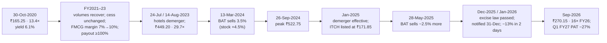

# I12 · ITC (2014 → 2020 → 2023 → 2026): value trap, re-rating, and the tax that came back

> **The hook.** On 31 March 2014 ITC traded at 32 times earnings. Over the next six and a half years its earnings per
> share rose 67% and the Nifty rose 74%, yet by 30 October 2020 the share price was 30% *lower*, at ₹165.25 — 13
> times trailing earnings, with a 6% dividend yield, ₹37,000 crore of cash and investments, and the most profitable
> cigarette franchise in Asia. Investors called it the market's best-known value trap: a tobacco company that kept
> putting its cigarette cash into biscuits, hotels and paper at single-digit returns, that ESG funds would not own,
> and whose earnings sat at the mercy of the finance minister. Anyone who bought that day made 47% a year for the
> next 34 months as the multiple doubled. Anyone who bought after the re-rating, on the day the board approved the
> hotels demerger in August 2023, lost a quarter of their money by September 2026, after the government replaced
> the GST cess with a new excise duty and cigarette profits fell. This case is about what "cheap" means for a
> business with one great segment and several ordinary ones, how to value a conglomerate part by part, and how to
> price a tax risk that is always present and occasionally realised.

| | |
|:--|:--|
| **Period** | FY2013–FY2020 (set-up) · **30 October 2020** (decision A) · FY2021–FY2023 · **14 August 2023** (decision B) · 2023–September 2026 (outcome) |
| **Decision dates** | **A:** close of **30 October 2020**, **₹165.25** (NSE), market cap ≈ **₹2.03 lakh crore** on 1,229.22 crore shares. You may use only what was public by then: annual reports to FY2020 (July 2020), the Q1 FY2021 results (July 2020), the July 2017 GST cess increase and the February 2020 Budget's NCCD increase. The Q2 FY2021 results came out on 6 November 2020, after the decision date. **B:** close of **14 August 2023**, **₹449.20**, market cap ≈ **₹5.59 lakh crore** on 1,243.95 crore shares. You may use only what was public by then: annual reports to FY2023, the Q1 FY2024 results and the hotels demerger scheme (in-principle approval 24 July 2023; scheme approved by the board on 14 August 2023) |
| **Sector** | Cigarettes, packaged foods and personal care ("FMCG-Others"), hotels, agri-business, paperboards and packaging (NSE: ITC). Fiscal year ends 31 March |
| **Themes** | "Cheap for a reason" vs mispriced · sum-of-the-parts and the conglomerate discount · return on incremental capital · sin-tax risk and volume elasticity · payout policy as a valuation driver · ESG exclusion and ownership flows · a large shareholder selling · demerger arithmetic · regulatory tail risk |
| **Modules this case reinforces** | [04.3 Returns on capital](../../04-financial-analysis/03-returns-on-capital.md) · [05.3 Moats](../../05-business-analysis/03-moats-and-competitive-advantage.md) · [05.5 Management & capital allocation](../../05-business-analysis/05-management-and-capital-allocation.md) · [06.5 Multiples](../../06-valuation/05-relative-valuation-and-multiples.md) · [06.6 Reverse DCF](../../06-valuation/06-reverse-dcf-and-expectations.md) · [06.7 Other valuation methods (SOTP)](../../06-valuation/07-other-valuation-methods.md) · [07.5 Holdcos & conglomerates](../../07-special-valuation/05-holdcos-conglomerates-psus-mncs.md) · [08.3 Consumer](../../08-sectors/03-consumer.md) · [12.1 Macro for equity investors](../../12-macro-special-sits/01-macro-for-equity-investors.md) · [12.3 Special situations](../../12-macro-special-sits/03-special-situations.md) |
| **Difficulty** | Intermediate (★★★☆☆). Do it after Modules 06 and 07. Pairs with [I2 Asian Paints](02-asian-paints-compounder.md) (a great business at a high price), [G1 See's Candies](../global/01-sees-candies-1972.md) (where to put a cash cow's cash) and [G2 Coca-Cola](../global/02-coca-cola-1988.md) |
| **Time** | ~3 hours (two decision points; about 45 minutes on each before you read on) |

!!! note "Conventions in this case"
    ₹ crore unless stated (1 crore = 10 million; 1 lakh crore = 1 trillion). Ten-year tables are **consolidated**
    (as compiled by Screener.in); segment data, EPS and dividends used for valuation are **standalone**, from the
    annual reports, because that is where ITC reports its segments. Share prices are **NSE closes from exchange
    bhavcopies**, not Yahoo Finance, whose history for ITC is adjusted for both the 2016 bonus and the 2025 hotels
    demerger. Per-share figures before the 1:2 bonus of July 2016 are divided by 1.5. "PBIT" is segment profit before
    interest and tax; "capital employed" is segment assets less segment liabilities. Bracketed numbers point to the
    [Sources](#sources).

---

## 1. The scene

### 1.1 The business (as of October 2020)

ITC began in 1910 as the Imperial Tobacco Company of India, a subsidiary of what became British American Tobacco
(BAT). It is now an Indian company with no controlling shareholder: BAT is the largest holder (29.47% at March 2020)
but cannot control the board, and Indian institutions (LIC, the Specified Undertaking of the UTI and other state
insurers) own a comparable share [[1]](#sources). Its businesses in FY2020 (standalone):

- **Cigarettes.** The dominant legal cigarette maker in India, with brands across every length and price point
  (Gold Flake, Classic, Navy Cut, Scissors, Bristol). Legal cigarettes are a small part of Indian tobacco
  consumption — most is bidi and chewing tobacco — and a heavily taxed one. Revenue ₹21,202 crore; PBIT ₹14,853
  crore, **85% of the group's segment profit** [[1]](#sources).
- **FMCG-Others.** Aashirvaad atta, Sunfeast biscuits, Bingo snacks, Yippee noodles, Classmate notebooks, and personal
  care (Savlon, Fiama, Engage). Built from nothing since the early 2000s; revenue ₹12,844 crore but PBIT only
  ₹423 crore (3.3% of revenue) [[1]](#sources).
- **Hotels.** ITC Maurya, ITC Grand Chola and about 100 other hotels, owned or managed; revenue ₹1,837 crore and PBIT
  ₹158 crore in FY2020, before Covid shut them.
- **Agri-business.** Leaf tobacco exports and commodity trading; the sourcing arm for the foods business.
- **Paperboards, paper and packaging.** India's largest paperboard maker, with integrated pulp and plantations and a
  packaging unit that supplies the cigarette business.

**Industry and regulation.** Cigarette taxes in India are among the highest in the world as a share of price. From
July 2017 cigarettes paid 28% GST plus a GST **compensation cess** (an ad valorem rate plus a specific amount per
thousand sticks by length) plus the National Calamity Contingent Duty (NCCD). On 17 July 2017 the GST Council raised
the cess days after GST began, and ITC fell 12.5% the next day. The February 2020 Budget raised the NCCD, and the stock
fell 6.9% on Budget day [[7]](#sources). Indian cigarette volumes had fallen for most of the 2010s as taxes rose,
while illegal (smuggled and counterfeit) cigarettes gained share.

**Management and capital allocation.** Sanjiv Puri became CEO in 2017 and chairman in 2019, succeeding Y.C.
Deveshwar, who had run ITC from 1996 and built the non-cigarette businesses. Management's stated strategy, "ITC Next",
was to build FMCG brands and hotels into large profit pools using the cigarette cash flow, and it defended the hotels
and paper businesses as strategic [[1]](#sources). In FY2020, 94% of capital expenditure (₹2,315 crore in total)
went outside cigarettes: 36% to FMCG-Others, 31% to hotels [[1]](#sources).

### 1.2 What the market believed, and who disagreed

**The bear case (the consensus by 2020).** Cigarettes were in structural decline; each Budget carried the risk of a
tax shock; ESG mandates excluded tobacco, so a growing share of global money could not own the stock; the
non-cigarette businesses destroyed value, earning 5–6% on capital; management would not return the cash or separate
the parts; and BAT, the largest shareholder, was itself a tobacco company. The share price was lower than in 2014.
Covid had closed the hotels and briefly shut cigarette factories. Foreign ownership was falling [[1]](#sources)
[[8]](#sources).

**The bull case (a minority).** Cigarette profits had compounded at about 7% a year even in a falling-volume market,
with pricing power and a near-monopoly on legal distribution. The payout ratio had risen to 82% and the dividend
yield exceeded the 10-year G-sec (≈5.9%). The non-cigarette capital was sunk, and incremental FMCG margins were
improving. At 13 times earnings, the market was pricing a slow death that the numbers did not show.

### 1.3 The scene at decision B (August 2023)

By August 2023 the stock had nearly tripled. Cigarette volumes had recovered after Covid while GST cess rates stayed
unchanged; FMCG-Others margins had doubled; hotels were enjoying a post-Covid boom; paperboards had a cyclical peak.
ITC paid out more than 100% of FY2023 earnings, including a special dividend. It crossed ₹5 lakh crore of market value
and, for a few days in July 2023, briefly overtook Hindustan Unilever as India's most valuable consumer company
[[9]](#sources). On 24 July 2023 the board gave in-principle approval to **demerge the hotels business**, with ITC
keeping about 40% and shareholders receiving the rest; on **14 August 2023** it approved the scheme: **one ITC Hotels
share for every ten ITC shares** [[3]](#sources) [[4]](#sources). The market had wanted the hotels out for years; it
fell 3.9% on 24 July, disappointed that ITC would keep 40%.

---

## 2. The numbers then

### 2.1 Decision A (October 2020)

**Table 2.1: ITC consolidated, FY2015–FY2020 (₹ crore)**

| FY | Sales | Operating profit | OPM (%) | Net profit | EPS (₹) | Payout (%) | ROCE (%) | Free cash flow |
|:--|--:|--:|--:|--:|--:|--:|--:|--:|
| 2015 | 38,817 | 14,252 | 37 | 9,779 | 8.04 | 52 | 47 | 6,552 |
| 2016 | 39,192 | 14,531 | 37 | 9,501 | 7.74 | 73 | 40 | 7,459 |
| 2017 | 42,768 | 15,470 | 36 | 10,477 | 8.47 | 56 | 36 | 7,556 |
| 2018 | 43,449 | 16,521 | 38 | 11,493 | 9.24 | 56 | 34 | 10,371 |
| 2019 | 48,340 | 18,537 | 38 | 12,836 | 10.27 | 56 | 34 | 9,442 |
| 2020 | 49,388 | 19,344 | 39 | 15,593 | 12.45 | 82 | 32 | 12,276 |

Source: Screener.in, consolidated [[5]](#sources). EPS is on the post-2016-bonus share count. FY2020 net profit
benefited from the cut in the corporate tax rate (tax rate 22% against 33% a year earlier). Sales are net of excise
and GST.

**Table 2.2: Segment economics, FY2020 (standalone, ₹ crore)**

| Segment | Revenue | PBIT | PBIT margin (%) | EBITDA | Capital employed | ROCE (%) | Share of segment PBIT (%) | Share of FY2020 capex (%) |
|:--|--:|--:|--:|--:|--:|--:|--:|--:|
| Cigarettes | 21,202 | 14,853 | 70.1 | 15,125 | 2,913 | 510 | 84.7 | 5.6 |
| FMCG-Others | 12,844 | 423 | 3.3 | 914 | 6,561 | 6.4 | 2.4 | 36.2 |
| Hotels | 1,837 | 158 | 8.6 | 420 | 5,788 | 2.7 | 0.9 | 31.2 |
| Agri-business | 10,241 | 789 | 7.7 | 862 | 2,932 | 26.9 | 4.5 | 2.4 |
| Paperboards & packaging | 6,107 | 1,305 | 21.4 | 1,663 | 6,059 | 21.5 | 7.4 | 10.7 |
| **Total** | | **17,528** | | | **24,253** | | 100 | 86.1 (13.9 unallocated) |

Source: FY2020 annual report, segment note [[1]](#sources). Segment revenue is gross of inter-segment sales, so it
does not add to the consolidated figure. EBITDA = PBIT + segment depreciation. ROCE = PBIT ÷ year-end capital
employed.

**Table 2.3: Where the profit came from, FY2013–FY2020 (standalone, ₹ crore)**

| FY | Cigarette PBIT | FMCG-Others revenue | FMCG-Others PBIT |
|:--|--:|--:|--:|
| 2013 | 8,326 | 7,012 | (81) |
| 2014 | 10,016 | 8,122 | 22 |
| 2015 | 11,196 | 9,038 | 34 |
| 2016 | 11,752 | 9,731 | 71 |
| 2017 | 12,514 | 10,512 | 28 |
| 2018 | 13,341 | 11,329 | 164 |
| 2019 | 14,551 | 12,505 | 316 |
| 2020 | 14,853 | 12,844 | 423 |
| **CAGR FY2014–20** | **6.8%** | **7.9%** | — |

Source: annual reports FY2014–FY2020 [[1]](#sources) [[2]](#sources). After roughly fifteen years and several
thousand crore of investment, FMCG-Others made ₹423 crore of PBIT on ₹12,844 crore of revenue.

**Table 2.4: Valuation at decision A (30 October 2020)**

| Metric | Value | Working |
|:--|--:|:--|
| Price | ₹165.25 | NSE close [[7]](#sources) |
| Market cap | ₹2,03,129 crore | 165.25 × 1,229.22 crore shares |
| FY2020 standalone EPS / P/E | ₹12.31 / 13.4× | [[1]](#sources) |
| Trailing-twelve-month EPS / P/E (to June 2020) | ₹11.64 / 14.2× | Q1 FY2021 hit by lockdown |
| FY2020 dividend / yield | ₹10.15 / **6.1%** | Payout 82% of standalone profit |
| Earnings yield vs 10-year G-sec | 7.4% vs ≈5.9% | |
| Cash and current investments / plus non-current investments | ₹24,018 / ₹37,474 crore | ₹19.5 / ₹30.5 per share |
| Net worth / P/B | ₹64,029 crore / 3.2× | |
| Price change since 31-Mar-2014 (bonus-adjusted ₹235.23) | **−29.8%** | EPS +67% over the same period; Nifty +73.7% |
| P/E on 31-Mar-2014 | 31.9× | ₹352.85 ÷ FY2014 EPS ₹11.05 (pre-bonus) |
| Peers' P/E | HUL 66.5×, Nestlé India 84×, VST 17.3×, Godfrey Phillips 12.0× | FY2020 / CY2019 earnings |
| BAT holding / FPI holding | 29.47% / 14.63% | Shareholding pattern, March 2020 |

Sources: [[1]](#sources) [[5]](#sources) [[7]](#sources). The 10-year G-sec yield is approximate. Peer multiples are
computed from each company's reported EPS and its NSE close on the same date.

### 2.2 Decision B (August 2023)

**Table 2.5: ITC, FY2020–FY2023 (consolidated unless stated, ₹ crore)**

| FY | Sales | Operating profit | Net profit | EPS (₹) | Payout (%) | Cigarette PBIT (standalone) | FMCG-Others revenue (standalone) | FMCG-Others EBITDA margin (%) |
|:--|--:|--:|--:|--:|--:|--:|--:|--:|
| 2020 | 49,388 | 19,344 | 15,593 | 12.45 | 82 | 14,853 | 12,844 | 7.1 |
| 2021 | 49,257 | 17,065 | 13,383 | 10.69 | 101 | n/r | n/r | n/r |
| 2022 | 60,645 | 20,623 | 15,503 | 12.37 | 93 | n/r | n/r | n/r |
| 2023 | 70,919 | 25,704 | 19,477 | 15.44 | 100 | 17,927 | 19,123 | 10.2 |

Sources: [[5]](#sources) [[2]](#sources). n/r = not reproduced here. FY2020–23 CAGR: cigarette PBIT 6.5%, FMCG-Others
revenue 14.2%.

**Table 2.6: Segment economics, FY2023 (standalone, ₹ crore)**

| Segment | PBIT | EBITDA | EBITDA margin (%) | Capital employed | ROCE (%) | Share of segment PBIT (%) |
|:--|--:|--:|--:|--:|--:|--:|
| Cigarettes | 17,927 | 18,196 | 64.5 | 2,234 | 803 | 76.4 |
| FMCG-Others | 1,374 | 1,954 | 10.2 | 9,615 | 14.3 | 5.9 |
| Hotels | 542 | 832 | 32.2 | 5,574 | 9.7 | 2.3 |
| Agri-business | 1,328 | 1,394 | 7.7 | 2,465 | 53.9 | 5.7 |
| Paperboards & packaging | 2,294 | 2,642 | 29.1 | 7,886 | 29.1 | 9.8 |

Source: FY2023 annual report [[2]](#sources).

**Table 2.7: Valuation at decision B (14 August 2023)**

| Metric | Value | Working |
|:--|--:|:--|
| Price | ₹449.20 | NSE close [[7]](#sources) |
| Market cap | ₹5,58,782 crore | 449.20 × 1,243.95 crore shares |
| FY2023 standalone EPS / P/E | ₹15.15 / 29.7× | |
| Trailing-twelve-month EPS / P/E (to June 2023) | ₹15.67 / 28.7× | |
| FY2023 dividend / yield | ₹15.50 incl. ₹2.75 special / 3.45% | Payout 103% of standalone profit |
| Earnings yield vs 10-year G-sec | 3.5% vs ≈7.2% | |
| Price change since decision A | +171.8% | Nifty +66.9% |
| Peers' P/E | HUL 59.7×, Nestlé India 88×, VST 16.3×, Godfrey Phillips 17.4× | FY2023 / CY2022 earnings |

### 2.3 What the filings said (paraphrased)

1. **FY2020 annual report [[1]](#sources).** The chairman described the non-cigarette businesses as "future
   engines of growth" and set out the "ITC Next" strategy of building brands, digital capability and "Indian
   agriculture"-linked supply chains. The report highlighted that FMCG-Others had become the second-largest
   packaged-foods business in India and that its EBITDA margin had improved for several years running. It
   emphasised the social and environmental credentials of the group (carbon, water and solid-waste positive).
2. **Taxation.** The report described the cigarette tax regime as "discriminatory" and "punitive", pointing to the
   share of illicit trade and to legal cigarettes' small share of tobacco consumption, and argued for a "stable,
   equitable and pragmatic" tax policy [[1]](#sources).
3. **Payout.** The board had raised the payout ratio in stages to 82% of standalone profit in FY2020 [[1]](#sources).
4. **The demerger media statement (24 July 2023) [[3]](#sources).** The board had "evaluated and discussed various
   alternative structures for the Hotels Business" and chose a demerger into a new listed entity, with ITC holding
   about 40% and shareholders about 60%, so that the hotels could have their own capital structure and investors.
5. **The scheme (14 August 2023) [[4]](#sources).** Share entitlement: one ITC Hotels share of ₹1 for every ten ITC
   shares of ₹1; ITC to keep ~40%; subject to shareholder, creditor, stock-exchange and NCLT approvals.

---

## 3. You are the analyst

Answer these **before reading section 4**, using only sections 1 and 2. Show your arithmetic.

### Decision A: 30 October 2020 (₹165.25)

1. **(Numerical — sum of the parts.)** Value each segment from Table 2.2: cigarettes at 12× EBITDA (a discount to a
   global tobacco multiple, to reflect tax risk), FMCG-Others at 3× revenue (a heavy discount to HUL and Nestlé,
   reflecting its low margin), hotels at 20× FY2020 EBITDA, paper and agri at 8× EBITDA. Add ₹37,474 crore of cash and
   investments (ITC has almost no debt). What is the value per share? Then turn it round: what multiple of cigarette
   EBITDA, and of cigarette PBIT after tax (25.17% rate), is the market paying once the other parts and the cash are
   valued as above?
2. **(Numerical — return on incremental capital.)** From Table 2.2, compute the combined PBIT, capital employed and
   ROCE of FMCG-Others and hotels. At an 11% pre-tax cost of capital, what is the annual shortfall in rupees? What
   share of FY2020 capex went into these two segments? Is the market's "value destruction" argument about the
   *stock* of capital already invested or the *flow* of new investment — and which matters more for the share price?
3. **(Numerical — the tax sensitivity.)** Assume a tax increase is passed through in full, so the cigarette margin
   per stick is unchanged, and volumes respond to price with an elasticity of −0.4. Compute the change in cigarette
   PBIT and in group EPS (cigarettes = 84.7% of segment PBIT) for retail price increases of 10%, 15% and 20%, the last
   two with elasticities of −0.5 and −0.6. How does that compare with the 12.5% one-day fall in July 2017?
4. **(Numerical — what does the price imply?)** With a dividend of ₹10.15 and a cost of equity of 11%, solve the Gordon
   model for the perpetual dividend growth the price implies. Repeat at 10% and 12%. Compare with the 6.8% cigarette
   PBIT CAGR and the 9.5% PAT CAGR of FY2014–FY2020.
5. **(Judgement — why is it cheap?)** List every reason the stock de-rated from 32× to 13× while EPS rose 67%. For
   each, say whether it is a *cash-flow* reason (the future profits are lower or riskier) or a *demand-for-the-stock*
   reason (fewer buyers regardless of cash flows), and what evidence would reverse it.
6. **(Decision A.)** Build three three-year scenarios — bear (EPS +2% a year, P/E 11×), base (EPS +7%, P/E 16×), bull
   (EPS +10%, P/E 22×) — with an 85% payout. Compute the total return and annualised return of each from ₹165.25. Buy,
   avoid or short? How much would you own?

### Decision B: 14 August 2023 (₹449.20)

7. **(Numerical — decompose A → B.)** Using TTM EPS of ₹11.64 at A and ₹15.67 at B, split the price change from
   ₹165.25 to ₹449.20 (2.79 years) into EPS growth and P/E change, and add the ₹37.75 of dividends paid in between.
   What share of the return was the re-rating?
8. **(Numerical — how big is the hotels demerger?)** Value the hotels business at 20×, 25× and 30× its FY2023 EBITDA
   (₹832 crore). What is the 60% going to shareholders worth per ITC share, and as a percentage of the ₹449.20 price?
   What does that tell you about whether the demerger explains the re-rating?
9. **(Numerical — the tax tail.)** Cigarettes are 76.4% of segment PBIT at B. If a tax change cut cigarette PBIT by
   10%, 20% and 30%, what happens to EPS? What price results at the current 29.7× P/E, and at 20×? How far could the
   stock fall?
10. **(Decision B.)** Build three three-year scenarios from ₹449.20 — bear (EPS +3% a year, exit P/E 18×), base (+8%,
    24×), bull (+11%, 30×) — with a 95% payout. Hold, buy more or sell? How does your answer depend on what you
    believe about the probability of a tax shock?

---

## 4. What happened

**2020–2023: the re-rating.** The Q2 FY2021 results on 6 November 2020 showed cigarette revenue recovering and
FMCG-Others EBITDA up 66% with margins at 9.7% [[6]](#sources). Over the next three years three things happened at
once. Cigarette taxes did not rise: the GST compensation cess rates, which the finance minister later noted were
unchanged from July 2017, stayed where they were, and volumes recovered from Covid [[10]](#sources). The non-
cigarette businesses improved: FMCG-Others' EBITDA margin rose from 7.1% to 10.2% and its revenue grew 14% a year;
hotels rebounded; paperboards had a cyclical peak. And the payout rose to 100% or more. EPS grew about 11% a year;
the P/E doubled. From ₹165.25 the stock reached ₹449.20 on 14 August 2023 — with dividends, **47% a year for 34
months** [[5]](#sources) [[7]](#sources).

**2023–2025: the peak, BAT and the demerger.** On 13 March 2024 BAT sold about 3.5% of ITC (43.7 crore shares) in an
accelerated bookbuild, cutting its stake to about 25.5%; the overhang cleared and the stock rose 4.5% [[11]](#sources).
ITC closed at a record **₹522.75 on 26 September 2024**. The hotels demerger became effective on 1 January 2025 (record
date 6 January). In the special pre-open session on 6 January, ITC's price fell from ₹481.60 to ₹455.60 — an
implied ₹26 per ITC share, or ₹260 per ITC Hotels share. ITC Hotels listed on 29 January 2025 and closed its first
day at **₹171.85**, a third below that discovery price. For tax purposes ITC told shareholders to allocate 86.49% of
their cost to ITC and 13.51% to ITC Hotels [[4]](#sources) [[7]](#sources). On 28 May 2025 BAT sold roughly another
2.5% at around ₹400–417 a share, leaving it with about 23% (22.91% at March 2026) [[12]](#sources); in December 2025
it launched a block sale of its 15.3% stake in ITC Hotels.

**December 2025–September 2026: the tax came back.** The GST compensation cess, levied since 2017 to compensate states
for GST revenue losses, was due to end once the borrowing it serviced was repaid. The government's answer for tobacco
was to restore a central excise duty. Parliament passed the **Central Excise (Amendment) Bill, 2025** in December
2025; the finance minister said it was "not a new law and not even an additional tax" but a return to the pre-GST
excise, with the cess "reverting back to the Centre to be collected as excise duty", and noted that total tax
incidence on cigarettes was 53% of retail price [[10]](#sources). The notification on 31 December 2025 set a specific
excise of **₹2,050 to ₹8,500 per 1,000 sticks**, by length, effective 1 February 2026, alongside a 40% GST rate in
place of 28% plus cess. Analysts said the combined increase was much larger than expected; Religare estimated costs
in the 75–85mm segment (16% of ITC's volume) would rise 22–28%. ITC fell **9.7% on 1 January 2026**, its largest
one-day fall since March 2020, and another 3.8% the next day; Godfrey Phillips fell 17% [[13]](#sources).

ITC responded with staggered price increases and "over 30 interventions" to re-engineer its portfolio, to limit the
shift to illicit cigarettes. FY2026 was still a growth year: consolidated PAT rose 4.9%, and the board paid ₹14.50 a
share. But the first full quarter under the new tax, Q1 FY2027, showed **standalone EBITDA down 28% and PAT down
27%** year on year, even as FMCG-Others revenue grew 12% and its PBIT 21% [[14]](#sources). On 23 September 2026 ITC
closed at **₹270.15** — 16.4× FY2026 consolidated EPS of ₹16.51, with a 5.4% trailing dividend yield — after touching
₹255.50 on 31 August 2026 [[5]](#sources) [[7]](#sources). ITC Hotels closed at ₹161.23.

**The returns.** Holding one ITC share plus the 0.1 ITC Hotels share it received:

| Holder | Start | Value on 23-Sep-2026 (ITC + 0.1 ITCH) | Dividends received (not reinvested) | Total | Annualised | Nifty (price) |
|:--|--:|--:|--:|--:|--:|--:|
| Bought at A (30-Oct-2020) | ₹165.25 | ₹286.27 | ₹80.35 (+₹0.10 from ITCH) | **2.22×** | **14.5%** | 2.01× (12.6%) |
| Bought at B (14-Aug-2023) | ₹449.20 | ₹286.27 | ₹42.60 (+₹0.10) | **0.73×** | **−9.5%** | 1.21× |

Sources: bhavcopy and Yahoo Finance closes and ITC dividend history [[7]](#sources); ITC Hotels paid a ₹1 dividend in
2026. From the September 2024 peak to 31 August 2026 the combined position fell 48%.

---

## 5. Signals: knowable then vs hindsight

| Knowable at the decision date | Only in hindsight |
|:--|:--|
| **A:** Cigarette PBIT had compounded ~7% a year for six years with a 500%+ ROCE; payout had risen to 82%; the dividend yield exceeded the G-sec | That three years would pass without a cigarette tax increase |
| **A:** A sum-of-the-parts with conservative multiples gave ~₹233 a share; the market was paying about 6.5× cigarette EBITDA once the rest was valued | That FMCG-Others margins would rise three points and hotels boom after Covid |
| **A:** The de-rating was largely about *demand for the stock* (ESG exclusion, falling FPI ownership, BAT overhang, "value trap" narrative) rather than falling cash flows | That domestic institutions would absorb the supply and that BAT's sales would be seen as clearing an overhang |
| **B:** 29.7× earnings and a 3.5% earnings yield against a 7.2% G-sec, for a business whose profit was 76% cigarettes | The timing and design of the excise duty that replaced the cess |
| **B:** The cess was temporary by law; its end was public, and a replacement tax on cigarettes was a stated policy option | That Q1 FY2027 profit would fall 27% |
| **B:** The hotels demerger was worth only ~2% of ITC's market value; it could not justify a re-rating | That ITC Hotels would list a third below the discovery price |

!!! success "The strongest bear case at A — and the strongest bull case at B"
    **Bear at A (October 2020).** Legal cigarette volumes had fallen for a decade; illicit trade was rising; every
    Budget was a coin toss; ESG exclusion would keep shrinking the buyer base; management had spent fifteen years and
    thousands of crores building businesses that earned less than their cost of capital and showed no intention of
    stopping or splitting them. "Cheap for a reason" — the stock had lost 30% in six years while its earnings rose.

    **Bull at B (August 2023).** ITC had finally shown that FMCG could earn double-digit margins, the hotels were
    being separated, the payout was over 100%, BAT was a willing seller whose supply was being absorbed, and domestic
    investors owned a growing share. At 30× it was still cheaper than HUL or Nestlé.

    Each side was right about the facts it chose. The bear at A was right that the tax risk was permanent — and wrong
    that it was about to be realised, at a price that already assumed it. The bull at B was right that the business
    had improved — and wrong to pay a consumer-staples multiple for a business whose profit remained three-quarters
    cigarettes. The same tax risk was mispriced in opposite directions three years apart.

---

## 6. Lessons

1. **"Cheap for a reason" needs the reason sorted into cash flows and flows of money.** ITC's 2014–2020 de-rating
   happened while earnings rose 67%. Reasons that change future cash (tax, volumes, value-destroying capex) belong in
   the valuation; reasons that change who can buy (ESG exclusion, a large seller) create opportunities when the price
   already discounts them.
   → [06.5 Multiples](../../06-valuation/05-relative-valuation-and-multiples.md) ·
   [12.2 Market cycles & sentiment](../../12-macro-special-sits/02-market-cycles-and-sentiment.md)
2. **Value a conglomerate part by part, then ask what the market pays for the core.** At A, once the other businesses
   and the cash were valued generously, the market was paying about 9× after-tax cigarette profit — a price for a
   declining business, attached to one that was growing.
   → [06.7 Other valuation methods (SOTP)](../../06-valuation/07-other-valuation-methods.md) ·
   [07.5 Holdcos & conglomerates](../../07-special-valuation/05-holdcos-conglomerates-psus-mncs.md)
3. **Distinguish the stock of bad capital from the flow.** ITC's ₹12,000 crore in FMCG-Others and hotels earned about 5%
   — a sunk cost. What mattered for the share price was whether new money would keep going in at those returns, and
   whether margins on the existing capital would rise. Both improved after 2020.
   → [04.3 Returns on capital](../../04-financial-analysis/03-returns-on-capital.md) ·
   [05.5 Management & capital allocation](../../05-business-analysis/05-management-and-capital-allocation.md)
4. **Payout policy is a valuation lever.** Raising the payout from 52% to 100% converted an argument about capital
   allocation into a cash yield above the risk-free rate — and removed much of the "they will waste the cash" discount.
   → [G1 See's Candies](../global/01-sees-candies-1972.md) · [06.1 What value is](../../06-valuation/01-what-is-value.md)
5. **Sin-tax risk is a permanent tail; price it as a probability, not a certainty or an impossibility.** At A the
   price implied perpetual decline; at B it implied tax stability for a business whose tax was set annually by the
   state. The same risk was underpriced at the peak and overpriced at the trough.
   → [12.1 Macro & policy](../../12-macro-special-sits/01-macro-for-equity-investors.md) ·
   [06.8 Margin of safety](../../06-valuation/08-margin-of-safety-and-expected-value.md)
6. **Read the sunset clauses.** The GST compensation cess had a legal end; a government that depends on tobacco
   revenue was always going to replace it. Scheduled regulatory changes belong in the monitoring list years ahead.
   → [11.5 Monitoring & selling](../../11-process/05-monitoring-and-selling.md)
7. **A demerger's value is its size, not its headline.** The hotels were 2–3% of ITC's value. Re-ratings attributed to
   small corporate actions are usually about something else.
   → [12.3 Special situations](../../12-macro-special-sits/03-special-situations.md)
8. **Multiples of mixed businesses drift toward the multiple of their largest profit pool.** Paying a staples multiple
   for a company whose profit was 76% cigarettes relied on the market continuing to see it as a staples company.
   → [08.3 Consumer](../../08-sectors/03-consumer.md)

---

## 7. Model answers

<strong>Q1 — Sum of the parts (A)</strong>

Cigarettes 15,125 × 12 = ₹1,81,500 crore; FMCG-Others 12,844 × 3 = ₹38,533 crore; hotels 420 × 20 = ₹8,400 crore;
agri 862 × 8 = ₹6,896 crore; paper 1,663 × 8 = ₹13,304 crore; cash and investments ₹37,474 crore. Total
**₹2,86,107 crore = ₹232.8 a share**, 41% above ₹165.25. With cigarettes at 10× the answer is ₹208; at 8×, ₹184.

Turning it round: the market cap of ₹2,03,129 crore less the other parts and the cash (₹1,04,607 crore) leaves
**₹98,522 crore for the cigarette business — 6.5× its EBITDA and 8.9× its after-tax PBIT** (14,853 × 0.7483 = ₹11,114
crore). That is the multiple of a business expected to shrink steadily, applied to one whose profit had grown 6.8%
a year. Even if FMCG-Others were valued at zero, cigarettes would be priced at under 9× EBITDA.

<strong>Q2 — Return on incremental capital (A)</strong>

FMCG-Others + hotels: PBIT 423 + 158 = **₹581 crore** on capital employed 6,561 + 5,788 = **₹12,349 crore** — a ROCE
of **4.7%**. At 11% the required PBIT is ₹1,358 crore, a shortfall of **₹778 crore a year** (about ₹0.63 a share
before tax). FY2020 capex into the two segments: 36.2% + 31.2% = **67%** of ₹2,315 crore, i.e. ₹1,560 crore.

The *stock* (₹12,349 crore) is sunk: it matters only through what it earns from here. The *flow* (₹1,500–2,000 crore a
year) is the live decision: every rupee earning 5% against an 11% cost destroys about half its value. What the share
price needed was either higher returns on the stock (margins rising) or less flow (capex falling relative to cash
generation, and the rest paid out). The 82% payout had already capped the flow; the margin improvement came after.

<strong>Q3 — The tax sensitivity (A)</strong>

With full pass-through and a constant margin per stick, cigarette PBIT moves with volume. Price +10%, elasticity −0.4:
volume **−4.0%**, cigarette PBIT −4.0%, group EPS −0.847 × 4.0 = **−3.4%**. Price +15%, −0.5: volume −7.5%, EPS
**−6.4%**. Price +20%, −0.6: volume −12%, EPS **−10.2%**. The 12.5% one-day fall in July 2017 was larger than even the
worst of these earnings effects — the market was pricing the *multiple* (the perceived permanence and repetition of
tax risk), not only the earnings hit. If ITC does not pass the tax through in full, margin falls too and the EPS effect
roughly doubles, which is what Q1 FY2027 later showed.

<strong>Q4 — What the price implies (A)</strong>

Gordon: P = D₀(1 + g) ÷ (r − g) → g = (rP − D₀) ÷ (P + D₀). At r = 11%: (0.11 × 165.25 − 10.15) ÷ (165.25 + 10.15)
= **4.6%**. At 10%: **3.6%**; at 12%: **5.5%**. The price assumed dividends would grow at 3.5–5.5% forever — roughly
inflation — for a company whose cigarette PBIT had grown 6.8% and profit 9.5% a year for six years. It was a price for
real decline in a business that had not been declining.

<strong>Q5 — Why is it cheap? (A)</strong>

Cash-flow reasons: (1) tax shocks (2017 cess, 2020 NCCD) — lower and riskier future profits; (2) legal volumes falling
and illicit trade rising; (3) capital put into low-return businesses; (4) Covid hitting hotels and, briefly,
cigarettes. Demand-for-the-stock reasons: (5) ESG exclusion shrinking the pool of buyers; (6) falling FPI ownership
(14.6%); (7) BAT, a 29% holder, seen as a potential seller; (8) the "value trap" narrative itself — momentum and
underperformance feed on each other.

Reversal evidence: a year without a tax increase; FMCG-Others margins rising; capex falling relative to cash flow and
payout rising; domestic institutions and retail absorbing supply; BAT's intentions clarified. The cash-flow reasons
were partly priced; the demand reasons were, by nature, reversible without any change in the business.

<strong>Q6 — Decision A</strong>

From EPS ₹12.31, 85% payout, three years:

| Scenario | EPS year 3 | Price year 3 | Dividends | Total multiple | Annualised |
|:--|--:|--:|--:|--:|--:|
| Bear (+2%, 11×) | 13.06 | 143.7 | 32.7 | 1.07× | 2.2% |
| Base (+7%, 16×) | 15.08 | 241.3 | 36.0 | 1.68× | 18.8% |
| Bull (+10%, 22×) | 16.38 | 360.5 | 38.1 | 2.41× | 34.1% |

Even the bear case returns roughly the cash yield; the base case needs only a partial re-rating. The asymmetry favoured
buying, sized for the tax tail: a 4–6% position, with the max-loss rule applied to a scenario in which a tax shock
takes the stock down 30% ([11.4](../../11-process/04-position-sizing-and-portfolio-construction.md)). The outcome to
August 2023 exceeded the bull case, because both EPS and the multiple did better.

<strong>Q7 — Decompose A → B</strong>

Price 449.20 ÷ 165.25 = **2.72×** over 2.79 years (**43.2% a year**). EPS 15.67 ÷ 11.64 = 1.35× (**11.3% a year**).
P/E 14.2× → 28.7× = 2.02× (**28.7% a year**). With ₹37.75 of dividends, the total was 2.95× (**47.4% a year**). About
**70% of the price return (in log terms) was the re-rating** — the market changed its mind about ITC far more than
ITC's earnings changed.

<strong>Q8 — How big is the hotels demerger? (B)</strong>

Hotels EV at 20×, 25×, 30× of ₹832 crore EBITDA = ₹16,640, ₹20,800, ₹24,960 crore. The 60% going to shareholders is
worth **₹8.0, ₹10.0 and ₹12.0 per ITC share — 1.8%, 2.2% and 2.7% of the ₹449.20 price** (the whole hotels business,
₹13–20 a share). Capital employed was ₹4.48 a share. The demerger could not explain a tripling; at most it removed a
small drag on returns and signalled a management more willing to act for shareholders. (In hindsight, the market
priced ITC Hotels at ₹26 per ITC share on 6 January 2025, then valued it at ₹17 on listing day.)

<strong>Q9 — The tax tail (B)</strong>

EPS effect ≈ cut × 76.4% (treating segment PBIT shares as profit shares). Cigarette PBIT −10%: EPS ₹14.47 (−7.6%);
at 29.7× → ₹430; at 20× → **₹290 (−36%)**. −20%: EPS ₹13.28 (−15.3%) → ₹394 at 29.7×, **₹266 (−41%)** at 20×. −30%:
EPS ₹12.08 (−22.9%) → ₹359, **₹242 (−46%)**. The earnings effect alone is modest; the danger is the multiple, which at
B assumed tax stability. A tax shock that also resets the P/E to 20× costs 36–46%.

<strong>Q10 — Decision B</strong>

From EPS ₹15.67, 95% payout, three years:

| Scenario | EPS year 3 | Price year 3 | Total multiple | Annualised |
|:--|--:|--:|--:|--:|
| Bear (+3%, 18×) | 17.12 | 308.2 | 0.79× | −7.5% |
| Base (+8%, 24×) | 19.74 | 473.8 | 1.17× | 5.4% |
| Bull (+11%, 30×) | 21.43 | 642.9 | 1.55× | 15.8% |

The base case returns less than the G-sec; the bull case needs the multiple to hold at 30× *and* growth to accelerate.
If you attach even a 30% probability to a tax shock within three years (Q9: −36% to −46%), the expected return is
below the risk-free rate. **Trim or sell**; if held, size it as a yield position with the tax tail explicit. The actual
outcome was close to the bear case: EPS grew, then the tax arrived, and the stock returned −9.5% a year including
dividends.

---

## 8. Discussion questions & extensions

1. **Rebuild the SOTP today.** Using the FY2026 annual report and current market prices, value ITC's parts (including
   its 40% of ITC Hotels at market). What multiple of after-tax cigarette profit does ₹270 imply? Is it closer to A or
   to B?
2. **Illicit trade as the elasticity.** Industry bodies argue that higher taxes shift consumption to smuggled
   cigarettes rather than reducing it. Find two independent estimates of illicit trade's share in India. How would you
   build that into the volume elasticity in Q3?
3. **ESG exclusion and returns.** ITC holds an MSCI ESG "AA" rating for its environmental record, yet many funds exclude
   tobacco. Does exclusion raise a stock's expected return (a lower price for the same cash flows)? Compare ITC's
   2014–2020 and 2020–2023 returns and discuss.
4. **Compare two de-ratings.** [I2 Asian Paints](02-asian-paints-compounder.md) de-rated from 97× because a competitor
   arrived; ITC re-rated and then de-rated because a tax did not come and then came. Which risk was easier to see in
   advance, and which was priced better?
5. **BAT's sales.** BAT sold about 6% of ITC in 2024–25 and put its ITC Hotels stake up for sale. Model the supply as a share of
   average daily turnover and discuss how block sales to institutions differ from market selling
   ([12.3](../../12-macro-special-sits/03-special-situations.md)).

---

## Sources

All accessed 23-Sep-2026.

[1]: https://itcportal.com/content/dam/itc-corporate/pdfs/report-and-accounts/ITC-Report-and-Accounts-2020.pdf
[2]: https://itcportal.com/content/dam/itc-corporate/pdfs/report-and-accounts/ITC-Report-and-Accounts-2023.pdf
[3]: https://www.bseindia.com/xml-data/corpfiling/AttachHis/4af27618-eabc-47cc-b039-10b682467ecd.pdf
[4]: https://www.bseindia.com/xml-data/corpfiling/AttachHis/cd6cc39f-c7ae-4992-a507-cf03c161331c.pdf
[5]: https://www.screener.in/company/ITC/consolidated/
[6]: https://itcportal.com/content/dam/itc-corporate/pdfs/media-statement/2020-2021/ITC-Press-Release-Q2-FY2020.pdf
[7]: https://www.nseindia.com/all-reports
[8]: https://www.businesstoday.in/magazine/the-buzz/story/bats-reduction-of-stake-in-itc-heres-how-it-can-impact-the-indian-fmcg-giant-423782-2024-04-01
[9]: https://www.zeebiz.com/markets/stocks/news-itc-briefly-beats-hul-to-become-most-valued-fmcg-company-amid-hotel-business-demerger-talk-nse-bse-price-rs-500-price-target-marketcap-stst-245424
[10]: https://newsonair.gov.in/ls-passes-excise-bill-2025-to-raise-excise-duties-and-cess-on-tobacco-products/
[11]: https://www.business-standard.com/companies/news/bat-plans-to-sell-up-to-3-5-of-stake-in-itc-will-own-25-5-after-sale-124031200751_1.html
[12]: https://upstox.com/news/market-news/stocks/itc-shares-in-focus-bat-to-offload-2-3-stake-worth-11-600-crore-check-details/article-170206/
[13]: https://www.newindianexpress.com/business/2026/Jan/01/itc-shares-see-sharpest-fall-in-six-years-as-centre-imposes-new-excise-duty-on-cigarettes
[14]: https://itcportal.com/content/dam/itc-corporate/open-pdfs/report-and-accounts/ITC-Report-and-Accounts-2026.pdf

Notes on sources. Share prices are NSE bhavcopy closes (archive files reached through [7]) and, for 2025–2026 and ITC
Hotels, NSE closes via Yahoo Finance. Segment figures for FY2013–FY2019 come from the annual reports for those years at
the same itcportal.com address pattern as [1] and [2]. The Q1 FY2027 figures in section 4 are from ITC's media statement
for the quarter ended 30 June 2026 (on itcportal.com and BSE), and the FY2026 dividend from the Q4 FY2026 statement.
Source [9] reports ITC briefly overtaking HUL in market value amid the July 2023 demerger talk (on 6 July 2023 the
exchange sought ITC's clarification of a media report on the demerger). The 10-year G-sec yields at the two
decision dates are approximate (RBI data).

---
[← Previous: I11 · Kingfisher & Jet Airways](11-jet-kingfisher-airlines.md) · [Module index](../index.md) · [Next: I13 · Avenue Supermarts / DMart (2017–) →](13-dmart-avenue-supermarts.md)
