# I13 · Avenue Supermarts / DMart (2017–2026): the cheapest shop and the most expensive share

> **The hook.** In March 2017 a Mumbai supermarket chain with 118 stores, 14.7% gross margins and a founder who
> preferred to own the land under his shops asked the market for ₹1,870 crore at ₹299 a share, 53× its last full-year
> earnings. The book was subscribed about 106 times; on 21 March the shares closed at ₹641.60. Four and a half years
> later, on 14 October 2021, the same shares closed at ₹5,323.75 — a market value of ₹3.45 lakh crore, about 299× trailing
> earnings for a business that earns roughly 5 paise of profit on each rupee of sales. By September 2026 DMart had 500
> stores and 2.6× the earnings per share of October 2021, and the stock was 28% *lower*. The IPO allottee compounded at
> 31% a year; the 2021 buyer lost money while the business did almost everything asked of it. This case teaches retail
> unit economics (sales per square foot, gross margin against operating cost, inventory turns, store payback), what
> owning the real estate does to returns on capital, and why a great business at the wrong price is a bad investment.

| | |
|:--|:--|
| **Period** | FY2012–FY2016 and 9M FY2017 (set-up) · **21 March 2017** (decision A) · FY2017–FY2021 · **14 October 2021** (decision B) · 2021–September 2026 (outcome) |
| **Decision dates** | **A:** 21 March 2017, listing day. Issue price **₹299** (market cap ≈ ₹18,660 crore on 62.41 crore post-issue shares); NSE close **₹641.60** (≈ ₹40,040 crore). You may use only what was public by then: the red herring prospectus and prospectus (restated FY2012–FY2016 and nine months to 31-Dec-2016), the price band, the subscription and the listing-day price. **B:** 14 October 2021, NSE close **₹5,323.75**, market cap ≈ **₹3.45 lakh crore** (64.78 crore shares). You may use only what was public by then: the FY2021 annual report (filed 21 July 2021), the Q1 FY2022 results (July 2021), the February 2020 QIP and the price history. The Q2 FY2022 results (16 October 2021) are *not* available |
| **Sector** | Food-and-grocery-led value retail (supermarkets) plus online grocery (DMart Ready) (NSE: DMART, BSE: 540376). Fiscal year ends 31 March |
| **Themes** | Everyday-low-cost/everyday-low-price (EDLC/EDLP) · sales per square foot · gross margin vs operating cost · inventory turns and paying suppliers early · owned vs leased stores and ROCE · growth funded by internal accruals (and two equity raises) · IPO pricing and listing pops · valuation at 300× earnings · quick commerce as a competitive threat · CEO succession |
| **Modules this case reinforces** | [01.3 Raising and returning capital](../../01-markets-101/03-raising-and-returning-capital.md) · [04.2 Margins & cost structure](../../04-financial-analysis/02-margins-and-cost-structure.md) · [04.3 Returns on capital](../../04-financial-analysis/03-returns-on-capital.md) · [04.4 Working capital & cash conversion](../../04-financial-analysis/04-working-capital-and-cash-conversion.md) · [05.1 Business models & unit economics](../../05-business-analysis/01-business-models-and-unit-economics.md) · [05.3 Moats](../../05-business-analysis/03-moats-and-competitive-advantage.md) · [05.4 Capital cycle & competition](../../05-business-analysis/04-capital-cycle-and-competition.md) · [05.5 Management & capital allocation](../../05-business-analysis/05-management-and-capital-allocation.md) · [06.6 Reverse DCF & expectations](../../06-valuation/06-reverse-dcf-and-expectations.md) · [08.3 Consumer](../../08-sectors/03-consumer.md) |
| **Difficulty** | Intermediate (★★★☆☆). Do it after Modules 04–06; pairs with [I2 Asian Paints](02-asian-paints-compounder.md), [I8 Zomato & Paytm](08-zomato-paytm-ipos-2021.md) and [G5 Amazon](../global/05-amazon-1997-2015.md) |
| **Time** | ~3 hours (two decision points; about 45 minutes on each before reading on) |

!!! note "Conventions in this case"
    ₹ crore unless stated (1 crore = 10 million); the prospectus reports in ₹ million, converted here. Pre-IPO figures
    are the restated **standalone** Indian GAAP numbers in the prospectus; FY2017 onward are Ind AS. "Standalone" means
    the listed company alone (the stores); "consolidated" adds the subsidiaries, chiefly Avenue E-Commerce Ltd
    (DMart Ready). Ind AS 116 put most leases on the balance sheet from FY2020. **Retail business area** is the
    company's measure: built-up area less parking, machine rooms and basement. **Revenue per sq ft** is the company's
    published figure (annualised revenue from sales ÷ year-end retail business area) unless marked as our own
    calculation. **LFL** (like-for-like) growth is the growth in sales of stores open at least 24 months. DMart has had no
    split or bonus since listing, so historical and today's share prices are on the same basis. Prices are NSE closes
    from Yahoo Finance. Bracketed numbers point to the [Sources](#sources).

---

## 1. The scene (as of 21 March 2017 and 14 October 2021)

### 1.1 The business at the IPO (March 2017)

Avenue Supermarts was incorporated in Mumbai in May 2000 by **Radhakishan S. Damani**, a stock-market investor, and
opened its first DMart store in Powai in 2002. By 31 January 2017 it had **118 stores** in nine states and one union
territory, heavily clustered in Maharashtra (59) and Gujarat (27), with 22 distribution centres and six packing
centres [[1]](#sources). The prospectus described the model in a sentence that every later annual report repeats:
sell everyday goods at low prices every day, and make that possible by keeping every cost low — buying directly from
manufacturers, paying suppliers early in return for discounts, carrying a narrow assortment that turns quickly, and
**owning the stores**. It said the company operated "predominantly on an ownership model (including long-term lease
arrangements, where lease period is more than 30 years and the building is owned by us) rather than on a rental
model" [[1]](#sources).

The product mix in the nine months to December 2016 was 52.8% foods (staples, groceries, fruit and vegetables, dairy,
snacks), 19.6% non-food FMCG (home and personal care) and 27.6% general merchandise and apparel (bed and bath,
utensils, plastics, garments, footwear, small appliances). The target customer was "lower-middle, middle and
aspiring upper-middle income" households. The stores were large — the prospectus costed new ones at an average
**42,000 sq ft built-up** — air-conditioned, and designed to feel like a mall for a family shopping trip [[1]](#sources).

### 1.2 Industry and competition

The prospectus's industry section (by the consultancy Technopak) put Indian retail at about **US$616bn**, of which
**food and grocery was 67%** — and only **~3%** of food and grocery went through organised retail. The organised
food-and-grocery market was ~US$14bn; Future Group (Big Bazaar) held 13% of it, DMart 10% and Reliance 8%. Food and
grocery retailers' EBITDA margins ranged from 2% to 7%. Technopak named "owning real estate to control costs" as a key
success factor and cited DMart with Walmart, Costco and IKEA as examples. It also noted that food and grocery was
under 5% of Indian e-commerce and that the online grocery model was still being worked out [[1]](#sources). The risk
factors listed the competitors: Big Bazaar, Reliance Retail, Spencer's, HyperCity, Star Bazaar — and the
unorganised kirana shop on every corner.

### 1.3 Management and governance

Damani, his family, their private trusts and an investment company (the promoters) held **91.34%** before the
issue and would hold **82.19%** after it; their average acquisition cost was ₹10 a share (₹3.33 for the trusts)
[[1]](#sources). The managing director and CEO was **Ignatius Navil
(Neville) Noronha**, a former FMCG executive who had been on the board since January 2006; the CFO, **Ramakant
Baheti**, had joined the board the same day [[1]](#sources) [[11]](#sources). The prospectus disclosed three things a
careful reader would note:

- **An associate that could compete.** The promoters directly owned 50.75% of **Avenue E-Commerce Ltd**, which had
  begun online grocery sales in parts of Mumbai in December 2016. The prospectus flagged the conflict of interest
  and the risk that e-commerce, including its own associate, could take sales from the stores [[1]](#sources).
- **Regulatory history.** SEBI had in the past penalised some members of the promoter group for broking-related
  non-compliance (transferring client securities late) [[1]](#sources).
- **Concentration.** Maharashtra produced 62.6% of FY2016 revenue and Gujarat 18.8% [[1]](#sources).

### 1.4 What the market believed at the IPO

The issue was a pure primary offering: **6,25,41,806 new shares** at ₹295–299, raising **₹1,870 crore** for 10.02%
of the enlarged company. The stated uses were ₹1,080 crore to repay loans and redeem debentures, ₹366.6 crore to build
and fit out new stores (2.1 million sq ft over FY2018–FY2020) and the rest for general purposes [[1]](#sources) [[2]](#sources). The
book, open 8–10 March 2017, was subscribed about **106 times** [[3]](#sources) [[4]](#sources). The prospectus's peer
table compared DMart's 52.6× FY2016 P/E at the top of the band with Future Retail at 250× and Trent at 109× — peers
that earned 0.8% and 4.4% on their equity against DMart's 21% [[1]](#sources).

On 21 March 2017 the stock opened at ₹600 on the NSE (₹604.40 on the BSE), traded between ₹558.30 and ₹648.90, and
closed at **₹641.60**, 115% above the issue price [[3]](#sources) [[5]](#sources). The market had decided within one
morning that the cheapest supermarket in India was worth twice what its bankers had priced it at.

### 1.5 The scene at decision B (October 2021)

Four and a half years later DMart had **234 stores** and **8.8 million sq ft** at 31 March 2021, across Maharashtra
(74), Gujarat (42), Telangana (27), Karnataka (21), Andhra Pradesh (21), Madhya Pradesh (14), Tamil Nadu (12),
Rajasthan (8), Punjab (7), Chhattisgarh (5), NCR (2) and Daman (1) [[6]](#sources). It had raised equity once more: a
**₹4,098 crore QIP** (qualified institutions placement) of 2 crore shares at ₹2,049 on 11 February 2020, which took the
promoters to 74.99% — the ceiling that SEBI's 25% minimum-public-shareholding rule allows [[6]](#sources).

FY2021 had been the Covid year: revenue fell 3.6% (standalone), like-for-like sales fell 13.1%, customer bills fell
from 20.1 crore to 15.2 crore, and profit fell 14% to ₹1,165 crore standalone (₹1,099 crore consolidated). The
company still opened 22 stores [[6]](#sources). The June 2021 quarter, hit by the second wave, showed consolidated
revenue of ₹5,183 crore (+33.5% on the lockdown-hit base) and profit of ₹95.36 crore [[7]](#sources).

**DMart Ready**, the online business, was by now a 99.86% subsidiary (the company held 99.82% of it by March 2020).
It delivered from fulfilment centres to homes and to pick-up points in Mumbai and, from FY2021, in Pune, Hyderabad,
Bangalore and Ahmedabad. Its revenue was **₹791 crore** in FY2021 (₹354 crore in FY2020) with a **loss of ₹80.6
crore** [[6]](#sources). The FY2021 annual report noted that e-commerce had "seen significant acceleration" in the
pandemic, with food and grocery growing fastest within it [[6]](#sources). Outside the company, a new format had
appeared: Swiggy had launched **Instamart**, grocery delivery from dark stores, in August 2020; Grofers had introduced
10-minute delivery in its main markets by August 2021; and **Zepto** had been founded in July 2021 to do the same
[[17]](#sources) [[18]](#sources) [[19]](#sources).

**What the market believed.** At ₹5,323.75 — the highest close of 2021 — the market value was ₹3.45 lakh crore:
14× trailing sales and about **299× trailing earnings**. The price embedded a belief that DMart's store count could
compound at 20%+ for a very long time without its margins or returns eroding, and that its cost advantage would
survive any shift to online. **The doubts** were written into the same numbers: a PAT margin of about 5% leaves no
room for a price war; FY2021 showed that the store model depends on footfall; revenue per square foot had peaked in
FY2019; and the new quick-commerce start-ups, backed by venture capital rather than profits, were aiming at the same
urban households DMart served.

---

## 2. The numbers then

Everything in Tables 2.1 and 2.2 was public on 21 March 2017; everything in Table 2.3 was public on 14 October 2021.

**Table 2.1: Restated standalone financials, FY2012–FY2016 and nine months to 31-Dec-2016 (₹ crore)**

| Item | FY2012 | FY2013 | FY2014 | FY2015 | FY2016 | 9M FY2017 |
|:--|--:|--:|--:|--:|--:|--:|
| Revenue from operations | 2,203 | 3,335 | 4,681 | 6,434 | 8,580 | 8,772 |
| Growth (%) | — | 51.4 | 40.4 | 37.5 | 33.4 | — |
| Gross margin (%) | 14.2 | 14.0 | 14.5 | 14.5 | 14.7 | 15.3 |
| Operating costs ex-D&A (% of revenue) | 8.1 | 7.7 | 7.4 | 7.5 | 7.0 | 6.7 |
| EBITDA | 135 | 211 | 335 | 453 | 657 | 755 |
| EBITDA margin (%) | 6.1 | 6.3 | 7.2 | 7.0 | 7.7 | 8.6 |
| Profit after tax (restated) | 59.4 | 92.6 | 159.6 | 210.7 | 318.5 | 386.4 |
| PAT margin (%) | 2.7 | 2.8 | 3.4 | 3.3 | 3.7 | 4.4 |
| Net worth | 679 | 786 | 950 | 1,193 | 1,511 | 1,898 |
| Borrowings (long + short term) | 328 | 432 | 495 | 741 | 1,022 | 1,240 |
| RoE on closing net worth (%) | 8.7 | 11.8 | 16.8 | 17.7 | 21.1 | 20.4 (9M) |
| Pre-tax ROCE (%) | ≈10 | ≈14 | ≈20 | ≈20 | ≈22 | ≈22 (9M) |
| Cash from operations | 60 | 128 | 206 | 207 | 439 | 359 |
| Capex (fixed assets purchased) | 183 | 237 | 270 | 465 | 644 | 464 |

Source: prospectus, restated standalone summary statements [[1]](#sources); our arithmetic. Gross margin = 1 − (purchases
+ change in inventory) ÷ revenue. Operating costs = employee, "other operational" and other expenses. ROCE = (PBT +
finance cost − other income) ÷ (net worth + borrowings − cash), on year-end balances, not annualised for 9M; rounded
(≈) because current maturities of long-term debt sit in other liabilities and are excluded. The 9M FY2017 period
includes the festive October–December quarter.

**Table 2.2: Operating metrics at the IPO**

| Metric | FY2012 | FY2013 | FY2014 | FY2015 | FY2016 | 9M FY2017 |
|:--|--:|--:|--:|--:|--:|--:|
| Stores (year-end) | 55 | 62 | 75 | 89 | 110 | 117 |
| New stores opened | 10 | 7 | 13 | 14 | 21 | 7 |
| Retail business area (mn sq ft) | 1.55 | 1.76 | 2.14 | 2.66 | 3.33 | 3.57 |
| Revenue from sales per sq ft (₹, company) | 15,324 | 20,116 | 23,419 | 26,388 | 28,136 | 25,161 (275 days) |
| LFL growth (%) | 20.3 | 31.6 | 26.1 | 22.4 | 21.5 | — |
| Bills ("bill cuts", crore) | 3.18 | 4.31 | 5.34 | 6.72 | 8.47 | 8.01 |
| Average revenue per store (₹ crore) | — | — | 62.3 | 72.2 | 77.9 | 74.9 (9M) |
| Inventory turnover (revenue ÷ avg inventory, ×) | — | — | 14.3 | 14.0 | 14.2 | 11.6 (9M) |
| Inventory days (on COGS) | 36 | 33 | 33 | 35 | 33 | 31 |
| Payable days (on COGS) | 12 | 12 | 12 | 9 | 10 | 9 |

Source: prospectus, "Our Business" and restated statements [[1]](#sources); inventory and payable days are our arithmetic on
year-end balances (9M on 275 days).

**Table 2.3: FY2017–FY2021, the record at decision B (standalone unless stated; ₹ crore)**

| Item | FY2017 | FY2018 | FY2019 | FY2020 | FY2021 |
|:--|--:|--:|--:|--:|--:|
| Revenue from operations | 11,881 | 15,009 | 19,916 | 24,675 | 23,787 |
| Growth (%) | 38.6 | 26.3 | 32.7 | 23.9 | (3.6) |
| EBITDA | 964 | 1,337 | 1,642 | 2,122 | 1,742 |
| EBITDA margin (%) | 8.1 | 8.9 | 8.2 | 8.6 | 7.3 |
| Gross margin (%) | n/a | n/a | n/a | 14.8 | 14.4 |
| Profit after tax | 483 | 785 | 936 | 1,350 | 1,165 |
| Consolidated PAT | 479 | 806 | 902 | 1,301 | 1,099 |
| Stores (year-end) | 131 | 155 | 176 | 214 | 234 |
| Retail business area (mn sq ft) | 4.1 | 4.9 | 5.9 | 7.8 | 8.8 |
| Revenue per sq ft (₹, company) | 31,120 | 32,719 | 35,647 | 32,879 | 27,306 |
| LFL growth (%) | 21.2 | 14.2 | 17.8 | 10.9 | (13.1) |
| Bills (crore) | 10.9 | 13.4 | 17.2 | 20.1 | 15.2 |
| Inventory turnover (×) | 14.9 | 14.4 | 14.6 | 14.2 | 11.7 |
| Fixed-asset turnover (×) | 4.4 | 4.4 | 4.3 | 4.1 | 3.1 |
| Consolidated ROCE (%) | 21 | 24 | 26 | 20 | 13 |
| DMart Ready revenue / loss | — | — | — | 354 / (79.7) | 791 / (80.6) |

Sources: FY2021 annual report KPIs and MD&A [[6]](#sources); consolidated PAT and ROCE from Screener [[14]](#sources) (standalone series cross-checked against [[15]](#sources)); FY2020–21
gross margin is our arithmetic on the FY2021 standalone P&L (the FY2017–19 reports were not used here, hence n/a). FY2020
onward includes Ind AS 116 lease accounting. At 31-Mar-2021 freehold land (₹2,812 crore) and buildings (₹2,446 crore)
were **91% of the ₹5,773 crore of property, plant and equipment**; right-of-use (leased) assets were ₹847 crore
[[6]](#sources).

**Table 2.4: Valuation at the two decision dates**

| Metric | A: issue price ₹299 | A: listing close ₹641.60 | B: 14-Oct-2021, ₹5,323.75 | Working |
|:--|--:|--:|--:|:--|
| Shares (crore) | 62.41 | 62.41 | 64.78 | A: 56.15 pre-issue + 6.25 new; B: after the 2-crore-share QIP [[1]](#sources) [[6]](#sources) |
| Market cap (₹ crore) | 18,660 | 40,041 | 3,44,859 | shares × price |
| Net debt (₹ crore) | ≈ (690) net cash | ≈ (690) net cash | ≈ (2,470) net cash | A: Dec-2016 borrowings 1,240 − cash ≈ 62 − IPO proceeds 1,870; B: cash 181 + unused QIP money 2,285 |
| Enterprise value (₹ crore) | ≈ 17,970 | ≈ 39,350 | ≈ 3,42,390 | market cap + net debt |
| Trailing P/E | 52.6× (FY16 EPS ₹5.68) | 113× (FY16) | **≈ 299×** | B: TTM consolidated PAT 1,099.43 − 40.08 (Q1 FY21) + 95.36 (Q1 FY22) = ₹1,154.7 crore → EPS ₹17.83 |
| P/E on annualised 9M FY17 PAT | 36.1× | 77.5× | — | 9M consolidated PAT ₹387.5 crore × 4/3 = ₹516.6 crore ÷ 62.41 crore shares = EPS ₹8.28 |
| P/E on pre-Covid FY2020 PAT | — | — | 265× | 3,44,859 ÷ 1,301 |
| EV / EBITDA | 27× FY16; 18× ann. 9M | 60× FY16; 39× ann. 9M | 196× FY21; 161× FY20 | consolidated EBITDA FY21 ₹1,745 crore, FY20 ₹2,128 crore [[14]](#sources) |
| EV / sales | 2.1× FY16 | 4.6× FY16 | 14.2× FY21 | |
| Price / book | 4.9× | 10.6× | 28.3× | A: post-issue NAV ₹60.5/share [[1]](#sources); B: consolidated net worth ₹12,184 crore |
| EV per sq ft of store area | ≈ ₹50,300 | ≈ ₹1,10,200 | ≈ ₹3,88,200 | A: 3.57 mn sq ft; B: 8.82 mn sq ft |

The annualised 9M figures overstate the run-rate, because the October–December quarter is the strongest of the
year; they are shown because the IPO's marketing leaned on them.

### 2.5 What the filings said (paraphrased)

1. **Prospectus (March 2017), strategy.** Grow by clusters: open new stores within a few kilometres of existing
   stores and distribution centres, deepen Maharashtra and Gujarat, then expand in the south, centre and north.
   Choose sites on population density, access and "payback period". Own the property, or take leases of 30+ years
   with the building owned, because that controls fixed costs; the saving on rent is "partially offset by higher
   capital and capital servicing costs" [[1]](#sources).
2. **Prospectus, suppliers and inventory.** Procure mostly on purchase orders; pay suppliers on or before the due
   date and take the prompt-payment discount; keep assortment tight so that inventory turns ~14 times a year
   [[1]](#sources).
3. **Prospectus, risk factors.** Growth depends on finding suitable real estate; owned stores tie the company to
   locations whose catchments may change; the promoters' associate Avenue E-Commerce could compete; e-tailers had
   deep pockets and discounted heavily [[1]](#sources).
4. **FY2021 annual report.** The year was "disrupted due to COVID-19"; 22 stores added and two older stores converted
   into fulfilment centres for DMart Ready; 39 distribution centres; bills down 24%; DMart Ready expanded to four new
   cities. The QIP money was being used for capex and debt repayment, with ₹2,285 crore unused and on deposit at 31
   March 2021 [[6]](#sources).

---

## 3. You are the analyst

Answer these **before reading section 4**, using only sections 1–2. Show your arithmetic.

### Decision A (21 March 2017: ₹299 at the issue, ₹641.60 at the listing close)

1. **(Numerical — a square foot of DMart.)** Using FY2016 standalone numbers — revenue ₹8,580 crore, gross margin
   14.7%, operating costs 7.0% of revenue, D&A ₹97 crore, fixed assets including CWIP ₹2,147 crore, inventory ₹660
   crore, trade payables ₹198 crore, retail business area 3.33 million sq ft — compute per square foot: revenue, gross
   profit, operating cost, EBITDA, EBIT, fixed assets and net working capital. What pre-tax return does a square foot
   earn on the capital tied up in it? Why does your revenue figure differ from the company's ₹28,136?
2. **(Numerical — store payback.)** The prospectus costs a 42,000 sq ft store at ₹1,985/sq ft of construction and
   ₹895/sq ft of fit-outs, excluding land. In FY2016 the company spent ₹644 crore of capex and opened 21 stores. The
   average store sold ₹77.9 crore. Compute the ex-land and the "all-in" cost per store (capex ÷ new stores, which
   includes land, distribution centres and work in progress). At a store EBITDA margin of 7.65% (the company's) and 9%
   (before head-office costs), what is the payback on each? Then assume the store is leased: capex is fit-outs only,
   and rent is 2% of sales. What is the payback now, and what has the company given up to get it?
3. **(Numerical — owned vs leased and ROCE.)** At 31-Mar-2016 land and buildings were ₹1,883 crore (consolidated net
   book value) of ₹2,147 crore of fixed assets. EBIT was ≈ ₹559 crore and capital employed ≈ ₹2,501 crore. Suppose DMart
   had sold all its property to a landlord at book value and rented it back at a 7% or 8% rental yield (and stopped
   depreciating the buildings, ₹44 crore a year). Recompute EBITDA margin and ROCE. Which ROCE better describes the
   *business*, and which better describes the *company* you would own?
4. **(Numerical — what the prices required.)** Compute the P/E and EV/EBITDA at ₹299 and ₹641.60 (Table 2.4). Then
   work backwards: if you want 12% a year for ten years and assume the stock trades at 40× earnings in year ten, what
   profit must DMart earn in year ten at each price, and what annual growth from the FY2016 PAT of ₹318.5 crore does
   that imply? Compare with FY2012–FY2016 PAT growth of 52% a year and revenue growth of 40%.
5. **(Red flags and judgement.)** List what in the prospectus should worry an outside minority shareholder: the
   promoter-owned e-commerce associate, the SEBI penalties on the promoter group, the geographical concentration,
   the annualisation of a nine-month period that contains Diwali, the 82% post-issue promoter holding, and the
   decline in LFL growth from 31.6% to 21.5%. Grade each Red, Amber or Green and say what you would check.
6. **(Decision A.)** Would you have applied at ₹299? The book was ~106× subscribed, so a retail applicant would have
   received few shares. Would you have bought at ₹641.60 on the listing day? For each, write the thesis in three
   lines, the one number that would make you wrong, and a position size.

### Decision B (14 October 2021, ₹5,323.75)

7. **(Numerical — the multiple and the reverse DCF.)** Verify the trailing P/E of ≈299×, the 265× on pre-Covid FY2020
   profit and the 196× EV/EBITDA. Then solve for the growth the price implied: for a 12% annual return over ten years
   with a 40× exit multiple and a 5.5% PAT margin, what revenue must DMart reach, and what revenue CAGR from FY2021's
   ₹24,143 crore (consolidated) does that require? Repeat with a 60× exit and a 5% margin
   ([06.6](../../06-valuation/06-reverse-dcf-and-expectations.md)).
8. **(Numerical — where growth comes from.)** From FY2016 to FY2020 standalone revenue rose 2.88× while retail area
   rose 2.34× and revenue per sq ft 1.17×. Decompose the growth. If revenue per sq ft stays flat, what area growth
   does the answer to Q7 require, and how many stores a year is that from a base of 234 stores averaging ~38,000 sq ft?
   The company had added between 7 and 38 stores a year in FY2013–FY2021.
9. **(Judgement — online and the 10-minute threat.)** Using only what was public in October 2021 (DMart Ready's
   ₹791 crore of revenue and ₹81 crore loss, Instamart since August 2020, Grofers' 10-minute delivery, Zepto's
   founding), write the bull and the bear case for DMart's position against online grocery. Which DMart advantages
   (price, assortment, real estate, supplier terms) travel online, and which do not? What would you monitor each
   quarter to see which case was winning?
10. **(Decision B.)** Hold, trim, or sell? Build a grid: FY2026 EPS from FY2021's ₹16.97 at 15%, 22% and 30% a year;
    exit P/E of 60×, 90× and 150×. Compute the five-year annual return from ₹5,323.75 for each cell. Which cells beat
    a 12% cost of equity? What did you have to believe about both growth *and* the multiple?

---

## 4. What happened

```mermaid
flowchart LR
  A["21-Mar-2017<br/>Lists: NSE open ₹600,<br/>close ₹641.60<br/>(issue ₹299)"] --> B["FY17–FY20<br/>131 → 214 stores;<br/>PAT ₹483 → ₹1,350 Cr;<br/>ROCE 20–26%"]
  B --> C["11-Feb-2020<br/>QIP ₹4,098 Cr at ₹2,049;<br/>promoters to 74.99%"]
  C --> D["FY21 Covid<br/>low ₹1,808.70 (24-Mar-20);<br/>LFL −13.1%; PAT −14%"]
  D --> E["14-Oct-2021<br/>close ₹5,323.75<br/>≈299× trailing EPS;<br/>18-Oct: ₹5,900 intraday"]
  E --> F["FY22–FY24<br/>LFL 16.7% → 24.2% → 9.9%;<br/>24-Sep-2024 peak<br/>close ₹5,391.45"]
  F --> G["2024–26<br/>quick commerce scales;<br/>LFL 8.4%, 8.1%;<br/>28-Feb-2025 ₹3,403.95"]
  G --> H["Jan-2025 → Apr-2026<br/>Asawa CEO-designate,<br/>CEO (Feb-26), MD (Apr-26);<br/>Noronha's term ends"]
  H --> I["Sep-2026<br/>500 stores; FY26 PAT<br/>₹2,970 Cr; ₹3,834.80<br/>≈82× TTM"]
```

**2017–2020: the compounding the IPO promised.** The listing-day pop was not the end of the re-rating: the stock
ended 2017 at ₹1,181.35 and 2019 at ₹1,838.35 [[5]](#sources). The business delivered what the prospectus described.
Stores went from 131 (FY2017) to 214 (FY2020), retail area from 4.1 to 7.8 million sq ft, standalone revenue from
₹11,881 crore to ₹24,675 crore (27.6% a year) and standalone profit from ₹483 crore to ₹1,350 crore (40.8% a year), with
EBITDA margins of 8.1–8.9% and consolidated ROCE of 20–26% [[6]](#sources) [[14]](#sources). The gross margin stayed near
15%; the operating leverage came from sales per square foot, which rose to ₹35,647 in FY2019 before the dilution from
new, less mature stores took it back to ₹32,879 in FY2020 [[6]](#sources). The IPO money repaid the debt; by March
2021 standalone borrowings were nil [[6]](#sources). In February 2020 the company raised ₹4,098 crore in a QIP at
₹2,049, issuing 3.2% more shares and bringing the promoters to 74.99% [[6]](#sources).

**2020–2021: Covid, then the peak.** The stock fell to ₹1,808.70 on 24 March 2020 [[5]](#sources). FY2021 was the
worst year in the company's listed history — revenue −3.6%, LFL −13.1%, profit −14% — but the chain kept opening
stores and DMart Ready more than doubled its revenue [[6]](#sources). The market looked through it. By 14 October 2021
the stock had risen 194% from the Covid low to ₹5,323.75. On Saturday 16 October the Q2 FY2022 results showed
standalone revenue of ₹7,649.64 crore (+46.6%), consolidated profit of ₹417.76 crore (roughly double the year before)
and 246 stores with 9.44 million sq ft [[8]](#sources). On Monday 18 October the stock opened at ₹5,599, touched its
all-time intraday high of **₹5,900** and closed at ₹4,897.80, 8.0% below the decision-date close [[5]](#sources).

**2022–2024: the business keeps growing; the multiple does not.** Revenue rose 27.6% in FY2022 and 37.8% in FY2023
(LFL 24.2%, against a Covid-depressed base), then 18.4% in FY2024 (LFL 9.9%) [[10]](#sources) [[11]](#sources). Store
additions ran at 40–50 a year: 284 stores at March 2022, 324 at March 2023, 365 at March 2024. Revenue per square foot
recovered to ₹31,096 (FY2023) and ₹32,941 (FY2024), still below the FY2019 peak [[10]](#sources) [[11]](#sources). The
stock fell to ₹3,230.60 on 13 May 2022 — 39% below the October 2021 close — and then went sideways for two years. Its
highest close, **₹5,391.45**, came on 24 September 2024, almost three years later, on trailing profit
about 2.3 times that of October 2021 [[5]](#sources) [[14]](#sources).

**2023–2026: quick commerce.** What DMart's bulls in 2021 could treat as a niche became a national format. Zomato
bought Blinkit (the renamed Grofers) in an all-stock deal of about $568m, completed in August 2022 [[17]](#sources);
Zepto raised $450m at a $7bn valuation in October 2025 and ran more than 1,000 dark stores by 2026
[[18]](#sources); Swiggy, owner of Instamart, listed in November 2024 at ₹390 a share [[19]](#sources). By the March 2026
quarter Blinkit alone had 2,243 dark stores and its net order value (NOV) was growing 95.4% a year; it reported
adjusted EBITDA of ₹37 crore, 0.3% of NOV — which implies roughly ₹12,300 crore of NOV in that one quarter
[[20]](#sources). On DMart's July 2025 call an analyst put quick commerce's market, net of discounts and taxes, at
about ₹70,000 crore and said DMart had meaningfully underperformed it; the CEO did not dispute the arithmetic and
said the company would "set up our own course" [[13]](#sources).

The damage showed up where Table 2.3 said to look: LFL growth. Quarterly LFL fell to 5.5% in Q2 FY2025; full-year
LFL was 8.4% in FY2025 and 8.1% in FY2026, and revenue per square foot was flat at ₹33,896 and ₹33,422
[[11]](#sources) [[12]](#sources). Management's view, stated on the July 2025 call, was that its "gut feel" estimate of a
~1.5-point hit to LFL from quick commerce had roughly materialised (9.9% → 8.4%), that the impact came in waves city
by city as discounting intensified, that some of the lost store sales went to DMart Ready itself, and that the best
counter to quick commerce was "more and more DMart stores" [[13]](#sources). The stock fell 36.9% from its September
2024 peak to ₹3,403.95 on 28 February 2025 [[5]](#sources).

**The online answer.** DMart Ready grew revenue from ₹791 crore (FY2021) to ₹4,094 crore (FY2026) but never made
money: losses were ₹142 crore (FY2022), ₹194 crore (FY2023), ₹185 crore (FY2024), ₹247 crore (FY2025) and ₹307 crore
(FY2026), 6–9% of its revenue [[9]](#sources) [[10]](#sources) [[11]](#sources). It shut most pick-up points and
pivoted to home delivery; management said DMart Ready grew 21–22% in FY2025 and that the promoters wanted it to make
money "or at least come close to breaking even" [[13]](#sources). The H1 FY2026 presentation showed 24 cities; the
FY2026 annual report described an 18-city footprint, with eight fulfilment centres added in the year
[[11]](#sources) [[12]](#sources). Unlike its quick-commerce rivals, DMart Ready does not promise delivery in minutes.

**The store answer.** DMart accelerated the physical network instead: 50 new stores in FY2025 and 85 in FY2026, to
**500 stores and 20.58 million sq ft** at 31 March 2026 (+20% area), across 17 states and regions as the company lists them, with
84 distribution centres [[11]](#sources). Noronha said in July 2025 that the company should "maybe" have had 600 stores
by then and that property acquisition was the bottleneck; long leases, he said, did not solve the availability of
good sites [[13]](#sources). Leases did grow: standalone lease liabilities rose from ₹693 crore to ₹1,302 crore in
FY2026, though freehold land and buildings (₹15,513 crore net) were still 89% of property, plant and equipment
[[11]](#sources). The store economics held: FY2026 standalone gross margin was 14.3%, operating costs 6.5% of revenue
and EBITDA margin 7.8% — within a point of the FY2016 figures in Table 2.1 [[11]](#sources).

**Succession.** On 11 January 2025 the board approved the appointment of **Anshul Asawa**, a Unilever executive of
about 30 years, as CEO-designate from 15 March 2025 [[16]](#sources). Noronha completed his term as managing director
and CEO on 31 January 2026; Asawa became CEO from 1 February 2026 and managing director for three years from 1 April
2026 [[11]](#sources). The transition was planned and orderly. What is unresolved is whether the store acceleration
that Noronha said he would spend his remaining time driving continues under the new team.

**September 2026.** FY2026 consolidated revenue was ₹68,821 crore (+15.9%) and profit ₹2,970 crore (+9.7%); the June
2026 quarter showed revenue of ₹18,795 crore (+14.9%) and profit of ₹860 crore (+11.3%) [[14]](#sources). DMart has
never paid a dividend. On 23 September 2026 the stock closed at **₹3,834.80**: a market value of ₹2.50 lakh crore, 82×
trailing earnings and 10.2× book [[5]](#sources) [[14]](#sources).

| Buyer | Entry | Price on 23-Sep-2026 | Multiple | Annual return | Nifty 50, same period |
|:--|--:|--:|--:|--:|--:|
| IPO allottee (10-Mar-2017) | ₹299 | ₹3,834.80 | 12.8× | 30.7% | 10.6% |
| Listing-day buyer (21-Mar-2017) | ₹641.60 | ₹3,834.80 | 6.0× | 20.7% | 10.4% |
| Decision B buyer (14-Oct-2021) | ₹5,323.75 | ₹3,834.80 | 0.72× | (6.4%) | 5.1% |

Sources: [[5]](#sources) [[21]](#sources); Nifty 50 price index (no dividends; DMart pays none). The decision-B return
decomposes into trailing EPS up 2.63× (₹17.83 → ₹46.94, about 21.6% a year) and the P/E down to 0.27× (299× → 82×):
2.63 × 0.27 ≈ 0.72.

---

## 5. Signals: knowable then vs hindsight

| Knowable at the time | Only in hindsight |
|:--|:--|
| **At A:** a 14–15% gross margin and 7–8% EBITDA margin sustained for five years while revenue grew 40% a year — a cost advantage, visible in the P&L, not a pricing one | That the same margins would hold for ten more years and through 500 stores (FY2026: 14.3% and 7.8%) |
| **At A:** ≈22% pre-tax ROCE *despite* land and buildings making up ~88% of fixed assets; lease-adjusted, the retailing business earned 70%+ on its capital (Q3) | That the listing-day buyer would earn 20.7% a year and the allottee 30.7% |
| **At A:** at ₹299 the price needed only ~16% a year of profit growth for a 12% return; at ₹641.60, ~26% (Q4) | That actual profit growth FY2016–FY2026 would be 25.0% a year — almost exactly the listing-day bar — and the exit multiple 82×, not 40× |
| **At A:** the promoters' 50.75% stake in the e-commerce associate; SEBI's rule forcing the promoters below 75% within three years | That the company would take DMart Ready in-house (99.82% by March 2020) and meet the rule through a ₹4,098 crore QIP |
| **At B:** ≈299× trailing earnings, 196× EV/EBITDA, ₹3.9 lakh of enterprise value per square foot of store; a reverse DCF needing ~35% revenue growth for ten years (Q7) | That revenue would in fact grow 23.3% a year FY2021–FY2026 — excellent, and far short of the price |
| **At B:** revenue per sq ft had peaked in FY2019; LFL had fallen from 21% to 11% before Covid; growth increasingly came from new area | That quick commerce would take LFL to 8% and hold revenue per sq ft flat at ~₹33,500 for three years |
| **At B:** Instamart (2020), Grofers' 10-minute delivery (2021) and Zepto (2021) existed; DMart Ready lost 10% of its revenue | Blinkit's 2,243 dark stores and 95% NOV growth by 2026; DMart Ready's retreat to 18 cities and continuing losses |
| **At B:** a founder-era CEO who had run the company since before the IPO | The orderly 2025–26 handover to an outside FMCG executive |

!!! success "The strongest bear case at B (October 2021)"
    DMart is the best-run grocer in India, and that is the problem with the price. A 5% net margin means the whole
    value rests on volume growth, and volume growth rests on buying land in the right places faster than ever before
    — something the company had never done at more than 40 stores a year. At 299× earnings, a 12% return needed about
    35% compound revenue growth for a decade *and* a 40× multiple at the end. Revenue per square foot had already
    peaked; LFL was fading; and a new channel funded by venture capital was being built to sell the same basket to the
    same urban households at a loss. Even if DMart executed perfectly, the multiple had nowhere to go but down.

    The business did almost everything the bulls expected: 500 stores, 20% more area in a single year, margins
    intact, earnings per share up 2.6×. The bear was right about the stock and right about the threat, and still
    wrong about the company, which absorbed the threat with what management estimated as a ~1.5-point hit to
    LFL. That is what "priced for perfection" means in practice: the stock can lose money even when perfection very
    nearly arrives.

---

## 6. Lessons

1. **A grocer's edge shows up as low costs, not high margins.** DMart's gross margin (14–15%) is *lower* than a
   hypermarket's by design; the profit comes from operating costs of 6.5–7% of sales against a gross margin twice
   that. Analyse a retailer as a spread: gross margin minus operating cost per rupee of sales, then multiply by
   turnover.
   → [04.2 Margins & cost structure](../../04-financial-analysis/02-margins-and-cost-structure.md) · [05.1 Business models & unit economics](../../05-business-analysis/01-business-models-and-unit-economics.md)
2. **Revenue = area × sales per square foot; watch the second term.** New area is bought with capital; productivity
   gains are nearly free. LFL growth and revenue per square foot are the canaries — they turned down in FY2020, before
   Covid, and again in FY2025 when quick commerce scaled.
   → [04.1 Growth analysis](../../04-financial-analysis/01-growth-analysis.md) · [08.3 Consumer](../../08-sectors/03-consumer.md)
3. **Owning the real estate lowers reported ROCE and raises durability.** DMart is a retailer with a property
   portfolio attached; lease-adjusted, the retailing part earned 70%+ on capital in FY2016. Compare retailers on a
   lease-adjusted basis before you conclude that one "earns less" on capital — and ask what the owned land buys
   (no rent escalations, no renewals, a cost floor competitors cannot match).
   → [04.3 Returns on capital](../../04-financial-analysis/03-returns-on-capital.md) · [07.6 Real estate, infra, utilities](../../07-special-valuation/06-real-estate-infra-utilities-telecom.md)
4. **Working capital is a strategy, not a residual.** DMart pays suppliers in about ten days and turns inventory
   about 14 times a year. It forgoes the supplier credit most retailers live on in exchange for lower purchase
   prices — a cost advantage financed from its own balance sheet.
   → [04.4 Working capital & cash conversion](../../04-financial-analysis/04-working-capital-and-cash-conversion.md)
5. **"Self-funded growth" is a claim to check.** From FY2017 to FY2026 DMart generated ≈₹17,300 crore of operating
   cash and spent ≈₹21,500 crore on capex (free cash flow ≈ −₹4,200 crore), paid no dividends and raised ₹5,968 crore
   of equity (IPO and QIP). Internal accruals funded most of the growth, not all of it.
   → [05.5 Management & capital allocation](../../05-business-analysis/05-management-and-capital-allocation.md) · [01.3 Raising and returning capital](../../01-markets-101/03-raising-and-returning-capital.md)
6. **Write down what the price requires.** ₹299 required 16% profit growth; ₹641.60 required 26%; ₹5,323.75 required
   ~35% revenue growth for a decade. The first two were achievable and were achieved; the third was not, and a 2.6×
   rise in EPS could not rescue a 73% fall in the multiple.
   → [06.6 Reverse DCF & expectations](../../06-valuation/06-reverse-dcf-and-expectations.md) · [06.8 Margin of safety](../../06-valuation/08-margin-of-safety-and-expected-value.md) · [I2 Asian Paints](02-asian-paints-compounder.md)
7. **The IPO allottee and the listing-day buyer own different investments.** The same company returned 30.7% a year
   from ₹299 and 20.7% from ₹641.60. A 115% listing pop means the company sold 10% of itself for less than half what
   the market paid the same afternoon — a transfer from existing shareholders to allottees — and the listing-day
   buyer starts with a much higher bar. Know which price you are underwriting.
   → [01.3 Raising and returning capital](../../01-markets-101/03-raising-and-returning-capital.md) · [I8 Zomato & Paytm](08-zomato-paytm-ipos-2021.md)
8. **Threats arrive through the channel, not the product.** Quick commerce did not beat DMart on price; it sold
   convenience to DMart's richest customers. A cost moat protects margin but not footfall. Monitor the metric the
   threat attacks (LFL, bills per store), not the one it leaves alone (gross margin).
   → [05.3 Moats](../../05-business-analysis/03-moats-and-competitive-advantage.md) · [05.4 Capital cycle & competition](../../05-business-analysis/04-capital-cycle-and-competition.md) · [11.5 Monitoring & selling](../../11-process/05-monitoring-and-selling.md)

---

## 7. Model answers

<strong>Q1 — A square foot of DMart (A)</strong>

On revenue from operations ÷ year-end area (₹8,580 crore ÷ 3.33 million sq ft), per square foot: revenue **₹25,764**;
gross profit ₹3,788 (14.7%); operating cost ₹1,816 (7.0%); **EBITDA ₹1,971**; D&A ₹292; EBIT ₹1,680. Capital: fixed
assets ₹6,448, inventory ₹1,983, less payables ₹594 → **≈ ₹7,836 per sq ft**. Pre-tax return: EBITDA ÷ capital =
**25.2%**; EBIT ÷ capital = **21.4%** — the same order as the ≈22% ROCE in Table 2.1, as it should be.

The company's ₹28,136 is 9.2% higher because it uses its own "revenue from sales" numerator (the prospectus does
not reconcile the two). Use one definition consistently across years and across companies; the trend in the
company's series (₹15,324 → ₹28,136 in four years) is the useful part.

The insight: each square foot turns over ~4× its fixed capital and ~13× its inventory. A 1-point change in gross
margin is worth ₹258 per sq ft — 13% of EBITDA — which is why DMart's pricing discipline and procurement discounts
matter more than any other line.

<strong>Q2 — Store payback (A)</strong>

Ex-land: 42,000 × (₹1,985 + ₹895) = **₹12.1 crore**. All-in: ₹644 crore ÷ 21 = **₹30.7 crore** per new store (this
overstates, because FY2016 capex also bought land for future stores, distribution centres and work in progress).

| Store EBITDA margin | EBITDA (₹ crore, on ₹77.9 crore sales) | Payback, all-in | Payback, ex-land |
|:--|--:|--:|--:|
| 7.65% | 5.96 | 5.1 years | 2.0 years |
| 9.0% | 7.01 | 4.4 years | 1.7 years |

Leased (fit-outs ₹3.76 crore; rent 2% of sales = ₹1.56 crore): EBITDA after rent ₹4.40 crore at 7.65% (payback **0.85
years**) or ₹5.45 crore at 9% (0.69 years). Leasing gives a far faster payback and a far higher return on invested
capital. What DMart gives up by leasing: a permanent charge of ~2% of sales (a quarter of its EBITDA margin) that
escalates with the lease; renewal risk on its best sites; and the land itself, which is carried at cost and never
revalued. What it gets by owning: the lowest possible cost floor, which is what lets it price below everyone else.
All of these are pre-tax and ignore the ramp-up of a new store (new stores take time to reach mature sales), which
lengthens every payback.

<strong>Q3 — Owned vs leased and ROCE (A)</strong>

As reported: EBIT ≈ ₹559 crore ÷ capital employed ≈ ₹2,501 crore = **22.4%**.

Sale-and-leaseback at book value (₹1,883 crore of land and buildings):

| Rental yield | Rent (₹ crore) | Rent / sales | EBITDA margin | EBIT (₹ crore) | Capital (₹ crore) | ROCE |
|:--|--:|--:|--:|--:|--:|--:|
| 7% | 131.8 | 1.5% | 6.1% | 471.6 | 617.7 | **76%** |
| 8% | 150.6 | 1.8% | 5.9% | 452.8 | 617.7 | **73%** |

(EBIT = 559.4 − rent + ₹44.0 crore of building depreciation no longer charged.) The *retailing business* earns 70%+
on the capital it really needs; the *company* is that business plus a property portfolio earning its 7–8% rental
yield, blended to 22%. The same calculation on FY2026 gives 15.7% as reported and 28–29% lease-adjusted. You own the
company, so 22% is the return on your capital — but the business is far better than 22% suggests, and the property
is carried at historical cost, so the blended return also understates the asset value. A leasing competitor showing
a higher ROCE is not necessarily the better retailer.

<strong>Q4 — What the prices required (A)</strong>

From Table 2.4: P/E 52.6× FY2016 at ₹299 and 113× at ₹641.60 (36× and 78× on annualised nine-month earnings);
EV/EBITDA 27× and 60× on FY2016.

Required year-10 profit = market cap × 1.12¹⁰ ÷ 40 (1.12¹⁰ = 3.106):

- ₹299: ₹18,660 crore × 3.106 ÷ 40 = **₹1,449 crore**, i.e. **16.4% a year** from ₹318.5 crore.
- ₹641.60: ₹40,041 crore × 3.106 ÷ 40 = **₹3,109 crore**, i.e. **25.6% a year**.

With a record of 52% profit growth and 40% revenue growth, 20%+ LFL and a stated plan to add 2.1 million sq ft in
three years, ₹299 required a dramatic slowdown to disappoint; ₹641.60 required roughly revenue growth in the low
20s with stable margins for a decade — demanding, not absurd. What happened: consolidated PAT went from ₹318.8 crore
(FY2016) to ₹2,970 crore (FY2026), **25.0% a year** — the listing-day bar almost exactly — and the stock ended at 82×,
not 40×, which is why the listing-day buyer still made 20.7% a year.

<strong>Q5 — Red flags and judgement (A)</strong>

- **Promoter-owned e-commerce associate (50.75%) — Amber.** A controlling shareholder owning a potential competitor
  outside the listed company is a classic value-transfer risk. Check: related-party transactions with it; any
  undertaking on future ownership. (Hindsight: the listed company held 99.82% by March 2020; test the price it paid
  in the related-party note of those years.)
- **SEBI penalties on promoter group members — Green/Amber.** Procedural broking lapses, disclosed; not related to
  the company's accounts.
- **Concentration (Maharashtra 62.6%, Gujarat 18.8%) — Amber.** A regional shock or a state-level regulatory change
  hits most of the business; the cluster strategy is also the source of the cost advantage.
- **Annualising 9M FY2017 — Amber (an analytical trap).** The nine months contain Diwali; FY2017's actual consolidated
  profit turned out to be ₹479 crore, not the ₹517 crore that ×4/3 suggests.
- **82% promoter holding — Amber.** SEBI's 25% minimum public shareholding rule meant ~7% of the company would have to
  be sold or issued within three years: a known future supply of stock.
- **LFL falling from 31.6% (FY2013) to 21.5% (FY2016) — Green.** Still exceptional, and a maturing store base
  naturally decelerates; watch it, don't penalise it.
- **Payables of ~10 days — Green.** Deliberate: the company pays early for a discount. The cost is working capital;
  the benefit is in the gross margin.

<strong>Q6 — Decision A</strong>

**At ₹299: apply for the maximum.** Thesis: a proven low-cost operator growing profit 40–50% a year, priced at 36×
annualised earnings and needing only ~16% growth for a 12% return. What makes you wrong: gross margin falling below
~13% (a price war you cannot win at a 3–4% PAT margin). Size is not the constraint — at ~106× subscription the
allotment is a lottery.

**At ₹641.60: buy a starter, 2–3%, and add on evidence.** Thesis: 10% of an organised food-and-grocery market that
is only 3% of the total, with 20% LFL and 20%+ area growth; the price needs ~26% profit growth for a decade at a 40×
exit. What makes you wrong: revenue per square foot or LFL falling for two years while area grows (growth being
bought, not earned). The expected return is lower than the allottee's and the margin for error thinner; a
position that can be doubled if FY2018–FY2019 confirm the growth is the right shape.

Actual: 30.7% a year from ₹299; 20.7% from ₹641.60 (Nifty 10.4–10.6%).

<strong>Q7 — The multiple and the reverse DCF (B)</strong>

Market cap ₹3,44,859 crore. TTM consolidated PAT ₹1,154.7 crore → **≈299×**; on FY2020's ₹1,301 crore → **265×**;
EV ≈ ₹3,42,390 crore ÷ FY2021 EBITDA ₹1,745 crore → **196×** (161× on FY2020). Earnings yield ≈ 0.33%.

Reverse: ₹3,44,859 crore × 3.106 = ₹10,71,080 crore needed in year 10; ÷ 40 = **₹26,777 crore** of PAT; ÷ 5.5% =
**₹4,86,854 crore** of revenue; from ₹24,143 crore that is **35.0% a year for ten years**. With a 60× exit and a 5%
margin: 30.9%; with 40× and 5%: 36.3%. DMart's best four-year run (FY2016–FY2020) was 30.2% on a much smaller base.
Actual FY2021–FY2026: **23.3%** — a superb outcome for a grocer, and roughly ten points a year short of the price.

<strong>Q8 — Where growth comes from (B)</strong>

FY2016–FY2020: revenue 2.88× = area 2.34× × revenue per sq ft 1.17× × ≈1.05 residual (the timing of openings within
the year and the definitional gap in Q1). In annual terms: revenue 30.2% ≈ area 23.7% + productivity 4.0%, with
roughly four-fifths of the growth coming from new area.

With flat productivity, 35% revenue growth needs 35% area growth: 8.82 million sq ft × 1.35¹⁰ = **177 million sq ft**
by year ten, about **4,670 stores** at ~38,000 sq ft. Year one alone needs ~81 new stores (against a record of 38),
and year ten ~1,210. The company's stated rule of thumb (July 2025) was to add 10–15%, "maybe 10% to 20%", of the
store base each year [[13]](#sources). The price required an expansion rate the property-acquisition machine had never
shown — and, as the CEO said in 2025, finding sites was the binding constraint.

<strong>Q9 — Online and the 10-minute threat (B)</strong>

**Bull (October 2021).** Groceries are low-ticket and low-margin; delivering them in ten minutes costs more than a
grocer's entire EBITDA margin, so quick commerce needs venture capital to exist and will shrink when funding tightens.
DMart's price advantage (procurement, ownership of stores, low overhead) is structural; its customers are value
seekers; DMart Ready is growing fast from pick-up points at lower cost than home delivery.

**Bear.** The richest 20–25% of urban households generate a disproportionate share of profit per bill, and they value
time over the last rupee. DMart's advantages that *travel* online: procurement cost and assortment discipline. Those
that *do not*: owned real estate (the store is irrelevant to a delivery customer), the "family trip" experience, and
footfall-driven impulse purchases of higher-margin general merchandise. DMart Ready's 10% loss margin at ₹791 crore
showed the company had not found an online model that fitted its economics.

**What to monitor quarterly:** LFL growth and bills per store (footfall); revenue per square foot in the metros vs
smaller towns; general merchandise and apparel share of sales (the discretionary, higher-margin basket); DMart
Ready's revenue growth and loss ratio; quick-commerce funding rounds and discounting. (Hindsight: LFL fell to 8%, the
category mix held at ~57/20/23, and DMart Ready's loss margin stayed at 6–9%.)

<strong>Q10 — Decision B</strong>

Five-year annual return from ₹5,323.75 (FY2026 EPS × exit P/E):

| EPS growth (FY2026 EPS) | Exit 60× | Exit 90× | Exit 150× |
|:--|--:|--:|--:|
| 15% (₹34.13) | (17.4%) | (10.4%) | (0.8%) |
| 22% (₹45.86) | (12.4%) | (5.0%) | 5.3% |
| 30% (₹63.01) | (6.6%) | 1.3% | **12.2%** |

Only one cell — 30% EPS growth for five years *and* a 150× exit — beats 12%. You had to believe both that DMart would
grow faster than it ever had from a far larger base and that the market would still pay 150× at the end. **Sell or
trim hard** was the answer consistent with the arithmetic, even for an investor who (correctly) expected the business
to keep executing. Actual: EPS grew 21.8% a year to ₹45.56 in FY2026 and the stock ended near 84× that EPS — very close
to the (22%, 90×) cell — for (6.4%) a year.

For an options trader: at 299× the stock's value was almost entirely duration — long-dated growth discounted at a
rate that could only go one way. Owning it was like paying up for a very long-dated call: the underlying (earnings) moved
the right way, by 2.6×, but not by enough to cover the premium that had been paid for it.

---

## 8. Discussion questions & extensions

1. **Lease-adjust the sector.** Take the latest annual reports of DMart and two listed retailers that mostly lease
   (for example Trent and a department-store chain). Put all three on a lease-adjusted basis (capitalise rent, or
   remove owned property as in Q3) and compare ROCE, EBITDA margin and asset turnover. Which retailer is really the
   most efficient user of capital ([04.3](../../04-financial-analysis/03-returns-on-capital.md))?
2. **Mark the land to market.** DMart carries ₹9,290 crore of freehold land at cost (FY2026). Estimate its market
   value using circle rates for five of its oldest store locations. How much of the ₹2.50 lakh crore market value in
   September 2026 is land, and what does that imply for the retail business's multiple?
3. **The quick-commerce ledger.** Build a quarterly table from FY2023 to today of DMart's LFL and revenue per square
   foot against Blinkit's NOV and dark-store count ([I8 Zomato & Paytm](08-zomato-paytm-ipos-2021.md)). Is there a
   measurable relationship, city by city if the data allow? What would convince you the threat has peaked?
4. **Two expensive compounders.** Compare DMart at 299× (October 2021) with Asian Paints at its 2021–22 peak
   ([I2](02-asian-paints-compounder.md)) and Amazon in 1999 ([G5](../global/05-amazon-1997-2015.md)). In each case,
   decompose the next five years' return into earnings growth and multiple change. What rule would have kept you out
   of all three at the peak without keeping you out of them for the whole decade?
5. **Succession and store velocity.** Track store additions per year under the new CEO from FY2027. If the pace falls
   back below 50, what happens to your revenue forecast and to the multiple the market will pay? Write the monitoring
   rule you would put in your decision journal
   ([11.6](../../11-process/06-behavioural-finance-and-decision-journals.md)).

---

## Sources

All accessed 23-Sep-2026.

[1]: https://www.axiscapital.co.in/public/contents/Avenue-Supermarts-Limited-Prospectus.pdf
[2]: https://www.sebi.gov.in/filings/public-issues/mar-2017/avenue-supermarts-red-herring-prospectus_34310.html
[3]: https://www.chittorgarh.com/ipo/avenue-supermarts-ipo/615/
[4]: https://www.businesstoday.in/markets/company-stock/story/d-mart-ipo-avenue-supermarts-lists-at-90-percent-premium-to-issue-price-69950-2017-03-21
[5]: https://finance.yahoo.com/quote/DMART.NS/history/
[6]: https://www.bseindia.com/bseplus/AnnualReport/540376/69056540376.pdf
[7]: https://www.business-standard.com/amp/article/news-cm/avenue-supermarts-q1-pat-soars-137-yoy-to-rs-95-cr-121071200168_1.html
[8]: https://www.business-standard.com/amp/article/companies/d-mart-q2-consolidated-net-profit-increases-twofold-to-rs-417-crore-121101600721_1.html
[9]: https://nsearchives.nseindia.com/corporate/DMART_25072022203433_ASLIntimationAnnualReport202122.pdf
[10]: https://api.dmartindia.com/corporate/content/file/v1/6/KhDFKqO1CnIL85k4TBXcxnhy1721903509/Annual%20Report%202023-24.pdf
[11]: https://nsearchives.nseindia.com/corporate/DMART_23072026180419_ASLAGMNoticeandAR23072526.pdf
[12]: https://nsearchives.nseindia.com/corporate/DMART_11102025154804_ASLInvestorPresentation11102025.pdf
[13]: https://api.dmartindia.com/corporate/content/file/v1/2/SY8kD0CZEbb3WiAeAfOdUOJM1754485402/Transcript%20of%20Analyst%20Institutional%20Investor%20Call%20-%2030.07.2025.pdf
[14]: https://www.screener.in/company/DMART/consolidated/
[15]: https://www.screener.in/company/DMART/
[16]: https://www.business-standard.com/companies/news/avenue-supermarts-appoints-anshul-asawa-as-ceo-designate-from-march-15-125011200216_1.html
[17]: https://en.wikipedia.org/wiki/Blinkit
[18]: https://en.wikipedia.org/wiki/Zepto_(company)
[19]: https://en.wikipedia.org/wiki/Swiggy
[20]: https://upstox.com/news/market-news/earnings/eternal-q4-results-live-updates-zomato-blinkit-district-revenue-profit-ebitda-dividend-latest-news-share-price-april-28-2026/liveblog-192816/
[21]: https://finance.yahoo.com/quote/%5ENSEI/history/

Source [1] is the final prospectus (14 March 2017; the red herring prospectus of 22 February 2017 is at [2]); all
pre-IPO figures, store metrics, construction costs and risk factors come from it. Sources [6], [9], [10] and [11]
are the FY2021, FY2022, FY2024 and FY2026 annual reports as filed with the exchanges; [12] is the H1 FY2026 investor
presentation and [13] the company's transcript of its 30 July 2025 analyst meeting. Share prices and the Nifty 50 are
daily closes downloaded with yfinance from [5] and [21]. Quarterly figures for Q1 and Q2 FY2022 are from the press
reports [7] and [8]; the Blinkit figures are from Eternal's Q4 FY2026 results as reported in [20].

---
[← Previous: I12 · ITC (2014–2023)](12-itc-value-trap-or-not.md) · [Module index](../index.md) · [Next: I14 · Manpasand & Vakrangee (2017–2018) →](14-manpasand-vakrangee-small-cap-flags.md)
