# I14 · Manpasand & Vakrangee (2017–2018): two small-cap collapses and the signals before them

> **The hook.** On 25 January 2018, at the top of India's 2017 small-cap boom, two very different companies traded
> near their highs. **Vakrangee** — a Mumbai company running 40,000 franchised "Vakrangee Kendra" outlets for banking,
> e-governance and e-commerce in small towns — was worth **₹53,500 crore**, 84 times trailing profit, with Price
> Waterhouse as auditor, an LIC nominee on the board and an MSCI ESG "A" rating. **Manpasand Beverages** — the maker of
> Mango Sip, with 400,000 rural retailers — was worth ₹4,500 crore at 62 times earnings, audited by Deloitte, with ₹900
> crore raised from an IPO and a QIP. Within five months Vakrangee had fallen 94% and Price Waterhouse had resigned; a
> month later Deloitte resigned from Manpasand saying it had not been given "significant information". By late 2019
> Manpasand's managing director had been arrested in a GST case built on 38 bogus firms, its shares were suspended, and
> SEBI later found its FY2019–20 accounts manipulated. Vakrangee survived as a much smaller company after SEBI penalised
> sixteen connected entities for manipulating its shares. This case is about what a forensic analyst could and could
> not see before the auditors left, and how to size positions when the evidence is Amber rather than Red.

| | |
|:--|:--|
| **Period** | FY2014–FY2017 and H1 FY2018 (set-up) · **25 January 2018** (decision) · 2018–September 2026 (outcome) |
| **Decision date** | Close of **25 January 2018**. **Vakrangee ₹505.00** (NSE), market cap ≈ **₹53,470 crore** on 105.9 crore shares. **Manpasand ₹396.90**, market cap ≈ **₹4,543 crore** on 11.45 crore shares. Both prices are after 1:1 bonus issues in late 2017. You may use only what was public by then: annual reports to FY2017, H1 FY2018 results (November 2017), company press releases, and prices and volumes |
| **Sector** | Vakrangee (NSE: VAKRANGEE): franchised "assisted digital" retail outlets for banking correspondent services, e-governance (Aadhaar, passports), e-commerce, ATMs and insurance. Manpasand Beverages (NSE: MANPASAND): fruit drinks (Mango Sip, Fruits Up), ORS drinks, bottled water. Both use a 31 March fiscal year |
| **Themes** | Too-good-to-be-true growth · cash conversion and free cash flow · repeated equity raising · revenue quality and mix · receivables · related parties and connected traders · price and volume behaviour · auditor resignation as the decisive signal · GST-era circular trading · sizing under Amber evidence |
| **Modules this case reinforces** | [04.4 Working capital & cash conversion](../../04-financial-analysis/04-working-capital-and-cash-conversion.md) · [04.7 Quality of earnings](../../04-financial-analysis/07-quality-of-earnings.md) · [05.6 Corporate governance (India)](../../05-business-analysis/06-corporate-governance-india.md) · [09.1 Why and how numbers lie](../../09-forensics/01-why-and-how-numbers-lie.md) · [09.2 Revenue red flags](../../09-forensics/02-revenue-red-flags.md) · [09.4 Cash-flow games](../../09-forensics/04-cash-flow-games.md) · [09.5 Governance red flags (India)](../../09-forensics/05-governance-red-flags-india.md) · [09.7 The forensic checklist](../../09-forensics/07-the-forensic-checklist.md) · [11.4 Position sizing](../../11-process/04-position-sizing-and-portfolio-construction.md) · [12.2 Market cycles](../../12-macro-special-sits/02-market-cycles-and-sentiment.md) |
| **Difficulty** | Intermediate (★★★☆☆). Do it after Module 09. Pairs with [I1 Satyam](01-satyam-2009.md) (fictitious cash), [G9 Wirecard](../global/09-wirecard-2020.md) (profits from unverifiable partners) and [I9 Adani–Hindenburg](09-adani-hindenburg-2023.md) (allegations vs findings) |
| **Time** | ~2.5 hours (about 60 minutes on sections 1–3 before you read on) |

!!! note "Conventions in this case"
    ₹ crore unless stated. Annual figures are **standalone**, as compiled by Screener.in from the published accounts;
    Vakrangee's H1 FY2018 figures are **consolidated**, from its results press release. EPS and per-share prices are
    adjusted for the 1:1 bonus issues (Manpasand, September 2017; Vakrangee, December 2017). Share prices are NSE
    closes from exchange bhavcopies. **Allegations are allegations.** Where a regulator or court has made a finding,
    the case says so and quotes its scope; where matters are pending, it says they are pending. Bracketed numbers
    point to the [Sources](#sources).

---

## 1. The scene (as of 25 January 2018)

### 1.1 The market

2017 was the best year for Indian small caps since 2009. Domestic mutual-fund flows were at records, retail
participation was rising after demonetisation pushed savings towards financial assets, and stocks with a story —
rural consumption, digital India, formalisation after GST — traded at multiples that would have been reserved for
blue chips a few years earlier. The Nifty 500 closed 25 January 2018 at 9,810; the Nifty at 11,070. Both are within
days of their peak for that cycle. The SEBI circular on re-categorising mutual-fund schemes (October 2017) was forcing
fund managers to reshuffle small- and mid-cap holdings.

### 1.2 Vakrangee

Vakrangee was founded in 1990 by Dinesh Nandwana, a chartered accountant, and made voter ID cards and, later, Aadhaar
enrolments under government contracts. From about 2015 it repositioned itself around **Vakrangee Kendras**: small
franchised outlets, mostly in rural and semi-urban India, that act as banking correspondents (cash deposits and
withdrawals for partner banks), enrol Aadhaar and passport applications, sell insurance and ATM services, and take
e-commerce orders (including for Amazon in urban areas). Franchisees paid for the outlet; Vakrangee supplied the
technology, the brand and the partnerships, and booked revenue from the services and goods sold through the network
[[1]](#sources) [[2]](#sources).

By Q2 FY2018 there were **40,461 Kendras**, "Vakrangee Kendra business" was **95.5%** of standalone revenue, and the
company's "Vision 2020" target was **75,000 outlets and $2 billion of revenue** by 2020 [[2]](#sources)
[[3]](#sources). The board had six independent directors out of eight, including an LIC nominee and a former
executive director of SEBI; the auditor was **Price Waterhouse & Co** (PwC); the company highlighted its MSCI ESG
"A" rating, its tax payments (more than ₹1,000 crore over five years) and a treasury of more than ₹1,500 crore
[[3]](#sources). In January 2018 it had also made **direct equity investments in PC Jeweller**, another stock
that was then a market favourite; after investor complaints it announced on 30 January 2018 that it would make no more
direct equity investments [[3]](#sources).

The share price had risen from ₹177.70 in January 2016 to the equivalent of ₹1,010 before the December 2017 bonus
— **5.7 times in two years**. The stock was one of the most traded on the NSE by value.

### 1.3 Manpasand Beverages

Manpasand was founded in Vadodara in 1997–98 by Dhirendra Singh, who leased a dairy plant to make Mango Sip and sold it
in the small towns and villages that Coca-Cola, Pepsi and Parle Agro's Frooti served less intensively. SAIF Partners
invested in 2011. The company listed in **July 2015** (IPO of 1.25 crore shares at **₹320**, ₹400 crore) and raised a
further **₹500 crore in a QIP** in 2016–17 at ₹705 a share (pre-bonus) [[4]](#sources). By FY2017 it described itself
as "India's only listed pure-play beverage company", with 400,000 retailers, 2,500 distributors and 250 super-stockists
in 20 states, plants in Vadodara, Varanasi and Sri City, and new plants under construction; brand ambassadors included
Sunny Deol and Taapsee Pannu [[4]](#sources). The auditor was **Deloitte Haskins & Sells**; the CFO was Paresh Thakkar;
Dhirendra Singh was chairman and managing director and his son Abhishek Singh a whole-time director.

The stock had risen from the ₹320 IPO price to the equivalent of ₹976 (pre-bonus) in September 2017, and was ₹396.90
after the bonus on 25 January 2018 — 2.5 times the IPO price, 19% below its peak.

---

## 2. The numbers then

**Table 2.1: Manpasand Beverages, FY2014–FY2017 (standalone, ₹ crore)**

| FY | Sales | Operating profit | OPM (%) | Net profit | EPS (₹, bonus-adj.) | CFO | Free cash flow | Net worth | Fixed assets + CWIP | Debtor days | ROCE (%) |
|:--|--:|--:|--:|--:|--:|--:|--:|--:|--:|--:|--:|
| 2014 | 289 | 46 | 16 | 20 | — | 2 | (12) | 94 | 92 | 60 | 21 |
| 2015 | 356 | 64 | 18 | 30 | 3.99 | 53 | (106) | 191 | 217 | 61 | 18 |
| 2016 | 521 | 111 | 21 | 50 | 5.04 | 82 | (151) | 602 | 400 | 47 | 14 |
| 2017 | 701 | 140 | 20 | 73 | 6.35 | 146 | (161) | 1,153 | 466 | 39 | 9 |

Source: Screener.in [[5]](#sources), FY2017 annual report [[4]](#sources). FY2016 net worth includes the IPO; FY2017
includes the QIP. FY2017 investments of ₹205 crore were treasury funds from the QIP. FY2014 EPS is on a pre-IPO share
count and not comparable.

**Table 2.2: Vakrangee, FY2015–FY2017 and H1 FY2018 (₹ crore)**

| Period | Sales | Operating profit | OPM (%) | Net profit | EPS (₹, bonus-adj.) | CFO | Debtor days | Borrowings | ROCE (%) |
|:--|--:|--:|--:|--:|--:|--:|--:|--:|--:|
| FY2015 | 2,775 | 718 | 26 | 321 | 3.18 | (7) | 161 | 400 | 39 |
| FY2016 | 3,169 | 811 | 26 | 392 | 3.70 | 272 | 100 | 320 | 37 |
| FY2017 | 3,949 | 926 | 23 | 523 | 4.94 | 680 | 78 | 144 | 42 |
| H1 FY2017 (consolidated) | 1,877 | 449 | 23.9 | 248 | | | | | |
| H1 FY2018 (consolidated) | 2,853 | 557 | 19.5 | 358 | | | | | |

Sources: Screener.in (standalone annual) [[6]](#sources); Q2 FY2018 press release (H1, consolidated) [[2]](#sources).
H1 FY2018 sales grew 52%, EBITDA 24% and PAT 45%. Vakrangee Kendra revenue grew 141% year on year in Q2 FY2018.

**Table 2.3: Valuation at the decision date (25 January 2018)**

| Metric | Vakrangee | Manpasand | Working |
|:--|--:|--:|:--|
| Price (₹) | 505.00 | 396.90 | NSE close [[7]](#sources) |
| Shares (crore) | 105.9 | 11.45 | After 1:1 bonus |
| Market cap (₹ crore) | 53,469 | 4,543 | |
| Trailing P/E | 102× (FY2017); 84× (TTM to Sep-2017, PAT ₹633 crore) | 62.5× (FY2017) | |
| EV / sales | ≈13× FY2017 | ≈6.2× FY2017 | Net of treasury |
| EV / EBITDA | ≈56× FY2017 | ≈31× FY2017 | |
| Market cap per outlet | ₹1.32 crore per Kendra | ₹11,400 per retailer | 53,469 ÷ 40,461; 4,543 ÷ 400,000 |
| Price multiple over two years | 5.7× (Jan-2016 → Jan-2018) | 2.5× IPO price (Jul-2015 → Jan-2018) | |
| Equity raised FY2015–FY2017 | ≈0 (dividends paid) | ₹900 crore | IPO + QIP |

### 2.4 What the filings and releases said (paraphrased)

1. **Vakrangee, Q2 FY2018 release (13 November 2017) [[2]](#sources).** Net sales up 62% to ₹1,551 crore; Kendra revenue
   up 141% and now 95.5% of the total; EBITDA up 28%; PAT up 50%; a 1:1 bonus recommended; "well on track" for 75,000
   outlets.
2. **Vakrangee, governance statement (February 2018, but repeating earlier claims) [[3]](#sources).** Six of eight
   directors independent; LIC nominee; ex-SEBI executive director on the board; Big Four auditor; MSCI ESG "A"; full
   taxpayer; treasury over ₹1,500 crore; no promoter pledge.
3. **Manpasand, FY2017 annual report [[4]](#sources).** Rapid expansion of capacity (a third Vadodara facility; Sri
   City in Andhra Pradesh; a planned Odisha plant); growing distribution; tie-ups with modern retail; ₹500 crore QIP
   completed; "future-ready" capacity ahead of demand.

---

## 3. You are the analyst

Answer these **before reading section 4**, using only sections 1 and 2. Show your arithmetic.

1. **(Numerical — Manpasand's cash.)** Over FY2014–FY2017, compute cumulative net profit, CFO, operating profit and
   free cash flow, and CFO as a share of net profit and of operating profit. How much equity did the company raise over
   the same period, and where did it go? Compute asset turnover (sales ÷ fixed assets + CWIP) in FY2014 and FY2017.
   What does a company with a 20% EBITDA margin and negative free cash flow every year need in order to keep growing?
2. **(Numerical — Vakrangee's growth quality.)** Compute the EBITDA margin in H1 FY2017 and H1 FY2018, and the sales and
   PAT CAGR for FY2015–FY2017. Kendra revenue grew 141% while group EBITDA grew 28%: what does that imply about the
   margin on the new revenue? Compute CFO ÷ PAT for FY2015, FY2016, FY2017 and the three years together.
3. **(Numerical — what is the price asking for?)** For Vakrangee, compute market value per Kendra and annualised
   Kendra revenue per outlet (₹1,437.69 crore in Q2 FY2018 across 40,461 outlets). At a 15% cost of equity and 6%
   terminal growth, what ten-year PAT growth does a ₹53,469 crore market cap require from TTM PAT of ₹633 crore (assume
   FCF ≈ PAT)? Do the same for Manpasand at 62.5× FY2017 earnings, noting that its FCF is negative.
4. **(Red flags — score both companies.)** Using the checklist in [09.7](../../09-forensics/07-the-forensic-checklist.md),
   score each company Red/Amber/Green on: cash conversion; free cash flow vs reported profit; equity raising; revenue
   mix and margin trend; receivables; related parties and connected entities; auditor quality and tenure; promoter
   behaviour; price and volume behaviour; valuation. Which company has more Red flags at the decision date? Is either
   one *Red* on evidence that is verifiable, rather than on inference?
5. **(Judgement — Big Four auditors, LIC and MSCI.)** Both companies cited gatekeepers: a Big Four auditor, an
   institutional director, an ESG rating, index inclusion. What does each gatekeeper actually check? Which of them would
   notice fictitious sales to a network of shell firms, or synchronised trading in the stock?
6. **(Judgement — price and volume.)** Vakrangee rose 5.7 times in two years and was among the most traded stocks by
   value. What would you look at in the trading data (delivery percentage, concentration of buyers, bulk and block
   deals, shareholding changes) to distinguish genuine institutional demand from a small group trading among itself?
   Which of these data are public in India, and with what lag?
7. **(Decision.)** Buy, avoid or short each stock at the decision-date price? Suppose you believe the upside is +30%
   if the story is real and −90% if it is not. Compute the expected return and the Kelly fraction for a 10%, 20% and 30%
   probability that the story is not real. What does the max-loss rule give for a 2% portfolio loss budget? How would
   you express a view on Vakrangee, which was in the F&O segment, with defined risk?

---

## 4. What happened

```mermaid
flowchart LR
  A["25-Jan-2018<br/>VAKRANGEE ₹505 · 84×<br/>MANPASAND ₹397 · 62×"] --> B["30-Jan–8-Feb-2018<br/>Vakrangee lower circuits<br/>₹505 → ₹192"]
  B --> C["27-Apr-2018<br/>PwC resigns as<br/>Vakrangee's auditor"]
  C --> D["26-May-2018<br/>Deloitte resigns from Manpasand:<br/>'significant information'<br/>not provided"]
  D --> E["May-2019<br/>Manpasand MD arrested in<br/>₹40 Cr GST case<br/>(38 bogus firms alleged)"]
  E --> F["Nov-2019<br/>Manpasand suspended<br/>(no results filed)"]
  F --> G["Apr-2021<br/>SEBI penalises 16 entities<br/>for manipulative trading<br/>in Vakrangee"]
  G --> H["Apr-2024<br/>SEBI bans Manpasand & 3 officials;<br/>FY19–20 accounts manipulated"]
  H --> I["2026<br/>Manpasand in CIRP (Jan);<br/>Vakrangee ₹5.35"]
```

### 4.1 Vakrangee

**The fall.** Five days after the decision date the stock began a run of lower circuits: from ₹505 on 25 January to
₹192.10 on 8 February 2018 (a 62% fall in two weeks), amid reports that entities linked to the company were
under scrutiny for price and volume manipulation. On 3 February the company said it had received no communication
from the exchanges or SEBI, that the rumours were "completely baseless and factually incorrect", and that the director
named in the reports had resigned from the other company concerned in July 2017 [[3]](#sources). On 3 April 2018 the
business publication *The Ken* published a long investigation questioning the Kendras' economics; the company rebutted
it point by point [[8]](#sources).

**The auditor.** On **27 April 2018 Price Waterhouse resigned** "with immediate effect", before signing the FY2018
accounts. The company said PwC had "satisfactorily done the limited review" to December 2017, that it had provided all
information, and that its audit committee was "fully satisfied" [[9]](#sources). The stock closed at ₹99.95 on 30
April and **₹32.60 on 31 May 2018 — 94% below the decision-date price** [[7]](#sources).

**The investigations and their findings.** In September 2018 the Ministry of Corporate Affairs ordered an inspection
of Vakrangee's books covering PwC's resignation, tax assessments, the number of Kendras and franchisee deposits; in
May 2019 the company said the MCA had found no irregularities and no action was pending on those matters
[[10]](#sources). In November 2018 the company said SEBI's investigation into trading in its shares had produced "no
findings or instance of any stock manipulation by Promoter or Promoter group entities", and that the Economic Offences
Wing had closed a complaint against it and its CEO [[11]](#sources). On **26 April 2021** a SEBI adjudicating officer
ruled on trading in the shares between September 2016 and June 2017, a period in which the price had risen 131%. The
BSE/NSE joint examination (December 2017) had found 22 clients "related to each other as well as to the Company mainly
through common directorships" trading intra-day; the order imposed a penalty of **₹50 lakh jointly and severally on
16 connected entities** for manipulative trades, and disposed of the case against two others [[12]](#sources). The
entities had denied any meeting of minds. The company itself was not a noticee.

**The business.** Revenue fell from ₹6,379 crore in FY2018 to ₹1,450 crore in FY2019 and ₹623 crore in FY2020; profit
from ₹663 crore to ₹20 crore and ₹65 crore [[6]](#sources). The company demerged its e-governance and IT business into
VL E-Governance & IT Solutions (announced October 2021; NCLT approval May 2023) [[13]](#sources). In Q1 FY2027 it
reported profit after tax of **₹2.26 crore** from 23,276 outlets [[14]](#sources). The shares closed at **₹5.35** on 23
September 2026, 99% below the decision-date price (before the small value of the demerged company's shares). Over the
same period the Nifty rose 112% and the Nifty 500 134%.

### 4.2 Manpasand

**The auditor.** On Saturday **26 May 2018** Deloitte resigned, saying "significant information" it had requested at
various times for the audit of the FY2018 results had not been provided. Dhirendra Singh said the disagreement was only
about timing: he wanted results by 30 May and Deloitte would not sign without all the information it required. The
stock fell 20% on 28 May and another 20% on 29 May [[15]](#sources) [[7]](#sources). A new auditor, **Mehra Goel &
Co**, signed the FY2018 accounts without qualification on 27 June 2018 (revenue ₹948 crore, PAT ₹100 crore)
[[16]](#sources) [[5]](#sources). The stock ended June 2018 at ₹148.65.

**The GST case.** In **May 2019** the Directorate General of GST Intelligence (CGST Commissionerate, Vadodara) arrested
managing director Abhishek Singh and two other officials, alleging a **₹40 crore GST fraud**: the department said the
company had created **38 bogus firms**, with inward and outward transactions with them of ₹188.48 crore and ₹691.30
crore, to inflate turnover and use input tax credit from fake invoices [[17]](#sources) [[18]](#sources). Five of six
directors resigned. Mehra Goel resigned in July 2019, citing the investigations. Exchanges **suspended trading from 4
November 2019** because the company had not filed its March and June 2019 results; the last traded price was about ₹5
[[19]](#sources).

**The findings.** In September 2019 the chairman of Manpasand's audit committee complained to SEBI, which appointed
Chokshi & Chokshi as forensic auditor. On **30 April 2024** SEBI found the company's financial statements for
**FY2019 and FY2020** "manipulated and mis-stated" — citing purchases from unregistered dealers without payment,
overstated purchases and sales, transactions with parties that had not filed GST returns, sales to suspicious entities,
and overstated receivables, fixed assets and impairments — barred the company, Dhirendra Singh, Abhishek Singh and
Paresh Thakkar from the securities market for three years, barred the three individuals from board or key roles in
listed companies for five years, and fined them ₹17 lakh each; former and current independent directors were fined
₹1–2 lakh each [[20]](#sources). SEBI's finding covered FY2019–20; it did not rule on the FY2015–18 accounts that were
public at the decision date. **In January 2026 the Ahmedabad bench of the NCLT admitted an insolvency petition by Tetra
Pak India over ₹25.3 crore of unpaid dues** [[21]](#sources). The criminal GST case against the promoters had not
reached a verdict by September 2026 so far as public reports show.

---

## 5. Signals: knowable then vs hindsight

| Knowable on 25 January 2018 | Only in hindsight |
|:--|:--|
| **Manpasand:** free cash flow negative every year (−₹430 crore over FY2014–17) while reporting a 20% EBITDA margin; ₹900 crore of equity raised in two years; asset turnover halved from 3.1× to 1.5× | That the GST department would allege a network of 38 bogus firms, and that SEBI would find the FY2019–20 accounts manipulated |
| **Manpasand:** 62× earnings for a regional juice brand; growth claims centred on rural distribution that outsiders could not easily count | That Deloitte would resign over information requests and that the stock would be suspended within 18 months |
| **Vakrangee:** revenue growth concentrated in a low-margin Kendra business (141% growth, 28% EBITDA growth), margins falling from 24% to 19.5% | That FY2019 revenue would fall 77% once the auditor left and scrutiny rose |
| **Vakrangee:** 84× trailing profit, ₹1.32 crore of market value per franchised kiosk, a 5.7× rise in two years, very high trading volumes | The exchanges' joint report (December 2017) on 22 connected clients, and SEBI's 2021 penalty on 16 of them |
| **Vakrangee:** treasury money put into another hot small cap (PC Jeweller) | That PwC would resign before signing FY2018 |
| **Both:** Big Four auditors, institutional directors and ESG ratings — none of which tests trading patterns or counterparties' existence | Which gatekeeper would move first |

!!! success "The strongest bull case that existed at the time"
    **Vakrangee.** India was digitising benefits, banking and government services, and 600,000 villages had no bank
    branch. A franchised network of 40,000 "assisted digital" kiosks, with partnerships with banks, Amazon, insurers
    and the government, was a unique distribution asset. Profit had grown 28% a year, debt was nearly zero, the
    company paid tax and dividends, had a Big Four auditor and six independent directors, and targeted 75,000 outlets
    and $2 billion of revenue by 2020.

    **Manpasand.** Rural consumption was the decade's theme; Manpasand was the only listed pure-play beverage company,
    growing sales 34% and profit 54% a year, with a founder who knew the rural channel, capacity built ahead of demand,
    a private-equity backer, Deloitte as auditor, and the ₹900 crore it needed already raised.

    For Vakrangee the checkable part of the bull case (auditor, board, ESG, tax) said nothing about whether its trading
    and revenue were what they seemed. For Manpasand the numbers were Amber rather than Red: negative free cash flow
    and repeated equity raising are common in genuine fast-growing companies. The decisive evidence arrived only when
    the auditors resigned — and it arrived as a price gap, not a trend.

---

## 6. Lessons

1. **Negative free cash flow plus repeated equity raising plus a high multiple is a pattern, not a verdict.** Manpasand
   looked like many honest growth companies. The pattern justifies smaller positions and closer monitoring, not a
   short.
   → [04.4 Working capital & cash conversion](../../04-financial-analysis/04-working-capital-and-cash-conversion.md) ·
   [09.4 Cash-flow games](../../09-forensics/04-cash-flow-games.md)
2. **Revenue that grows much faster than profit needs its mix explained.** Vakrangee's revenue grew 52% and its EBITDA
   24% in H1 FY2018; the new revenue carried a far lower margin. Ask what is being sold, to whom, and with what cash
   collected.
   → [09.2 Revenue red flags](../../09-forensics/02-revenue-red-flags.md)
3. **An auditor's resignation before signing is the most important governance event in Indian small caps.** PwC and
   Deloitte both resigned before signing annual accounts; both stocks fell by most of their value within weeks. Since
   2019 SEBI requires resigning auditors to state detailed reasons — read them.
   → [09.5 Governance red flags (India)](../../09-forensics/05-governance-red-flags-india.md) ·
   [05.6 Corporate governance (India)](../../05-business-analysis/06-corporate-governance-india.md)
4. **Gatekeepers certify what they test.** Auditors test accounts against records; ESG ratings score policies; index
   providers screen size and liquidity; institutional directors attend board meetings. None of them tests whether a
   company's counterparties exist or whether its stock is being traded among connected parties.
   → [09.1 Why and how numbers lie](../../09-forensics/01-why-and-how-numbers-lie.md)
5. **Price and volume are data.** A 5.7× rise in two years with extraordinary turnover in a stock whose free float is
   held by a few names is a question to answer before buying. The exchanges' surveillance saw what shareholders could
   not; SEBI's findings came three years later.
   → [12.2 Market cycles & sentiment](../../12-macro-special-sits/02-market-cycles-and-sentiment.md)
6. **GST created a new forensic trail — and a new way to inflate revenue.** Circular trading among related or fake
   firms generates invoices, input tax credit and "sales" without customers. Compare GST-filed turnover, e-way bills
   and receivables with reported sales where you can.
   → [09.2 Revenue red flags](../../09-forensics/02-revenue-red-flags.md)
7. **Size for the tail when the evidence is Amber.** At a 20% probability of a −90% outcome, a +30% upside is barely
   positive in expectation; at 30% it is negative. The max-loss rule caps such positions at about 2% of the portfolio.
   → [11.4 Position sizing](../../11-process/04-position-sizing-and-portfolio-construction.md)
8. **Distinguish findings from allegations — in both directions.** Vakrangee's promoters were not found to have
   manipulated the stock; connected entities were penalised. Manpasand's FY2019–20 accounts were found manipulated;
   its earlier accounts were not ruled on. Precision about what was found protects you from both over- and
   under-reacting.
   → [I9 Adani–Hindenburg](09-adani-hindenburg-2023.md)

---

## 7. Model answers

<strong>Q1 — Manpasand's cash</strong>

FY2014–FY2017: net profit **₹173 crore**, CFO **₹283 crore**, operating profit ₹361 crore, free cash flow **−₹430
crore**. CFO ÷ net profit = 1.64 (flattered by depreciation, since profit is after a rising depreciation charge);
CFO ÷ operating profit = **0.78**. Equity raised: **₹900 crore** (IPO ₹400 crore, QIP ₹500 crore); net worth rose from
₹94 crore to ₹1,153 crore. The money went into capex (fixed assets and CWIP from ₹92 crore to ₹466 crore, plus gross
additions depreciated along the way) and ₹205 crore of treasury investments. Asset turnover fell from **3.1× to 1.5×**.

A company with a 20% EBITDA margin that converts only 78% of it into operating cash and spends more than that on capex
needs outside capital to grow. That is normal for a capacity-building phase — but it means the investor is paying 62×
earnings for a business that had never produced free cash, whose return on capital (9% in FY2017) was falling as
capital piled up, and whose growth depended on the next raise.

<strong>Q2 — Vakrangee's growth quality</strong>

EBITDA margin: H1 FY2017 448.63 ÷ 1,876.61 = **23.9%**; H1 FY2018 556.82 ÷ 2,852.64 = **19.5%**. FY2015–17 sales CAGR
**19.3%**, PAT CAGR **27.6%**. Incremental H1 revenue ₹976 crore brought incremental EBITDA of ₹108 crore — an
**11% margin on the new revenue**, about half the old margin. The growth was coming from lower-margin sales (goods sold
through the Kendras) rather than from high-margin services.

CFO ÷ PAT: FY2015 **−0.02**; FY2016 **0.69**; FY2017 **1.30**; three years **0.76**. The FY2017 improvement came with
debtor days falling from 161 to 78 — a real improvement, or an effect of the revenue mix. On its own, the cash
conversion was Amber, not Red.

<strong>Q3 — What is the price asking for?</strong>

Market value per Kendra = 53,469 ÷ 40,461 = **₹1.32 crore**. Kendra revenue per outlet: ₹1,437.69 crore ÷ 40,461 =
₹3.55 lakh a quarter, **≈₹14.2 lakh a year** — for a kiosk in a small town. The market valued each kiosk at nine
times its annual revenue.

Required growth: with FCF ≈ PAT of ₹633 crore, r = 15%, g∞ = 6%, a ₹53,469 crore value needs PAT to grow about
**35% a year for ten years** (at 30%, the PV is about ₹38,600 crore; at 35%, about ₹54,000 crore) — to about
₹12,700 crore of profit by 2027, twenty times the trailing figure, from a network of kiosks. Manpasand at 62.5× trailing earnings with negative
FCF cannot be valued on current cash at all; the price assumes the capacity being built will produce 25–30% compounded
earnings growth *and* a turn to positive free cash within a few years.

<strong>Q4 — Scoring both companies</strong>

**Vakrangee:** cash conversion Amber; FCF vs profit Green-Amber; equity raising Green (none); revenue mix and margin
**Red** (falling margin on explosive revenue growth in a hard-to-verify channel); receivables Amber (high but falling);
related parties and connected entities **Amber-Red** (a director's past links named in the press; treasury investment in
another hot small cap); auditor Green (Big Four); promoter behaviour Amber; price and volume **Red** (5.7× in two
years, very high turnover); valuation **Red** (84×, ₹1.3 crore per kiosk).

**Manpasand:** cash conversion Amber; FCF **Red** (negative every year); equity raising **Red** (₹900 crore in two years);
revenue and margin Amber (20% margin for a juice brand is high but not impossible); receivables Green (falling days);
related parties Amber (family management); auditor Green (Big Four); promoter behaviour Amber; price and volume Amber;
valuation Red (62×).

Vakrangee has more Red flags, and more of them are about the *stock* and the *story*; Manpasand's are about the
*cash*. Neither was Red on hard, verifiable evidence of fraud at the decision date — which is why sizing, not
certainty, was the right response.

<strong>Q5 — What gatekeepers check</strong>

The **statutory auditor** tests the accounts against the company's records and third-party confirmations for samples;
it can be deceived by well-constructed fake counterparties, and it has no remit over share trading. **Institutional
nominee directors** attend meetings and rely on management's information. **ESG ratings** score disclosed policies and
controversies, not the existence of customers. **Index inclusion** reflects free-float market cap and liquidity — which
manipulation can inflate. The **exchanges' surveillance** is the one gatekeeper that sees trading patterns, and its
findings are confidential until an order is passed. None would reliably notice sales to shell firms; only the auditor
might, and the auditors' resignations were exactly that signal.

<strong>Q6 — Reading price and volume</strong>

Look at: delivery percentage (the share of volume that results in delivery, published daily by the NSE); bulk and
block deals (published daily, naming the parties); quarterly shareholding patterns (names of holders above 1%, with a
one-quarter lag); changes in the number of shareholders; the concentration of the public float among a few non-
institutional names; and whether volume spikes around announcements. A small group trading among itself shows up as
high turnover with low delivery, recurring names in bulk deals, and a public float concentrated in unfamiliar
corporate holders. Vakrangee's shareholding pattern listed many corporate entities with 1–4% each; the SEBI order later
showed the same names. Trade-by-trade data (who traded with whom) is available only to the exchanges and SEBI.

<strong>Q7 — Decision and sizing</strong>

Upside +30%, downside −90%. Expected return: at p = 10%, 0.9 × 30% − 0.1 × 90% = **+18%**; at 20%, **+6%**; at 30%,
**−6%**. Kelly for a binary bet with b = 30/90 = 0.333: f* = (q·b − p)/b → **60%**, **20%** and **negative** (don't bet)
respectively. The max-loss rule with a 2% budget and a 90% loss caps the position at **2.2%**. With honest uncertainty
about p in the 10–30% range, the answer is **avoid, or at most 1–2%** — and exit on the first governance event (an
auditor's resignation, a qualified opinion, a regulator's order), without waiting to be sure.

A defined-risk short on Vakrangee (an F&O stock) was buying puts or put spreads: the stock's implied volatility was
high, but a −90% outcome was far outside the implied distribution. A naked short was dangerous in a stock with
concentrated holders capable of squeezing it. Manpasand had no derivatives; the only expression was not to own it.

---

## 8. Discussion questions & extensions

1. **Auditor resignation disclosures.** SEBI's October 2019 circular requires a resigning auditor to state detailed
   reasons and to complete the limited review for the quarter. Find three Indian auditor resignations since 2020 and
   read the stated reasons. What would you have done as a shareholder in each case?
2. **GST data as a forensic tool.** How could an outside analyst use GST return filings, e-way bill data or the
   GST-registered status of a company's top customers and suppliers? Which data are public and which are not?
3. **Build a small-cap screen.** Screen today's Nifty Smallcap 250 for: negative free cash flow in each of the last three
   years, equity raised in the last two years, P/E above 50, and a price rise of more than 3× in two years. How many
   companies pass? What would you do with the list? ([11.1](../../11-process/01-idea-generation.md))
4. **Compare with [I1 Satyam](01-satyam-2009.md) and [G9 Wirecard](../global/09-wirecard-2020.md).** Which forensic test
   (interest income, borrowing vs cash, where the profit comes from, auditor behaviour) would have been most useful for
   Manpasand and for Vakrangee?
5. **The 2017 small-cap cycle.** Using the Nifty Smallcap index and fund-flow data, describe the 2017 peak and the
   2018–19 fall. How many of the most-traded small caps of December 2017 were more than 80% lower two years later?
   ([12.2](../../12-macro-special-sits/02-market-cycles-and-sentiment.md))

---

## Sources

All accessed 23-Sep-2026.

[1]: https://en.wikipedia.org/wiki/Vakrangee
[2]: https://www.vakrangee.in/pdf/press_release/41Press%20Release%20-%20Q2FY2017-18%20Results%20Vakrangee%20Limited.pdf
[3]: https://www.vakrangee.in/pdf/press_release/37Vakrangee%20%20Limited%20-%20Media%20Release.pdf
[4]: https://www.bseindia.com/bseplus/AnnualReport/539207/5392070317.pdf
[5]: https://www.screener.in/company/MANPASAND/
[6]: https://www.screener.in/company/VAKRANGEE/
[7]: https://www.nseindia.com/all-reports
[8]: https://www.vakrangee.in/pdf/press_release/33Vakrangee%20Clarification%20-%20The%20Ken%20Article.pdf
[9]: https://www.vakrangee.in/pdf/News_and_Announcements/36Company%20Update%20on%20Resignation%20of%20Statutory%20Auditors.pdf
[10]: https://www.vakrangee.in/pdf/News_and_Announcements/17Update%20on%20Ministry%20of%20Corporate%20Affairs%20(MCA)%20Order%20on%20Inspection%20of%20Books%20of%20Accounts.pdf
[11]: https://www.vakrangee.in/pdf/press_release/27SEBI%20Update%20-%20Press%20Note%20-%20Vakrangee.pdf
[12]: https://www.sebi.gov.in/enforcement/orders/apr-2021/adjudication-proceedings-in-respect-of-18-entities-in-the-matter-of-trading-in-the-scrip-of-vakrangee-ltd-investigation-period-01-09-2016-15-06-2017_49925.html
[13]: https://www.vakrangee.in/pdf/NCLT_PAVES_WAY_FOR_VAKRANGEE_LIMITED_DEMERGER.pdf
[14]: https://www.vakrangee.in/pdf/Press_Release_Q1_FY27_Vakrangee.pdf
[15]: https://www.business-standard.com/article/companies/after-auditor-delloitte-s-exit-manpasand-may-declare-q4-results-by-june-15-118053001600_1.html
[16]: https://www.business-standard.com/article/companies/manpasand-s-books-give-true-fair-view-of-firm-mehra-goel-company-118062800024_1.html
[17]: https://www.business-standard.com/article/current-affairs/manpasand-beverages-md-officials-arrested-in-rs-40-crore-gst-fraud-119052500241_1.html
[18]: https://www.business-standard.com/finance/personal-finance/manpasand-beverages-scam-how-sebi-unfolded-the-rs-40-crore-gst-fraud-124050300149_1.html
[19]: https://www.business-standard.com/article/pti-stories/bse-to-suspend-trading-in-manpasand-beverages-binani-industries-14-others-from-nov-4-119101400898_1.html
[20]: https://www.business-standard.com/markets/news/sebi-bans-manpasand-beverages-3-top-officials-from-market-for-3-years-124050100417_1.html
[21]: https://informistmedia.com/MoneyWire/42520/nclt-admits-tetra-pak-india-s-insolvency-plea-against-manpasand-beverages

Notes on sources. [3] is Vakrangee's media release of 3 February 2018 (governance claims, treasury, the PC Jeweller
investment and the new treasury policy). [8] is the company's point-by-point response to *The Ken*'s article of 3 April
2018, which reproduces the article's claims. [10] is the company's 2 May 2019 update on the MCA inspection ordered in
September 2018. [11] is its 28 November 2018 update on the SEBI and EOW enquiries. Prices are NSE bhavcopy closes
(archives reached through [7]); the latest Vakrangee price is from Yahoo Finance (VAKRANGEE.NS).

---
[← Previous: I13 · Avenue Supermarts / DMart (2017–)](13-dmart-avenue-supermarts.md) · [Module index](../index.md) · [Next: I15 · Tata Motors & JLR (2008–2024) →](15-tata-motors-jlr.md)
