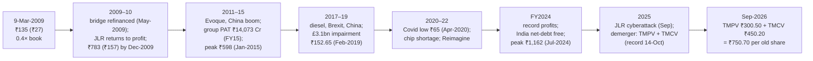

# I15 · Tata Motors & JLR (2008 → 2009 → 2019 → 2026): buying a cyclical at the bottom, twice

> **The hook.** On 2 June 2008 Tata Motors paid Ford $2.3 billion in cash for Jaguar Land Rover, financed with a
> $3 billion one-year bridge loan, three months before Lehman Brothers failed. By 9 March 2009 the rupee had fallen
> 18%, luxury-car sales in Britain and America had collapsed, Tata Motors' own truck sales had fallen by 61% in a
> quarter, and its shares were ₹135 — 75% below the day of the deal, 3.7 times the previous year's earnings, 0.4 times
> book. A buyer that day made 28 times their money by September 2026. Ten years later the same thing nearly happened
> again: in February 2019 JLR wrote off £3.1 billion, the group reported a ₹26,961 crore quarterly loss, and the shares
> fell to ₹153 — half of book value. A buyer then made almost five times their money. In 2025 the company split in two,
> and a cyberattack stopped JLR's factories for five weeks. This case is about valuing a leveraged cyclical at the
> trough: separating a balance-sheet crisis from a business crisis, what the market implicitly pays for the troubled
> piece, and why the best buying points look the most dangerous.

| | |
|:--|:--|
| **Period** | FY2004–FY2008 (set-up) · **9 March 2009** (decision A) · FY2009–FY2018 · **11 February 2019** (decision B) · 2019–September 2026 (outcome) |
| **Decision dates** | **A:** close of **9 March 2009**, **₹135.20** (face value ₹10; **₹27.04** on today's basis after the 5-for-1 split of 2011), ordinary-share market cap ≈ **₹6,080 crore** on 44.98 crore shares. You may use only what was public by then: the FY2008 Form 20-F (September 2008), the JLR completion and financing announcements (June 2008), the rights issue (September–October 2008), and the Q3 FY2009 standalone results (30 January 2009). **B:** close of **11 February 2019**, **₹152.65** (face value ₹2), ordinary-share market cap ≈ **₹44,000 crore** on ≈288.7 crore ordinary shares. You may use only what was public by then: annual reports and 20-Fs to FY2018 and the Q3 FY2019 results (7 February 2019) |
| **Sector** | Automobiles: commercial vehicles and passenger cars in India; Jaguar Land Rover (premium cars, UK-based, sold worldwide). NSE: TATAMOTORS (from October 2025, TMPV and TMCV); NYSE ADSs until 2023. Fiscal year ends 31 March |
| **Themes** | Cyclicality and operating leverage · acquisition leverage and refinancing risk · currency (GBP, USD, INR, CNY) · the implied value of the troubled segment · book value and asset impairments at the trough · product cycles · China · the DVR discount · demerger · operational tail risk |
| **Modules this case reinforces** | [04.5 Leverage, solvency & liquidity](../../04-financial-analysis/05-leverage-solvency-liquidity.md) · [05.4 Capital cycle & competition](../../05-business-analysis/04-capital-cycle-and-competition.md) · [05.5 Management & capital allocation](../../05-business-analysis/05-management-and-capital-allocation.md) · [06.7 Other valuation methods (SOTP)](../../06-valuation/07-other-valuation-methods.md) · [06.8 Margin of safety](../../06-valuation/08-margin-of-safety-and-expected-value.md) · [07.3 Cyclicals & commodities](../../07-special-valuation/03-cyclicals-and-commodities.md) · [07.5 Holdcos & conglomerates](../../07-special-valuation/05-holdcos-conglomerates-psus-mncs.md) · [08.6 Autos & ancillaries](../../08-sectors/06-autos-and-ancillaries.md) · [12.1 Macro for equity investors](../../12-macro-special-sits/01-macro-for-equity-investors.md) · [12.3 Special situations](../../12-macro-special-sits/03-special-situations.md) |
| **Difficulty** | Intermediate–Advanced (★★★☆☆). Do it after Modules 07 and 08. Pairs with [G6 Lehman](../global/06-lehman-2008.md) (the same months, the other side), [I6 Eicher Motors](06-eicher-motors-royal-enfield.md) (autos, focus and operating leverage) and [I11 Kingfisher & Jet](11-jet-kingfisher-airlines.md) (leverage without a turnaround) |
| **Time** | ~3 hours (two decision points; about 45 minutes on each before you read on) |

!!! note "Conventions in this case"
    ₹ crore unless stated. FY2004–FY2008 group figures are **US GAAP consolidated** from Tata Motors' Form 20-F (the
    company switched to IFRS in its FY2009 20-F); FY2015–FY2018 figures are **Ind AS/IFRS consolidated** as compiled by
    Screener.in. Share prices before September 2011 are quoted at face value ₹10 with today's basis (÷5) in
    brackets; Yahoo Finance's history is split-adjusted but **not** adjusted for the October 2025 demerger, so
    post-demerger returns add the value of the commercial-vehicle share. Market caps count **ordinary shares only**;
    the "A" ordinary shares (DVRs: one-tenth of a vote, extra dividend) traded at a discount and are excluded. Bracketed
    numbers point to the [Sources](#sources).

---

## 1. The scene

### 1.1 Decision A: the business (as of March 2009)

Tata Motors began in 1945 as a locomotive maker and became India's largest commercial-vehicle manufacturer, with
about **62% of the domestic commercial-vehicle market** in FY2008 and a growing car business (Indica, Indigo, Sumo, Safari). It is
controlled by Tata Sons, which owned **30.8% of the ordinary shares** (and most of the DVRs) [[2]](#sources). In the
mid-2000s it expanded abroad: Daewoo's Korean truck business (2004), a stake in Spain's Hispano Carrocera, and a joint
venture with Fiat. In January 2008 it unveiled the Nano, the "₹1 lakh car"; protests over land in Singur (West Bengal)
forced it to move the Nano plant to Sanand in Gujarat in October 2008, and the car's commercial launch was set for
March 2009.

**The acquisition.** On 26 March 2008 Tata Motors agreed to buy Jaguar and Land Rover from Ford, and on **2 June 2008**
completed the purchase for a **net consideration of US$2.3 billion, all in cash**; Ford contributed about US$600
million to the JLR pension plans [[3]](#sources). JLR brought three UK manufacturing plants, two advanced engineering centres and a worldwide sales network
[[10]](#sources). Tata Motors financed the deal through a subsidiary with a **US$3 billion, 12-month bridge loan** from a bank
syndicate [[4]](#sources).

**The crisis.** The acquisition closed at the top of the cycle. Between June 2008 and March 2009: Lehman Brothers
failed; credit for car buyers dried up in the UK, US and Europe; premium-car demand collapsed; the rupee fell from
₹42.9 to ₹50.7 to the dollar (an 18% rise in the rupee cost of dollar debt); and in India, high interest rates and the
disappearance of truck finance cut **medium and heavy commercial-vehicle demand by 61%** in the October–December
quarter [[5]](#sources). Tata Motors raised equity: a rights issue of **one ordinary share for six at ₹340 and one
"A" ordinary share for six at ₹305**, totalling about **₹4,147 crore**, completed in October 2008 to repay part of the
bridge [[6]](#sources). Its Q3 FY2009 standalone results (30 January 2009) showed revenue down 34% and a loss of ₹263
crore, including ₹227 crore of exchange losses on foreign-currency borrowings [[5]](#sources). The bridge loan was due
in June 2009, and Tata Motors was negotiating with its lenders to refinance the rest.

### 1.2 Decision A: what the market believed

The bear case, near-universal by March 2009: an Indian truck maker had bought a loss-prone British luxury carmaker at
the peak, with borrowed dollars, weeks before the worst car market since the 1930s; the bridge could not be refinanced
on acceptable terms; JLR might need billions more; the rupee kept falling; the group might have to sell assets or issue
equity at the bottom; and the Nano and Singur showed management distracted. The share price had fallen from ₹540.85
on the day the JLR deal completed to **₹135.20 on 9 March 2009**, a 75% fall [[1]](#sources). The Nifty closed that day
at 2,573, its low for the cycle.

The bull case, a minority: the Indian business — a commercial-vehicle market leader with a 62% share that was still rising — was cyclically
depressed, not broken, and had earned ₹1,400–1,800 crore a year for four years; the refinancing risk was large but
bounded (the remaining bridge was about $1.8 billion); JLR's brands were intact and its products (Range Rover, Land
Rover Discovery, the new Jaguar XF) were well regarded; the rights issue showed Tata Sons would put in money; and at
₹135 the market valued the entire group at less than the price paid for JLR.

### 1.3 Decision B: the scene (as of February 2019)

A decade later Tata Motors was a very different company. JLR had become the group's profit engine — at its peak (FY2015)
the group earned ₹14,073 crore — and Tata Motors was now India's third-largest carmaker, with a turnaround plan for its
domestic passenger cars under CEO Guenter Butschek. But FY2018–19 brought a second crisis centred on JLR: diesel
demand in Europe collapsed after the Volkswagen emissions scandal and tax changes; Brexit uncertainty hit UK sales and
supply chains; and in China, JLR's second-largest market, sales fell by almost half in the December 2018 quarter amid
a trade war and dealer inventory problems [[7]](#sources). JLR launched "Project Charge" in 2018 to save £2.5 billion.
On **7 February 2019** Tata Motors reported Q3 FY2019: a **£3.1 billion (₹27,838 crore) impairment of JLR's assets**, a
consolidated loss of **₹26,961 crore** — one of the largest quarterly losses in Indian corporate history — JLR revenue of
£6.2 billion (−1.4%), an EBIT margin of −2.6%, and a free-cash outflow of £361 million [[7]](#sources). The shares fell
18% the next day, to ₹150.70, and closed at **₹152.65** on 11 February [[1]](#sources).

---

## 2. The numbers then

### 2.1 Decision A (March 2009)

**Table 2.1: Tata Motors consolidated before JLR, FY2004–FY2008 (US GAAP, ₹ crore)**

| FY | Net sales | Operating income | Operating margin (%) | Net income | EPS (₹, FV ₹10) | Dividend (₹) | Long-term debt | Shareholders' equity |
|:--|--:|--:|--:|--:|--:|--:|--:|--:|
| 2004 | 13,829 | 1,459 | 10.6 | 890 | 27.1 | 8.0 | 1,080 | 3,738 |
| 2005 | 19,678 | 1,879 | 9.5 | 1,326 | 36.8 | 4.0 | 2,563 | 5,641 |
| 2006 | 23,689 | 2,004 | 8.5 | 1,501 | 40.2 | 12.5 | 2,720 | 8,102 |
| 2007 | 32,448 | 2,643 | 8.1 | 1,811 | 47.1 | 13.0 | 4,024 | 9,137 |
| 2008 | 35,279 | 2,369 | 6.7 | 1,421 | 36.9 | 15.0 | 5,879 | 10,526 |

Source: Form 20-F for FY2008, selected financial data [[2]](#sources). Long-term debt excludes the current portion and
short-term borrowings. FY2005 net income is from the 20-F table; the ₹4.0 dividend reflects a change in timing.

**Table 2.2: The JLR deal and its financing**

| Item | Amount | Note |
|:--|--:|:--|
| Net consideration (2 June 2008) | US$2.3 billion ≈ ₹9,870 crore | at ₹42.9/$ [[3]](#sources) |
| Ford's contribution to JLR pensions | ≈ US$0.6 billion | [[3]](#sources) |
| Bridge loan (12 months, June 2008) | US$3.0 billion ≈ ₹12,870 crore at ₹42.9 | ≈ ₹15,220 crore at ₹50.7 (March 2009) |
| Rights issue (October 2008) | ₹4,147 crore | ₹2,186 crore ordinary at ₹340 + ₹1,961 crore DVR at ₹305 [[6]](#sources) |
| Bridge repaid by March 2009 | US$1.16 billion | rights issue plus divestments [[4]](#sources) |
| Bridge outstanding | ≈ US$1.84 billion ≈ ₹9,330 crore | due June 2009 |
| Rupee | ₹42.9 → ₹50.7 per $ | −18% in nine months |

**Table 2.3: The Indian business in the downturn (standalone)**

| Item | Q3 FY2008 | Q3 FY2009 | Change |
|:--|--:|--:|--:|
| Vehicle sales incl. exports | 144,608 | 98,760 | −31.7% |
| Revenue, net of excise (₹ crore) | 7,252 | 4,759 | −34.4% |
| Profit after tax (₹ crore) | 499 | (263) | — |
| — of which exchange gain/(loss) on foreign-currency items | 28 | (227) | |
| M&HCV industry demand in the quarter | | −61% | |

Source: Q3 FY2009 results release [[5]](#sources).

**Table 2.4: Valuation at decision A (9 March 2009)**

| Metric | Value | Working |
|:--|--:|:--|
| Price | ₹135.20 (₹27.04 on today's basis) | [[1]](#sources) |
| Ordinary shares after the rights issue | 44.98 crore | [[2]](#sources) [[6]](#sources) |
| Market cap (ordinary) | ≈ ₹6,081 crore | |
| P/E on FY2008 EPS (pre-JLR) | 3.7× | 135.20 ÷ 36.9 |
| Book equity, March 2008 + rights issue | ≈ ₹14,673 crore | 10,526 + 4,147 |
| P/B | ≈ 0.41× | |
| Price change since JLR completion (₹540.85) | −75% | |
| Price paid for JLR vs market cap | 1.6× | ₹9,870 crore ÷ ₹6,081 crore |

### 2.2 Decision B (February 2019)

**Table 2.5: Tata Motors consolidated, FY2015–FY2018 (₹ crore) and Q3 FY2019**

| FY | Sales | Operating profit | OPM (%) | Net profit | EPS (₹, FV ₹2) | Borrowings | Free cash flow | ROCE (%) |
|:--|--:|--:|--:|--:|--:|--:|--:|--:|
| 2015 | 2,63,159 | 39,239 | 15 | 14,073 | 48.44 | 73,610 | 3,643 | 21 |
| 2016 | 2,73,046 | 38,395 | 14 | 11,678 | 40.11 | 69,360 | 6,455 | 15 |
| 2017 | 2,69,693 | 29,589 | 11 | 7,557 | 25.82 | 78,604 | 14,181 | 9 |
| 2018 | 2,91,550 | 31,458 | 11 | 9,091 | 31.13 | 88,950 | (11,191) | 9 |
| Q3 FY2019 | 77,001 | 6,522 (EBITDA) | 8.5 | (26,961) | — | — | — | — |

Sources: Screener.in [[8]](#sources); Q3 FY2019 results [[7]](#sources). JLR retail volumes in FY2018 were 614,309
units, up 1.7% [[9]](#sources). Consolidated cash and cash equivalents were ₹14,717 crore at March 2018, before
current investments [[9]](#sources).

**Table 2.6: Valuation at decision B (11 February 2019)**

| Metric | Value | Working |
|:--|--:|:--|
| Price | ₹152.65 | [[1]](#sources) |
| Market cap (ordinary, ≈288.7 crore shares) | ≈ ₹44,075 crore | DVRs (≈50.9 crore) excluded |
| P/E on FY2018 EPS | 4.9× | 152.65 ÷ 31.13 |
| Book value per share, March 2018 / after the impairment (March 2019) | ₹281 / ₹177 | total shares incl. DVRs |
| P/B | 0.54× / 0.86× | |
| Borrowings, March 2018 | ₹88,950 crore | 2.0× the ordinary market cap |
| EV / FY2018 EBITDA | ≈ 3.8× | ≈(44,075 + ≈3,500 DVR + 88,950 − 14,717) ÷ 31,458 |
| Price vs January 2015 peak (₹598) | −74% | |

### 2.3 What the filings said (paraphrased)

1. **FY2008 20-F risk factors [[2]](#sources).** The Indian automotive industry is cyclical and sensitive to interest
   rates, credit availability, fuel prices and freight rates; the JLR acquisition exposes the company to the UK, US and
   European premium-car markets and to currency movements; the acquisition financing increases indebtedness and
   refinancing risk.
2. **The rights issue offer (September 2008) [[6]](#sources).** Proceeds to prepay part of the short-term bridge loan
   raised by the subsidiary that bought JLR.
3. **Q3 FY2009 release [[5]](#sources).** Demand contraction "arising from major financial and other market upheavals";
   lack of liquidity and consumer finance; market-share gains in most segments; aggressive cost and working-capital
   control.
4. **Q3 FY2019 release [[7]](#sources).** JLR "performance impacted by corrective action in China and production
   shutdown"; the £3.1 billion non-cash impairment "reduces growth in depreciation and amortization by £300mn pa";
   Project Charge "on track to achieve £2.5 bn target", with £500 million of cash benefits in the quarter; the Indian
   business ("Turnaround 2.0") gained market share in trucks and cars and earned a 9.1% EBITDA margin.

---

## 3. You are the analyst

Answer these **before reading section 4**, using only sections 1 and 2. Show your arithmetic.

### Decision A: 9 March 2009 (₹135.20)

1. **(Numerical — what is JLR worth in the price?)** Value the Indian business alone at 4×, 6× and 8× its FY2008
   operating income (₹2,369 crore), and subtract about ₹10,000 crore of its own debt (long-term plus short-term). Subtract
   the result from the ₹6,081 crore market cap to find what the market is implicitly paying for JLR's *equity*, after
   JLR's share of the remaining bridge debt. Compare with the $2.3 billion (₹9,870 crore) Tata Motors paid nine months
   earlier.
2. **(Numerical — the currency hit.)** The rupee moved from ₹42.9 to ₹50.7 per dollar. By how much did the rupee cost of
   the original $3 billion bridge rise? Of the $1.84 billion still outstanding? What happens to reported profit when a
   company with dollar debt reports in rupees — and why is part of it "notional"?
3. **(Numerical — operating leverage in trucks.)** In Q3 FY2009 volumes fell 32% and revenue 34%. Suppose the Indian
   business's costs are 70% variable and 30% fixed, and its operating margin at FY2008 revenue was 6.7%. Compute the
   operating margin at revenue 20%, 30% and 40% below FY2008. At what revenue decline does it break even at the
   operating level?
4. **(Judgement — balance-sheet crisis or business crisis?)** List what would have to go wrong for equity holders to
   lose everything (refinancing failure, JLR cash burn, covenant breaches, forced asset sales), and what would have to go
   right for the stock to recover. Which risks were in management's control, which in Tata Sons', and which in no one's?
   What does the October 2008 rights issue tell you about Tata Sons' willingness to support the company?
5. **(Decision A.)** Build three scenarios for March 2012: (i) *distress* — a deeply dilutive equity raise or asset
   sales, shares worth ₹60 (FV ₹10); (ii) *muddle through* — earnings recover to the FY2006–08 average of ₹1,578 crore
   (EPS ≈ ₹35 on 44.98 crore shares) at 8×; (iii) *recovery* — the Indian business back to FY2007 profit plus JLR
   earning ₹2,000 crore, 50 crore shares, at 10×. Weight them and size the position. How would an options trader
   express "the distribution is fat-tailed on both sides"?

### Decision B: 11 February 2019 (₹152.65)

6. **(Numerical — the impairment.)** A £3.1 billion non-cash write-down cut book value per share from ₹281 to ₹177.
   Does an impairment change the company's value? What does it tell you about the returns JLR's past capital spending
   will earn, and about future depreciation (the release says £300 million a year less)?
7. **(Numerical — what is the price implying?)** At an EV of about ₹1,21,800 crore and FY2018 EBITDA of ₹31,458 crore,
   what EV/EBITDA is the market paying? If JLR's EBITDA margin fell permanently from 11% to 7%, what would group EBITDA
   be (assume JLR is 80% of revenue)? At 4× that EBITDA, what equity value remains after ₹74,000 crore of net debt?
8. **(Numerical — Project Charge.)** JLR targeted £2.5 billion of savings (cash and profit) by March 2020. At ₹90 to the
   pound, what is that in rupees, and as a share of the market cap? If half of it reached EBIT permanently, what EBIT
   margin improvement would that be on JLR revenue of about £25 billion?
9. **(Red flags and green flags.)** Score the situation on: leverage and refinancing (JLR's bonds, Tata Motors' debt),
   China exposure, diesel exposure, Brexit, product pipeline (new Evoque, Defender), the Indian business's turnaround,
   and governance (Tata Sons' support; the 2016–17 boardroom dispute at Tata Sons). Which single factor decides whether
   0.86× book is cheap?
10. **(Decision B.)** Buy, avoid or short? Build scenarios for March 2022 and size the position. What would make you
    add, and what would make you sell?

---

## 4. What happened

**2009–2015: the recovery.** On 27 May 2009 Tata Motors completed the refinancing of the bridge: of the $3 billion,
$1.16 billion had been repaid (rights issue and divestments), $840 million was repaid from rupee debentures issued the
previous week, and $1 billion was extended by 18 months to December 2010 with 21 lenders participating
[[4]](#sources). The FY2009 accounts, published later, showed how bad the year had been: a consolidated net loss of
**₹6,014 crore** attributable to shareholders under IFRS, including ₹4,814 crore of exchange losses, a JLR segment loss
of ₹3,053 crore for June 2008–March 2009, and shareholders' equity down from ₹12,432 crore to ₹3,873 crore
[[10]](#sources). But the markets reopened, JLR cut costs and launched new models (the Range Rover Evoque in 2011),
China became its fastest-growing market, and the Indian truck cycle turned. The shares were **₹783 (₹156.63 on
today's basis) at the end of December 2009 — 5.8 times the March low in ten months** [[1]](#sources). By FY2015 the
group earned ₹14,073 crore on sales of ₹2.63 lakh crore with a 21% ROCE, and the stock peaked at ₹598 in January 2015
[[8]](#sources).

**2019–2022: the second crisis.** After decision B, FY2019 ended with a consolidated loss of ₹28,724 crore; FY2020
brought another loss and then Covid, which took the stock to **₹65.30 on 3 April 2020** — 57% below the decision-B price
[[1]](#sources) [[8]](#sources). JLR's "Reimagine" strategy (February 2021) cut costs and planned an all-electric Jaguar
from 2025, with further write-downs; the global semiconductor shortage then limited JLR's production through 2021–22.
Losses continued through FY2022 [[8]](#sources).

**2023–2025: the peak.** As chip supply returned, JLR's order book of high-margin Range Rover, Range Rover Sport and
Defender models converted into record profits. Tata Motors earned ₹31,807 crore in FY2024; its Indian business
became net-debt free that year, and the group targeted net-automotive-debt-free status on a consolidated basis in FY2025
[[11]](#sources) [[8]](#sources). The shares reached **₹1,161.85 on 30 July 2024**. In 2024 the company cancelled its
DVRs, issuing seven ordinary shares for every ten "A" shares [[12]](#sources).

**2025–2026: the demerger and the cyberattack.** Tata Motors split into two listed companies: the passenger-vehicle
business with JLR (**Tata Motors Passenger Vehicles, TMPV**) and the commercial-vehicle business (**TMCV**), with one
TMCV share for each Tata Motors share; the record date was **14 October 2025**, and TMCV listed on **12 November 2025**,
opening at ₹335 [[13]](#sources). Weeks earlier, on 1–2 September 2025, a **cyberattack** forced JLR to shut its IT
systems and halt production at all its plants for about five weeks; the UK government arranged a **£1.5 billion loan
guarantee** to help it pay suppliers. JLR's Q2 FY2026 revenue fell 24% to £4.9 billion, with a pre-tax loss before
exceptional items of £485 million and £196 million of direct exceptional costs from the attack; for FY2026 JLR's net
profit fell to **£14 million** from £2.5 billion, hit also by US tariffs and weak Chinese demand [[14]](#sources)
[[15]](#sources). On 23 September 2026 TMPV closed at **₹300.50** and TMCV at **₹450.20** — together ₹750.70 for each
original Tata Motors share, 35% below the July 2024 peak [[1]](#sources).

**The returns.** Ignoring dividends and the 2015 rights issue:

| Buyer | Price | Value on 23-Sep-2026 (TMPV + TMCV) | Multiple | Annualised | Nifty over the same period |
|:--|--:|--:|--:|--:|--:|
| A: 9-Mar-2009 | ₹27.04 (today's basis) | ₹750.70 | **27.8×** | **20.9%** (17.5 years) | 9.1× (13.4%) |
| B: 11-Feb-2019 | ₹152.65 | ₹750.70 | **4.9×** | **23.3%** (7.6 years) | 2.2× (10.6%) |

The paths were anything but smooth: buyer A was up 5.8 times within ten months, then down 89% from the 2015 peak to the
2020 low before rising again; buyer B was down 57% within fourteen months.

---

## 5. Signals: knowable then vs hindsight

| Knowable at the decision date | Only in hindsight |
|:--|:--|
| **A:** The market cap (₹6,081 crore) was less than the price paid for JLR nine months earlier; the Indian business alone, valued at 6× trough-ish operating income, was worth most of the market cap — JLR was priced near zero | That global credit markets would reopen within months and the bridge would be refinanced by May 2009 |
| **A:** Tata Sons had just led a ₹4,147 crore rights issue; the lenders were negotiating, not calling | That JLR would lose ₹3,053 crore in its first ten months and then earn record profits from China and the Evoque |
| **A:** 3.7× the previous year's earnings and 0.41× book for India's truck market leader in a cyclical trough | That the stock would rise 5.8× in ten months |
| **B:** 0.86× post-impairment book, 4.9× FY2018 EPS, ~3.8× EV/EBITDA; JLR's problems were China, diesel and Brexit — cyclical and policy shocks rather than a loss of brand | Covid, the chip shortage and three more years of losses before the recovery |
| **B:** ₹88,950 crore of borrowings — leverage large enough that the equity was an option on JLR's recovery | That the JLR order book of 2022–24 would produce record margins and debt repayment |
| **Both:** the equity of a leveraged cyclical at the trough behaves like a long-dated call — high volatility, large drawdowns, large payoffs | The 2025 cyberattack — an operational tail risk no financial model would have priced |

!!! success "The strongest bear case that existed at the time"
    **A (March 2009).** A $1.84 billion bridge was due in June into the worst credit market in 80 years; JLR was losing
    money and might need billions more; the rupee was falling; Indian truck demand had halved. Equity holders stood
    behind lenders who could force asset sales or a highly dilutive rescue. The market was right to price a meaningful
    chance of wipe-out.

    **B (February 2019).** JLR had spent heavily on new models and plants and just admitted they would not earn their
    cost of capital (the £3.1 billion impairment); China was shrinking, diesel was dying, Brexit threatened its supply
    chain, and the electric transition would need billions more. Tata Motors carried ₹89,000 crore of debt and had
    missed on returns for years.

    Both bear cases were largely correct about the risks. They were wrong about what was already in the price. At A the
    market was valuing JLR at roughly nothing; at B it was valuing the whole group at less than four times depressed
    EBITDA. When the equity of a leveraged business is priced for failure, you are paid for surviving — provided you size
    for the possibility that the bear case is right.

---

## 6. Lessons

1. **At the trough, value the troubled piece by subtraction.** Value the healthy parts conservatively, subtract debt and
   ask what is left for the problem. In March 2009 the market paid roughly nothing for JLR's equity.
   → [06.7 Other valuation methods (SOTP)](../../06-valuation/07-other-valuation-methods.md) ·
   [07.5 Holdcos & conglomerates](../../07-special-valuation/05-holdcos-conglomerates-psus-mncs.md)
2. **Separate a balance-sheet crisis from a business crisis.** Tata Motors' 2009 problem was a bridge loan maturing into
   a closed credit market; the businesses were cyclically hit, not destroyed. Balance-sheet crises resolve (well or
   badly) quickly; business crises take years.
   → [04.5 Leverage, solvency & liquidity](../../04-financial-analysis/05-leverage-solvency-liquidity.md)
3. **Cyclicals are cheapest on trailing earnings when they are most dangerous — and vice versa.** 3.7× earnings in 2009
   and 4.9× in 2019 were low multiples of profits about to vanish; the right anchor is normalised earnings and asset
   value.
   → [07.3 Cyclicals & commodities](../../07-special-valuation/03-cyclicals-and-commodities.md) ·
   [08.6 Autos](../../08-sectors/06-autos-and-ancillaries.md)
4. **Leverage turns equity into an option.** With debt twice the market cap, small changes in enterprise value produce
   large changes in equity value, in both directions. Size such positions like options: small, diversified across time,
   with the full loss accepted in advance.
   → [11.4 Position sizing](../../11-process/04-position-sizing-and-portfolio-construction.md) ·
   [11.7 Fundamentals × derivatives](../../11-process/07-fundamentals-meets-derivatives.md)
5. **Currency is a balance-sheet item, not only a P&L item.** A dollar bridge funded from rupee equity cost 18% more in
   nine months, and the exchange losses on revaluation dominated reported profit in FY2009.
   → [12.1 Macro for equity investors](../../12-macro-special-sits/01-macro-for-equity-investors.md)
6. **A controlling shareholder's support is an asset — but price it, don't assume it.** Tata Sons' rights-issue money in
   2008 reduced the probability of distress; it did not remove it.
   → [05.5 Management & capital allocation](../../05-business-analysis/05-management-and-capital-allocation.md)
7. **Impairments are information about past capital allocation, not about present value.** The £3.1 billion write-down
   in 2019 told investors that JLR's 2014–18 investment programme would not earn its cost; it did not change the cash
   flows the brands could earn from there.
   → [02.7 Deeper cuts: assets & expenses](../../02-accounting/07-deeper-cuts-assets-and-expenses.md)
8. **Operational tails exist.** A cyberattack erased a quarter of JLR's revenue in 2025. Concentrated, just-in-time
   manufacturing has a tail no financial model captures; it belongs in the pre-mortem.
   → [11.6 Behavioural finance & decision journals](../../11-process/06-behavioural-finance-and-decision-journals.md)
9. **Demergers make the parts visible.** The 2025 split let the market price the steady commercial-vehicle business and
   the cyclical JLR-plus-cars business separately — and showed how much of the combined value each carried.
   → [12.3 Special situations](../../12-macro-special-sits/03-special-situations.md)

---

## 7. Model answers

<strong>Q1 — What is JLR worth in the price? (A)</strong>

Indian business EV at 4×, 6×, 8× FY2008 operating income: ₹9,476, ₹14,214, ₹18,952 crore. Less ₹10,000 crore of its own
debt: equity **−₹524, ₹4,214, ₹8,952 crore**. Subtract from the ₹6,081 crore market cap: implied value of JLR equity
(after its bridge debt) = **₹6,605, ₹1,867, −₹2,871 crore**. At a middle multiple the market paid about ₹1,900 crore for
JLR's equity, against ₹9,870 crore paid nine months earlier — and at a fuller multiple for the Indian business, JLR was
priced below zero. The market was pricing a meaningful chance that JLR would consume the group's equity. A buyer at A
was getting the Indian business at a fair-to-cheap price and an option on JLR almost free.

<strong>Q2 — The currency hit (A)</strong>

$3 billion: ₹12,870 crore at ₹42.9 → ₹15,219 crore at ₹50.7, a rise of **₹2,349 crore (18.3%)**. The $1.84 billion still
outstanding: ≈ ₹7,894 crore at ₹42.9 → ₹9,334 crore now, **+₹1,440 crore**. Under Indian and international accounting, a
company revalues foreign-currency monetary liabilities at each reporting date and runs the difference through profit
— hence the ₹227 crore Q3 FY2009 standalone exchange loss and the ₹4,814 crore FY2009 group loss. It is "notional" until
the debt is repaid at that rate, but it is a real change in the rupee value of what is owed; it reverses only if the
rupee recovers.

<strong>Q3 — Operating leverage in trucks (A)</strong>

Normalise FY2008 revenue to 100: costs 93.3, of which fixed 0.3 × 93.3 = 28.0 and variable 65.3 (65.3% of revenue).
At revenue R, operating profit = R − 0.653R − 28.0 = 0.347R − 28.0. Revenue −20% (R = 80): 27.8 − 28.0 = **−0.2 (−0.3%
margin)**; −30%: 24.3 − 28.0 = **−3.7 (−5.3%)**; −40%: 20.8 − 28.0 = **−7.2 (−12.0%)**. Break-even at R = 28.0 ÷
0.347 = 80.7, i.e. a **19.3% revenue decline**. With a 32–34% volume and revenue fall in Q3 FY2009, the standalone
business was loss-making at the operating level before currency effects — consistent with the reported loss.

<strong>Q4 — Balance-sheet crisis or business crisis? (A)</strong>

For a wipe-out: the lenders refuse to extend the bridge; JLR burns cash for two years and needs more than Tata Motors
can raise; covenants are breached and the lenders force asset sales at the bottom; the equity raise needed is larger
than the market cap. For recovery: the bridge is refinanced (even expensively); JLR cuts costs and holds its brands;
the Indian truck cycle turns with rate cuts and government stimulus; the rupee stabilises.

In management's control: costs, working capital, capex, model plans. In Tata Sons': more equity (it had just subscribed
to the rights issue and held most of the DVRs), guarantees, patience. In no one's: global credit markets, car demand,
the rupee. The rights issue showed Tata Sons was willing to commit fresh money at ₹305–340 a share — far above ₹135 — so
the probability of a disorderly outcome was lower than the price implied, though not zero.

<strong>Q5 — Decision A</strong>

(i) Distress: ₹60 (−56%). (ii) Muddle through: ₹1,578 crore ÷ 44.98 crore = EPS ₹35.1 × 8 = **₹281** (+108%). (iii)
Recovery: FY2007 net income ₹1,811 crore + JLR ₹2,000 crore = ₹3,811 crore ÷ 50 crore shares = EPS ₹76 × 10 = **₹762**
(+464%). At 30/50/20: expected value ≈ 0.3 × 60 + 0.5 × 281 + 0.2 × 762 = **₹311**, 2.3× the price, with a 30% chance
of losing more than half. Size by the max-loss rule: a 2% portfolio loss budget on a 56% (or, in a true wipe-out, 100%)
loss gives **2–4%** of the portfolio; fractional Kelly on this skewed tree gives a similar answer. Options: long-dated
calls or call spreads capture the recovery while capping the loss at the premium; a trader who thought the
distribution was fat-tailed on both sides would buy strangles, since implied volatility (though high) typically
understates such bimodal outcomes. What happened: the stock was ₹783 in ten months — beyond the recovery case's
three-year target.

<strong>Q6 — The impairment (B)</strong>

An impairment is non-cash: it does not change future cash flows, so it does not by itself change value. It is an
admission that the carrying value of JLR's assets — mostly capitalised product development and plants — exceeded the
present value of the cash they were expected to generate: past capital spending would not earn its cost. The
consequences: lower book value (₹281 → ₹177 a share), lower future depreciation (£300 million a year, so reported
profits *rise* for a given cash flow), and a better-informed view of JLR's capital efficiency. For valuation, what
matters is the cash JLR can earn on its brands from here and how much it must reinvest.

<strong>Q7 — What is the price implying? (B)</strong>

EV ≈ 44,075 + ≈3,500 (DVRs) + 88,950 − 14,717 = **≈ ₹1,21,800 crore** (netting only cash and cash equivalents);
÷ ₹31,458 crore = **≈ 3.9× EBITDA**. If JLR's EBITDA
margin fell from 11% to 7% on 80% of revenue (₹2,33,240 crore), JLR EBITDA falls by ₹9,330 crore, taking group EBITDA to
≈ ₹22,130 crore. At 4×: EV ₹88,500 crore; less ₹74,000 crore of net debt: equity ≈ **₹14,500 crore**, or about ₹43 a share
— a 72% fall. The price was consistent with a permanent margin collapse and a low multiple; it did not require a
recovery. That made the risk/reward asymmetric, provided the balance sheet could survive the transition.

<strong>Q8 — Project Charge (B)</strong>

£2.5 billion × ₹90 = **₹22,500 crore — 51% of the ordinary market cap**. If half (£1.25 billion) reached EBIT permanently
on JLR revenue of about £25 billion, that is **+5.0 percentage points of EBIT margin**, enough to take JLR from roughly
zero to a mid-single-digit margin. Management targets deserve a haircut (much of Project Charge was cash timing and
capex cuts rather than permanent cost), but even a quarter of it was worth a quarter of the market cap.

<strong>Q9 — Red and green flags (B)</strong>

Red: leverage (₹89,000 crore) and JLR's negative free cash flow; China (sales nearly halved in the quarter); diesel
dependence in Europe; Brexit (UK plants and EU supply chains). Amber: product pipeline (new Evoque and Defender due —
potentially positive, but expensive); governance (Tata Sons' 2016–17 dispute had been resolved, and it remained a
supportive owner). Green: the Indian business's turnaround (market share up, 9.1% EBITDA margin), Project Charge
delivering cash. The deciding factor: **whether JLR's free cash flow would turn positive before its debt needed
refinancing** — liquidity, not earnings, determined whether 0.86× book was cheap.

<strong>Q10 — Decision B</strong>

Scenarios for March 2022 (FV ₹2): *distress* — a rights issue at the bottom and continued losses, ₹70 (−54%); *base*
— JLR back to a 4–5% EBIT margin, group EPS ≈ ₹30, 8× → ₹240 (+57%); *recovery* — JLR 7–8% EBIT, EPS ≈ ₹55, 9× → ₹495
(+224%). At 30/50/20 the expected value ≈ ₹240 (+57%), with a 30% chance of halving: buy, sized at 2–4%, adding on
evidence that JLR's free cash flow had turned positive, and selling or trimming if refinancing required equity at a
discount. What happened: the distress path came first (₹65 in April 2020, with Covid, not the refinancing, as the cause),
then the recovery exceeded the bull case — by March 2024 the stock was ₹993 and in July 2024 ₹1,162. A buyer who had
sized for the drawdown and held made 4.9× by 2026.

---

## 8. Discussion questions & extensions

1. **Value the parts today.** Using TMPV's and TMCV's latest annual reports, value the commercial-vehicle business on
   Indian truck peers' multiples and JLR on global premium-car peers'. Which market price looks more demanding, and
   what does JLR's FY2026 (£14 million profit) mean for normalised earnings?
2. **The rights issue as a signal.** Compare Tata Motors' 2008 and 2015 rights issues with [I3 Bajaj Finance](03-bajaj-finance-2008-2019.md)'s
   equity raises and [I11 Kingfisher](11-jet-kingfisher-airlines.md)'s 2011 recast. What distinguishes capital raised to
   survive from capital raised to grow?
3. **Currency hedging.** JLR earns in pounds, dollars, euros and yuan and spends mostly in pounds and euros. Using a
   recent JLR annual report, describe its hedging policy and estimate the EBIT effect of a 10% move in GBP/USD and
   GBP/CNY. ([12.1](../../12-macro-special-sits/01-macro-for-equity-investors.md))
4. **Cyclical troughs across the course.** Compare the trough valuations of Tata Motors (2009, 2019), [I6 Eicher](06-eicher-motors-royal-enfield.md)
   (2009) and [G6 Lehman](../global/06-lehman-2008.md) (2008). What distinguished the troughs that were buying
   opportunities from the one that was not?
5. **Operational risk.** List the ways a manufacturing business can be stopped for weeks (cyberattack, fire, chip
   shortage, single-source supplier failure). How would you estimate the probability and the cost, and where would they
   appear in a DCF? ([06.4](../../06-valuation/04-dcf-in-practice.md))

---

## Sources

All accessed 23-Sep-2026.

[1]: https://finance.yahoo.com/quote/TMPV.NS/history/
[2]: https://www.sec.gov/cgi-bin/browse-edgar?action=getcompany&CIK=0000926042&type=20-F
[3]: https://www.sec.gov/cgi-bin/browse-edgar?action=getcompany&CIK=0000926042&type=6-K&dateb=20080630
[4]: https://www.sec.gov/cgi-bin/browse-edgar?action=getcompany&CIK=0000926042&type=6-K&dateb=20090531
[5]: https://www.sec.gov/cgi-bin/browse-edgar?action=getcompany&CIK=0000926042&type=6-K&dateb=20090131
[6]: https://www.sec.gov/cgi-bin/browse-edgar?action=getcompany&CIK=0000926042&type=6-K&dateb=20080930
[7]: https://www.sec.gov/cgi-bin/browse-edgar?action=getcompany&CIK=0000926042&type=6-K&dateb=20190228
[8]: https://www.screener.in/company/TMPV/consolidated/
[9]: https://www.sec.gov/cgi-bin/browse-edgar?action=getcompany&CIK=0000926042&type=20-F&dateb=20180831
[10]: https://www.sec.gov/cgi-bin/browse-edgar?action=getcompany&CIK=0000926042&type=20-F&dateb=20091031
[11]: https://www.business-standard.com/markets/news/tata-motors-turns-net-debt-free-in-fy24-shares-recover-2-5-from-lows-124061100355_1.html
[12]: https://www.businesstoday.in/markets/stocks/story/tata-motors-dvr-shares-suspended-whats-next-443637-2024-08-30
[13]: https://www.businesstoday.in/markets/stocks/story/tata-motors-demerger-commercial-vehicle-arm-to-list-today-check-expected-listing-price-501792-2025-11-12
[14]: https://en.wikipedia.org/wiki/Jaguar_Land_Rover_cyberattack
[15]: https://media.jaguarlandrover.com/news/2025/11/jlr-performance-impacted-challenging-quarter

Notes on sources. Tata Motors filed Forms 20-F and 6-K with the US SEC while its ADSs were listed (CIK 0000926042);
sources [2]–[7], [9] and [10] point to the filing index pages for the relevant periods: the FY2008 20-F (selected
financial data, risk factors, share counts, Tata Sons' holding); the 6-Ks of 2 June 2008 (JLR completion), 2 September
2008 (rights-issue terms), 30 January 2009 (Q3 FY2009), 27 May 2009 (bridge refinancing) and 7 February 2019 (Q3
FY2019); the FY2018 20-F (JLR retail volumes, cash) and the FY2009 20-F (IFRS results, JLR segment loss, equity). Share
prices are NSE closes via Yahoo Finance (TMPV.NS for Tata Motors before and after the demerger, split-adjusted; TMCV.NS
for the commercial-vehicle company). JLR's FY2026 profit is from its results announcement, as reported by the Free
Press Journal (https://www.freepressjournal.in/business/jlr-raises-2-billion-loan-to-refinance-debt-after-fy26-profit-falls-to-14-million).

---
[← Previous: I14 · Manpasand & Vakrangee (2017–2018)](14-manpasand-vakrangee-small-cap-flags.md) · [Module index](../index.md) · [Next: Module 14 · Mocks & drills →](../../14-mocks/index.md)
