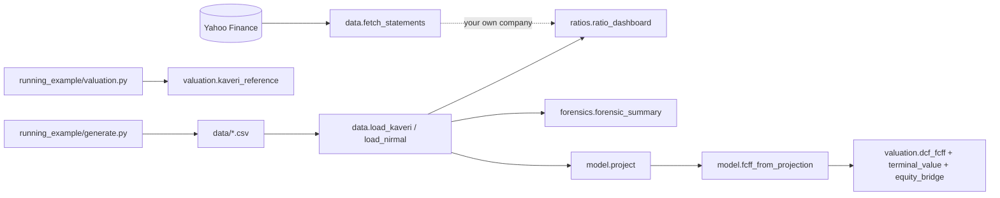

# Appendix · The Python tools (`tools/`)

> **Why this exists:** the lessons do a lot of arithmetic: ratio dashboards, DCFs, reverse DCFs,
> forensic scores, three-statement models. The `fi` package does that arithmetic in small functions
> you can read, so you spend your time on the judgement calls. Every number the course quotes for
> Kaveri Pumps (₹320/share, 14.1% implied growth, the §6 ratio table) is reproduced by these tools
> and checked by the test suite.

!!! warning "Educational code"
    Nothing here is investment advice or a recommendation to buy or sell any security. Kaveri Pumps
    & Motors and Nirmal Finance are **fictional**. Anything fetched for a real company is vendor
    data: tie it to the annual report before you rely on it.

---

## 1. Install

You need **Python ≥ 3.11**. From the repository root:

```bash
python -m venv .venv
# Windows (PowerShell):   .venv\Scripts\Activate.ps1
# macOS / Linux:          source .venv/bin/activate
pip install -r tools/requirements.txt
python -m pytest tools/tests -q        # should end with "... passed"
```

`requirements.txt` installs pandas, numpy, pytest, yfinance and **OpenBB Platform 4.x**. OpenBB is
large and **optional**. If you only want the offline tools (running examples, ratios, valuation,
forensics, model), comment out the `openbb` line. `fi.data.fetch_statements` falls back to raw
yfinance automatically.

**Tested with** (as of 21-Sep-2026, Windows 11): Python 3.13.13, pandas 3.0.3, numpy 2.4.5,
yfinance 1.4.1, openbb 4.7.2 (with openbb-yfinance 1.6.3), pytest 9.1.1. On that date live fetches
for `ASIANPAINT.NS` and `TCS.NS` worked through both the OpenBB route and the yfinance fallback.
Vendor APIs change often, so if a fetch breaks, check the
[yfinance changelog](https://github.com/ranaroussi/yfinance/blob/main/CHANGELOG.rst) and the
[OpenBB docs](https://docs.openbb.co/).

!!! info "Three things that trip everyone up"
    1. **Turn off your VPN** before anything that fetches data. Many VPNs block the Yahoo Finance
       endpoints that both yfinance and OpenBB's `yfinance` provider use. The symptom is an empty
       frame or a connection error, not a helpful message.
    2. **Windows and the ₹ sign.** The default Windows console encoding (cp1252) cannot print `₹`
       and raises `UnicodeEncodeError`. Every course script starts with
       `sys.stdout = io.TextIOWrapper(sys.stdout.buffer, encoding="utf-8")`.
    3. **Quarterly means `"quarter"`.** OpenBB expects `period="quarter"`, not `"quarterly"`.
       `fetch_statements` accepts either and converts it for you.

### Making `fi` importable

`fi` lives in `tools/fi/` and is not pip-installed. Either run from the repository root and add
`tools` to the path (this is what the snippets below do), or set `PYTHONPATH`:

```bash
# Windows PowerShell:  $env:PYTHONPATH = "tools"
# macOS / Linux:       export PYTHONPATH=tools
```

The scripts in `tools/examples/` add the path themselves, so they run from any directory.

---

## 2. What is in the folder

```
tools/
  fi/
    __init__.py      re-exports the most-used functions
    data.py          load the running examples; fetch real Indian company data (OpenBB / yfinance)
    ratios.py        margins, ROE / ROCE / ROIC, DuPont, working-capital days, ratio dashboard
    valuation.py     CAPM, WACC, DCF, terminal value, sensitivity, reverse DCF, justified multiples
    forensics.py     Beneish M, Altman Z / Z' / Z'', Piotroski F, accruals, cash-yield check
    model.py         three-statement projection engine (Module 10 build-along)
  running_example/   generate.py + valuation.py: the single source of truth for Kaveri and Nirmal
  data/              CSVs written by the generators (do not edit by hand)
  examples/          runnable scripts used in lessons
  tests/             pytest suite (runs offline)
  requirements.txt
```



---

## 3. Module guide

### 3.1 `fi.data`: getting numbers in

- **`load_kaveri(kind)`** returns a DataFrame with **line items as rows and periods as columns**
  (`FY21` … `FY26`), in ₹ crore. The row keys are the generator's short names (`rev`, `mat`, `ebitda`,
  `receivables`, `cfo` …). `fi.data.KAVERI_LINE_ITEMS` spells out what each one means. The annual
  frame also carries the FY20 opening balance sheet, 31-March share prices, DPS and share counts in
  `df.attrs`. That is how `ratio_dashboard` can compute FY21's averaged ratios without extra arguments.
- **`load_nirmal()`** does the same for the fictional NBFC, and already includes its ratio rows
  (NIM, credit cost, GNPA, CRAR …).
- **`fetch_statements(ticker, period, provider)`** returns `{"income", "balance", "cash"}` frames in the
  same orientation (rows = snake_case line items, columns = period-end dates, oldest first). It
  tries OpenBB (`obb.equity.fundamental.income/balance/cash`, `provider="yfinance"`) and falls back
  to yfinance. It adds **canonical rows** so your code does not care which route answered. The main
  one is `revenue`, which comes from `total_revenue` when Yahoo reports it and `operating_revenue`
  otherwise. Others are `net_income`, `ebitda`, `total_assets`, `total_equity`, `cfo`, `capex`,
  `fcf` and so on. Yahoo reports **rupees**, so pass `in_crore=True` to divide by 10⁷.
- **`fetch_price_info(ticker)`** gives price, market cap, shares, beta and the analyst-target fields from
  `yf.Ticker(t).info`. Yahoo's beta is a 5-year monthly regression and is often useless for an
  Indian stock, so estimate your own (lesson 06.2).

!!! note "Data coverage caveats (observed 21-Sep-2026)"
    Yahoo returns at most about 4–5 annual and 5 quarterly periods. For Indian companies the quarterly
    balance sheet and cash-flow statement are often missing for some or all quarters. On that date
    Asian Paints had no quarterly cash flow and only March/September balance sheets. The mandatory
    balance sheet for Indian listed companies is the half-yearly statement of assets and liabilities
    under SEBI's LODR Regulations (Reg. 33). Verify the current text on
    [sebi.gov.in](https://www.sebi.gov.in/). For anything longer or more granular, use the annual
    reports and Screener.in (lesson 10.2). In the course author's experience (2026), the **FMP free
    tier does not cover Indian listings**. Check FMP's current plan coverage before relying on it.

### 3.2 `fi.ratios`: turning statements into ratios

These functions take plain numbers, so they work on figures you type in from an annual report. The
conventions match the course (kaveri-pumps.md §6):

| Quantity | Definition used |
|:--|:--|
| Averages | $(\text{opening} + \text{closing}) / 2$ |
| Capital employed | equity + all borrowings + lease liabilities |
| Invested capital | net block + CWIP + ROU + intangibles + (inventory + receivables + OCA − payables − OCL) |
| NOPAT | EBIT × (1 − 25.17%), EBIT **excluding** other income |
| ROCE numerator | EBIT + other income, because capital employed includes the cash that earns it |
| WC days | closing balances; inventory and payable days on material cost, receivable days on revenue |

`ratio_dashboard(df)` builds all 28 rows of the course table. `format_dashboard(dash)` prints them
as the course does: percentages to one decimal, `7.8x`, integer days, and brackets for negative ₹ Cr.

### 3.3 `fi.valuation`: from cash flows to value

The functions are small on purpose, so a lesson can show every step of a DCF:

$$
k_e = r_f + \beta\,ERP,\qquad WACC = (1-w_d)\,k_e + w_d\,k_d(1-t),\qquad
TV = \frac{NOPAT_{T+1}\,(1 - g/RONIC)}{WACC - g}
$$

- `dcf_fcff` discounts year *t* at $(1+r)^{t-0.5}$ (mid-year convention) and the terminal value at
  $(1+r)^N$.
- `terminal_value` makes you choose between `ronic=` (the value-driver formula) and `fcff_next=`
  (plain Gordon). There is no default, because assuming growth needs no reinvestment is the most
  common DCF error.
- `reverse_dcf` finds, by bisection, the input that makes value equal price. It is implied
  volatility for fundamentals.
- `dcf_from_drivers` is a complete driver-based FCFF model: growth, margin, D&A %, capex % and NWC %
  go in, and value per share comes out. `kaveri_base_drivers()` supplies the house-view inputs.
- `kaveri_reference()` runs `tools/running_example/valuation.py` itself and returns the base case, the
  sensitivity grid, the scenarios, the probability-weighted value and the implied growth. It also
  recomputes the base case independently with `dcf_from_drivers` as a cross-check.

### 3.4 `fi.forensics`: screens, not verdicts

| Model | What it measures | Output | Flag |
|:--|:--|:--|:--|
| Beneish M (8-variable, 1999) | likelihood of earnings manipulation | 8 indices + M | M > −1.78 |
| Altman Z (1968) | bankruptcy risk, listed manufacturers | Z | < 1.81 distress, > 2.99 safe |
| Altman Z′ | private firms (book equity) | Z′ | < 1.23 / > 2.90 |
| Altman Z″ | non-manufacturers / emerging markets (book equity, no sales term) | Z″ | < 1.10 / > 2.60 (Z″ + 3.25 for the EM version) |
| Piotroski F (2000) | improving vs deteriorating fundamentals | 9 binary signals | 0–1 low, 8–9 high (the paper's portfolio cut-offs) |
| Accruals | profit running ahead of cash | ratio | persistent positive values |
| Cash-yield check | does reported cash earn a plausible yield? | % | far below deposit rates |

Formula sources: Beneish (1999) *Financial Analysts Journal*; Altman (1968) *Journal of Finance*;
Piotroski (2000) *Journal of Accounting Research*; Sloan (1996) *The Accounting Review*. Summaries:
[Beneish M-score](https://en.wikipedia.org/wiki/Beneish_M-score) and
[Altman Z-score](https://en.wikipedia.org/wiki/Altman_Z-score) (both checked 21-Sep-2026). The
docstrings in `forensics.py` give every formula.

Indian P&Ls classify expenses **by nature** (materials, employees, other), not by function. There
is no reported "SG&A" or "COGS", so `forensic_inputs(df, year)` has to map the Kaveri frame onto the
US-style inputs. SG&A is taken as employee + other expenses, COGS as material cost, PP&E as net
block + CWIP + ROU, long-term debt as non-current borrowings + leases, and so on. The full mapping is
in the docstring. **Quote the mapping whenever you quote a score.**

### 3.5 `fi.model`: a three-statement projection

`project(history, Assumptions(...), years)` rolls the last historical balance sheet forward.

- **Cash is the plug.** Every other balance-sheet line is driven by an assumption, and cash is what
  the cash-flow statement leaves behind. If the logic is right, the balance sheet balances
  automatically. The `checks` frame shows it does, every year, to floating-point precision.
- **No circularity.** Interest is charged on *opening* debt, and treasury income is earned on
  *opening* cash.
- **Working capital** is set either as `nwc_pct` (one % of revenue) or as days (`inventory_days`,
  `receivable_days`, `payable_days`).
- **Dividends** in year *t* are the payout ratio × PAT of year *t−1*. Indian final dividends are
  paid after the AGM, so they fall in the following financial year.
- **Revolver.** `min_cash` draws working-capital debt whenever cash would drop below the floor.

`Assumptions.kaveri_base()` loads the reference-valuation drivers. With them,
`fcff_from_projection` reproduces the reference FCFFs exactly, so the ₹320 value can be rebuilt from
a full three-statement model (lesson 10.5).

---

## 4. Function reference

| Module | Function (signature) | Returns | Used in |
|:--|:--|:--|:--|
| `data` | `load_kaveri(kind="annual")`: `kind` ∈ {annual, ratios, quarterly} | DataFrame, line item × period | everywhere |
| `data` | `load_nirmal()` | DataFrame, line item × period | 07.1, 08.1 |
| `data` | `kaveri_opening_balance()` | Series (31-Mar-2020 balance sheet) | 04.3 |
| `data` | `kaveri_market_data()` | DataFrame: price, dps_paid, shares, diluted_shares | 04.6 |
| `data` | `fetch_statements(ticker, period="annual", provider="yfinance", *, limit=5, use_openbb=None, in_crore=False)` | `{"income","balance","cash"}` → DataFrame | 06.6, 10.2 |
| `data` | `fetch_price_info(ticker)` | dict: price, market_cap, shares_outstanding, beta, target_mean … | 06.2, 06.6 |
| `data` | `standardise_statement(df, statement, in_crore=False)`, `revenue_row(income)`, `to_snake_case(name)` | helpers | 10.2 |
| `ratios` | `margins(rev, **lines)` | dict of line / revenue | 04.2 |
| `ratios` | `roe(pat, equity_open, equity_close)` | float | 04.3 |
| `ratios` | `roce(ebit, other_income, ce_open, ce_close)` | float | 04.3 |
| `ratios` | `roic(ebit, tax_rate, ic_open, ic_close)` | float | 04.3 |
| `ratios` | `dupont_3(pat, revenue, avg_assets, avg_equity)` | dict: margin, turnover, leverage, roe | 04.3 |
| `ratios` | `dupont_5(pat, pbt, ebit, revenue, avg_assets, avg_equity)` | dict: tax_burden, interest_burden, ebit_margin, turnover, leverage, roe | 04.3 |
| `ratios` | `working_capital_days(revenue, cogs, inventory, receivables, payables, days=365)` | dict: dio, dso, dpo, ccc | 04.4 |
| `ratios` | `capital_employed(bs)`, `invested_capital(bs)`, `net_debt(bs)` | float (Kaveri keys) | 04.3, 04.5 |
| `ratios` | `ratio_dashboard(df, opening=None, *, tax_rate=None, shares=None, prices=None, dps=None)` | DataFrame, 28 ratios × period | 04.6 |
| `ratios` | `format_dashboard(dash, labels=True)` | DataFrame of strings, course formatting | 04.6 |
| `valuation` | `capm(rf, beta, erp)` | float | 06.2 |
| `valuation` | `wacc(ke, kd_pre_tax, tax_rate, debt_weight)` | float | 06.2 |
| `valuation` | `gordon_value(cf_next, r, g)` | float; raises if g ≥ r | 06.1 |
| `valuation` | `terminal_value(nopat_next, r, g, ronic=None, fcff_next=None)` | float | 06.3 |
| `valuation` | `dcf_fcff(fcffs, r, tv, mid_year=True)` | dict: pv_explicit, pv_tv, ev, discount_factors, pv_fcff, tv_share | 06.3 |
| `valuation` | `equity_bridge(ev, net_debt, leases=0, nci=0, investments=0)` | float | 06.3 |
| `valuation` | `sensitivity(fn, rows, cols)` | DataFrame grid | 06.4 |
| `valuation` | `reverse_dcf(price, value_fn, lo=-0.05, hi=0.5, tol=1e-6)` | float | 06.6 |
| `valuation` | `justified_pe(payout_or_roe, r, g, *, roe=None, trailing=False)` | float | 06.5 |
| `valuation` | `justified_pb(roe, r, g)` | float | 06.5, 07.1 |
| `valuation` | `dcf_from_drivers(*, base_revenue, base_nwc, growth, ebitda_margin, da_pct, capex_pct, nwc_pct, tax_rate, wacc, g, ronic=None, net_debt=0, leases=0, shares=1, mid_year=True, labels=None)` | dict incl. projection, ev, equity, per_share | 06.3–06.6 |
| `valuation` | `kaveri_base_drivers()` | kwargs for `dcf_from_drivers` | 06.3 |
| `valuation` | `kaveri_reference()` | dict: per_share (₹320), sensitivity, scenarios, implied_growth … | 06.3–06.8 |
| `forensics` | `beneish_m(cur, prev)` | dict: DSRI … TATA, m_score, threshold, likely_manipulator | 09.6 |
| `forensics` | `altman_z(wc, re, ebit, mve, sales, ta, tl, variant="original")`: variants original, z_prime, z_double_prime, z_double_prime_em | float | 09.6 |
| `forensics` | `altman_zone(z, variant="original")` | "distress" / "grey" / "safe" | 09.6 |
| `forensics` | `piotroski_f(cur, prev)` | dict: nine `f_*` signals, score, values | 09.6 |
| `forensics` | `accruals_ratio(pat, cfo, avg_total_assets)` | float | 04.7, 09.6 |
| `forensics` | `balance_sheet_accruals(d_current_assets, d_cash, d_current_liabilities, d_short_term_debt, depreciation, avg_total_assets, d_taxes_payable=0.0)` | float | 04.7, 09.6 |
| `forensics` | `cash_yield_check(cash_and_investments_avg, other_income)` | float | 09.4, 09.6 |
| `forensics` | `forensic_inputs(df, year, *, opening=None, price=None, shares=None)` | dict of model inputs | 09.6 |
| `forensics` | `forensic_summary(df, year, *, mve=None)` | dict of every score | 09.6, 09.7 |
| `model` | `Assumptions(growth, ebitda_margin, da_pct=0.034, capex_pct=0.035, nwc_pct=None, …)`; `Assumptions.kaveri_base(**overrides)` | dataclass | 10.3–10.5 |
| `model` | `project(history, a, years=None)` | dict: income, balance, cash, checks, assumptions | 10.5 |
| `model` | `fcff_from_projection(proj)` | Series | 10.5 |

---

## 5. Worked snippets

Run these **from the repository root**, in order, in one Python session or notebook. The test suite
executes every block on this page that is not marked `# needs network`, so they are guaranteed to
run. The outputs shown in comments are what they print.

### 5.1 Ratios

```python
import io, sys
sys.stdout = io.TextIOWrapper(sys.stdout.buffer, encoding="utf-8")  # lets Windows print ₹
sys.path.insert(0, "tools")                                          # run from the repo root

from fi.data import load_kaveri
from fi.ratios import ratio_dashboard, format_dashboard

df = load_kaveri()                    # line items x FY21..FY26, ₹ crore
print(df.loc[["rev", "ebitda", "pat", "cfo", "receivables"], ["FY25", "FY26"]])
dash = ratio_dashboard(df)            # decimals, multiples, days
print(format_dashboard(dash, labels=False).loc[["roe", "roce", "roic", "rec_days", "cfo_to_pat"]])
# roe          8.5%   11.3%   13.6%   16.5%  16.3%  13.5%
# roce        12.5%   14.1%   16.4%   19.2%  17.0%  15.9%
# roic        10.1%   11.6%   13.4%   15.1%  13.0%  12.0%
# rec_days       64      57      61      70     84     96
# cfo_to_pat 154.9%  139.2%  106.4%  100.2%  62.5%  71.9%
```

### 5.2 Valuation and reverse DCF

```python
from fi.valuation import (capm, wacc, dcf_from_drivers, kaveri_base_drivers,
                          reverse_dcf, justified_pb)

ke = capm(rf=0.065, beta=1.05, erp=0.06)
w = wacc(ke, kd_pre_tax=0.089, tax_rate=0.2517, debt_weight=0.10)
print(f"ke {ke:.2%}, WACC {w:.2%}")                     # ke 12.80%, WACC 12.19%

drivers = kaveri_base_drivers()        # the house-view assumptions as keyword arguments
base = dcf_from_drivers(**drivers)
print(f"EV ₹{base['ev']:,.1f} Cr, equity ₹{base['equity']:,.1f} Cr, ₹{base['per_share']:,.0f}/share")
# EV ₹2,100.0 Cr, equity ₹1,941.3 Cr, ₹320/share

implied_g = reverse_dcf(390, lambda g: dcf_from_drivers(**{**drivers, "growth": [g] * 10})["per_share"])
print(f"₹390 implies {implied_g:.1%} a year of revenue growth for 10 years")   # 14.1%
print(f"Justified P/B at ROE 15%, ke 12.8%, g 5.5%: {justified_pb(0.15, 0.128, 0.055):.2f}x")  # 1.30x
```

### 5.3 Forensic scores

```python
from fi.forensics import forensic_summary

s = forensic_summary(df, "FY26")
print(f"Beneish M {s['beneish']['m_score']:.2f} (DSRI {s['beneish']['DSRI']:.2f}), "
      f"Piotroski F {s['piotroski']['score']}/9, Altman Z {s['altman_original']:.2f} ({s['altman_original_zone']}), "
      f"accruals {s['accruals_ratio']:.1%}, cash yield {s['cash_yield']:.1%}")
# Beneish M -2.14 (DSRI 1.14), Piotroski F 4/9, Altman Z 6.99 (safe), accruals 2.3%, cash yield 7.4%
```

### 5.4 Three-statement model → DCF

```python
from fi.model import Assumptions, project, fcff_from_projection
from fi.valuation import terminal_value, dcf_fcff, equity_bridge

proj = project(df, Assumptions.kaveri_base())
print(proj["checks"].loc["balances"].all())            # True: balances every year
fcff = fcff_from_projection(proj)
tv = terminal_value(proj["income"].loc["nopat"].iloc[-1] * 1.055, w, 0.055, ronic=0.18)
ev = dcf_fcff(fcff.tolist(), w, tv, mid_year=True)["ev"]
print(f"₹{equity_bridge(ev, net_debt=140.5, leases=18.2) / 6.07:,.0f} per share")   # ₹320 per share

stress = project(df, Assumptions.kaveri_base(nwc_pct=0.277))   # receivables never normalise
print(fcff_from_projection(stress).round(1).tolist()[:3])       # [69.4, 75.7, 94.8]
```

### 5.5 A real company (needs network, VPN off)

```python
# needs network
from fi.data import fetch_statements, fetch_price_info, revenue_row

st = fetch_statements("ASIANPAINT.NS", period="annual", in_crore=True)
print(st["income"].attrs["source"])                 # "openbb" or "yfinance"
print(revenue_row(st["income"]).round(1))           # total_revenue, else operating_revenue
print(st["cash"].loc[["cfo", "capex"]].round(1))
print(fetch_price_info("ASIANPAINT.NS")["market_cap"])
```

---

## 6. Example scripts

| Script | What it shows | Network? |
|:--|:--|:--|
| `tools/examples/kaveri_ratio_dashboard.py` | the full ratio table, DuPont FY25 vs FY26, working-capital days | no |
| `tools/examples/kaveri_dcf_and_reverse_dcf.py` | WACC, the base-case DCF line by line, the WACC × g grid, reverse DCF at ₹390, justified multiples | no |
| `tools/examples/forensic_scores_kaveri.py` | Beneish, Piotroski, Altman, accruals and cash yield, FY22–FY26 | no |
| `tools/examples/build_kaveri_model.py` | three-statement projection → FCFF → ₹320; receivables stress case; days-driven variant | no |
| `tools/examples/fetch_indian_company.py TICKER [--quarter] [--no-openbb]` | fetch a real company's statements and compute a few ratios | **yes** |

```bash
python "tools/examples/kaveri_dcf_and_reverse_dcf.py"
python "tools/examples/fetch_indian_company.py" TCS.NS --quarter
```

## 7. Data files

| File | Contents |
|:--|:--|
| `tools/data/kaveri_pumps_annual.csv` | Kaveri P&L, balance sheet, cash flow FY21–FY26 (₹ Cr) |
| `tools/data/kaveri_pumps_ratios.csv` | the generator's ratio table (decimals) |
| `tools/data/kaveri_pumps_quarterly.csv` | Q1 FY26 – Q1 FY27 |
| `tools/data/nirmal_finance_annual.csv` | Nirmal Finance P&L, balance sheet, asset quality, ratios FY21–FY26 |

These files are **outputs** of `tools/running_example/generate.py` and `valuation.py`. Never edit
them by hand. If a generator changes, rerun it and then rerun the tests.

## 8. Troubleshooting

| Symptom | Cause and fix |
|:--|:--|
| `UnicodeEncodeError: 'charmap' codec can't encode character '₹'` | Windows console encoding. Wrap stdout in UTF-8 (first lines of every snippet). |
| `ModuleNotFoundError: No module named 'fi'` | Add `tools` to `sys.path` or `PYTHONPATH` (§1). |
| Empty frames, `YFRateLimitError`, or connection errors | VPN or firewall is blocking Yahoo. Turn off the VPN and retry after a minute. |
| `OpenBB ... fetch failed ... trying yfinance` warning | Normal. The fallback took over. Pass `use_openbb=False` to skip OpenBB. |
| The first `from openbb import obb` is slow | OpenBB builds its extension registry on first import. Later imports are fast. |
| Quarterly cash flow is empty | Yahoo coverage gap for many Indian companies (§3.1). Use the results filings instead. |
| Numbers differ from the annual report | Vendor standardisation, restatements, or consolidated vs standalone. Trust the filing. |
