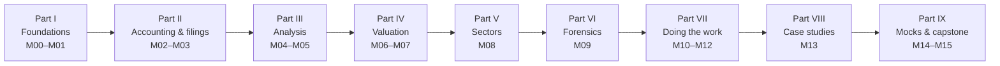

# Syllabus

This is the complete map of the course: every module, every lesson, what each lesson must cover, and how the
pieces connect. It doubles as the authoring specification — every lesson file listed here exists in `docs/`.

**Audience.** Numerate, market-literate people who have never studied accounting or company analysis — for
example a derivatives trader or an engineer. No prior finance theory is assumed beyond "a stock has a price".

**Market focus.** India-first (NSE/BSE, SEBI, RBI, Ind AS, ₹ crore, Indian annual reports), with global
comparisons (US GAAP, SEC filings) wherever they help. Roughly a third of the historical case studies are global.

**Running examples.** Two fictional companies are used throughout so that numbers are consistent across
lessons, exercises and mocks:

- [Kaveri Pumps & Motors Ltd](appendix/running-example/kaveri-pumps.md) — a Coimbatore pump and motor maker
  (manufacturing, working capital, capex, a solar-receivables problem, a promoter pledge, related-party purchases).
- [Nirmal Finance Ltd](appendix/running-example/nirmal-finance.md) — a vehicle/MSME NBFC (lending economics,
  asset quality, capital adequacy).
- [Kaveri reference valuation](appendix/running-example/kaveri-valuation.md) — the course's base-case DCF,
  scenarios and reverse DCF.

**Suggested pace.** ~20 weeks at 8–10 hours a week (see [study plan](00-orientation/02-how-to-use-this-course.md)).
Each module ends with `exercises.md` (Warm-up → Core → Stretch → Real-world task) and `solutions.md`.
Mocks sit in [Module 14](14-mocks/index.md) and are placed on the timeline below.

---

## Part I — Foundations

### Module 00 · Orientation — `docs/00-orientation/`

| # | File | Lesson | Must cover |
|:--|:--|:--|:--|
| 00.1 | `01-what-is-fundamental-investing.md` | What fundamental investing is — and isn't | Price vs value; a share as a claim on future cash flows; the three questions (what is the business, is it good, what is it worth vs price); schools: value (Graham), quality/compounders (Buffett, Munger, Fisher), growth, GARP, special situations, activism, long/short; why mispricing exists (behavioural, structural/time-horizon, informational, analytical) and the efficient-markets objection; how a fundamental investor's edge differs from a market-maker's/vol trader's edge (horizon, feedback loop, sample size, variance of outcomes, how you know you were right); what returns are realistic; survivorship bias in "multibagger" stories |
| 00.2 | `02-how-to-use-this-course.md` | How to use this course | Module map and dependencies; 20-week study plan (weekly table, hours, which mock when); how to study (active reading, doing exercises before reading solutions, spaced repetition with the Anki deck in `flashcards/`, the "explain it to a 12-year-old" test); toolkit setup: Screener.in, BSE/NSE filings pages, company IR pages, Python env for `tools/` (yfinance/OpenBB, pandas), a spreadsheet; how to keep a learning journal; how the running examples work |
| 00.3 | `03-the-research-workflow-map.md` | The investor's map: from idea to decision | End-to-end workflow (idea → quick filter → understand business → read filings → analyse numbers → assess quality & governance → value → compare with price & expectations → decide & size → monitor) as a mermaid diagram, with the module that teaches each step; a preview of a finished one-page thesis for Kaveri Pumps (drawn from the reference valuation) so the learner sees the destination; the vocabulary they will acquire |

### Module 01 · Money, Companies & Markets 101 — `docs/01-markets-101/`

| # | File | Lesson | Must cover |
|:--|:--|:--|:--|
| 01.1 | `01-what-is-a-company.md` | What a company is | Legal person, limited liability; equity vs debt holders and the priority of claims; share capital, face value vs market price; board, management, promoters (India) vs professionally-managed; private vs public (listed) company; holding/subsidiary/associate structure; how a company "belongs" to shareholders in practice (voting, AGM, special resolutions); agency problems |
| 01.2 | `02-shares-market-cap-and-enterprise-value.md` | Shares, market cap & enterprise value | Shares outstanding, free float, market cap; EPS, book value per share; enterprise value (EV = market cap + debt + minority interest + preference − cash & investments; leases) with worked Kaveri example; why EV is the price of the *business* and market cap the price of the *equity*; basic vs diluted shares (ESOPs, warrants, convertibles, treasury-stock method); per-share thinking |
| 01.3 | `03-raising-and-returning-capital.md` | How companies raise and return capital | IPO (fresh issue vs offer for sale), FPO, QIP, rights issue, preferential allotment & warrants, OFS by promoters, debt (bank loans, NCDs, CPs); returning capital: dividends (interim/final, record date, ex-date), buybacks (tender vs open-market in India, current tax treatment — verify), bonus issues and stock splits (why they change nothing fundamentally); effect of each on per-share value; dilution arithmetic |
| 01.4 | `04-indian-market-structure.md` | Indian market plumbing | NSE/BSE, SEBI's role, depositories (NSDL/CDSL), brokers, T+1 settlement; indices (Nifty 50/Next 50/Midcap 150/Smallcap 250/500, Sensex); SEBI market-cap categories (top 100/101–250/251+); shareholding pattern (promoter, FPI, DII: MFs/insurance, retail) and why it matters; promoter pledges; LODR disclosure obligations (results timelines, material events); surveillance (circuit filters/price bands, ASM/GSM, F&O ban); insider-trading and SAST disclosures; bulk/block deals; MSCI/FTSE index flows; retail/SIP flows as a structural force |
| 01.5 | `05-time-value-and-returns-math.md` | Time value of money & returns math | Compounding, CAGR, the Rule of 72; present value, discounting, perpetuity and growing perpetuity (derive Gordon), annuities; IRR and XIRR (with a worked SIP example); real vs nominal returns, inflation; total shareholder return decomposition: TSR = EPS growth + change in P/E + dividend yield (worked on Kaveri FY21–FY26 price/EPS data); log vs simple returns; why a 50% loss needs a 100% gain; volatility drag (link to the trader's intuition) |

---

## Part II — Accounting: the language of business

### Module 02 · Accounting Foundations — `docs/02-accounting/`

| # | File | Lesson | Must cover |
|:--|:--|:--|:--|
| 02.1 | `01-the-accounting-equation.md` | The accounting equation & double entry | Why accounting exists; Assets = Liabilities + Equity; debits/credits explained intuitively (and why analysts rarely need them); T-accounts; a 10-transaction "start a pump workshop" walk-through showing each transaction's effect on the equation; the idea of a period and of retained earnings as the bridge between P&L and balance sheet |
| 02.2 | `02-accrual-accounting-and-revenue-recognition.md` | Accrual accounting & revenue recognition | Cash vs accrual basis; matching principle; Ind AS 115's five-step model with examples (goods, services over time, multi-element contracts, variable consideration, principal vs agent → gross vs net revenue); deferred revenue, accrued income, unbilled revenue, advances from customers; timing examples (a solar-pump tender with installation, a software licence, a real-estate project); why revenue recognition is the #1 place for aggressive accounting |
| 02.3 | `03-the-income-statement.md` | The income statement, line by line | Indian Schedule III P&L format; revenue from operations vs other income; cost of materials consumed, purchases of stock-in-trade, change in inventories; employee costs; other expenses; EBITDA/EBIT/PBT/PAT and why EBITDA is not a GAAP line; D&A; finance costs; exceptional items; current vs deferred tax; PAT attributable to owners vs non-controlling interests; OCI and total comprehensive income; EPS basic & diluted; standalone vs consolidated. Use Kaveri FY26 as the fully annotated example |
| 02.4 | `04-the-balance-sheet.md` | The balance sheet, line by line | Schedule III balance-sheet format; non-current assets (PP&E, CWIP, ROU assets, goodwill, intangibles, investments, deferred tax assets), current assets (inventories, receivables, cash, current investments, loans & advances, other); equity (share capital, other equity: securities premium, retained earnings, reserves, OCI reserve), NCI; non-current and current liabilities (borrowings, lease liabilities, payables incl. MSME dues disclosure, provisions, other). Historical cost vs fair value; what is *not* on the balance sheet (brand, people, contingent liabilities). Annotated Kaveri FY26 balance sheet |
| 02.5 | `05-the-cash-flow-statement.md` | The cash-flow statement | Why it exists (profit is an opinion, cash is a fact); CFO/CFI/CFF; indirect method walk from PBT with every adjustment explained using Kaveri FY26; direct method; classification choices under Ind AS 7 (interest and dividends paid/received) and how they change CFO; free cash flow definitions (CFO − capex; FCFF; FCFE; "owner earnings"); lease payments and how Ind AS 116 moved them into CFF; reading the pattern of signs (+/−/−, etc.) as a business life-cycle signal |
| 02.6 | `06-linking-the-three-statements.md` | How the three statements link | The linkages (PAT → retained earnings; D&A → PP&E; working capital; capex; debt; cash); a full worked example: 12 transactions posted through all three statements with running tables; the "tie-out" drill (rebuild Kaveri FY26 CFO from the two balance sheets and the P&L); what breaks when a model doesn't balance; mermaid diagram of the flows |
| 02.7 | `07-deeper-cuts-assets-and-expenses.md` | Deeper cuts I: assets & expenses | Inventory costing (FIFO/weighted average; why LIFO is banned under Ind AS/IFRS); depreciation methods & useful lives (Schedule II of the Companies Act), changing lives as a lever; impairment (Ind AS 36) of PP&E & goodwill; capitalising vs expensing (R&D under Ind AS 38, software, borrowing costs Ind AS 23, pre-operative expenses); leases under Ind AS 116 (ROU asset, lease liability; why EBITDA rose for retailers/airlines/QSR in FY20); government grants; how each choice shifts profit between periods without changing cash |
| 02.8 | `08-deeper-cuts-group-accounts-and-other.md` | Deeper cuts II: group accounts, tax, provisions | Consolidation (subsidiaries — control; associates & JVs — equity method; NCI); standalone vs consolidated and why Indian investors read both (cash trapped in subsidiaries, loans to subsidiaries); business combinations & goodwill; deferred tax assets/liabilities intuitively (timing differences, MAT credit legacy); provisions vs contingent liabilities (Ind AS 37) — where they appear and how to read them; share-based payments (Ind AS 102) and why "adjusted EBITDA excl. ESOP" is suspect; foreign-currency translation, hedge accounting basics; OCI items; related-party disclosures (Ind AS 24) |
| 02.9 | `09-ind-as-ifrs-us-gaap.md` | Ind AS vs IFRS vs US GAAP (and old Indian GAAP) | Timeline of Ind AS adoption (2016–) and who still uses old Indian GAAP (smaller unlisted cos; SME exchange nuances — verify); key Ind AS carve-outs from IFRS; the US GAAP differences that matter to analysts (LIFO allowed, R&D expensing, impairment reversal not allowed, lease classification, extraordinary items); banks & NBFCs: Ind AS 109 ECL for NBFCs vs banks still on RBI's IRAC norms (check the current status of ECL for banks as of 2026); insurers & Ind AS 117 status (verify); a "translator" table for reading a US 10-K after reading Indian reports |

### Module 03 · Reading Filings & Documents — `docs/03-reading-filings/`

The goal of this module is that the learner can open any real document and *understand what they are reading*.

| # | File | Lesson | Must cover |
|:--|:--|:--|:--|
| 03.1 | `01-the-disclosure-universe.md` | Where information lives | The full map of Indian disclosures and where to find each: BSE/NSE corporate announcements, annual reports, quarterly results (LODR Reg 33) and their deadlines, investor presentations, earnings-call transcripts/recordings (LODR requirement), credit-rating rationales (CRISIL/ICRA/CARE/India Ratings/Acuité/Brickwork), shareholding pattern, SAST & insider disclosures, pledge data, bulk/block deals, DRHP/RHP (SEBI site), MCA21 filings for unlisted subsidiaries, RBI/sector regulator data, industry bodies (SIAM, CEA, etc.), court/NCLT orders. A table: "question you have → document that answers it". Aggregators (Screener, Tijori, Trendlyne, Tikr, etc.) and why you verify against the primary source |
| 03.2 | `02-anatomy-of-an-annual-report.md` | Anatomy of an Indian annual report | Section-by-section tour: chairman/MD letter, MD&A, Board's (Directors') report, corporate governance report, BRSR, secretarial audit (MR-3), standalone & consolidated financials, notes, auditor's report (opinion types — unmodified/qualified/adverse/disclaimer; Key Audit Matters; Emphasis of Matter; CARO 2020 annexure; Internal Financial Controls opinion), AOC-1 (subsidiaries), AOC-2 (related-party contracts), remuneration disclosures (median-employee ratio), AGM notice resolutions. For each: what it is, what to look for, time to spend. "The 2-hour annual-report read" protocol; how to compare 3–5 years of reports (what changed in language, policies, auditors) |
| 03.3 | `03-notes-to-accounts.md` | Notes to accounts: where the bodies are buried | Reading order of notes by importance: significant accounting policies (and changes), segment information, revenue disaggregation & contract balances, borrowings (lenders, security, rates, maturity, covenants), contingent liabilities & commitments, related-party transactions, receivables ageing schedule (Schedule III amendment 2021), CWIP & intangibles-under-development ageing, inventories, employee benefits (gratuity actuarial assumptions), leases, tax reconciliation (effective vs statutory rate), exceptional items, subsequent events, going-concern notes. Annotated examples from Kaveri's notes table |
| 03.4 | `04-quarterly-results-and-concalls.md` | Quarterly results, earnings season & conference calls | Reading a Reg 33 results filing (standalone & consolidated, segment results, limited-review report); YoY vs QoQ vs YTD; seasonality; normalising one-offs; "beat/miss vs consensus" and why consensus in India is thin for small caps; reading an earnings-call transcript: structure, guidance language, decoding management speak (a glossary: "calibrated growth", "one-offs", "headwinds", "we remain cautiously optimistic"), tracking what management *said* last quarter vs what happened, the questions analysts ask and don't ask. Use Kaveri Q1 FY27 vs guidance as the worked example; include a short *fictional* concall excerpt with annotations |
| 03.5 | `05-other-documents.md` | Rating rationales, offer documents, broker reports & US filings | Credit-rating rationales (why they are gold for equity analysts: liquidity, covenants, group support, key rating sensitivities); DRHP/RHP walkthrough (objects of the issue, fresh issue vs OFS, pre-IPO placements and pricing, KPIs section, restated financials, risk factors, litigation, basis of issue price and peer comparison); sell-side research reports (structure, how target prices are built, incentives and biases, how to use them without being used by them); US filings map (10-K sections incl. Item 1A risk factors & Item 7 MD&A, 10-Q, 8-K, DEF 14A proxy, S-1, 13F, Form 4) for global stocks |
| 03.6 | `06-annotated-walkthroughs.md` | Annotated walkthroughs: practise reading | Fully *fictional* but realistic excerpts, each followed by margin-style annotations: (1) a Kaveri FY26 MD&A excerpt, (2) the Kaveri auditor's report with a Key Audit Matter on receivables, (3) a related-party note, (4) a concall Q&A excerpt, (5) a rating-rationale excerpt for Nirmal Finance. Each excerpt deliberately seeds green flags and red flags; learner first annotates, then compares with the model annotations (in `
`) |

---

## Part III — Analysis

### Module 04 · Financial Statement Analysis — `docs/04-financial-analysis/`

| # | File | Lesson | Must cover |
|:--|:--|:--|:--|
| 04.1 | `01-growth-analysis.md` | Growth analysis | Revenue decomposition: volume × price × mix, organic vs acquired, FX; CAGR vs average growth; base effects (FY21 COVID base); segment growth (Kaveri's solar vs agri); growth quality (is growth consuming capital?); EPS growth vs revenue growth; the "growth at what cost" framing |
| 04.2 | `02-margins-and-cost-structure.md` | Margins & cost structure | Gross/EBITDA/EBIT/PAT margins; common-size statements (Kaveri FY21–26); fixed vs variable costs; contribution margin; operating leverage & degree of operating leverage (link: operating leverage is the "gamma" of a business); raw-material pass-through and lag (copper/steel for pumps); margin mean-reversion; why gross margin tells you about pricing power and EBITDA margin about scale |
| 04.3 | `03-returns-on-capital.md` | Returns on capital: ROE, ROCE, ROIC | Definitions and how to compute each correctly (averages, what goes in capital employed/invested capital, treatment of cash, goodwill, leases, CWIP); DuPont 3-step and 5-step on Kaveri FY21–26; ROIC vs WACC as the value-creation test; incremental ROIC; why high ROE can be leverage; why ROCE is the Indian sell-side's favourite and its flaws; reinvestment rate × ROIC = growth |
| 04.4 | `04-working-capital-and-cash-conversion.md` | Working capital & cash conversion | Inventory/receivable/payable days and the cash conversion cycle (Kaveri's CCC rising from 71 to 115 days); NWC as % of sales; negative working-capital businesses (FMCG, DMart-style retail, platforms); CFO/EBITDA and CFO/PAT; FCF conversion; capex intensity; estimating maintenance vs growth capex (D&A proxy, Greenwald method, asset-turnover method); cash-flow-based quality checks |
| 04.5 | `05-leverage-solvency-liquidity.md` | Leverage, solvency & liquidity | D/E, net debt/EBITDA, interest coverage, DSCR, fixed-charge coverage, current & quick ratios; debt maturity profile & refinancing risk; off-balance-sheet obligations (guarantees, supplier finance/reverse factoring, bill discounting, channel financing, promoter-group guarantees, contingent liabilities); why leverage ratios differ by sector; covenants; credit-rating linkage |
| 04.6 | `06-per-share-metrics-and-ratio-dashboard.md` | Per-share metrics & building a ratio dashboard | EPS (basic/diluted/adjusted), BVPS, DPS, payout, dividend & buyback yield; book-value growth; a complete 6-year ratio dashboard for Kaveri (from `tools/fi/ratios.py`) and how to read it top-to-bottom as a story; peer comparison dashboard with the fictional peer set; how to use Screener.in's ratio pages and their definitional quirks (e.g., Screener "operating profit" and "ROCE" definitions) |
| 04.7 | `07-quality-of-earnings.md` | Quality of earnings | Accruals (balance-sheet & cash-flow accrual ratios; Sloan anomaly); cash vs accrual earnings; recurring vs one-off (Kaveri's FY25 land gain); other-income dependence; tax-rate anomalies; capitalised costs; related-party revenue; "adjusted" metrics; a quality-of-earnings scorecard applied to Kaveri FY24–26 (it should flag the receivables trend, CFO/PAT < 75%, related-party purchases rising, the pledge) |

### Module 05 · Business & Competitive Analysis — `docs/05-business-analysis/`

| # | File | Lesson | Must cover |
|:--|:--|:--|:--|
| 05.1 | `01-business-models-and-unit-economics.md` | Business models & unit economics | How a company makes money: product vs service, recurring vs transactional vs project vs take-rate/platform vs subscription vs licensing/royalty; value chain position; customer concentration; unit economics (price, variable cost, contribution per unit; CAC, LTV, payback, cohorts) with worked examples (a pump, a QSR store, a D2C brand, an NBFC loan); the "explain the business in 3 sentences" test |
| 05.2 | `02-industry-analysis.md` | Industry analysis | Porter's five forces with Indian examples (cement, airlines, paints, telecom, pumps); industry structure (fragmented → consolidated), life cycle; profit pools along a value chain; TAM/SAM/SOM and why TAM slides mislead; regulation as an industry force (PLI, tariffs, licensing, price controls — e.g. DPCO for drugs); substitutes & disruption |
| 05.3 | `03-moats-and-competitive-advantage.md` | Moats & competitive advantage | Sources of durable advantage (Helmer's 7 Powers: scale economies, network economies, counter-positioning, switching costs, branding, cornered resource, process power; plus licences/regulation and low-cost production/distribution); Indian examples (Asian Paints distribution/tinting, Pidilite brand, IEX/CDSL network & regulatory position, HDFC Bank cost of funds, DMart cost advantage, Info Edge network effects); testing for a moat in the numbers (sustained ROIC > WACC, stable/gaining share, pricing power, gross margin stability); moat erosion and "moat-washing" |
| 05.4 | `04-capital-cycle-and-competition.md` | The capital cycle | Supply-side analysis (Marathon's capital-cycle idea): high returns attract capacity, which destroys returns; why fast-growing industries often have poor stock returns (airlines, telecom, solar modules, EV); cyclicality and capacity utilisation; reading capex announcements across an industry; Indian examples (cement capacity additions, specialty chemicals 2021–24, telecom tariff war 2016–19) |
| 05.5 | `05-management-and-capital-allocation.md` | Management & capital allocation | The five uses of cash (reinvest, acquire, dividend, buy back, repay); judging capital allocation (incremental ROIC, M&A track record, dilution history); incentives (remuneration structure, ESOPs, promoter salary as % of profit); skin in the game; say-do ratio (guidance vs delivery tracking — worked on Kaveri); succession; reading management tone; red flags in behaviour |
| 05.6 | `06-corporate-governance-india.md` | Corporate governance — the India edition | Promoter-controlled companies and minority shareholders; related-party transactions (thresholds, approvals — verify current LODR rules); royalty/brand fees to MNC parents; group structures, cross-holdings, inter-corporate deposits/loans; promoter pledges; board independence in practice; auditor quality, rotation and resignations; remuneration excess; preferential allotments/warrants to promoters; SEBI enforcement history; a "can I trust these numbers and these people?" checklist with scoring |
| 05.7 | `07-scuttlebutt-and-primary-research.md` | Scuttlebutt & primary research | Fisher's scuttlebutt; channel checks (dealers, distributors, customers, ex-employees, competitors) and how to ask non-leading questions; using alternative data (app downloads, web traffic, job postings, e-commerce ratings, Google Trends); Indian government data (GST collections, VAHAN vehicle registrations, SIAM, CEA power data, RBI sectoral credit, commodity prices, DGCA traffic); expert networks and legal limits (UPSI and SEBI PIT regulations — do not trade on inside information); designing a scuttlebutt plan for Kaveri (what to ask a pump dealer in Coimbatore; how to check state solar-tender payment track records) |

---

## Part IV — Valuation

### Module 06 · Valuation — `docs/06-valuation/`

| # | File | Lesson | Must cover |
|:--|:--|:--|:--|
| 06.1 | `01-what-is-value.md` | What value is | Intrinsic vs relative value; value = PV of future cash flows; the three drivers (growth, ROIC, risk/WACC) and the value-driver formula V = NOPAT·(1 − g/ROIC)/(WACC − g) with a derivation and a table showing that growth only creates value when ROIC > WACC; price vs value vs expectations; why a "great company" can be a bad investment |
| 06.2 | `02-cost-of-capital.md` | Cost of capital | Risk-free rate (India 10-yr G-sec; INR vs USD consistency and the inflation differential); equity risk premium for India (historical vs implied; Damodaran's country risk approach; practitioner ranges); beta (regression, its problems, adjusted/bottom-up beta, Indian liquidity issues); CAPM and its critics; cost of debt (rating-based spread, post-tax); WACC with target weights; practical ranges for Indian large/mid/small caps; the trader's view: WACC as a hurdle, not a truth. Compute Kaveri's WACC exactly as the reference valuation does (12.19%) |
| 06.3 | `03-dcf-step-by-step.md` | DCF step by step | FCFF vs FCFE and when to use which; building the forecast (revenue, margins, reinvestment: capex & NWC), explicit-period length, fade; terminal value (Gordon with reinvestment = g/RONIC vs exit multiple — and why exit multiples smuggle in relative valuation); mid-year convention; the equity bridge (net debt, leases, NCI, investments, ESOP dilution, contingent liabilities); value per share. Walk through the Kaveri reference DCF line by line (must reproduce ₹320/share base case) |
| 06.4 | `04-dcf-in-practice.md` | DCF in practice: sensitivity, scenarios, mistakes | Sensitivity tables (WACC × g; growth × margin) and what they reveal; bull/base/bear scenarios and probability-weighting (Kaveri: ₹416/₹320/₹168 → ₹306); terminal value share of EV (55% for Kaveri) and what that means; the 15 most common DCF mistakes (g ≥ WACC, growth without reinvestment, double-counting, inconsistent inflation, ignoring dilution, using book debt blindly, hockey-stick margins, circular WACC, etc.); DCF as a thinking tool not an oracle |
| 06.5 | `05-relative-valuation-and-multiples.md` | Relative valuation & multiples | P/E, EV/EBITDA, EV/EBIT, P/B, P/S, EV/Sales, FCF yield, dividend yield, PEG; equity vs enterprise multiples (matching numerator and denominator); derive justified P/E = (1 − g/ROE)/(r − g) and justified P/B = (ROE − g)/(r − g); trailing vs forward; choosing peers; historical bands and mean reversion; why Indian multiples are structurally higher (growth, ROE, scarcity, flows, cost of equity debates); relative valuation of Kaveri vs the fictional peer set |
| 06.6 | `06-reverse-dcf-and-expectations.md` | Reverse DCF & expectations investing | Mauboussin & Rappaport's expectations investing; solving for market-implied growth/margins (implied-vol analogy made precise: the price is the input, the expectation is the output); Kaveri at ₹390 implies ~14.1% growth for 10 years vs 14.7% historical and 10.8% base case; identifying the "expectation that matters"; variant perception; using `tools/fi/valuation.py::reverse_dcf`; a worked reverse-DCF on a real Indian large cap using live data via `tools/` (with instructions, not hard-coded current numbers) |
| 06.7 | `07-other-valuation-methods.md` | Other methods | Dividend discount model; residual income / excess-return model (and why it equals DCF when consistent); sum-of-the-parts and holding-company discounts (Indian holdcos: Bajaj Holdings, Tata Investment, etc. — verify examples); asset-based: book, replacement cost, liquidation, NAV (real estate, holdcos); EV/capacity and EV/reserves (cement, metals); option-based views: equity as a call on the firm's assets (Merton) — explained for a vol trader, real options in capex and exploration |
| 06.8 | `08-margin-of-safety-and-expected-value.md` | Margin of safety, expected value & asymmetry | Graham's margin of safety restated as a distribution; expected value across scenarios; skew and payoff asymmetry; downside analysis first (what can I lose?); how uncertainty in inputs maps to a *distribution* of values (a Monte-Carlo sketch in Python); link to position sizing (Kelly-style thinking, covered fully in M11); Kaveri: at ₹390 vs PW value ₹306 — what would have to change for it to become attractive? |

### Module 07 · Valuing Special Kinds of Companies — `docs/07-special-valuation/`

| # | File | Lesson | Must cover |
|:--|:--|:--|:--|
| 07.1 | `01-banks-and-nbfcs.md` | Banks & NBFCs | Why EV/EBITDA & FCFF don't work for lenders; the lender P&L and balance sheet (Nirmal Finance fully annotated); NIM, yield, cost of funds, CASA (banks), cost-to-income, credit cost, GNPA/NNPA, PCR, slippages, restructuring, write-offs; stage 1/2/3 ECL (NBFCs) vs IRAC (banks — verify ECL transition status); CRAR/Tier-1, LCR; ALM mismatch; RoA tree (NIM + fees − opex − credit cost − tax = RoA; × leverage = RoE); valuation via justified P/B = (RoE − g)/(CoE − g), residual income and P/ABV; worked valuation of Nirmal at ₹402 |
| 07.2 | `02-insurers-amcs-exchanges.md` | Insurers, AMCs, exchanges & brokers | Life insurance: embedded value (EV), VNB and VNB margin, persistency, product mix (ULIP/par/non-par/protection), P/EV valuation; general insurance: combined ratio, float, reserving; AMCs: AUM mix, yields, SIP flows, TER regulation, operating leverage; exchanges/depositories/RTAs/brokers: volumes, take rates, regulatory risk (the 2024 SEBI F&O measures as an example); how each is valued |
| 07.3 | `03-cyclicals-and-commodities.md` | Cyclicals & commodities | Normalised (mid-cycle) earnings; P/B and EV/replacement cost at troughs; the P/E paradox (buy at high P/E, sell at low P/E); EV/tonne and EV/EBITDA-per-tonne (cement, steel); cost curves and marginal producers; commodity price decks; Indian examples (Tata Steel, Hindalco, cement, sugar, chemicals) — verify any numbers cited |
| 07.4 | `04-high-growth-and-loss-making.md` | High-growth & loss-making companies | Unit economics and contribution margins; cohort analysis; path-to-profitability modelling; EV/Sales with a margin sanity check; Rule of 40; ESOP dilution and adjusted-EBITDA games; Indian new-age tech (Zomato/Eternal, Nykaa, Paytm, PolicyBazaar, Swiggy) as patterns — verify facts; how to set a terminal state for a company that has not reached it |
| 07.5 | `05-holdcos-conglomerates-psus-mncs.md` | Holding companies, conglomerates, PSUs & MNC subsidiaries | SOTP mechanics and holdco discounts (why 30–60% in India); conglomerate discount; PSUs: government as majority owner, dividend policy, OFS overhang, social objectives, re-rating cycles; MNC subsidiaries: royalty and technology fees, parent buy-out/delisting optionality, capital allocation constraints; family business groups |
| 07.6 | `06-real-estate-infra-utilities-telecom.md` | Real estate, infra, utilities & telecom | Real estate: pre-sales vs revenue recognition (Ind AS 115 completion method), NAV valuation, land bank; infra: BOT/HAM/EPC economics, order-book based valuation, InvITs & REITs (yield, NAV); utilities: regulated-ROE model (CERC), PPAs, merchant exposure; telecom: ARPU, subscribers, spectrum & AGR liabilities, EV/EBITDA and capex intensity |

---

## Part V — Sector playbooks

### Module 08 · Sector Playbooks (India) — `docs/08-sectors/`

Each lesson follows the same template: **how the industry makes money → value chain → key KPIs (with definitions and
where to find them) → what drives earnings and multiples → sector-specific accounting quirks → red flags → how to value
→ representative listed companies (for study, not recommendation) → a 10-question sector checklist**. Facts about real
companies must be verified and dated.

| # | File | Sector |
|:--|:--|:--|
| 08.1 | `01-banks-and-lending.md` | Banks (private, PSU, SFBs) and NBFCs by type (HFCs, gold loans, MFI, vehicle finance, consumer), the credit cycle, RBI regulation |
| 08.2 | `02-it-services-and-software.md` | IT services, ER&D, SaaS: constant-currency growth, deal TCV, utilisation, attrition, pyramid, pricing, offshore economics, GCCs, AI disruption risk |
| 08.3 | `03-consumer.md` | FMCG, retail, QSR, apparel, jewellery, durables, paints: volume vs price, distribution reach, A&P spend, rural vs urban, gross-margin commodity sensitivity, SSSG, store economics |
| 08.4 | `04-pharma-and-healthcare.md` | Pharma (domestic formulations, US generics, ANDAs, USFDA inspections/483s/warning letters, price erosion, specialty), CDMO/CRDMO, APIs, hospitals (ARPOB, occupancy), diagnostics |
| 08.5 | `05-industrials-capital-goods-defence.md` | Capital goods, defence, railways, EPC, EMS: order book, book-to-bill, execution, working capital, government payment cycles, PLI, margins by contract type |
| 08.6 | `06-autos-and-ancillaries.md` | 2W/PV/CV/tractors, EV transition, auto-component content per vehicle, VAHAN/SIAM data, commodity pass-through, the CV cycle |
| 08.7 | `07-metals-cement-chemicals.md` | Steel, aluminium, zinc, mining, cement (EV/tonne, utilisation, regional pricing), commodity vs specialty chemicals (China+1, capacity cycles) |
| 08.8 | `08-energy-and-utilities.md` | Oil & gas (upstream realisations, OMC marketing margins, GRMs, city gas), power generation/transmission/distribution, renewables (PLF, tariffs, ALMM), power exchanges |
| 08.9 | `09-real-estate-infra-logistics.md` | Residential/commercial real estate (pre-sales, collections), REITs/InvITs, roads/ports/airports, logistics & warehousing |
| 08.10 | `10-telecom-media-internet.md` | Telecom (ARPU, capex, tariff cycles), media & broadcasting, internet platforms (GMV, take rate, contribution margin, CAC) |
| 08.11 | `11-financial-services-ex-lending.md` | Life & general insurance, AMCs, exchanges, depositories, brokers, wealth managers, RTAs, fintech/payments |

---

## Part VI — Skepticism

### Module 09 · Forensic Accounting & Red Flags — `docs/09-forensics/`

| # | File | Lesson | Must cover |
|:--|:--|:--|:--|
| 09.1 | `01-why-and-how-numbers-lie.md` | Why and how numbers lie | Incentives (targets, pledges, fund-raising, bonuses); the spectrum from conservative → aggressive → fraudulent; Schilit's taxonomy (earnings manipulation, cash-flow manipulation, key-metric manipulation); the fraud triangle; how often fraud is caught and by whom (short sellers, auditors, regulators, journalists, whistle-blowers) |
| 09.2 | `02-revenue-red-flags.md` | Revenue red flags | Channel stuffing, bill-and-hold, round-tripping, gross vs net, percentage-of-completion abuse, receivables growing faster than revenue, rising unbilled revenue, related-party sales, one-off revenue, change in revenue policy; Kaveri's receivables trend as a live example (distinguish "aggressive or merely risky?") |
| 09.3 | `03-expense-and-asset-red-flags.md` | Expense & asset red flags | Capitalising operating costs, never-ending CWIP, useful-life changes, soft assets growing (intangibles, "other" assets, capital advances), inventory bloat, provisions released to profit ("cookie jar"), big-bath write-offs, exceptional items that recur |
| 09.4 | `04-cash-flow-games.md` | Cash-flow games | Moving outflows from CFO to CFI; supplier finance and receivable factoring that inflate CFO; "cash-rich but borrowing" (high cash + high debt + low interest income: the Satyam test, with the implied yield on cash check); loans & advances to related parties; investments in obscure entities; capital advances; comparing standalone vs consolidated cash |
| 09.5 | `05-governance-red-flags-india.md` | Governance red flags in India | Promoter pledging and margin calls; auditor resignations (and LODR disclosure of reasons); qualified opinions & CARO remarks; frequent changes of CFO/CS/auditor; related-party labyrinths; preferential allotments & warrants; SME-exchange and "operator" patterns (pump-and-dump, circular trading, SEBI orders on stock tips via social media/Telegram); frequent fund-raising despite "cash"; stated vs actual promoter holding (holding through shell entities); the role of SEBI orders as data |
| 09.6 | `06-forensic-scoring-models.md` | Forensic scoring models | Beneish M-score (all 8 variables, formula, thresholds), Altman Z (original and Z'' for emerging markets/non-manufacturers), Piotroski F-score (9 signals), Sloan accruals, Dechow F-score (overview), Montier C-score; implementation with `tools/fi/forensics.py`; run each on Kaveri FY25→FY26 and interpret; limitations (false positives, sector bias, lenders excluded) |
| 09.7 | `07-the-forensic-checklist.md` | The forensic checklist | A 40-point checklist organised by statement and governance, each item with *how to check* (which note/document), threshold, and severity; a scoring template; applying it end-to-end to Kaveri FY26 (conclusion should be "yellow flags that need resolution: receivables & solar concentration, rising related-party purchases, new promoter pledge, CFO/PAT < 75%") |

---

## Part VII — Doing the work

### Module 10 · Financial Modelling — `docs/10-modeling/`

| # | File | Lesson | Must cover |
|:--|:--|:--|:--|
| 10.1 | `01-model-architecture.md` | Model architecture | Inputs/drivers → calculations → statements → valuation → outputs; conventions (inputs in one place, colour coding, sign conventions, one row one formula, checks); Excel vs Python trade-offs; model hygiene; version control for models |
| 10.2 | `02-historicals-and-data.md` | Building the historicals | Getting data: annual reports (primary), Screener.in Excel export, `yfinance`/OpenBB via `tools/fi/data.py`; mapping and standardising line items; reclassification decisions (other income, exceptional items, leases); normalising; checking that historicals tie (BS balances, CF reconciles); pitfalls with data vendors (restatements, consolidated vs standalone mix-ups) |
| 10.3 | `03-forecasting-drivers.md` | Forecasting drivers | Revenue builds (volume × price, segment, capacity × utilisation, order-book burn, same-store growth); cost builds (gross margin, fixed/variable opex); working capital via days; capex & depreciation schedule (link to capacity); debt schedule & interest (circularity and how to handle it); tax; dividends; cash as the balancing item; Kaveri forecast FY27–FY29 consistent with the reference valuation assumptions |
| 10.4 | `04-scenarios-sensitivities-qa.md` | Scenarios, sensitivities & model QA | Scenario switches; data tables; tornado charts; stress tests; the model-review checklist (balance check, cash check, sign errors, hard-codes, units, circularity); how to present model outputs honestly |
| 10.5 | `05-build-along-kaveri-model.md` | Build-along: the Kaveri model in Python | Step-by-step build of a three-statement projection + DCF for Kaveri using `tools/fi/model.py` and `tools/fi/valuation.py`, reproducing the reference valuation (₹320 base); then extend it (e.g., a receivables stress case); instructions for re-running on a real Indian company using `tools/fi/data.py` (disable VPN before running yfinance scripts) |

### Module 11 · Investment Process & Portfolio Management — `docs/11-process/`

| # | File | Lesson | Must cover |
|:--|:--|:--|:--|
| 11.1 | `01-idea-generation.md` | Idea generation | Screens (quality, value, growth, magic formula, coffee-can, net-net) with Screener.in query examples; new 52-week lows/highs; corporate actions (spin-offs, demergers, buybacks, open offers); insider/promoter buying; sector rotations; reading widely; circle of competence; building an idea funnel and a watchlist |
| 11.2 | `02-the-research-process.md` | The research process | Stage-gated research (30-minute kill test → 3-hour triage → 3-week deep dive); a research checklist; primary sources first; the research log; managing time and avoiding "research as procrastination"; when to stop researching |
| 11.3 | `03-writing-an-investment-memo.md` | Writing an investment thesis & memo | Thesis in 3 bullets; variant perception (what do I believe that the market doesn't, and why am I right?); key value drivers & KPIs; valuation summary; catalysts; risks and pre-mortem; thesis-breakers ("I'm wrong if…"); monitoring plan. A complete sample memo on Kaveri (conclusion consistent with the reference valuation: watchlist, not a buy at ₹390; what would change the view) |
| 11.4 | `04-position-sizing-and-portfolio-construction.md` | Position sizing & portfolio construction | Kelly criterion and why fractional Kelly (estimation error, fat tails, correlation); conviction-weighted vs equal-weight vs risk-parity; max-loss sizing; concentration vs diversification (how many stocks?); factor/sector exposure; liquidity (ADV-based limits, impact cost in small caps); cash as a position; drawdown management; portfolio-level pre-mortem |
| 11.5 | `05-monitoring-and-selling.md` | Monitoring & selling | Quarterly thesis review template; KPI tracking; when to sell (thesis broken, valuation full, better opportunity, position too large); averaging down vs catching knives; trimming; Indian taxation of equity gains (STCG/LTCG rates and exemption — verify current rules for FY27 and cite the source), STT, grandfathering history, tax-loss harvesting |
| 11.6 | `06-behavioural-finance-and-decision-journals.md` | Behavioural finance & decision journals | The biases that matter most for fundamental investors (confirmation, anchoring, commitment/consistency, narrative fallacy, recency, overconfidence, loss aversion, disposition effect, social proof); base rates and the outside view (Mauboussin); process vs outcome; decision-journal template; checklists (Gawande/Pabrai); pre-mortems |
| 11.7 | `07-fundamentals-meets-derivatives.md` | Fundamentals × derivatives | For option-literate investors: implied move vs fundamental surprise around results; using implied vol and skew as information about fundamental uncertainty; expressing fundamental views (stock replacement with calls, risk reversals, put-writing at your "buy price", covered calls on full-value positions, protective puts, collars); hedging beta/sector with Nifty/Bank Nifty futures; long/short pairs; event-driven structures; Indian practicalities (F&O-eligible stocks only, lot sizes, SEBI 2024–25 F&O rule changes — verify), tax treatment of F&O as business income — verify. Educational framing, not advice |

### Module 12 · Macro, Cycles & Special Situations — `docs/12-macro-special-sits/`

| # | File | Lesson | Must cover |
|:--|:--|:--|:--|
| 12.1 | `01-macro-for-equity-investors.md` | Macro for equity investors | Interest rates and equity duration (why long-duration growth stocks are rate-sensitive); inflation and margins; INR and exporters/importers; RBI policy transmission; fiscal policy & government capex; commodity prices (crude for India); the earnings cycle; top-down vs bottom-up; which macro variables matter for which sectors (a matrix) |
| 12.2 | `02-market-cycles-and-sentiment.md` | Market cycles & sentiment | Index valuation (Nifty P/E & P/B bands, earnings yield vs bond yield, market cap/GDP) and their limits; flows (FPI vs DII, SIP flows); IPO cycles and primary-market froth; small-cap cycles in India (2008, 2018, 2024–25 — verify); how to behave at extremes; Howard Marks' pendulum |
| 12.3 | `03-special-situations.md` | Special situations | Demergers/spin-offs (why they outperform; Indian examples — verify), buybacks (tender-offer arithmetic and acceptance ratios), open offers (SAST), delisting (reverse book building), mergers & swap-ratio arbitrage, rights issues (renunciation), IPO analysis & grey-market caution, index inclusions/exclusions, holdco discount closure events |

---

## Part VIII — Historical case studies

### Module 13 · Case Studies — `docs/13-case-studies/`

Each case follows the format: **scene at the decision date → the numbers then → "you are the analyst" questions (answer
before reading on) → what happened (timeline) → which signals were knowable in advance vs only in hindsight →
lessons mapped to course modules → model answers → sources**. All facts are sourced and dated.

| # | File | Case | Main lessons |
|:--|:--|:--|:--|
| G1 | `global/01-sees-candies-1972.md` | See's Candies (1972) | Pricing power, capital-light compounding, return on incremental capital |
| G2 | `global/02-coca-cola-1988.md` | Buffett buys Coca-Cola (1988) | Moat + reinvestment + a fair price; owner earnings |
| G3 | `global/03-cisco-2000.md` | Cisco at the dot-com peak (2000) | Great company, terrible price; reverse DCF of a bubble |
| G4 | `global/04-enron-2001.md` | Enron (2001) | Mark-to-market accounting, SPEs, cash flow ≠ earnings, governance |
| G5 | `global/05-amazon-1997-2015.md` | Amazon (1997–2015) | Reinvestment, negative working capital, FCF vs EPS, long-duration value |
| G6 | `global/06-lehman-2008.md` | Lehman Brothers (2008) | Leverage, liquidity, Repo 105, balance-sheet fragility |
| G7 | `global/07-nokia-blackberry-2007-2013.md` | Nokia & BlackBerry (2007–2013) | Moat erosion, platform shifts, value traps |
| G8 | `global/08-valeant-2015.md` | Valeant (2015) | Roll-up economics, adjusted metrics, price-hike strategy, debt |
| G9 | `global/09-wirecard-2020.md` | Wirecard (2020) | Missing cash, third-party acquirers, auditor failure, short-seller vindication |
| G10 | `global/10-apple-2016.md` | Buffett buys Apple (2016) | Consumer franchise vs "hardware company"; buybacks; multiple re-rating |
| I1 | `india/01-satyam-2009.md` | Satyam Computer Services (2009) | Fictitious cash, the interest-income test, governance |
| I2 | `india/02-asian-paints-compounder.md` | Asian Paints (1990s–2022) | Distribution moat, working capital, sustained ROCE; later competitive threat |
| I3 | `india/03-bajaj-finance-2008-2019.md` | Bajaj Finance (2008–2019) | Lending franchise, RoA/RoE, growth with risk control, re-rating |
| I4 | `india/04-ilfs-dhfl-2018.md` | IL&FS and DHFL (2018–2019) | ALM mismatch, short-term funding of long assets, rating failures, contagion |
| I5 | `india/05-yes-bank-2018-2020.md` | Yes Bank (2018–2020) | Asset-quality divergence, concentrated lending, governance, bail-out |
| I6 | `india/06-eicher-motors-royal-enfield.md` | Eicher Motors (2009–2019) | Focus & turnaround, operating leverage, re-rating then de-rating |
| I7 | `india/07-hdfc-bank-consistency.md` | HDFC Bank (1995–2024) | Consistency premium, underwriting, deposit franchise, the merger and its aftermath |
| I8 | `india/08-zomato-paytm-ipos-2021.md` | Zomato & Paytm IPOs (2021) | Valuing loss-making tech, divergent outcomes, regulatory risk |
| I9 | `india/09-adani-hindenburg-2023.md` | Adani–Hindenburg (2023) | Governance allegations vs findings, leverage, promoter structures, market reaction |
| I10 | `india/10-vodafone-idea-telecom-war.md` | Vodafone Idea & the telecom war (2016–) | Capital cycle, price war, AGR, balance-sheet stress |
| I11 | `india/11-jet-kingfisher-airlines.md` | Kingfisher & Jet Airways | Airline economics, leverage, why growth ≠ value |
| I12 | `india/12-itc-value-trap-or-not.md` | ITC (2014–2023) | "Cheap for a reason" vs re-rating; conglomerate discount; ESG overhang |
| I13 | `india/13-dmart-avenue-supermarts.md` | Avenue Supermarts / DMart (2017–) | Cost leadership, owned stores, capital efficiency, valuation |
| I14 | `india/14-manpasand-vakrangee-small-cap-flags.md` | Manpasand & Vakrangee (2017–2018) | Small-cap red flags, auditor resignations, too-good-to-be-true numbers |
| I15 | `india/15-tata-motors-jlr.md` | Tata Motors & JLR (2008–2024) | Cyclicality, acquisition leverage, turnaround, demerger |

---

## Part IX — Practice

### Module 14 · Mocks & Drills — `docs/14-mocks/`

| File | Mock | Taken after | Format |
|:--|:--|:--|:--|
| `01-mock-accounting.md` | Mock 1 — Accounting & statements | M02–M03 | 2 hours: 30 MCQs, 5 numerical problems, 1 statement-reconstruction problem |
| `02-mock-analysis-business.md` | Mock 2 — Analysis & business quality | M04–M05 | 2 hours: 25 MCQs, ratio problems, a business-quality mini-case |
| `03-mock-valuation.md` | Mock 3 — Valuation | M06–M07 | 2.5 hours: 20 MCQs, WACC/DCF/multiples problems, a bank valuation |
| `04-mock-forensics-sectors.md` | Mock 4 — Forensics & sectors | M08–M09 | 2 hours: 20 MCQs, Beneish/Altman/cash-flow-games problems, sector KPIs, a forensic mini-case |
| `05-final-exam.md` | Final exam — "The Analyst Exam" | M00–M12 | 4 hours: comprehensive + a timed case on a new fictional company with full data |
| `06-stock-pitch-mock.md` | Stock-pitch mock | Any time after M11 | 5-minute pitch + 10-minute Q&A, weighted rubric, question bank, a strong and a weak example pitch (fictional) |
| `07-drills-unidentified-industries.md` | Drill — "Unidentified industries" (India edition) | After M04 | Common-size statements and ratios of 12 anonymised company types; match them to industries |
| `08-drills-speed-and-mental-math.md` | Drill — speed ratios & mental math | Any time | Timed drills: margins, multiples, CAGR, perpetuity values, dilution |
| `answer-keys/` | Answer keys & rubrics for every mock | — | Worked solutions, marks, rubrics |

### Module 15 · Capstone — Your Own Case Studies — `docs/15-capstone/`

| File | Content |
|:--|:--|
| `index.md` | How the capstone works; how it connects to a private research repository |
| `01-the-case-study-method.md` | The step-by-step method for a full company case study (stage gates, deliverables, time budget) |
| `02-templates.md` | Links to all templates (full case, one-page thesis, quarterly update, forensic checklist, decision journal, post-mortem) |
| `03-worked-example-kaveri.md` | A complete worked case study of Kaveri Pumps using the templates, end to end |
| `04-grading-rubric-and-review.md` | Self-review rubric and a peer/AI review protocol |

---

## Appendices — `docs/appendix/`

| File | Content |
|:--|:--|
| `glossary.md` | A–Z glossary (500+ terms), plain-English definition, formula where relevant, example, India note; mirrored as an Anki deck in `flashcards/` |
| `formula-sheet.md` | Every formula in the course on one page, grouped by topic |
| `reading-list.md` | Books, letters, blogs, courses and podcasts — graded Beginner / Intermediate / Advanced, with India-specific resources |
| `data-sources.md` | Every data source used, with URLs, what it's good for, cost, and caveats |
| `indian-numbering-and-conventions.md` | Lakh/crore, FY conventions, Q1–Q4 mapping, ₹ formatting, common abbreviations in Indian filings |
| `running-example/` | Kaveri Pumps, Nirmal Finance, the Kaveri reference valuation |
| `tools.md` | How to install and use the Python tools in `tools/` |
